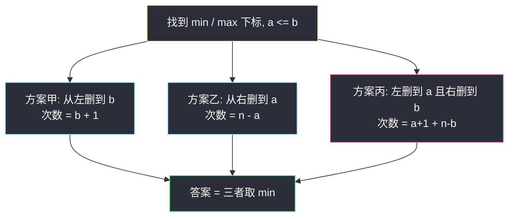

# 从数组中移除最大值和最小值（分类讨论 · 三种删法取最小）

## 一、问题描述

给你一个**元素互不相同**的数组 `nums`。一次删除只能拿掉数组**当前的头或尾**一个元素。要把最小值和最大值都删掉，最少需要几次删除？

> 🔗 LeetCode 2091：https://leetcode.cn/problems/removing-minimum-and-maximum-from-array/
>
> 数据范围：`1 ≤ nums.length ≤ 10^5`，元素在 `[-10^5, 10^5]` 且互不相同。
>
> 📚 灵茶题单：**§5.7 分类讨论**（1384 分）。记下 min / max 下标后只有三种互斥策略：全从左、全从右、左右夹击。取最小值。长度为 1 时这两个元素是同一个人。

**示例 1**

```
输入：nums = [2,10,7,5,4,1,8,6]
输出：5
解释：最大值 10 在下标 1，最小值 1 在下标 5。
     从左边删 2 个（覆盖 10），从右边删 3 个（覆盖 1），共 5 次。
```

**示例 2**

```
输入：nums = [0,-4,19,1,8,-2,-3,5]
输出：3
解释：最小值 -4 在下标 1，最大值 19 在下标 2。从左边连续删 3 个即可两个都带走。
```

**示例 3**

```
输入：nums = [101]
输出：1
解释：唯一的元素既是最小也是最大，删一次。
```

**直观理解**

头尾删除意味着：每次操作都在「啃」数组的某一端。要干掉下标 `i` 的元素，要么从左边一直删到 `i`（`i+1` 次），要么从右边一直删到 `i`（`n-i` 次）。现在要干掉**两个**位置，策略不是四个数乱乘，而是只有三种互不重叠的啃法——两端的分工一旦确定，次数就定了。

---

## 二、暴力解法

模拟所有删除序列：每一步选左或右，直到 min 和 max 都离开数组。分支是 `2^k`，`k` 最坏是 `n`，完全不可行。

稍好一点：目标只是两个下标，不必真的模拟弹出。但若仍去枚举「左删几次、右删几次」再检查是否覆盖两个下标，左次数 `0..n`、右次数 `0..n`，还要 `left + right ≤ n`，`O(n²)` 检查。`n = 10^5` 仍超时。

```python
class Solution:
    def minimumDeletions(self, nums: list[int]) -> int:
        n = len(nums)
        i = nums.index(min(nums))
        j = nums.index(max(nums))
        ans = n
        for L in range(n + 1):
            for R in range(n - L + 1):
                # 左边删掉下标 [0, L)，右边删掉 [n-R, n)
                def gone(p: int) -> bool:
                    return p < L or p >= n - R
                if gone(i) and gone(j):
                    ans = min(ans, L + R)
        return ans
```

对官方例 1 能算出 5，但双重循环过不了大数据。

### 🔴 瓶颈在哪里

覆盖两个下标的 `(L, R)` 不必枚举。把两个下标记成更左的 `a`、更右的 `b`（`a ≤ b`），可行方案只有三类：

1. 右端不删，左端一直删过 `b`；
2. 左端不删，右端一直删过 `a`；
3. 左端删过 `a`，右端删过 `b`（两边合力，中间一段留下）。

每一类里次数已经取了该类最小，三类再取 min 就是答案。`O(n)` 找下标 + `O(1)` 算三个数。

---

## 三、优化探索（核心章节）

> 📚 本题在灵茶题单中属于 **§5.7 分类讨论**。先定位两个关键下标，再按「删除工作由哪一端承担」分成互斥的几类，每类闭式计算，最后取 min。漏掉「左右夹击」是最常见的错。

### 3.1 一个下标的删除代价

要让下标 `p` 被删掉：

- 只从左：必须把 `0..p` 都删掉，`p + 1` 次；
- 只从右：必须把 `p..n-1` 都删掉，`n - p` 次。

不能从中间挖。所以每个下标对两端各有一个「覆盖代价」。

### 3.2 两个下标只有三种分工

设 `a = min(min下标, max下标)`，`b = max(min下标, max下标)`，于是 `a ≤ b`。数组画成：

```
[ 0 .. a .. b .. n-1 ]
```

要让 `a` 和 `b` 都落入「被左删掉的前缀」或「被右删掉的后缀」：

| 方案 | 谁负责 | 次数 | 留下的是 |
|------|--------|------|----------|
| 甲 | 左端包办两个 | `b + 1` | 后缀 `b+1 .. n-1` |
| 乙 | 右端包办两个 | `n - a` | 前缀 `0 .. a-1` |
| 丙 | 左端负责 `a`，右端负责 `b` | `(a + 1) + (n - b)` | 中间 `a+1 .. b-1` |

没有第四种。不存在「左端去删 `b`、右端去删 `a`」——左端要够到 `b` 已经把 `a` 顺带走了，那就是方案甲，右端再删只是浪费。



粉节点（方案丙）最容易漏：人下意识觉得「要删两个就该朝一个方向猛删」，但例 1 最优恰恰是夹击。

### 3.3 长度为 1、或 min 与 max 是同一个下标

元素互不相同，只有 `n = 1` 时最小最大是同一个元素。此时 `a = b = 0`：

- 甲：`0 + 1 = 1`
- 乙：`1 - 0 = 1`
- 丙：`1 + 1 - 0 = 2`

`min` 仍是 1，公式不用特判。官方例 3 直接覆盖。

### 3.4 一句话核心

> **记下更左下标 a、更右下标 b；答案是 `min(b+1, n-a, a+1+n-b)`。第三项是左右夹击，不要漏。**

---

## 四、代码实现

### Python（主解：三个公式）

```python
class Solution:
    def minimumDeletions(self, nums: list[int]) -> int:
        n = len(nums)
        i = nums.index(min(nums))
        j = nums.index(max(nums))
        a, b = (i, j) if i < j else (j, i)
        return min(b + 1, n - a, a + 1 + n - b)
```

一次遍历同时定位也可以，避免两次 `min` / `max` 各扫一遍：

```python
class Solution:
    def minimumDeletions(self, nums: list[int]) -> int:
        n = len(nums)
        i = j = 0
        for k, x in enumerate(nums):
            if x < nums[i]:
                i = k
            if x > nums[j]:
                j = k
        a, b = (i, j) if i < j else (j, i)
        return min(b + 1, n - a, a + 1 + n - b)
```

**变量含义**

| 写法 | 含义 |
|------|------|
| `i`, `j` | 最小值、最大值下标（谁左谁右不确定） |
| `a`, `b` | 两个目标里更靠左、更靠右的下标，`a ≤ b` |
| `b + 1` | 从左删到更右那个 |
| `n - a` | 从右删到更左那个 |
| `a + 1 + n - b` | 左删到 a、右删到 b |

元素互不相同，`index(min)` 不会有歧义。不要写成「值相等时随便取一个下标」那种带相等分支的代码。

三个表达式可以记成「覆盖更右目标的左代价、覆盖更左目标的右代价、分别覆盖」。画一条数轴，`a`、`b` 两个点，答案就是「吃掉左边那一段到 b、吃掉右边那一段到 a、两边各咬一口」的最短者。

---

## 五、具体例子演示

**示例 1**：`nums = [2, 10, 7, 5, 4, 1, 8, 6]`，`n = 8`。

| 下标 | 0 | 1 | 2 | 3 | 4 | 5 | 6 | 7 |
|------|---|---|---|---|---|---|---|---|
| 值 | 2 | **10** | 7 | 5 | 4 | **1** | 8 | 6 |

max 在 1，min 在 5。`a = 1`，`b = 5`。

| 方案 | 计算 | 实际删除 | 次数 |
|------|------|----------|------|
| 甲 从左到 b | 5+1=6 | 删掉 2,10,7,5,4,1 | 6 |
| 乙 从右到 a | 8-1=7 | 删掉 10,7,5,4,1,8,6（几乎整段） | 7 |
| **丙 左右夹击** | (1+1)+(8-5)=**5** | 左删 2,10；右删 6,8,1 | **5** |

官方解释「前面 2 个 + 后面 3 个」就是方案丙。答案 5。

逐步看丙：左删一次剩 `[10,7,5,4,1,8,6]`（10 还在头上）；再左删一次 10 去掉，剩 `[7,5,4,1,8,6]`；右删一次去掉 6，再去掉 8，再去掉 1。五次后 min、max 都走了。若改用甲，还要继续从左把 7,5,4,1 也删掉，多一次。

**示例 2**：`nums = [0, -4, 19, 1, 8, -2, -3, 5]`，`n = 8`。

min `-4` 在下标 1，max `19` 在下标 2。`a = 1`，`b = 2`。

| 方案 | 计算 | 次数 |
|------|------|------|
| **甲 从左到 b** | 2+1=**3** | **3** |
| 乙 从右到 a | 8-1=7 | 7 |
| 丙 夹击 | 2+(8-2)=8 | 8 |

两个目标紧挨着靠左，从左一次性扫过去最划算。答案 3，与官方一致。

**示例 3**：`nums = [101]`。`a = b = 0`，`min(1, 1, 2) = 1`。

**再补一个「从右更优」**：`[9, 1, 2, 8]`。min 在 1，max 在 0。`a = 0`，`b = 1`。甲 = 2，乙 = 4，丙 = 1+3 = 4。答案 2：从左删两个即可。若 max 在末尾、min 在开头，乙或丙会胜出——三个公式都算一遍最省心。

**边界**

- min 在 0、max 在 `n-1`：甲 = `n`，乙 = `n`，丙 = `1 + 1 = 2`。最优是夹击 2 次（各删一头）。这是漏掉方案丙时错得最离谱的形态。
- min、max 相邻在正中间：三种都要算，通常夹击或单端都可以，取 min 即可。
- `n = 2`：答案一定是 2（两个元素都得删，无论从哪端）。公式：`a=0,b=1` → `min(2, 2, 1+1)=2`。

---

## 六、复杂度分析

| 方法 | 时间 | 空间 | 说明 |
|------|------|------|------|
| 模拟每次选端 | 指数级 | `O(n)` 拷贝数组 | 不可用 |
| 枚举左删次数 × 右删次数 | `O(n²)` | `O(1)` | `n = 10^5` 超时 |
| 三公式（主解） | `O(n)` | `O(1)` | 一遍找 min/max，常数次算术 |

互不相同保证 min、max 各只有一个下标，不会出现「同值多个位置要都删」的歧义。

---

## 七、对比总结

| 维度 | 本题 | 可获得的最大点数 1423 | 将 x 减到 0 的最小操作 1658 |
|------|------|----------------------|------------------------------|
| 操作 | 只能删头或尾 | 只能拿头或尾（拿 k 次） | 只能从两端取 |
| 目标 | 覆盖两个特殊下标的最少次数 | k 次拿数的最大和 | 两端子数组和为 x 的最短长度 |
| 分类 | 三种覆盖形态 | 枚举左边拿几个（右边就定了） | 前缀 + 哈希 / 滑动窗口 |
| 关键 | 不要漏夹击 | 补集：留下中间一段 | 同样是「中间留下、两端拿走」 |

**易错点**

1. **漏掉方案丙**：只写 `min(b+1, n-a)`，两端目标分别靠近两侧时会错成接近 `n` 的答案，真正只要各啃一头。
2. **`i、j` 没排序就套公式**：必须先让 `a` 是更左、`b` 是更右。否则 `j+1` 在 max 比 min 更靠左时根本盖不住 min。
3. **`n - i` 写成 `n - i - 1`**：从右删到下标 `i` 包含 `i` 自己，是 `n - i` 个元素。
4. **`n = 1` 特判写错**：公式已经给出 1，特判成 0 或 2 都错。
5. **以为要真的模拟双端队列**：题目只问次数，定位两个下标后纯算术。

---

## 八、举一反三

| 题目 | 关系 |
|------|------|
| [1423. 可获得的最大点数](https://leetcode.cn/problems/maximum-points-you-can-obtain-from-cards/) | 同样只动两端；改成枚举「左边拿几个」 |
| [1658. 将 x 减到 0 的最小操作数](https://leetcode.cn/problems/minimum-operations-to-reduce-x-to-zero/) | 两端删除，目标从「两个下标」换成「和为 x」 |
| [1750. 删除字符串两端相同字符后的最短长度](https://leetcode.cn/problems/minimum-length-of-string-after-deleting-similar-ends/) | 双端删除，分类条件改成字符相同 |
| [1574. 删除最短的子数组使剩余数组有序](https://leetcode.cn/problems/shortest-subarray-to-be-removed-to-make-array-sorted/) | 同样「删一段让两个关键位置消失」，形态不同但都是分类后取最短 |
| [1526. 形成目标数组的最少增量](https://leetcode.cn/problems/minimum-number-of-increments-on-subarrays-to-form-a-target-array/) | 另一类「操作形态有限、分类后贪心」 |

**思想迁移**

- 操作被限制在两端时，先问「有几种互斥的覆盖形态」，再对每种写一个 `O(1)` 公式，比模拟删除序列干净得多。
- 口诀：**「记下左右两个目标下标；全左、全右、左右夹，三个数取最小。」**
