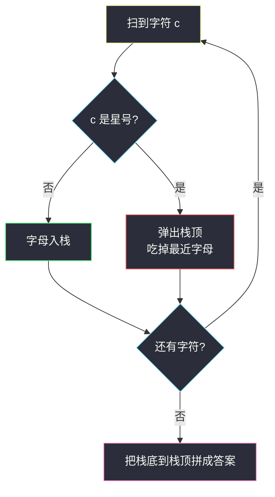
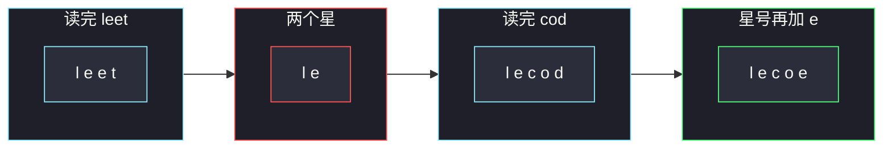

# 从字符串中移除星号（栈：字母入栈，星号弹顶）

## 一、问题描述

给你一个由小写字母和 `'*'` 组成的字符串 `s`。可以进行如下操作任意次：

- 选一个 `'*'`，删掉它以及它**左侧最近的那个非星字符**（连同这个星一起消失）。

题目保证操作总能做完（不会出现「星比左边字母多」的前缀）。请返回删掉所有星之后剩下的字符串。剩余串可能为空；字母相对顺序与原串中幸存字母的顺序一致。

> 🔗 LeetCode 2390：https://leetcode.cn/problems/removing-stars-from-a-string/
>
> 数据范围：`1 <= s.length <= 10^5`，`s` 只含小写字母和 `'*'`，保证操作可完成。
>
> 📚 本题出自灵茶题单 **§3.1 基础**（栈）。同节姊妹题 [#1441 用栈操作构建数组](https://leetcode.cn/problems/build-an-array-with-stack-operations/)（`build-an-array-with-stack-operations.md`）也是栈模拟：那边用 Push/Pop 构造序列，这边用入栈/弹栈消化星号。

**示例 1**

```
输入：s = "leet**cod*e"
输出："lecoe"
解释：leet**cod*e → lee*cod*e → lecod*e → lecoe。
```

**示例 2**

```
输入：s = "erase*****"
输出：""
解释：五个字母配五个星，全部抵消。
```

**示例 3**

```
输入：s = "a*b*c*"
输出：""
解释：每个字母立刻被后面的星吃掉，栈空。
```

**直观理解**

每次删的是「这个星左边还活着的最近字母」。后出现的字母离星更近，所以**越晚入场的字母越先被删**——这正是栈。从左到右扫：字母入栈；碰到星就把栈顶那个「最近字母」弹掉。扫完栈里剩下的就是答案。

---

## 二、暴力解法

真的按题意改字符串：每次找一个 `'*'`，删它和左边最近字母。用列表模拟，每次 `index('*')` 再 `pop` 两次：

```python
class Solution:
    def removeStars(self, s: str) -> str:
        a = list(s)
        while "*" in a:
            i = a.index("*")
            a.pop(i)                             # 删星
            a.pop(i - 1)                         # 删左侧最近字母
        return "".join(a)
```

### 复杂度

- **时间**：`O(n²)`。每次 `index` + `pop` 都是线性，星的个数最坏 `O(n)`。`n = 10^5` 超时。
- **空间**：`O(n)`。

### 🔴 瓶颈在哪里

反复在字符串中间删除导致元素搬移。观察到：每个星只影响「它左边还没被吃掉的最后一个字母」，而这正是从左到右扫时栈顶的那个。一遍栈模拟即可，每个字符进栈或出栈至多一次。

---

## 三、优化探索（核心章节）

> 📚 灵茶题单 **§3.1 基础**。栈用来表达「当前还活着的字母序列」：栈底是最左边幸存字符，栈顶是最近、也是下一个星会吃掉的那个。

### 3.1 为什么从左到右一遍就够

操作看起来可以先处理右边的星、再处理左边的星，顺序似乎有选择。实际上：

- 一个星吃掉的对象，是它左边**最终还没被更左边的星吃掉的**最近字母；
- 更左边的星只吃更左边的字母，不会跳过中间字母去抢右边；
- 所以每个星吃谁是确定的：**左边幸存序列的最后一个**。

从左到右维护幸存序列，遇到星弹顶，得到的删除集合与任意合法操作顺序相同。题目保证不会弹空，不必处理「星在开头」或「星比字母多」。

连续星星等于连续弹栈：`"leet**"` 先堆 `l,e,e,t` 再弹两次，等价于题面里先删第一颗星旁的 `t`、再删第二颗星旁的 `e`。交错出现也一样：`"ab*c*"` 逐步 `a → ab → a → ac → a`，答案 `"a"`。

### 3.2 和退格字符串是同一张图

[#844 比较含退格的字符串](https://leetcode.cn/problems/backspace-string-compare/) 里 `'#'` 的含义就是本题的 `'*'`。骨架：

```
字母 → 入栈
星号 → 弹栈
```

本题只要求还原最终串；844 要对两个串各做一遍再比较。



### 3.3 双指针就地写法（可选）

用数组当栈，指针 `w` 表示栈顶后一位：字母写到 `a[w]` 再 `w += 1`；星则 `w -= 1`。空间仍是 `O(n)`（要存答案），只是少一次列表扩容。主解用 Python 列表当栈更清晰。

### 3.4 一句话核心

> **幸存字母进栈，星号把栈顶（左侧最近字母）弹掉；扫完栈里就是结果。**

---

## 四、代码实现

### Python（主解：列表当栈）

```python
class Solution:
    def removeStars(self, s: str) -> str:
        st = []
        for c in s:
            if c == "*":
                st.pop()                        # 题目保证此时栈非空
            else:
                st.append(c)
        return "".join(st)
```

**变量含义**

| 变量 | 含义 |
|------|------|
| `st` | 当前幸存字符，下标 0 是最左，末项是最近 |
| `c == "*"` | 删除栈顶那个最近字母 |

### Java（最优解同款）

```java
class Solution {
    public String removeStars(String s) {
        StringBuilder st = new StringBuilder();
        for (int i = 0; i < s.length(); i++) {
            char c = s.charAt(i);
            if (c == '*') st.deleteCharAt(st.length() - 1);
            else st.append(c);
        }
        return st.toString();
    }
}
```

---

## 五、具体例子演示

以官方示例 `"leet**cod*e"` 逐步跟踪栈（底 → 顶）。

| 步 | 读入 | 动作 | 栈（底→顶） |
|----|------|------|-------------|
| 1 | `l` | 入栈 | `l` |
| 2 | `e` | 入栈 | `l e` |
| 3 | `e` | 入栈 | `l e e` |
| 4 | `t` | 入栈 | `l e e t` |
| 5 | `*` | 弹掉 t | `l e e` |
| 6 | `*` | 弹掉 e | `l e` |
| 7 | `c` | 入栈 | `l e c` |
| 8 | `o` | 入栈 | `l e c o` |
| 9 | `d` | 入栈 | `l e c o d` |
| 10 | `*` | 弹掉 d | `l e c o` |
| 11 | `e` | 入栈 | `l e c o e` |

拼起来 `"lecoe"` ✓。对照题面三种删除顺序，最终幸存集合相同：`l, e, c, o, e`。

示例 2 `"erase*****"`：先压入 `e r a s e`，再连续五次弹出，栈空，返回 `""`。

交错例子 `"a*b*c*"`：

| 步 | 读入 | 栈 |
|----|------|-----|
| 1 | `a` | `a` |
| 2 | `*` | （空） |
| 3 | `b` | `b` |
| 4 | `*` | （空） |
| 5 | `c` | `c` |
| 6 | `*` | （空） |

每个字母都被紧随的星立刻吃掉。这和「先把六个字符全放进串再从右往左删」结果相同，但栈只需一遍。

**边界速查**

| 输入 | 栈最终 | 答案 |
|------|--------|------|
| `"a"` | `a` | `"a"`（无星） |
| `"a*"` | 空 | `""` |
| `"abc*"` | `a b` | `"ab"` |
| `"erase*****"` | 空 | `""` |



---

## 六、复杂度分析

| 方法 | 时间 | 空间 | 说明 |
|------|------|------|------|
| 反复在列表中间删 | `O(n²)` | `O(n)` | 超时 |
| 栈模拟（主解） | `O(n)` | `O(n)` | 每字符进/出至多一次 |

答案本身最坏长度 `n`，空间下界 `O(n)`。

---

## 七、对比总结

| 维度 | 暴力改串 | 栈模拟 |
|------|----------|--------|
| 找「左侧最近字母」 | 每次向左扫描 / `index` | 恒为栈顶 |
| 删除代价 | 数组搬移 | `pop` 均摊 `O(1)` |
| 操作顺序 | 表面可换 | 从左到右一遍等价 |

与 1441 对照：1441 的 `"Pop"` 丢掉的是流里不该留下的数；本题的星丢掉的是已经入栈的字母。都是「栈顶 = 最新、也是下一次删除的对象」。

**易错点**

1. **从右往左扫**：星吃的是左边字母，右扫会把因果弄反。必须左到右。
2. **弹空未判**：题目保证不会，但自己造数据时 `"*a"` 会崩；面试可加一句 `if st: st.pop()`。
3. **把星也入栈**：再另找机会删，容易漏掉连续星。碰到星立刻弹，不要让星进栈。
4. **用队列**：FIFO 会删掉最左边的字母，与「最近」相反。必须 LIFO。
5. **`"".join` 忘记**：返回的是字符串不是列表。

**模板（§3.1 退格 / 消星）**

```python
st = []
for c in s:
    if c == "*":
        st.pop()
    else:
        st.append(c)
return "".join(st)
```

---

## 八、举一反三

| 题目 | 关系 |
|------|------|
| [1441. 用栈操作构建数组](https://leetcode.cn/problems/build-an-array-with-stack-operations/) | 同批 §3.1，见 `build-an-array-with-stack-operations.md`：构造序列 vs 消化删除 |
| [844. 比较含退格的字符串](https://leetcode.cn/problems/backspace-string-compare/) | `'#'` ≡ `'*'`，做两遍再比 |
| [1047. 删除字符串中的所有相邻重复项](https://leetcode.cn/problems/remove-all-adjacent-duplicates-in-string/) | 栈顶相等则双弹 |
| [1209. 删除字符串中的所有相邻重复项 II](https://leetcode.cn/problems/remove-all-adjacent-duplicates-in-string-ii/) | 栈里带计数，满 k 再弹 |
| [394. 字符串解码](https://leetcode.cn/problems/decode-string/) | 栈里压数字与子串，遇 `]` 弹出解码 |
| [71. 简化路径](https://leetcode.cn/problems/simplify-path/) | `..` 当弹栈，`.` 当跳过 |

**思想迁移**

- 见到「删除最近的左侧元素 / 退格 / 撤销」，第一反应是栈，不要真去改字符串。
- 连续多个删除符就是连续弹栈，不必一次找「第 k 个最近」。
- 操作顺序看起来可变，但「每个星吃谁」其实唯一，所以一遍从左到右等价于任意合法删除序列。
- 口诀：**「字母进栈，星星弹顶；栈里剩下的从底到顶就是答案。」**
