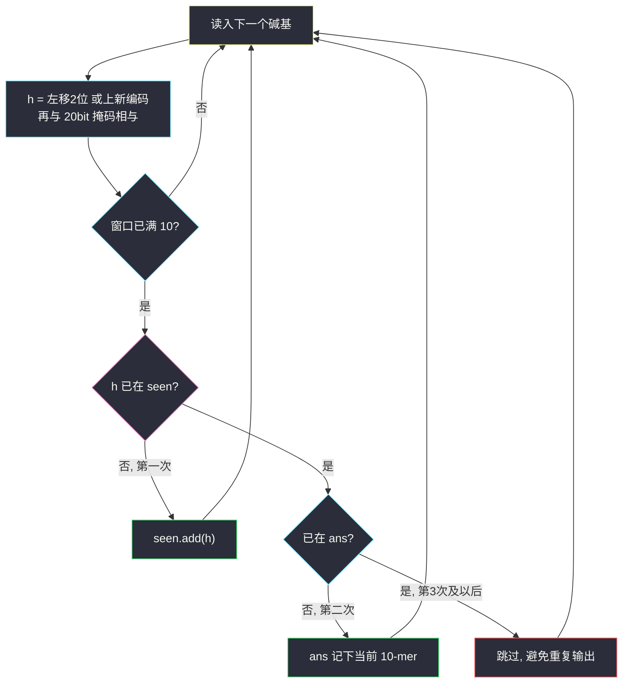
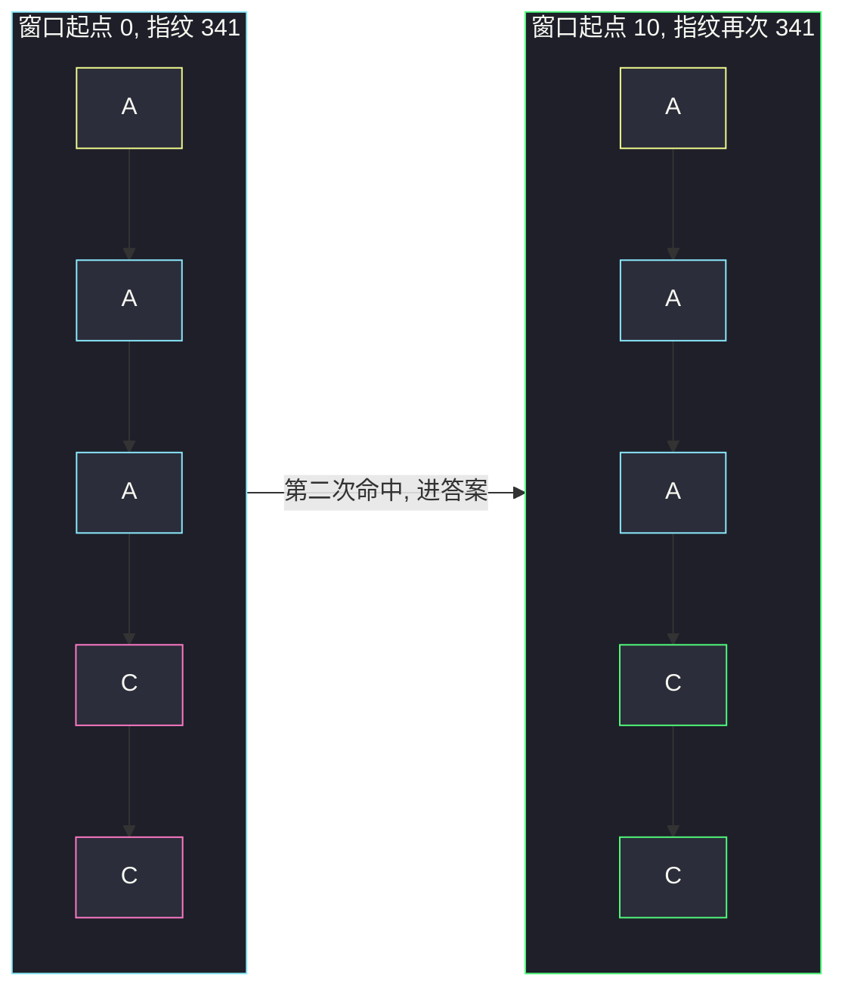

# 重复的 DNA 序列（定长窗口 + 滚动哈希）

## 一、问题描述

DNA 串 `s` 只含 `A / C / G / T`。找出所有长度为 **10**、在 `s` 中出现**超过一次**的子串，**去重**后返回（顺序任意）。

> 🔗 LeetCode 187：https://leetcode.cn/problems/repeated-dna-sequences/
>
> 数据范围：`0 ≤ s.length ≤ 10^5`，`s[i] ∈ {A, C, G, T}`。
>
> 📚 灵茶题单：**§4 字符串哈希**。定长 10 的滑动窗口；把碱基编成 2bit，窗口恰好是一个 20bit 整数，哈希值与子串一一对应。

**示例 1**

```
输入：s = "AAAAACCCCCAAAAACCCCCCAAAAAGGGTTT"
输出：["AAAAACCCCC", "CCCCCAAAAA"]
解释：这两个长度为 10 的子串各出现了两次。
```

**示例 2**

```
输入：s = "AAAAAAAAAAAAA"
输出：["AAAAAAAAAA"]
解释：长度为 10 的窗口全是 A，出现 4 次，答案里只留一份。
```

**直观理解**

长度为 10 的窗口从左滑到右，一共 `n - 9` 个。谁出现了第二次，就记进答案；第三次、第四次不要再输出。本质是「定长子串去重计数」，计数器只关心 ≥2。

---

## 二、暴力解法

每个起点 `i` 切出 `s[i:i+10]`，用哈希表计频，最后把频次 ≥ 2 的键收进答案。

```python
class Solution:
    def findRepeatedDnaSequences(self, s: str) -> list[str]:
        n = len(s)
        if n < 10:
            return []
        freq = {}
        for i in range(n - 9):
            sub = s[i:i + 10]
            freq[sub] = freq.get(sub, 0) + 1
        return [k for k, v in freq.items() if v >= 2]
```

Python 把字符串当 dict 的 key，写法最短，`n = 10^5` 也能过。但每次切片、哈希都是 `O(10)`，没有用上「相邻窗口只差一个碱基」——这正是 §4 滚动哈希要吃的结构。

### 🔴 瓶颈在哪里

窗口每次只进 1 个字符、出 1 个字符，完整重哈希是重复劳动。更关键的教学点：四个碱基 = 2bit，10 个碱基 = 20bit，**哈希值就是子串本身**，不必取模、不会碰撞。

---

## 三、优化探索（核心章节）

> 📚 本题在灵茶题单中属于 **§4 字符串哈希**。滚动哈希维护窗口的整数指纹；本题指纹宽度固定 20bit，比一般「base + mod」更干净。

### 3.1 编码：ACGT → 2bit

| 碱基 | 编码 |
|------|------|
| A | `00`（0） |
| C | `01`（1） |
| G | `10`（2） |
| T | `11`（3） |

一个窗口 10 个碱基拼成 20 位整数。`4^10 = 2^20 = 1048576`，所有长度为 10 的 DNA 互不相同，整数空间装得下，**无需取模**。

滚动更新：左移 2 位腾出最低两位，或上新碱基，再与 20 位掩码 ` (1 << 20) - 1 ` 相与，最高两位（滑出窗口的旧碱基）自动丢掉：

```text
h = ((h << 2) | encode[c]) & ((1 << 20) - 1)
```

### 3.2 两个集合：先 seen，再 ans

不要用「每次 count++，最后再筛 ≥2」——第二次见到就要进答案，第三次不能再进。

- `seen`：这个哈希**出现过**（第一次）
- `ans`：这个子串**已经作为答案收下**（第二次及以后只保证去重）

第一次：放进 `seen`。第二次：放进 `ans`（同时记下原串 `s[i-9:i+1]`）。之后哈希还在 `seen` 里，但 `ans` 是集合，不会重复输出。



### 3.3 一句话核心

> **定长 10 用 20bit 整数当指纹；第一次进 seen，第二次进答案，集合保证不重复输出。**

---

## 四、代码实现

### Python（主解：2bit 滚动哈希）

```python
class Solution:
    def findRepeatedDnaSequences(self, s: str) -> list[str]:
        n = len(s)
        if n < 10:
            return []
        mp = {"A": 0, "C": 1, "G": 2, "T": 3}
        mask = (1 << 20) - 1
        h = 0
        seen, ans = set(), set()
        for i, ch in enumerate(s):
            h = ((h << 2) | mp[ch]) & mask
            if i < 9:
                continue
            if h in seen:
                ans.add(s[i - 9 : i + 1])
            else:
                seen.add(h)
        return list(ans)
```

`ans` 存的是原串切片（要返回字符串）；`seen` 只存整数指纹，省空间、比较也快。`i < 9` 时窗口还没满，不查询。

**变量含义**

| 写法 | 含义 |
|------|------|
| `mp` | 碱基 → 2bit |
| `mask` | 低 20 位全 1，丢掉滑出窗口的碱基 |
| `h` | 当前窗口的 20bit 指纹 |
| `seen` | 见过的指纹 |
| `ans` | 第二次才进，自动去重 |

字符串直接当 key 的写法见第二章，面试两种都会、讲清「本题哈希无碰撞」即可。

---

## 五、具体例子演示

**示例 1**：`s = "AAAAACCCCCAAAAACCCCCCAAAAAGGGTTT"`（长度 32）。编码 A=00，C=01。逐步滚窗口：

| i | 窗口 `s[i-9:i+1]` | 20bit 指纹（高位在左） | 十进制 | 动作 |
|---|-------------------|------------------------|--------|------|
| 9 | `AAAAACCCCC` | `00000000000101010101` | 341 | 第一次 → seen |
| 10 | `AAAACCCCCA` | `00000000010101010100` | 1364 | seen |
| 14 | `CCCCCAAAAA` | `01010101010000000000` | 349184 | seen |
| 19 | `AAAAACCCCC` | `00000000000101010101` | 341 | **已在 seen → 进 ans** |
| 25 | `CCCCCAAAAA` | `01010101010000000000` | 349184 | **已在 seen → 进 ans** |

对拍官方：`["AAAAACCCCC", "CCCCCAAAAA"]`。窗口起点分别是 0 与 10、5 与 16。

第一次滑满时的拼法（帮助建立「左移 2 位」的手感）：

```text
A A A A A C C C C C
00 00 00 00 00 01 01 01 01 01
→ 0000000000 0101010101 = 341
```

再右滑一格：丢掉最左的 A（最高 2 位），最低两位补上新的 A=00，得到 `AAAACCCCCA`。



图里只画了窗口两端几个碱基：黄是起点 A，粉/绿是窗口尾部的 C。两次指纹同为 341，第二次才进答案。

**示例 2**：`s = "AAAAAAAAAAAAA"`，长度 13，窗口 4 个全是 `AAAAAAAAAA`。第一次进 seen，后三次哈希相同，`ans` 只留下一份。对拍官方 `["AAAAAAAAAA"]`。

**边界**：`n < 10` 不可能有长度为 10 的子串，返回 `[]`；`n = 10` 只有一个窗口，不可能「超过一次」。

---

## 六、复杂度分析

| 方法 | 时间 | 空间 | 说明 |
|------|------|------|------|
| 字符串当 key 计频 | `O(n)` | `O(n)` | 每个窗口切片/哈希 `O(10)`，常数吃在 10 上 |
| 20bit 滚动哈希（主解） | `O(n)` | `O(n)` | 每步 `O(1)` 更新指纹；最坏 `O(n)` 个不同 10-mer |

`seen` / `ans` 最坏接近 `n` 个不同窗口。20bit 值域约 100 万，但实际插入次数 ≤ `n`。

---

## 七、对比总结

| 维度 | 字符串 key | 20bit 滚动哈希 |
|------|------------|----------------|
| 正确性 | 无碰撞 | 本题也无碰撞（值域装得下） |
| 与 §4 的关系 | 把语言当黑盒 | 手写滚动，能迁到需要 mod 的题 |
| 更新代价 | 每次重哈希 10 个字符 | 左移 2 位 |

**易错点**

1. **第三次又往答案列表里 append**：必须用集合，或「仅当从 1 变成 2 时加入」。
2. **窗口未满就查表**：前 9 个字符只更新 `h`，`i >= 9` 才算一个完整 10-mer。
3. **掩码位数写错**：10 个碱基 × 2bit = 20，不是 10。
4. **取了个大质数做模**：本题不必模，模了反而引入碰撞讨论。
5. **返回顺序**：题目允许任意顺序，不要为了对拍官方样例去排序，除非判题器要求。

---

## 八、举一反三

| 题目 | 关系 |
|------|------|
| [1297. 子串的最大出现次数](https://leetcode.cn/problems/maximum-number-of-occurrences-of-a-substring/) | 同属 §4：定长窗口 + 哈希/计数；那题还要卡不同字母数 |
| [1044. 最长重复子串](https://leetcode.cn/problems/longest-duplicate-substring/) | 不定长，二分长度 + 滚动哈希判是否出现两次 |
| [718. 最长重复子数组](https://leetcode.cn/problems/maximum-length-of-repeated-subarray/) | 两个串的公共子串，哈希或 DP |
| [1316. 不同的循环子字符串](https://leetcode.cn/problems/distinct-echo-substrings/) | 滚动哈希数「由两段相同子串拼成」的不同子串 |
| [2156. 查找给定哈希值的子串](https://leetcode.cn/problems/find-substring-with-given-hash-value/) | 反向滚动哈希，模数在题目里给定 |

**思想迁移**

- 字母表极小就按 bit 打包；字母表大就用 `base = 131`、`mod = 10^9+7` 一类标准滚动哈希。
- 口诀：**「定长窗口滚指纹；先 seen 后 ans，第二次才进答案。」**
