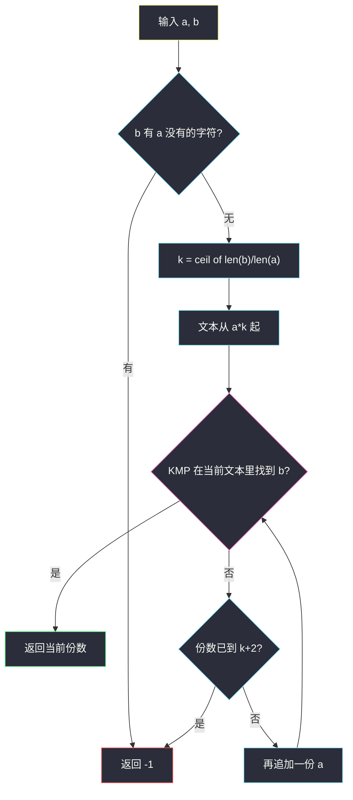
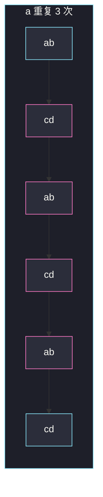

# 重复叠加字符串匹配（KMP 在 a 的重复串上搜 b）

## 一、问题描述

给定字符串 `a` 和 `b`，求最小正整数 `n`，使得把 `a` 重复 `n` 次之后，`b` 是这个长串的子串。不可能则返回 `-1`。

`a` 重复 1 次是 `a` 本身，重复 2 次是 `a+a`，以此类推。

> 🔗 LeetCode 686：https://leetcode.cn/problems/repeated-string-match/
>
> 数据范围：`1 ≤ a.length, b.length ≤ 10^4`，只含小写字母。
>
> 📚 灵茶题单：**一、KMP（前缀的后缀）**，2200 分。主解必须手搓 KMP 去 `a` 的有限次重复里搜 `b`，不要写 Python `b in a*n` 当过关答案。

**示例 1**

```
输入：a = "abcd", b = "cdabcdab"
输出：3
解释：abcdabcdabcd 包含 b；重复 2 次的 abcdabcd 还不包含。
```

**示例 2**

```
输入：a = "a", b = "aa"
输出：2
```

**示例 3**

```
输入：a = "a", b = "a"
输出：1
```

**示例 4**

```
输入：a = "abc", b = "wxyz"
输出：-1
解释：w 根本不在 a 里。
```

**直观理解**

`b` 若能出现在 `a+a+a+…` 里，起点只可能落在第一份 `a` 的某个位置。从那里数 `len(b)` 个字符，跨越的 `a` 的份数有一个很小的上界：大约 `⌈len(b)/len(a)⌉` 或再加 1～2。份数从下界试到上界，KMP 一搜就能定。

---

## 二、暴力解法

从 `n = 1` 起把 `a` 拼上去，每次用双重循环查 `b` 是不是子串，直到长串超过某个很大的上限。

```python
class Solution:
    def repeatedStringMatch(self, a: str, b: str) -> int:
        t = ""
        n = 0
        # 粗暴上限：多拼几份 a
        limit = len(b) // len(a) + 3
        while n <= limit:
            if n > 0 and b in t:
                return n
            t += a
            n += 1
        return -1
```

`b in t` 在 CPython 里是优化过的，能过大部分数据，但：

- 没有讲清 `n` 的上界从哪来；
- 和题单 KMP 对不上。

### 🔴 瓶颈在哪里

1. **上界**：`n` 至少 `⌈len(b)/len(a)⌉`，否则总长度都不够。最多再加 2：`b` 可以从第一份 `a` 的末尾附近起跳，尾巴再探进最后一份。
2. **匹配**：在长为 `O(|a|+|b|)` 的文本里找 `b`，KMP 线性，不依赖语言内置 `in`。
3. **早退**：`b` 里有 `a` 没有的字符，直接 `-1`。

---

## 三、优化探索（核心章节）

> 📚 本题在灵茶题单中属于 **一、KMP（前缀的后缀）**。先建 `b` 的前缀函数 `π`，再拿匹配指针 `j` 扫文本。失配时 `j = π[j-1]`，已经对过的前缀不用退回零。

### 3.1 n 的范围

令 `k = ⌈len(b) / len(a)⌉`（代码里 `(len(b) + len(a) - 1) // len(a)`）。

- `n < k`：`a*n` 比 `b` 短，不可能。
- `n = k`：长度刚够或略长，若 `b` 从 `a` 开头对齐，可能直接命中。
- `n = k+1`：典型如示例 1，`b` 从第一份 `a` 的后缀 `"cd"` 起跳，需要再多一份。
- `n = k+2`：保险上界。若 `b` 从第一份很靠后的位置开始，结束位置可能探进第 `k+2` 份。再多没有新的对齐方式——起点模 `|a|` 只有 `|a|` 种，长度已经覆盖全部相位。

主解对 `n = k, k+1, k+2` 各做一次 KMP（文本递增地 `+= a`，不必每次从零拼）。

### 3.2 手搓 KMP

前缀函数（与 2800 同一张表）：

```
π[i] = s[0..i] 的最长真前缀且真后缀的长度
```

匹配：文本指针 `i` 走 `t`，模式指针 `j` 走 `b`。`t[i]==b[j]` 则 `j += 1`；`j == len(b)` 找到。失配且 `j>0` 时 `j = π[j-1]`。

### 3.3 字符集合早退

`set(b) - set(a)` 非空 ⇒ 无论重复多少次都拼不出 `b`。示例 4 走这条路返回 `-1`。



### 3.4 一句话核心

> **n 从 ⌈|b|/|a|⌉ 试到 +2；在 a 的重复串上用 KMP 搜 b，搜到就返回份数。**

---

## 四、代码实现

### Python（主解：前缀函数 + 有限次重复）

```python
class Solution:
    def repeatedStringMatch(self, a: str, b: str) -> int:
        if set(b) - set(a):
            return -1

        def pi_of(s: str) -> list[int]:
            n = len(s)
            pi = [0] * n
            for i in range(1, n):
                j = pi[i - 1]
                while j > 0 and s[i] != s[j]:
                    j = pi[j - 1]
                if s[i] == s[j]:
                    j += 1
                pi[i] = j
            return pi

        def kmp_found(text: str, pat: str) -> bool:
            if not pat:
                return True
            pi = pi_of(pat)
            j = 0
            for ch in text:
                while j > 0 and ch != pat[j]:
                    j = pi[j - 1]
                if ch == pat[j]:
                    j += 1
                if j == len(pat):
                    return True
            return False

        k = (len(b) + len(a) - 1) // len(a)
        t = a * k
        for n in range(k, k + 3):
            if n > k:
                t += a
            if kmp_found(t, b):
                return n
        return -1
```

`kmp_found` 每次在新文本上从头扫。`|t| ≤ 3|a| + |b|` 量级，线性完全能过 `10^4`。

**变量含义**

| 写法 | 含义 |
|------|------|
| `k` | 长度下界 `⌈len(b)/len(a)⌉` |
| `pi` | 模式 `b` 的前缀函数 |
| `j` | 已经匹配的模式前缀长度 |
| `t` | 当前 `a` 重复 `n` 次 |

---

## 五、具体例子演示

**示例 1**：`a = "abcd"`，`b = "cdabcdab"`。`len(b)=8`，`len(a)=4`，`k = 2`。

先算 `b` 的 `π`（重叠预备）：

```
下标  0 1 2 3 4 5 6 7
b     c d a b c d a b
π     0 0 0 0 1 2 3 4
```

`π[7]=4`：整个 `"cdab"` 既是前缀也是后缀。KMP 在文本后半段可以对上这段，不必退回 0。

`n = 2`，文本 `"abcdabcd"`：

| 文本位置 | 字符 | j 变化 | 说明 |
|----------|------|--------|------|
| 0 | a | 0 | ≠ c |
| 1 | b | 0 | ≠ c |
| 2 | c | 1 | 对上 b[0] |
| 3 | d | 2 | |
| 4 | a | 3 | |
| 5 | b | 4 | |
| 6 | c | 5 | 用到 π：前缀 cd 再往后 |
| 7 | d | 6 | 文本结束，j=6 < 8，没找到 |

`n = 3`，文本再追加 `"abcd"`，从刚才的逻辑上等于在 `"abcdabcdabcd"` 里继续。位置 8、9：

| 位置 | 字符 | j | 说明 |
|------|------|---|------|
| 8 | a | 7 | 对上 b[6] |
| 9 | b | 8 | 对上 b[7]，命中 |

起点在位置 2，`cdabcdab` 正好跨三份 `a`。返回 3。对拍官方示例 1。



粉段是 `b` 的覆盖：从第一份的 `"cd"` 进到第三份的 `"ab"`。两份不够，三份刚好。

**示例 2**：`a = "a"`，`b = "aa"`。`k = 2`。`a*2 = "aa"`，KMP 第一轮就命中。返回 2。对拍官方。

**示例 3**：`a = "a"`，`b = "a"`。`k = 1`。一份即中。返回 1。对拍官方。

**示例 4**：`a = "abc"`，`b = "wxyz"`。`w ∉ a`，字符集合差集非空，直接 `-1`。对拍官方。即使不做早退，试到 `k+2` 也匹配失败，同样 `-1`。

**还要 +1 的相位**：`a = "abcd"`，`b` 从中间 `"cd"` 起跳，`k` 份长度够但相位不够，必须 `k+1`。这就是示例 1。

---

## 六、复杂度分析

| 方法 | 时间 | 空间 | 说明 |
|------|------|------|------|
| 不断 `+= a` 再 `in` | 取决于实现 | `O(|a|+|b|)` | 能过但不对齐题单 |
| KMP 扫 k～k+2 份（主解） | `O(|a| + |b|)` | `O(|b|)` | `π` 长 `|b|`，文本长 `O(|a|+|b|)` |
| 无限重复模拟 | 无上界 | — | 必须砍到 +2 |

`|a|、|b| ≤ 10^4`，线性足够。

---

## 七、对比总结

| 维度 | 内置 `in` | 手搓 KMP | 只试到 k 份 |
|------|-----------|----------|-------------|
| 正确性 | 通常对 | 对 | 示例 1 会返回 -1 |
| 题单 | 偏题 | **一、KMP** | 相位不够 |
| 早退 | 可选 | 建议 | — |

**易错点**

1. **上界只取 `⌈|b|/|a|⌉`**：示例 1 会错。至少 +1，稳妥 +2。
2. **用 Python `in` 当主解**：能 AC，但没练 `π`。
3. **KMP 失配写成 `j = 0`**：遇到 `b` 自重叠（如示例 1 的 `π[-1]=4`）会退太多，最坏退化。
4. **忘记字符集**：`b` 有外星字符时仍去拼很长的文本。
5. **`n = 0`**：空串不是本题要的；`b` 为空不在数据范围里。
6. **匹配方向**：文本是 `a` 的重复，模式是 `b`，不要反过来。

---

## 八、举一反三

| 题目 | 关系 |
|------|------|
| [2800. 包含三个字符串的最短字符串](https://leetcode.cn/problems/shortest-string-that-contains-three-strings/) | 同批 KMP：`π` 用来求「左后缀 = 右前缀」 |
| [28. 找出字符串中第一个匹配项的下标](https://leetcode.cn/problems/find-the-index-of-the-first-occurrence-in-a-string/) | 同一套 `pi_of` + 匹配指针 |
| [459. 重复的子字符串](https://leetcode.cn/problems/repeated-substring-pattern/) | `π[-1]` 能否整除 n；跟「由 a 重复得到」对偶 |
| [796. 旋转字符串](https://leetcode.cn/problems/rotate-string/) | `b in a+a`，相当于本题 n=2 且 `|a|=|b|` |
| [1392. 最长快乐前缀](https://leetcode.cn/problems/longest-happy-prefix/) | 只要 `π[-1]`，不需要匹配阶段 |

**思想迁移**

- 「短砖块铺成长墙，墙里找图案」：先算最少砖数，再为相位多铺 1～2 块，KMP 扫墙。
- 口诀：**「份数 ceil 起跳，再加两块防错位；手搓 π，别靠 in。」**
