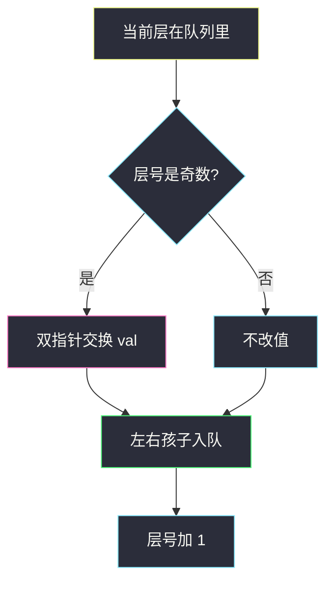
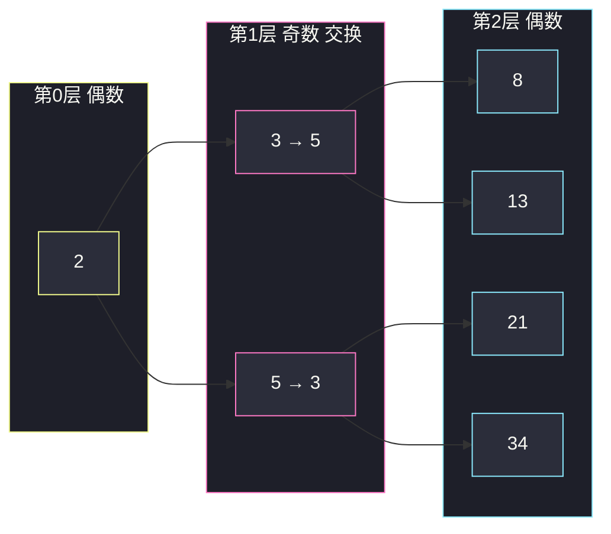

# 反转二叉树的奇数层（层序 BFS · 只换值不换结构）

## 一、问题描述

给定一棵**完美二叉树**根 `root`，把每个**奇数层**上的节点值左右反转，返回根。层号 = 到根的边数（根是第 0 层，偶数，不反转）。

完美：每个父节点都有两个孩子，所有叶子在同一层。反转的是**值**，不是左右孩子指针。

> 🔗 LeetCode 2415：https://leetcode.cn/problems/reverse-odd-levels-of-binary-tree/
>
> 数据范围：节点数 `[1, 2^14]`，`0 ≤ Node.val ≤ 10^5`，保证是完美二叉树。
>
> 📚 灵茶题单：**二叉树 · §2.13 二叉树 BFS**（1431 分）。

**示例 1**

```
输入：root = [2,3,5,8,13,21,34]
输出：[2,5,3,8,13,21,34]
        2                      2
       / \                    / \
      3   5                  5   3
     / \ / \                / \ / \
    8 13 21 34             8 13 21 34
第 1 层 [3,5] 反转成 [5,3]；第 2 层是偶数层，不动。
```

**示例 2**

```
输入：root = [7,13,11]
输出：[7,11,13]
第 1 层 [13,11] → [11,13]。
```

**直观理解**

一层一层看：偶数层原样出队；奇数层把这一层的值倒过来再往下走。队列里存的就是「当前层从左到右」，正是 §2.13 层序 BFS 的用法。完美二叉树保证每一层人数是 2 的幂，左右一定对称。

---

## 二、暴力解法

先层序把每一层的节点收集进二维列表，再对奇数层的值做 `[::-1]` 写回：

```python
class Solution:
    def reverseOddLevels(self, root: Optional[TreeNode]) -> Optional[TreeNode]:
        if root is None:
            return None
        levels = []
        q = deque([root])
        while q:
            levels.append(list(q))
            nxt = deque()
            for node in q:
                if node.left:
                    nxt.append(node.left)
                    nxt.append(node.right)
            q = nxt
        for i, layer in enumerate(levels):
            if i % 2 == 1:
                vals = [n.val for n in layer][::-1]
                for n, v in zip(layer, vals):
                    n.val = v
        return root
```

正确，但把所有层都存下来。节点数最大 `2^14 = 16384`，能过，多占一整份引用。

### 复杂度

- **时间**：`O(n)`。
- **空间**：`O(n)` 存全部层。

### 🔴 瓶颈在哪里

反转只依赖**当前这一层**。BFS 处理完奇数层立刻丢掉，下一层入队即可。空间降到一层的宽度 `O(n/2)`（最底层）。不必先全收集。

---

## 三、优化探索（核心章节）

> 📚 本题在灵茶题单中属于 **二叉树 · §2.13 二叉树 BFS**。层序遍历时记下层号，奇数层把该层节点值反转（双指针交换 `val`）。

### 3.1 反转值，不是翻转孩子

若 `left` / `right` 指针对调，偶数层的结构也会跟着乱，且下一层的左右顺序不再是层序从左到右。题目要的是：第 1 层最左和最右换值，第 3 层同理。指针保持完美树原样。

### 3.2 层序骨架

```
q = [root], level = 0
while q 非空:
    if level 是奇数:
        双指针交换这一层的 val
    把下一层孩子依次入队
    level += 1
```

完美树：有左必有右，入队可以写成固定的两下 `append`。



### 3.3 DFS 双指针（同一思想）

完美树左右对称。一对镜像节点 `(left, right)` 一起往下：奇数层交换它们的 `val`，然后递归 `(left.left, right.right)` 和 `(left.right, right.left)`。从 `(root.left, root.right)`、层号 1 出发。空间是递归栈 `O(h) = O(log n)`，比 BFS 更省。主解仍写 BFS，对齐 §2.13。

### 3.4 一句话核心

> **层序走到奇数层，把这一层的值左右对换；指针不动。**

---

## 四、代码实现

### Python（主解：BFS 层序反转值）

```python
class Solution:
    def reverseOddLevels(self, root: Optional[TreeNode]) -> Optional[TreeNode]:
        q = [root]
        level = 0
        while q:
            if level % 2 == 1:
                i, j = 0, len(q) - 1
                while i < j:
                    q[i].val, q[j].val = q[j].val, q[i].val
                    i += 1
                    j -= 1
            nxt = []
            for node in q:
                if node.left:
                    nxt.append(node.left)
                    nxt.append(node.right)
            q = nxt
            level += 1
        return root
```

**变量含义**

| 写法 | 含义 |
|------|------|
| `q` | 当前层从左到右的节点 |
| `level % 2 == 1` | 奇数层才交换 |
| `i, j` 对调 `val` | 层内左右对称交换；不改 `left`/`right` |

根单独一层，`level = 0` 偶数，跳过。

### Python（可选：DFS 镜像对）

```python
class Solution:
    def reverseOddLevels(self, root: Optional[TreeNode]) -> Optional[TreeNode]:
        def dfs(left: Optional[TreeNode], right: Optional[TreeNode], level: int) -> None:
            if left is None:
                return
            if level % 2 == 1:
                left.val, right.val = right.val, left.val
            dfs(left.left, right.right, level + 1)
            dfs(left.right, right.left, level + 1)

        dfs(root.left, root.right, 1)
        return root
```

### Java（可选）

```java
class Solution {
    public TreeNode reverseOddLevels(TreeNode root) {
        List<TreeNode> q = new ArrayList<>();
        q.add(root);
        int level = 0;
        while (!q.isEmpty()) {
            if (level % 2 == 1) {
                int i = 0, j = q.size() - 1;
                while (i < j) {
                    int tmp = q.get(i).val;
                    q.get(i).val = q.get(j).val;
                    q.get(j).val = tmp;
                    i++;
                    j--;
                }
            }
            List<TreeNode> nxt = new ArrayList<>();
            for (TreeNode node : q) {
                if (node.left != null) {
                    nxt.add(node.left);
                    nxt.add(node.right);
                }
            }
            q = nxt;
            level++;
        }
        return root;
    }
}
```

---

## 五、具体例子演示

**示例 1**：跟踪每一层队列里的值和层号。

```
开始：
        2
       / \
      3   5
     / \ / \
    8 13 21 34
```

| 层号 | 出队前 q 的值 | 奇数? | 交换后 | 下一层入队 |
|------|---------------|-------|--------|------------|
| 0 | `[2]` | 否 | 不动 | `[3, 5]` |
| 1 | `[3, 5]` | **是** | `[5, 3]`（节点还是那两个，值对调） | `[8, 13, 21, 34]` |
| 2 | `[8, 13, 21, 34]` | 否 | 不动 | 空，结束 |

第 1 层交换的是**值**：左边那个节点从 3 变成 5，右边从 5 变成 3。它们的孩子仍是 8、13 和 21、34，所以偶数层顺序不变。



**示例 3 第 3 层**：值为 `[1,1,1,1,2,2,2,2]`，双指针 `i=0,j=7` 起，依次对调成 `[2,2,2,2,1,1,1,1]`。层内 8 个节点，交换 4 次。

DFS 镜像对走第 1 层：一对 `(3,5)` 层号 1 为奇，交换；再对 `(8,34)`、`(13,21)` 层号 2 为偶，不换。与 BFS 结果相同。

---

## 六、复杂度分析

| 方法 | 时间 | 空间 | 说明 |
|------|------|------|------|
| 先收集全部层再写回 | `O(n)` | `O(n)` | 多存整棵引用 |
| BFS 当场反转（主解） | `O(n)` | `O(w)`，`w` 为最宽层，完美树 `O(n)` | 队列最多一层 |
| DFS 镜像对 | `O(n)` | `O(h) = O(log n)` | 完美树高度 `log n` |

`n ≤ 2^14`，三种都能过。主解选 BFS 对齐题单小节。

---

## 七、对比总结

| 维度 | 本题 BFS | #226 翻转二叉树 | #103 锯齿层序 |
|------|----------|-----------------|---------------|
| 动的是什么 | 奇数层的 **val** | 每个点的左右指针 | 只改变输出顺序，树本身不动 |
| 层号 | 根 = 0，奇层才换 | 每层都换指针 | 奇偶层输出方向不同 |
| 结构 | 完美，层序位置即对称位置 | 任意二叉树 | 任意二叉树 |

**易错点**

1. **翻转了 `left`/`right` 指针**：偶数层孩子顺序会错，下一层队列不再是「从左到右」。
2. **层号从 1 起算根**：根会被当成奇数层，示例 1 的 2 也会被换——但根一层只有一个节点，碰巧看不出来。第二层（真正的第 1 层）会错位。统一：根层号 0。
3. **非完美树按本题写法入队**：题目保证完美；若一边为 `None`，`node.left` 再 `node.right` 会把空指针塞进队列。
4. **反转节点对象而不是值**：把 `q.reverse()` 再去挂孩子，父子关系全乱。只换 `val`。
5. **DFS 镜像递归成 `(left.left, right.left)`**：应对的是最左对最右、次左对次右，必须交叉：`left.left` 配 `right.right`。

---

## 八、举一反三

| 题目 | 关系 |
|------|------|
| [103. 二叉树的锯齿形层序遍历](https://leetcode.cn/problems/binary-tree-zigzag-level-order-traversal/) | 同节 BFS；奇偶层方向不同，但只影响输出列表 |
| [107. 二叉树的层序遍历 II](https://leetcode.cn/problems/binary-tree-level-order-traversal-ii/) | 层序收集后倒层 |
| [116. 填充每个节点的下一个右侧节点指针](https://leetcode.cn/problems/populating-next-right-pointers-in-each-node/) | 也是完美二叉树 + 层内从左到右 |
| [226. 翻转二叉树](https://leetcode.cn/problems/invert-binary-tree/) | 换的是指针，每层都换，和「只换奇层的值」相反 |
| [1609. 奇偶树](https://leetcode.cn/problems/even-odd-tree/) | 层序检查奇偶层的值约束 |

**思想迁移**

- 按层处理 → BFS，队列 = 当前层从左到右。
- 完美树左右对称 → 也可以 DFS 两指针同时下沉。
- 口诀：**「奇层对调值；指针保持原样。」**
