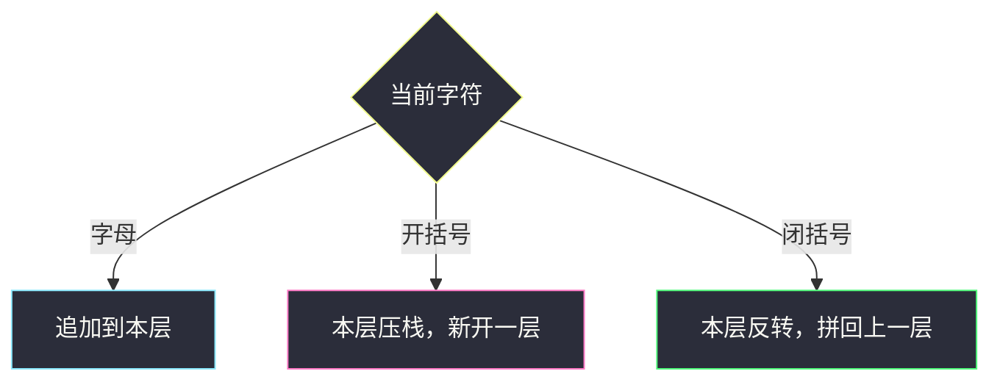
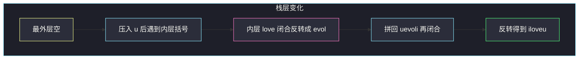

# 反转每对括号间的子串（括号栈）

## 一、问题描述

给出一个字符串 `s`（由小写字母和括号组成），从**最内层**括号开始：把该对括号之间的子串反转，然后**去掉**这一对括号。重复直到字符串中没有括号。返回最终字符串。

题目保证括号是合法匹配的（RBS：合法括号字符串）。

> 🔗 LeetCode 1190：https://leetcode.cn/problems/reverse-substrings-between-each-pair-of-parentheses/
>
> 数据范围：`1 <= s.length <= 2000`，`s[i]` 为 `'('`、`')'` 或小写字母。`O(n²)` 足够；另有 `O(n)` 虫洞跳转可作进阶。

**示例 1**

```
输入：s = "(abcd)"
输出："dcba"
```

**示例 2**

```
输入：s = "(u(love)i)"
输出："iloveu"
解释：内层 (love) → evol，变成 (uevoli)，再反转 → iloveu。
```

**示例 3**

```
输入：s = "(ed(et(oc))el)"
输出："leetcode"
```

**直观理解**

括号一层套一层，内层先反转，结果再交给外层一起反转。这和「表达式求值 / 字符串解码」一样：遇 `'('` 开新一层，遇 `')'` 把当前层处理完拼回上一层。处理动作就是**整层反转**。

---

## 二、暴力解法

反复找最内层括号：扫描一对相邻的 `'('` … `')'` 中间不再含括号，反转中间、删括号，直到没有 `'('`。

```python
class Solution:
    def reverseParentheses(self, s: str) -> str:
        s = list(s)
        while True:
            r = -1
            for i, c in enumerate(s):
                if c == ')':
                    r = i
                    break
            if r < 0:
                return ''.join(s)
            l = r - 1
            while s[l] != '(':
                l -= 1
            s = s[:l] + s[l + 1:r][::-1] + s[r + 1:]
```

每次找一对并拷贝整个串。最坏括号套 `n/2` 层、每层拷贝 `O(n)`，仍是 `O(n²)` 级别，能过；逻辑碎，不如一遍栈。

### 复杂度

- **时间**：`O(n²)`。
- **空间**：`O(n)`。

### 🔴 瓶颈在哪里

「最内层」其实就是最后一次还没匹配的 `'('`。用栈在一次扫描里完成：开括号记下当前进度，闭括号把从该处开始的片段反转。

---

## 三、优化探索（核心章节）

> 📚 本题在灵茶题单中属于 **栈 · §3.4 合法括号字符串（RBS）**。合法括号串的经典处理：栈存上一层的结果（或当前长度），`')'` 时把本层加工后拼回去。本题的「加工」就是反转。

### 3.1 字符串栈

维护 `st`（上一层已写出的字符列表）和 `cur`（当前层）。

- 字母：追加到 `cur`
- `'('`：把 `cur` 压栈，`cur` 清空，开始新的一层
- `')'`：`cur` 反转，弹出上一层，拼在后面：`cur = pop() + reversed(本层)`

扫完后 `cur` 就是答案。嵌套时内层先闭合，正好符合「从最内层开始反转」。



### 3.2 下标栈（同一思想）

不必真的分层存多份字符串：用一个数组 `ans` 当「当前已输出」，栈里只存遇到 `'('` 时 `ans` 的长度。遇到 `')'`，把 `ans[pos:]` 就地反转。效果相同，代码更短。

### 3.3 进阶：虫洞 O(n)

先 `O(n)` 配对每对括号的下标。然后从左往右走，但碰到括号就**跳到配对的那一侧并掉头**（方向 `d` 取反）。字母按访问顺序追加。每条边走一次，总时间 `O(n)`。

直觉：进入 `'('` 等于「从配对 `')'` 的内侧反向走」，正好把这一层按反转后的顺序读出来；再碰到括号又跳、再掉头，把嵌套一层层展开。`n≤2000` 时不是必须，面试能讲清栈即可。

### 3.4 一句话核心

> **遇 `'('` 开新层（或记下当前长度）；遇 `')'` 把本层反转后交给上一层。**

---

## 四、代码实现

### Python（主解：字符串栈）

```python
class Solution:
    def reverseParentheses(self, s: str) -> str:
        st = []
        cur = []
        for c in s:
            if c == '(':
                st.append(cur)
                cur = []
            elif c == ')':
                cur.reverse()
                cur = st.pop() + cur
            else:
                cur.append(c)
        return ''.join(cur)
```

**变量含义**

| 变量 | 含义 |
|------|------|
| `st` | 每一层「左括号之前」已经写好的字符 |
| `cur` | 当前括号层内部正在收集的字符 |

下标栈同款（更省一层列表）：

```python
class Solution:
    def reverseParentheses(self, s: str) -> str:
        st = []
        ans = []
        for c in s:
            if c == '(':
                st.append(len(ans))
            elif c == ')':
                i = st.pop()
                ans[i:] = reversed(ans[i:])
            else:
                ans.append(c)
        return ''.join(ans)
```

### 可选：虫洞 O(n)

```python
class Solution:
    def reverseParentheses(self, s: str) -> str:
        n = len(s)
        pair = [0] * n
        st = []
        for i, c in enumerate(s):
            if c == '(':
                st.append(i)
            elif c == ')':
                j = st.pop()
                pair[i] = j
                pair[j] = i
        ans = []
        i, d = 0, 1
        while i < n:
            if s[i] in '()':
                i = pair[i]
                d = -d
            else:
                ans.append(s[i])
            i += d
        return ''.join(ans)
```

### Java（栈主解）

```java
class Solution {
    public String reverseParentheses(String s) {
        Deque<StringBuilder> st = new ArrayDeque<>();
        StringBuilder cur = new StringBuilder();
        for (int i = 0; i < s.length(); i++) {
            char c = s.charAt(i);
            if (c == '(') {
                st.push(cur);
                cur = new StringBuilder();
            } else if (c == ')') {
                cur.reverse();
                cur = st.pop().append(cur);
            } else {
                cur.append(c);
            }
        }
        return cur.toString();
    }
}
```

---

## 五、具体例子演示

### 5.1 `s = "(u(love)i)"`（每步栈内容）

字符串下标：`0:(  1:u  2:(  3:l 4:o 5:v 6:e  7:)  8:i  9:)`

| 读入 | `st`（外层） | `cur`（本层） | 动作 |
|------|----------------|----------------|------|
| 初始 | `[]` | `[]` | — |
| `(` | `[[]]` | `[]` | 压入空层，新开 |
| `u` | `[[]]` | `[u]` | 字母 |
| `(` | `[[], [u]]` | `[]` | 把 `[u]` 压栈 |
| `love` | 同上 | `[l,o,v,e]` | 字母 |
| `)` | `[[]]` | `[u,e,v,o,l]` | 反转 `love`→`evol`，拼到 `[u]` |
| `i` | `[[]]` | `[u,e,v,o,l,i]` | 字母 |
| `)` | `[]` | `[i,l,o,v,e,u]` | 反转整层 → `iloveu` |

最终 `iloveu`。



下标栈同步跟踪 `ans`：

| 读入 | st（长度） | ans |
|------|------------|-----|
| `(` | `[0]` | `[]` |
| `u` | `[0]` | `[u]` |
| `(` | `[0, 1]` | `[u]` |
| `love` | `[0, 1]` | `[u,l,o,v,e]` |
| `)` | `[0]` | `[u,e,v,o,l]`（下标 1 起反转） |
| `i` | `[0]` | `[u,e,v,o,l,i]` |
| `)` | `[]` | `[i,l,o,v,e,u]`（下标 0 起反转） |

### 5.2 `s = "(ed(et(oc))el)"` 关键几步

最内 `(oc)` → `co`，上一层变成 `etco`，再反转 → `octe`，再和外层 `ed`…`el` 拼成 `edocteel`，最外反转 → `leetcode`。

### 5.3 虫洞扫一眼示例 2

配对：`0↔9`，`2↔7`。从 `i=0,d=+1` 出发：遇 `(` 跳到 9 并掉头，走到 `i=8` 的 `i`，再遇 `)` 跳到 2 掉头进入 `love` 正向……字母顺序恰好 `i,l,o,v,e,u`。

---

## 六、复杂度分析

| 方法 | 时间 | 空间 | 说明 |
|------|------|------|------|
| 反复找最内层 | `O(n²)` | `O(n)` | 多次拷贝 |
| 字符串栈 / 下标栈（主解） | `O(n²)` | `O(n)` | 每次反转一段，总长累加 ≤ `n + n/2 + …` = `O(n²)` |
| 虫洞跳转 | `O(n)` | `O(n)` | 配对一次 + 每下标访问常数次 |

`n ≤ 2000`，`O(n²)` 约四百万次操作，主解足够。需要线性时再写虫洞。

---

## 七、对比总结

| 维度 | 反复删括号 | 栈分层 | 虫洞 |
|------|------------|--------|------|
| 内层优先 | 显式找最内 `)` | `)` 先闭合的就是内层 | 跳转模拟反转顺序 |
| 实现量 | 多次扫描 | 一遍 | 先配对再走 |

**易错点**

1. **`'('` 时忘了把当前层压栈**：内外层字符混在一起，反转范围错误。
2. **`')'` 只 reverse 不拼回上一层**：丢掉外层已有字母。
3. **反转后仍保留括号**：题面要去掉括号，栈方案根本不把括号写入 `cur`。
4. **Python `cur = st.pop() + cur.reverse()`**：`list.reverse()` 返回 `None`。应先 `cur.reverse()` 再拼接，或 `st.pop() + cur[::-1]`。
5. **虫洞忘了 `i += d`**：跳到配对下标后还要沿新方向走一步，否则停在括号上死循环。

**模板（§3.4 RBS 分层处理）**

```python
st, cur = [], []
for c in s:
    if c == '(':
        st.append(cur); cur = []
    elif c == ')':
        # 对本层做运算（本题是 reverse）
        cur = st.pop() + 处理后的本层
    else:
        cur.append(c)
```

---

## 八、举一反三

| 题目 | 关系 |
|------|------|
| [394. 字符串解码](https://leetcode.cn/problems/decode-string/) | 同款分层栈：`']'` 时把本层重复 k 次拼回上一层 |
| [856. 括号的分数](https://leetcode.cn/problems/score-of-parentheses/) | `)` 时把本层分数加倍或记 1，再加回上一层 |
| [20. 有效的括号](https://leetcode.cn/problems/valid-parentheses/) | RBS 入门：栈只做匹配 |
| [32. 最长有效括号](https://leetcode.cn/problems/longest-valid-parentheses/) | 栈存下标算合法段长度 |
| [921. 使括号有效的最少添加](https://leetcode.cn/problems/minimum-add-to-make-parentheses-valid/) | 统计失衡，不必真的反转 |
| [1249. 移除无效的括号](https://leetcode.cn/problems/minimum-remove-to-make-valid-parentheses/) | 栈标出非法括号再删 |

**思想迁移**

- 合法括号嵌套 + 层内变换 → 栈保存上一层，闭括号时加工本层再拼接。
- 口诀：**「开括号压层；闭括号反转；字母只进当前层。」**
