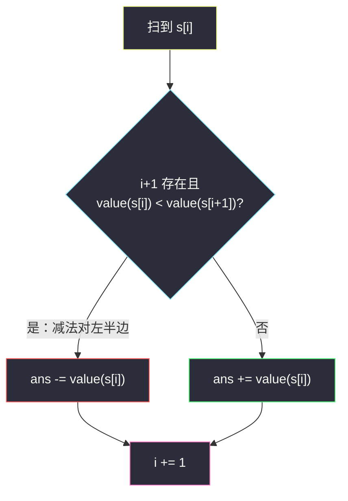

# 罗马数字转整数

## 一、问题描述

罗马数字由七个符号组成：`I=1`、`V=5`、`X=10`、`L=50`、`C=100`、`D=500`、`M=1000`。通常从大到小、从左到右相加；但有六种「小数在大数左边」表示减法：`IV=4`、`IX=9`、`XL=40`、`XC=90`、`CD=400`、`CM=900`。给定合法罗马字符串 `s`，把它转成整数。

> 🔗 LeetCode 13：https://leetcode.cn/problems/roman-to-integer/
>
> 数据范围：`1 <= s.length <= 15`，`s` 是合法罗马数字。

**示例 1**

```
输入：s = "III"
输出：3
解释：I + I + I = 3。
```

**示例 2**

```
输入：s = "LVIII"
输出：58
解释：L = 50，V = 5，III = 3。
```

**示例 3**

```
输入：s = "MCMXCIV"
输出：1994
解释：M + CM + XC + IV = 1000 + 900 + 90 + 4。
```

**直观理解**

每个字符都有固定面值。多数时候直接加；只有「当前面值比右边那个小」时，当前这个要减（它是减法对的左半边）。不必先切出 `CM` 这种子串。

---

## 二、暴力解法

先用哈希表记下六个减法对，每次优先吃两个字符，吃不到再吃一个：

```python
class Solution:
    def romanToInt(self, s: str) -> int:
        special = {"IV": 4, "IX": 9, "XL": 40, "XC": 90, "CD": 400, "CM": 900}
        single = {"I": 1, "V": 5, "X": 10, "L": 50, "C": 100, "D": 500, "M": 1000}
        ans, i, n = 0, 0, len(s)
        while i < n:
            if i + 1 < n and s[i:i + 2] in special:
                ans += special[s[i:i + 2]]
                i += 2
            else:
                ans += single[s[i]]
                i += 1
        return ans
```

### 复杂度

- **时间**：`O(n)`。
- **空间**：`O(1)`。

### 🔴 瓶颈在哪里

时间已经线性。问题是规则被拆成「特例表 + 单字符表」，要记 13 个键。更干净的做法：只留 7 个单字符面值，用「左小右大则减」统一处理。

---

## 三、优化探索（核心章节）

> 📚 本题在灵茶题单中属于 **Part A**（无评分热身）。扫描字符串、按相邻大小决定加减，是后面栈 / 表达式解析的铺垫。

### 3.1 减法对的本质

六种合法减法对，本质都是「左边那个贡献负的面值」：

| 写法 | 左 | 右 | 合计 |
|------|----|----|------|
| IV | -1 | +5 | 4 |
| IX | -1 | +10 | 9 |
| XL | -10 | +50 | 40 |
| XC | -10 | +100 | 90 |
| CD | -100 | +500 | 400 |
| CM | -100 | +1000 | 900 |

`IV` 不是一个新符号，而是 `I` 贡献 `-1`、`V` 贡献 `+5`。推广：扫描到位置 `i`，若 `value(s[i]) < value(s[i+1])`，则 `ans -= value(s[i])`；否则 `ans += value(s[i])`。最后一个字符右边没有更大的数，一定加。



### 3.2 为什么不会减错

题目保证输入合法：减法只出现在那六种相邻对上，且不会连续减两次。所以「只和右边一位比大小」足够，不必看更远。

### 3.3 一句话核心

> **只记 7 个面值；当前比下一位小就减，否则加。**

---

## 四、代码实现

### Python（主解：左到右按相邻大小加减）

```python
class Solution:
    def romanToInt(self, s: str) -> int:
        val = {"I": 1, "V": 5, "X": 10, "L": 50,
               "C": 100, "D": 500, "M": 1000}
        ans = 0
        n = len(s)
        for i in range(n):
            if i + 1 < n and val[s[i]] < val[s[i + 1]]:
                ans -= val[s[i]]
            else:
                ans += val[s[i]]
        return ans
```

**变量含义**

| 变量 | 含义 |
|------|------|
| `val` | 七个罗马符号的面值 |
| `i` | 当前字符下标 |
| `ans` | 累计结果 |

从右往左扫也可以：维护「右边已扫过的最大面值」，当前更小则减。效果相同，面试写「看下一位」更直观。

`IV` 这种最短减法对也能用同一条规则：`I` 比右边 `V` 小，`-1`；`V` 右边没有更大的，`+5`，合起来 4。不必单独写 `if s[i:i+2]=="IV"`。

---

## 五、具体例子演示

先看最短减法对 `s = "IV"`：`i=0` 时 1 < 5，`ans = -1`；`i=1` 时 5 没有下一位，`ans = 4`。

再看 `s = "MCMXCIV"`。面值序列：`1000, 100, 1000, 10, 100, 1, 5`。

| i | 字符 | 面值 | 下一位 | 比下一位小? | 动作 | ans |
|---|------|------|--------|-------------|------|-----|
| 0 | M | 1000 | C=100 | 否 | +1000 | 1000 |
| 1 | C | 100 | M=1000 | 是 | -100 | 900 |
| 2 | M | 1000 | X=10 | 否 | +1000 | 1900 |
| 3 | X | 10 | C=100 | 是 | -10 | 1890 |
| 4 | C | 100 | I=1 | 否 | +100 | 1990 |
| 5 | I | 1 | V=5 | 是 | -1 | 1989 |
| 6 | V | 5 | 无 | 否 | +5 | **1994** |

`CM`、`XC`、`IV` 三处都是「左减右加」，加起来正好 900、90、4。

`s = "LVIII"` 没有减法对：50+5+1+1+1，每一步都是「不小于下一位 → 加」，得到 58。

从右往左扫 `MCMXCIV` 时：先加 V=5，右边最大是 5；I=1 < 5 则减；C=100 ≥ 5 则加，并更新右边最大为 100；X=10 < 100 则减……最终同样 1994。

---

## 六、复杂度分析

| 方法 | 时间 | 空间 | 说明 |
|------|------|------|------|
| 减法对优先吃两字符 | `O(n)` | `O(1)` | 要记 13 个键 |
| 相邻比较加减（主解） | `O(n)` | `O(1)` | 只记 7 个面值 |

`n ≤ 15`，常数无关紧要，主解胜在规则统一。

---

## 七、对比总结

| 维度 | 特例表切分 | 相邻比较 |
|------|------------|----------|
| 规则 | 六对 + 七单字符 | 七面值 + 一条比较 |
| 指针 | 一次走 1 或 2 | 每次走 1 |
| 易错 | 漏某对、切错边界 | 漏写 `i+1 < n` |

**易错点**

1. **只加不加减**：`IV` 会算成 6。
2. **和左边比**：规则是看**右边**更大才减；看左边会把 `VI` 减错。
3. **越界**：最后一位没有 `s[i+1]`，必须先判 `i + 1 < n`。
4. **把 `II` 当减法**：相等要加，不是减。

**模板**

```python
if i + 1 < n and val[s[i]] < val[s[i + 1]]:
    ans -= val[s[i]]
else:
    ans += val[s[i]]
```

---

## 八、举一反三

| 题目 | 关系 |
|------|------|
| [12. 整数转罗马数字](https://leetcode.cn/problems/integer-to-roman/) | 本题逆过程：贪心从大面值往下扣 |
| [273. 整数转换英文表示](https://leetcode.cn/problems/integer-to-english-words/) | 同样是「符号表 + 扫描规则」 |
| [171. Excel 表列序号](https://leetcode.cn/problems/excel-sheet-column-number/) | 26 进制累加，扫描方向相反但都是逐位映射 |
| [8. 字符串转换整数 (atoi)](https://leetcode.cn/problems/string-to-integer-atoi/) | 同批解析题：指针扫状态，见 `string-to-integer-atoi.md` |

**思想迁移**

- 见到「特殊组合比单字符优先」，先问能不能用**相邻关系**消掉特例表。
- 口诀：**「左小右大就减，否则加。」**
