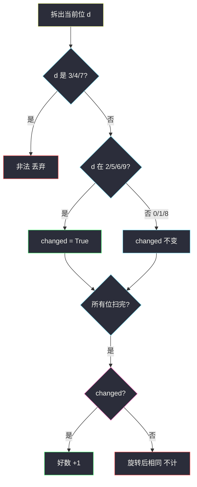
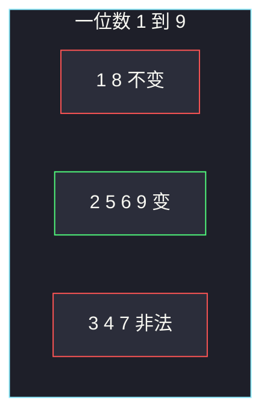

# 旋转数字（逐位判定 · 好数统计）

## 一、问题描述

把一个数的**每一位**旋转 180°：

| 原数字 | 0 | 1 | 2 | 5 | 6 | 8 | 9 | 3/4/7 |
|--------|---|---|---|---|---|---|---|-------|
| 旋转后 | 0 | 1 | 5 | 2 | 9 | 8 | 6 | 非法 |

一个数是**好数**，当且仅当：每一位都能旋转（不含 3、4、7），并且旋转完成后得到的数**与原来不同**。求 `1 .. n` 里好数的个数。

「与原来不同」⇔ 至少有一位是 `2/5/6/9`（这些旋转后会变）。只有 `0/1/8` 组成的数，转完还是自己，不算好数。

> 🔗 LeetCode 788：https://leetcode.cn/problems/rotated-digits/
>
> 数据范围：`1 ≤ n ≤ 10^4`。
>
> 📚 灵茶题单：**§10.1 统计合法元素的数目**。本质是逐位检查合法性；`n` 很小可以直接枚举。同一套规则也能写成数位 DP，方便迁到更大的 `n`。

**示例 1**

```
输入：n = 10
输出：4
解释：好数是 2、5、6、9。1 转完还是 1；10 转完还是 10；8 转完还是 8。
```

**示例 2**

```
输入：n = 1
输出：0
解释：1 不是好数（旋转后不变）。
```

**直观理解**

合法字符集 `valid = {0,1,2,5,6,8,9}`，其中 `diff = {2,5,6,9}` 会改变数值。从 1 扫到 n，每位都在 `valid` 里且至少一位在 `diff` 里，就计数。

---

## 二、暴力解法

对每个 `x`，拆数字符。

```python
class Solution:
    def rotatedDigits(self, n: int) -> int:
        valid = set("0182569")
        diff = set("2569")
        ans = 0
        for x in range(1, n + 1):
            s = str(x)
            if any(ch not in valid for ch in s):
                continue
            if any(ch in diff for ch in s):
                ans += 1
        return ans
```

`n ≤ 10000`，每位最多 5 位，`O(n log n)` 按十进制位数，轻松过。官方两例：`10 → 4`，`1 → 0`。

这已经是本题该交的解。下面的数位 DP 是 §10.1 的模板练习，不是性能刚需。

### 🔴 瓶颈在哪里

若 `n` 到 `10^18`，枚举不行，要按位统计「不超过 n 的合法数」。本题约束小，两种都写，枚举做主解、数位 DP 做迁移。

---

## 三、优化探索（核心章节）

> 📚 本题在灵茶题单中属于 **§10.1 统计合法元素的数目**。先给出判定函数 `isGood(x)`，再对 `1..n` 计数。判定本身就是「逐位扫描 + 两个布尔量」。数位 DP 只是把这套判定嵌进「贴着上界填位」。

### 3.1 判定不变式

扫完一个数的十进制表示后：

- `ok = True`：每位都在 `{0,1,2,5,6,8,9}`
- `changed = True`：至少一位在 `{2,5,6,9}`

好数 ⇔ `ok and changed`。出现 3/4/7 立刻 `ok = False`。

前导零：数值 `8` 写成一位 `'8'`，没有前导零问题。数位 DP 里要对「尚未开始填数字」单独处理，避免把 `000` 当成合法的「全 0/1/8」。

### 3.2 数位 DP 状态

把 `n` 看成数字串 `s`，从高位填到低位。

`dfs(pos, tight, started, changed)`：

- `pos`：当前填到第几位（0 是最高位）
- `tight`：前面是否一直贴着 `s` 的前缀（限制本位点的上界）
- `started`：前面是否已经填过非零（开始组成一个数）
- `changed`：已填的非前导零位里是否出现过 `2/5/6/9`

合法转移的数字：`0,1,2,5,6,8,9`（`tight` 时还不能超过本界）。`3/4/7` 直接跳过。

终点 `pos == len(s)`：若 `started and changed` 计 1，否则 0。前导零走完全程表示数值 0，`started=False`，不计（题目从 1 开始）。



### 3.3 一句话核心

> **每位必须能转；至少一位会变。枚举即可；更大 n 用数位 DP 带着 tight 和 changed。**

---

## 四、代码实现

### Python（主解：枚举 + 逐位判定）

```python
class Solution:
    def rotatedDigits(self, n: int) -> int:
        # 0/1/8 可转但不变；2/5/6/9 可转且变；3/4/7 不能转
        same = {0, 1, 8}
        diff = {2, 5, 6, 9}
        valid = same | diff
        ans = 0
        for x in range(1, n + 1):
            y = x
            ok = True
            changed = False
            while y:
                d = y % 10
                if d not in valid:
                    ok = False
                    break
                if d in diff:
                    changed = True
                y //= 10
            if ok and changed:
                ans += 1
        return ans
```

用字符串也行，和第二节相同。整除取余更贴近「逐位」。

### Python（数位 DP，对拍同一答案）

```python
from functools import cache

class Solution:
    def rotatedDigits(self, n: int) -> int:
        s = str(n)
        m = len(s)
        good = (0, 1, 2, 5, 6, 8, 9)
        diff = {2, 5, 6, 9}

        @cache
        def dfs(pos: int, tight: bool, started: bool, changed: bool) -> int:
            # 从高位 pos 填到末尾，满足上界/已开始/已变形 约束的好数个数
            if pos == m:
                return int(started and changed)
            up = int(s[pos]) if tight else 9
            ans = 0
            for d in range(up + 1):
                if d not in good:
                    continue
                ntight = tight and d == up
                nstarted = started or d != 0
                nchanged = changed or (nstarted and d in diff)
                ans += dfs(pos + 1, ntight, nstarted, nchanged)
            return ans

        return dfs(0, True, False, False)
```

前导零：`d == 0` 且尚未 `started` 时，不要把 0 当成 `diff`（0 也不在 `diff` 里，本来就不会）。`good` 含 0 是为了让前导零能继续往下走，以及数值中间的 0。

### Java（最优解：枚举）

```java
class Solution {
    public int rotatedDigits(int n) {
        int ans = 0;
        for (int x = 1; x <= n; x++) {
            if (isGood(x)) {
                ans++;
            }
        }
        return ans;
    }

    private boolean isGood(int x) {
        boolean changed = false;
        while (x > 0) {
            int d = x % 10;
            if (d == 3 || d == 4 || d == 7) {
                return false;
            }
            if (d == 2 || d == 5 || d == 6 || d == 9) {
                changed = true;
            }
            x /= 10;
        }
        return changed;
    }
}
```

---

## 五、具体例子演示

### 5.1 官方示例 1：`n = 10` 逐个数判定

对 `1..10` 逐位看（个位、十位）：

| x | 各位 | 合法? | 有变形位? | 好数? |
|---|------|-------|-----------|-------|
| 1 | 1 | 是 | 否 | 否（转完仍 1） |
| 2 | 2 | 是 | 是 | **是** → 5 |
| 3 | 3 | 否 | — | 否 |
| 4 | 4 | 否 | — | 否 |
| 5 | 5 | 是 | 是 | **是** → 2 |
| 6 | 6 | 是 | 是 | **是** → 9 |
| 7 | 7 | 否 | — | 否 |
| 8 | 8 | 是 | 否 | 否（转完仍 8） |
| 9 | 9 | 是 | 是 | **是** → 6 |
| 10 | 1, 0 | 是 | 否 | 否（转完仍 10） |

好数 4 个：`2,5,6,9`。对拍官方。

`10` 是易错点：两位都在 `{0,1,8}`，整段可转但不变。

### 5.2 官方示例 2：`n = 1`

只检查 1：合法、未变形，答案 0。对拍官方。

### 5.3 再往后看两位（帮助理解 changed）

`11`：两个 1，合法不变。  
`12`：1 与 2，合法且有 2，好数，转成 15。  
`15`：1 与 5，转成 12。  
`16`、`19`、`20` 都是好数。`n = 20` 时一共 9 个：`2,5,6,9,12,15,16,19,20`。

`18`：1 和 8，合法不变，**不是**好数。  
`13`：有 3，整数非法。



绿的四个就是 `n=10` 的答案；红的要么转不动要么转完没变。

### 5.4 数位 DP 对 `n = 10` 的贴界

`s = "10"`，两位。

- 高位只能 0 或 1（`tight`）。
- 高位填 0：还没 `started`，低位相当于在数一位数 `0..9`，但上界已松开（高位比 1 小）。低位枚举合法数字，其中 `2,5,6,9` 计 4；`1,8` 未变形不计；`0` 仍是前导零，终点 `started=False` 不计。
- 高位填 1：`started=True`，`changed=False`，低位上界 0，只能填 0。`0` 不在 diff，终点 `changed=False`，`10` 不计。

合计 4，与枚举一致。

---

## 六、复杂度分析

| 方法 | 时间 | 空间 | 说明 |
|------|------|------|------|
| 枚举 + 逐位（主解） | `O(n · D)`，`D≤5` | `O(1)` | `n≤10^4` 首选 |
| 数位 DP | `O(D · 2 · 2 · 2 · 10)` 记忆化状态极少 | `O(D)` 栈 + 缓存 | 迁到大 n；本题与枚举答案相同 |

---

## 七、对比总结

| 维度 | 只要求「能转」 | 本题好数 |
|------|----------------|----------|
| 0/1/8 | 算合法 | 必须再配上至少一个 2/5/6/9 |
| 3/4/7 | 整数作废 | 同 |
| 0 | 通常不计 | 题目从 1 起，0 本来就不在范围里 |

**易错点**

1. **把 0/1/8 当成好数**：旋转后相同，题面明确排除。
2. **漏掉 2↔5、6↔9**：只写了 0/1/8 会少算。
3. **`n=10` 把 10 算进去**：1 和 0 都能转，但结果相同。
4. **数位 DP 把前导零的 `started=False` 计 1**：会把 0 算进答案。
5. **认为 2 转成 5 还要再检查 5 是否 ≤ n**：好数看的是「原数在 1..n」，不是旋转后的数在不在范围内。

---

## 八、举一反三

| 题目 | 关系 |
|------|------|
| [233. 数字 1 的个数](https://leetcode.cn/problems/number-of-digit-one/) | §10.1 数位统计 |
| [902. 最大为 N 的数字组合](https://leetcode.cn/problems/numbers-at-most-n-given-digit-set/) | 给定数字集合、不超过 n，纯数位 DP |
| [1012. 至少有 1 位重复的数字](https://leetcode.cn/problems/numbers-with-repeated-digits/) | 补集：没有重复数字的个数 |
| [2376. 统计特殊整数](https://leetcode.cn/problems/count-special-integers/) | 各位都不同，贴界数位 DP |
| [357. 统计各位数字都不同的数字个数](https://leetcode.cn/problems/count-numbers-with-unique-digits/) | 另一类「合法数字计数」 |

**思想迁移**

- 先写出 `O(位数)` 的判定，再决定枚举还是数位 DP。
- 口诀：**「能转且至少一位会变；小 n 枚举，大 n 带着 tight 填位。」**
