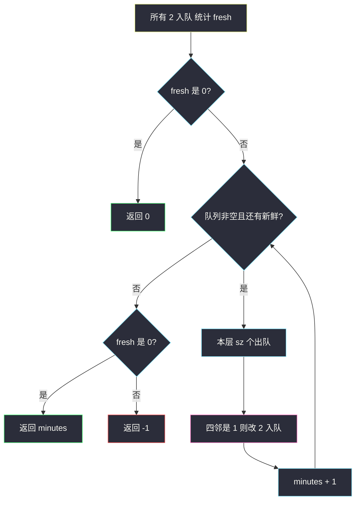
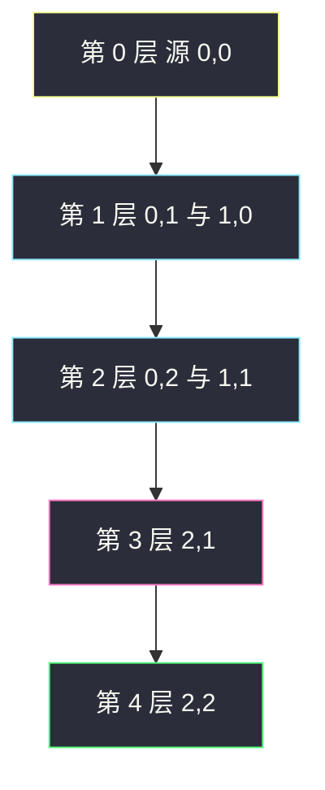

# 腐烂的橘子（多源 BFS · 按分钟传染）

## 一、问题描述

`m × n` 网格 `grid`：`0` 空格、`1` 新鲜橘子、`2` 腐烂橘子。每过 **1 分钟**，每个腐烂橘子会把 **四连通** 相邻的新鲜橘子变成腐烂。求「全部新鲜橘子都腐烂」的最少分钟；若有橘子永远烂不了，返回 `-1`。

空格不能走、不能被传染。一开始就没有新鲜橘子时，答案是 `0`。

> 🔗 LeetCode 994：https://leetcode.cn/problems/rotting-oranges/
>
> 数据范围：`1 ≤ m, n ≤ 10`，格子只含 `0/1/2`。
>
> 📚 灵茶题单：**二、网格图 BFS**。

**示例 1**

```
输入：grid = [[2,1,1],[1,1,0],[0,1,1]]
输出：4

2 1 1        2 2 1        2 2 2        2 2 2        2 2 2
1 1 0   →    2 1 0   →    2 2 0   →    2 2 0   →    2 2 0
0 1 1        0 1 1        0 1 1        0 2 1        0 2 2
分钟 0          1            2            3            4
```

**示例 2**

```
输入：grid = [[2,1,1],[0,1,1],[1,0,1]]
输出：-1
左下角 (2,0) 的新鲜橘子被空格隔开，四连通永远碰不到腐烂源。
```

**示例 3**

```
输入：grid = [[0,2]]
输出：0
一开始就没有新鲜橘子。
```

**直观理解**

腐烂像一场从所有「已烂橘子」同时点燃的火。火每向外烧一圈就是 1 分钟。空格子是防火墙，火过不去。问的是最后一颗新鲜橘子被烧到的时刻。

---

## 二、暴力解法

对每个新鲜橘子单独 BFS，找它到最近腐烂橘子的距离，再取所有新鲜橘子距离的最大值。某个新鲜橘子搜完整张图都碰不到 `2`，就是 `-1`。

```python
from collections import deque
from typing import List

class Solution:
    def orangesRotting(self, grid: List[List[int]]) -> int:
        m, n = len(grid), len(grid[0])
        DIRS = ((0, 1), (0, -1), (1, 0), (-1, 0))

        def dist_to_rot(si: int, sj: int) -> int:
            q = deque([(si, sj, 0)])
            seen = {(si, sj)}
            while q:
                i, j, d = q.popleft()
                if grid[i][j] == 2:
                    return d
                for di, dj in DIRS:
                    ni, nj = i + di, j + dj
                    if 0 <= ni < m and 0 <= nj < n and (ni, nj) not in seen:
                        if grid[ni][nj] != 0:
                            seen.add((ni, nj))
                            q.append((ni, nj, d + 1))
            return -1

        ans = 0
        has_fresh = False
        for i in range(m):
            for j in range(n):
                if grid[i][j] == 1:
                    has_fresh = True
                    d = dist_to_rot(i, j)
                    if d < 0:
                        return -1
                    ans = max(ans, d)
        return ans if has_fresh else 0
```

本题 `m, n ≤ 10` 能过，但每个新鲜橘子扫一遍图，时间 `O((mn)²)`。网格再大就会 TLE。更关键的是：它把「多源同时烧」拆成了「每个点单独找源」，和真实传染过程是反着的。

### 🔴 瓶颈在哪里

「所有腐烂橘子同时传染」= 经典**多源 BFS**。所有初始 `2` 一起入队，按层扩展，**层号就是分钟**。新鲜橘子计数，烂一个减一；队列空了还有新鲜，就是 `-1`。

---

## 三、优化探索（核心章节）

> 📚 本题在灵茶题单中属于 **二、网格图 BFS**。模板：所有源点同时入队；一层对应 1 分钟；`0` 空格不入队。

### 3.1 初始化

扫一遍网格：

- `grid[i][j] == 2`：入队（已经腐烂，时刻 0）。
- `grid[i][j] == 1`：`fresh += 1`。
- `fresh == 0`：直接返回 `0`（没有新鲜橘子可烂）。

### 3.2 按层传染

每一轮先记下当前队列长度 `sz`，只处理这 `sz` 个「本分钟已经腐烂」的橘子。它们把四邻的 `1` 改成 `2`、`fresh -= 1`、入队。这一轮结束 `minutes += 1`。

循环条件写成 `while q and fresh`：还有火源、还有没烂的，才继续。最后一轮把 `fresh` 减到 0 之后立刻停，不会多加一分钟。



### 3.3 一句话核心

> **所有初始腐烂橘子同时入队；每一层队列 = 1 分钟；结束时若仍有新鲜橘子则 -1。**

---

## 四、代码实现

### Python（主解：多源 BFS）

```python
from collections import deque
from typing import List

class Solution:
    def orangesRotting(self, grid: List[List[int]]) -> int:
        m, n = len(grid), len(grid[0])
        DIRS = ((0, 1), (0, -1), (1, 0), (-1, 0))
        q = deque()
        fresh = 0
        for i in range(m):
            for j in range(n):
                if grid[i][j] == 2:
                    q.append((i, j))
                elif grid[i][j] == 1:
                    fresh += 1
        if fresh == 0:
            return 0

        minutes = 0
        while q and fresh:
            minutes += 1
            for _ in range(len(q)):
                i, j = q.popleft()
                for di, dj in DIRS:
                    ni, nj = i + di, j + dj
                    if 0 <= ni < m and 0 <= nj < n and grid[ni][nj] == 1:
                        grid[ni][nj] = 2
                        fresh -= 1
                        q.append((ni, nj))
        return minutes if fresh == 0 else -1
```

原地把 `1` 改成 `2` 既当「已腐烂」又当 visited，空格 `0` 根本不会入队。不要把分钟存在格子上再最后取 max——计数 `fresh` 更直接：能减到 0 就成功。

**变量含义**

| 写法 | 含义 |
|------|------|
| 初始 `2` 入队 | 多源，时刻 0 的火源 |
| `fresh` | 还没烂的橘子个数 |
| 一层 `len(q)` | 同一分钟同时传染 |
| `grid == 1` 才走 | 空格不走，已腐烂不重复入队 |

### Java（可选）

```java
class Solution {
    private static final int[][] DIRS = {{0, 1}, {0, -1}, {1, 0}, {-1, 0}};

    public int orangesRotting(int[][] grid) {
        int m = grid.length, n = grid[0].length, fresh = 0;
        ArrayDeque<int[]> q = new ArrayDeque<>();
        for (int i = 0; i < m; i++) {
            for (int j = 0; j < n; j++) {
                if (grid[i][j] == 2) q.add(new int[]{i, j});
                else if (grid[i][j] == 1) fresh++;
            }
        }
        if (fresh == 0) return 0;
        int minutes = 0;
        while (!q.isEmpty() && fresh > 0) {
            minutes++;
            int sz = q.size();
            for (int k = 0; k < sz; k++) {
                int[] cur = q.poll();
                for (int[] d : DIRS) {
                    int ni = cur[0] + d[0], nj = cur[1] + d[1];
                    if (ni >= 0 && ni < m && nj >= 0 && nj < n && grid[ni][nj] == 1) {
                        grid[ni][nj] = 2;
                        fresh--;
                        q.add(new int[]{ni, nj});
                    }
                }
            }
        }
        return fresh == 0 ? minutes : -1;
    }
}
```

---

## 五、具体例子演示

示例 1。`DIRS` 右、左、下、上。初始只有 `(0,0)` 是 `2`，`fresh = 6`。

**第 0 分钟（源）**

```
2 1 1          队列: (0,0)
1 1 0          fresh = 6
0 1 1
```

**第 1 分钟**：弹出 `(0,0)`，右边 `(0,1)`、下边 `(1,0)` 是新鲜 → 腐烂入队。

```
2 2 1          队列: (0,1) (1,0)
2 1 0          fresh = 4
0 1 1
```

**第 2 分钟**：弹出 `(0,1)` → 新烂 `(0,2)`；弹出 `(1,0)` → 新烂 `(1,1)`（下格 `(2,0)` 是空，不走）。

```
2 2 2          队列: (0,2) (1,1)
2 2 0          fresh = 2
0 1 1
```

**第 3 分钟**：`(0,2)` 四邻没有新鲜；弹出 `(1,1)` → 新烂 `(2,1)`。

```
2 2 2          队列: (2,1)
2 2 0          fresh = 1
0 2 1
```

**第 4 分钟**：弹出 `(2,1)` → 新烂 `(2,2)`。`fresh = 0`，返回 `4`。



示例 2 里 `(2,0)` 四周是空格或边界，火烧不到。`fresh` 减不完，返回 `-1`。

和 [542. 01 矩阵](https://leetcode.cn/problems/01-matrix/) 对照：542 从所有 **0** 出发写距离；本题从所有 **2** 出发，层数是时间，还要检查是否烧尽。队列骨架同一套，见 `01-matrix.md`。

---

## 六、复杂度分析

| 方法 | 时间 | 空间 | 说明 |
|------|------|------|------|
| 每个新鲜橘子单独 BFS | `O((mn)²)` | `O(mn)` | `n ≤ 10` 能过，模板不对 |
| 多源 BFS（主解） | `O(mn)` | `O(mn)` 队列 | 每格最多入队一次 |

---

## 七、对比总结

| 维度 | 单源多次 | 多源按层 |
|------|----------|----------|
| 起点 | 每个新鲜橘子 | 所有初始腐烂 |
| 答案 | 各点最短距离取 max | 最后一层的层号 |
| 失败 | 某点搜不到 `2` | 结束仍有 `fresh` |

**易错点**

1. **忘了「一开始就没有新鲜」返回 0**：`[[0,2]]` 不是 `-1`。
2. **空格子当路走**：`0` 不是橘子，不能入队、不能传染。
3. **多加一分钟**：最后一层把 `fresh` 减到 0 之后还对空队列再 `+1`。用 `while q and fresh` 可避免。
4. **只用一个腐烂源**：多个 `2` 必须同时入队，否则时间偏大。
5. **四连通写成八连通**：本题不含对角。

---

## 八、举一反三

| 题目 | 关系 |
|------|------|
| [542. 01 矩阵](https://leetcode.cn/problems/01-matrix/) | 所有 0 当源，格子上写距离；见 `01-matrix.md` |
| [417. 太平洋大西洋水流问题](https://leetcode.cn/problems/pacific-atlantic-water-flow/) | 两边海岸当源，反向搜索；见 `pacific-atlantic-water-flow.md` |
| [1162. 地图分析](https://leetcode.cn/problems/as-far-from-land-as-possible/) | 所有陆地当源，取水到陆地的**最大**距离 |
| [1765. 地图中的最高点](https://leetcode.cn/problems/map-of-highest-peak/) | 所有水域当源，高度 = 距离 |
| [1926. 迷宫中离入口最近的出口](https://leetcode.cn/problems/nearest-exit-from-entrance-in-maze/) | 单源 BFS 到边界，空格是墙的反面 |

**思想迁移**

- 「多个源头同时扩散、问时间 / 距离」→ 源点全部入队，一次 BFS。
- 口诀：**「所有烂橙入队；一层一分钟；fresh 减光才成功。」**
