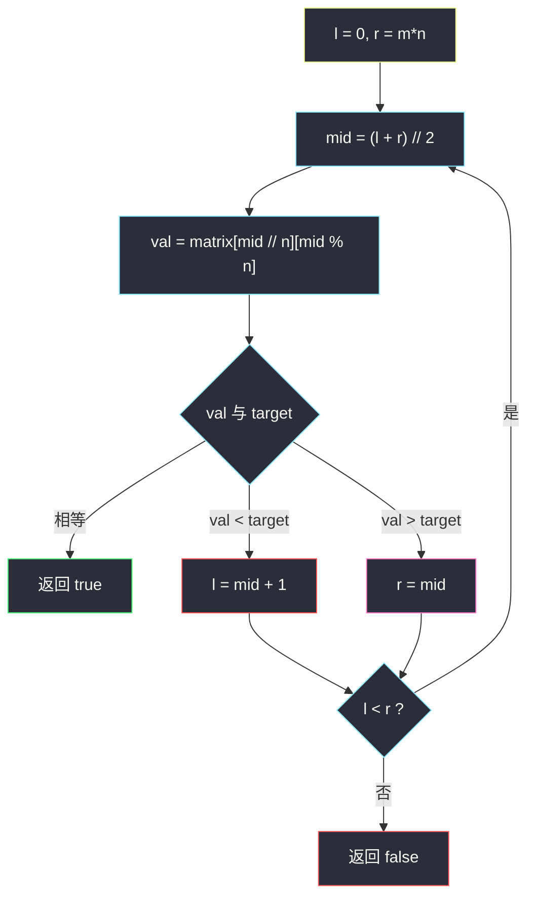

# 搜索二维矩阵（摊平二分 · 一次 log(mn)）

## 一、问题描述

给你一个 `m × n` 的整数矩阵 `matrix` 和一个整数 `target`，判断 `target` 是否在矩阵中。

矩阵同时满足：

- 每行从左到右**升序**；
- **每行的第一个整数大于上一行的最后一个整数**。

要求时间复杂度 `O(log(m·n))`。

> 🔗 LeetCode 74：https://leetcode.cn/problems/search-a-2d-matrix/
>
> 数据范围：`1 <= m, n <= 100`，`-10^4 <= matrix[i][j], target <= 10^4`。

**示例 1**

```
输入：matrix = [[1,3,5,7],[10,11,16,20],[23,30,34,60]], target = 3
输出：true
解释：3 在第 0 行第 1 列。
```

**示例 2**

```
输入：matrix = [[1,3,5,7],[10,11,16,20],[23,30,34,60]], target = 13
输出：false
解释：13 不在矩阵里。
```

**直观理解**

第二条性质把整张表接成了一条**全局升序**的长数组：上一行末尾 < 下一行开头，行与行之间没有交错。`m * n` 个元素排好队，标准二分即可。下标 `k` 对应第 `k // n` 行、第 `k % n` 列。

这和 [#240 搜索二维矩阵 II](https://leetcode.cn/problems/search-a-2d-matrix-ii/) **不是同一题**：#240 只保证每行、每列各自升序，行与行之间**没有**「下一行头 > 上一行尾」，不能摊成一维有序数组。

---

## 二、暴力解法

逐行逐列扫：

```python
class Solution:
    def searchMatrix(self, matrix: List[List[int]], target: int) -> bool:
        for row in matrix:
            for x in row:
                if x == target:
                    return True
        return False
```

### 复杂度

- **时间**：`O(m·n)`。
- **空间**：`O(1)`。

`m, n ≤ 100` 能过，但题目明确要 `O(log(mn))`，全局有序被浪费了。

也可以每行来一次 `bisect`：`O(m log n)`。行数到 100 仍偏慢于一次摊平二分，而且没用上「行间也有序」。

### 🔴 瓶颈在哪里

矩阵在行优先下标下单调。把二维坐标映射成一维下标后，就是普通有序数组查找。

---

## 三、优化探索（核心章节）

> 📚 本题在灵茶题单中属于 **02-二分查找 · 四、其他**。关键不是「二维怎么二分」，而是**先证明能摊平**，再套左闭右开。

### 3.1 为什么能看成一维

记第 `i` 行、第 `j` 列的元素为 `matrix[i][j]`。性质 2 给出：

```
matrix[i][n-1] < matrix[i+1][0]
```

再加每行升序，整表按行优先遍历严格递增（题目未说互异，但即使有相等，仍然非降；LeetCode 用例按非降处理即可）。一维下标 `mid ∈ [0, m·n)` 对应：

```
row = mid // n
col = mid % n
val = matrix[row][col]
```

### 3.2 左闭右开查找

`l, r = 0, m * n`，循环 `l < r`：

- `val == target`：找到，直接返回；
- `val < target`：染红，`l = mid + 1`；
- `val > target`：染蓝，`r = mid`。

结束仍没撞上相等，返回 `false`。也可以改成「找第一个 `≥ target`，再看是否相等」，和 #35 完全同一套；下面主解用「撞见就返回」，少一次收尾比较。



### 3.3 两次二分（等价）

先在**每行行首**组成的升序列上二分，定位 target 可能所在的行（最后一个行首 `≤ target` 的行），再在该行内二分。时间仍是 `O(log m + log n) = O(log(mn))`。映射一次更省事，作主解。

### 3.4 和 #240 的分界

| | #74 本题 | #240 |
|--|----------|------|
| 行内 | 升序 | 升序 |
| 行间 | 下一行头 > 上一行尾，**全局有序** | 无此保证，只保证列升序 |
| 算法 | 摊成一维二分 | 从右上 / 左下排除一排，`O(m+n)` |

把 #240 的矩阵摊平一般**不是**有序数组，套本题代码会错。

### 3.5 一句话核心

> **行尾小于下一行头 ⇒ 整表行优先就是有序数组；`mid // n` 是行、`mid % n` 是列，一次二分。**

---

## 四、代码实现

### Python（主解：摊平一次二分）

```python
class Solution:
    def searchMatrix(self, matrix: List[List[int]], target: int) -> bool:
        m, n = len(matrix), len(matrix[0])
        l, r = 0, m * n                         # 左闭右开 [l, r)
        while l < r:
            mid = (l + r) // 2
            val = matrix[mid // n][mid % n]
            if val == target:
                return True
            if val < target:
                l = mid + 1
            else:
                r = mid
        return False
```

**变量含义**

| 变量 | 含义 |
|------|------|
| `n` | 列数，映射的除数 / 模数 |
| `mid // n`, `mid % n` | 一维下标对应的行、列 |
| `[l, r)` | 尚未排除的一维区间 |

`mid` 始终 `< r ≤ m*n`，访问不下标越界。

### Java（最优解同款）

```java
class Solution {
    public boolean searchMatrix(int[][] matrix, int target) {
        int m = matrix.length, n = matrix[0].length;
        int l = 0, r = m * n;
        while (l < r) {
            int mid = l + (r - l) / 2;
            int val = matrix[mid / n][mid % n];
            if (val == target) return true;
            if (val < target) l = mid + 1;
            else r = mid;
        }
        return false;
    }
}
```

**两次二分（行再列）**

```python
class Solution:
    def searchMatrix(self, matrix: List[List[int]], target: int) -> bool:
        m, n = len(matrix), len(matrix[0])
        lo, hi = 0, m                           # 找第一个行首 > target
        while lo < hi:
            mid = (lo + hi) // 2
            if matrix[mid][0] <= target:
                lo = mid + 1
            else:
                hi = mid
        row = lo - 1
        if row < 0:
            return False
        l, r = 0, n
        while l < r:
            mid = (l + r) // 2
            if matrix[row][mid] == target:
                return True
            if matrix[row][mid] < target:
                l = mid + 1
            else:
                r = mid
        return False
```

---

## 五、具体例子演示

`matrix` 如下，`n = 4`，一维长度 `12`。摊平后：

```
下标:  0  1  2  3    4   5   6   7     8   9  10  11
值:    1  3  5  7   10  11  16  20    23  30  34  60
```

**例 1：`target = 3`（命中）**

初始 `l = 0`，`r = 12`。

| 轮次 | l | r | mid | mid//4 | mid%4 | val | 比较 | 新区间 |
|------|---|---|-----|--------|-------|-----|------|--------|
| 1 | 0 | 12 | 6 | 1 | 2 | 16 | 16 > 3 | `[0, 6)` |
| 2 | 0 | 6 | 3 | 0 | 3 | 7 | 7 > 3 | `[0, 3)` |
| 3 | 0 | 3 | 1 | 0 | 1 | 3 | **相等** | 返回 true |

**例 2：`target = 13`（不存在）**

| 轮次 | l | r | mid | val | 比较 | 新区间 |
|------|---|---|-----|-----|------|--------|
| 1 | 0 | 12 | 6 | 16 | 16 > 13 | `[0, 6)` |
| 2 | 0 | 6 | 3 | 7 | 7 < 13 | `[4, 6)` |
| 3 | 4 | 6 | 5 | 11 | 11 < 13 | `[6, 6)` |

`l == r`，返回 false ✓。13 夹在 11 与 16 之间，区间被挤空。


---

## 六、复杂度分析

| 方法 | 时间 | 空间 | 说明 |
|------|------|------|------|
| 双重循环 | `O(mn)` | `O(1)` | 浪费有序 |
| 每行二分 | `O(m log n)` | `O(1)` | 没用行间有序 |
| 摊平一次二分（主解） | `O(log(mn))` | `O(1)` | 一次映射 |
| 先二分行再二分列 | `O(log m + log n)` | `O(1)` | 与主解同阶 |

---

## 七、对比总结

**易错点**

1. **除数是列数 `n` 不是 `m`**：`row = mid // n`，写反会越界或取错格。
2. **`r = m * n` 不是 `m*n - 1`**：左闭右开右端是长度。
3. 不要和 #240 混用「从右上角走」当主解：能过但复杂度 `O(m+n)`，不是本题要求。
4. 空矩阵：题目 `m, n ≥ 1`，不必特判；若面试放宽，先看 `not matrix or not matrix[0]`。
5. 两次二分找行时，用「最后一个行首 `≤ target`」，行首全大于 target 则 `row = -1`。

**模板（二维摊平 · 左闭右开）**

```python
l, r = 0, m * n
while l < r:
    mid = (l + r) // 2
    val = matrix[mid // n][mid % n]
    if val == target: return True
    if val < target: l = mid + 1
    else: r = mid
return False
```

---

## 八、举一反三

| 题目 | 关系 |
|------|------|
| [240. 搜索二维矩阵 II](https://leetcode.cn/problems/search-a-2d-matrix-ii/) | 行间不全局有序；从右上 / 左下排除，不要摊平 |
| [704. 二分查找](https://leetcode.cn/problems/binary-search/) | 摊平之后就是本题 |
| [378. 有序矩阵中第 K 小的元素](https://leetcode.cn/problems/kth-smallest-element-in-a-sorted-matrix/) | #240 型矩阵上的二分答案 |
| [1351. 统计有序矩阵中的负数](https://leetcode.cn/problems/count-negative-numbers-in-a-sorted-matrix/) | 每行每列非增，右上排除或逐行二分 |
| [74 的行定位 · 35. 搜索插入位置](https://leetcode.cn/problems/search-insert-position/) | 两次二分里「找行」就是对行首做插入位置 |

**思想迁移**

- 先问矩阵**全局**有没有序；有，就映射成一维；没有，再考虑排除法。
- 口诀：**「行尾小于下行头，整表一条升序链；下标除 n 行、模 n 列。」**
