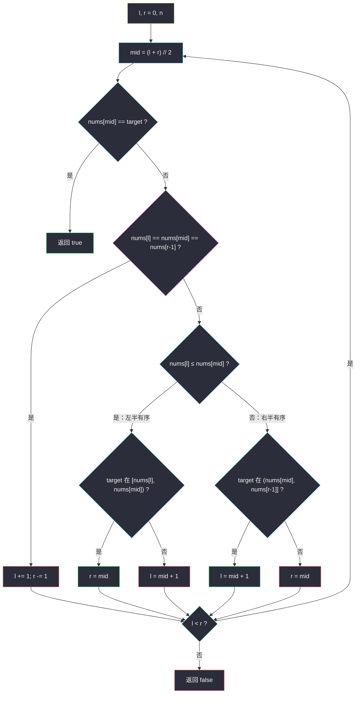

# 搜索旋转排序数组 II（旋转二分 · 含重复）

## 一、问题描述

已知存在一个按非降序排列的整数数组 `nums`，在某个下标处做了**未知旋转**（例如 `[0,1,2,4,4,4,5,6,6,7]` 旋转后可能变成 `[4,5,6,6,7,0,1,2,4,4]`）。

给你旋转后的数组 `nums` 和一个整数 `target`，请判断数组中**是否存在** `target`。`nums` **可能包含重复元素**。

> 🔗 LeetCode 81：https://leetcode.cn/problems/search-in-rotated-sorted-array-ii/
>
> 数据范围：`1 <= nums.length <= 5000`，`-10^4 <= nums[i], target <= 10^4`。进阶：尽可能将复杂度降到低于 `O(n)`。

**示例 1**

```
输入：nums = [2,5,6,0,0,1,2], target = 0
输出：true
解释：旋转点在 0 的左侧；右半有序区 [0,0,1,2] 里能找到 0。
```

**示例 2**

```
输入：nums = [2,5,6,0,0,1,2], target = 3
输出：false
```

**示例 3（三值相等）**

```
输入：nums = [1,0,1,1,1], target = 0
输出：true
解释：第一次 mid 处 nums[l] == nums[mid] == nums[r-1] == 1，无法判断哪边有序，只能两端收缩。
```

**直观理解**

无重复的旋转数组（[#33](https://leetcode.cn/problems/search-in-rotated-sorted-array/)）一定能根据 `nums[l]` 与 `nums[mid]` 判断**哪一半仍是有序的**，然后看 target 在不在那一半里。有了重复，可能出现 `nums[l] == nums[mid] == nums[右端]`，这一刻左右看起来「一样齐」，有序信息被抹掉，只能丢掉两端各一个元素，最坏退化成 `O(n)`。题目允许这个下界：全是相同数字时，不看完无法确定 target 在不在。

---

## 二、暴力解法

扫一遍：

```python
class Solution:
    def search(self, nums: List[int], target: int) -> bool:
        return target in nums
```

### 复杂度

- **时间**：`O(n)`。
- **空间**：`O(1)`。

`n ≤ 5000` 必过。本题意义是弄清：**有重复时旋转二分为什么会退化、退化发生在哪一步**。

### 🔴 瓶颈在哪里

无重复时每轮都能扔掉一半；有重复时存在「三值相等」的死角，那一轮只能扔掉两个端点。平均仍很快，最坏与暴力同阶。

---

## 三、优化探索（核心章节）

> 📚 本题在灵茶题单中属于 **02-二分查找 · 四、其他**，是 #33 的重复元素加强版。全文坚持左闭右开 `[l, r)`，右端元素是 `nums[r - 1]`。

### 3.1 旋转数组的半区有序

旋转后数组由两段非降序拼接：`[大段 | 小段]`。任取 `mid`：

- 若 `nums[l] < nums[mid]`：左半 `[l, mid]` **严格**有序（端点不等已足够）；
- 若 `nums[l] > nums[mid]`：旋转点在左半，**右半** `[mid, r)` 有序；
- 若 `nums[l] == nums[mid]`：左半可能有序也可能中间藏着旋转点（例如 `[1,0,1,1,1]`）。

有重复时把 `<` 放宽成 `≤` 的前提是：**已经排除三值相等**。排除之后 `nums[l] == nums[mid]` 蕴涵 `nums[r-1] != nums[mid]`，左半不再可能跨过旋转点，`≤` 可以当「左半有序」用。

### 3.2 三值相等：只能收缩两端

当 `nums[l] == nums[mid] == nums[r - 1]` 且三者都不等于 target（等于的话上一行已经返回）：

- 无法知道 target 在左还是在右；
- `l += 1`、`r -= 1`，丢掉两个已经核对过、不等于 target 的端点。

这一步破坏了「每轮减半」，所以最坏 `O(n)`。



### 3.3 和 #33 的唯一差别

#33 元素互异，`nums[l] == nums[mid]` 只可能发生在区间只剩一格（已经比过）。不必写三值收缩。本题多的就是这一支；其余「哪半有序、target 在不在有序半」与 #33 相同。返回类型从下标改成 `bool`。

### 3.4 一句话核心

> **先比 mid 是否命中；三值相等就两端各丢一个；否则在有序的那一半里用普通区间判断，把无序半留给下一轮。**

---

## 四、代码实现

### Python（主解）

```python
class Solution:
    def search(self, nums: List[int], target: int) -> bool:
        l, r = 0, len(nums)                     # 左闭右开 [l, r)
        while l < r:
            mid = (l + r) // 2
            if nums[mid] == target:
                return True
            if nums[l] == nums[mid] == nums[r - 1]:
                l += 1                          # 无法判断，丢掉两端
                r -= 1
                continue
            if nums[l] <= nums[mid]:            # 左半 [l, mid] 有序
                if nums[l] <= target < nums[mid]:
                    r = mid
                else:
                    l = mid + 1
            else:                               # 右半 [mid, r) 有序
                if nums[mid] < target <= nums[r - 1]:
                    l = mid + 1
                else:
                    r = mid
        return False
```

**变量含义**

| 变量 | 含义 |
|------|------|
| `[l, r)` | 尚未排除的区间，右端元素 `nums[r-1]` |
| `nums[l] <= nums[mid]` | 排除三值相等后，左半非降 |
| `target < nums[mid]` | 有序左半用左闭右开，mid 已不等于 target |

左半判断写成 `nums[l] <= target < nums[mid]`：mid 不等于 target，右端用开。右半对称 `nums[mid] < target <= nums[r-1]`。

### Java（最优解同款）

```java
class Solution {
    public boolean search(int[] nums, int target) {
        int l = 0, r = nums.length;
        while (l < r) {
            int mid = l + (r - l) / 2;
            if (nums[mid] == target) return true;
            if (nums[l] == nums[mid] && nums[mid] == nums[r - 1]) {
                l++;
                r--;
                continue;
            }
            if (nums[l] <= nums[mid]) {
                if (nums[l] <= target && target < nums[mid]) r = mid;
                else l = mid + 1;
            } else {
                if (nums[mid] < target && target <= nums[r - 1]) l = mid + 1;
                else r = mid;
            }
        }
        return false;
    }
}
```

---

## 五、具体例子演示

**例 A：正常有序半区** `nums = [2,5,6,0,0,1,2]`，`target = 0`

初始 `l = 0`，`r = 7`。

| 轮次 | l | r | mid | nums[mid] | 三值相等? | 有序半 | 比较 | 新区间 |
|------|---|---|-----|-----------|-----------|--------|------|--------|
| 1 | 0 | 7 | 3 | 0 | — | **命中** | `0 == 0` | 返回 true |

第一轮 mid 就踩中。再看 `target = 3`（不存在）：

| 轮次 | l | r | mid | nums[mid] | 三值? | 有序半 | target 在有序半? | 新区间 |
|------|---|---|-----|-----------|-------|--------|------------------|--------|
| 1 | 0 | 7 | 3 | 0 | 否 | `2 > 0` 右半有序 `[0,0,1,2]` | `0 < 3 ≤ 2`？否 | `[0, 3)` |
| 2 | 0 | 3 | 1 | 5 | 否 | `2 ≤ 5` 左半有序 `[2,5]` | `2 ≤ 3 < 5`？是 | `[0, 1)` |
| 3 | 0 | 1 | 0 | 2 | 否 | 单点 | `2 ≠ 3`，`2 ≤ 3 < 2`？否 | `[1, 1)` |

空区间，false ✓。第 1 轮丢掉无序左半里其实也没有 3；第 2 轮在有序左半 `[2,5]` 里把 3 夹进更窄区间后落空。

**例 B：三值相等收缩** `nums = [1,0,1,1,1]`，`target = 0`

| 轮次 | 区间 nums[l:r] | l | r | mid | nums[mid] | 判断 | 新区间 |
|------|----------------|---|---|-----|-----------|------|--------|
| 1 | `[1,0,1,1,1]` | 0 | 5 | 2 | 1 | 三值全是 1，收缩 | `[1, 4)` 即 `[0,1,1]` |
| 2 | `[0,1,1]` | 1 | 4 | 2 | 1 | `0 ≤ 1` 左半有序；`0 ≤ 0 < 1` | `[1, 2)` |
| 3 | `[0]` | 1 | 2 | 1 | 0 | **命中** | true |

若不收缩、误把第 1 轮左半 `[1,0,1]` 当成有序：`1 ≤ 0 < 1` 为假，会去搜右侧 `[1,1]`，**漏掉 0**。这就是必须先处理三值相等的原因。


---

## 六、复杂度分析

| 方法 | 时间 | 空间 | 说明 |
|------|------|------|------|
| 线性扫描 | `O(n)` | `O(1)` | 必过 |
| 旋转二分（主解） | 平均 `O(log n)`，最坏 `O(n)` | `O(1)` | 三值相等时每轮只减 2 |
| #33 无重复版 | `O(log n)` 最坏 | `O(1)` | 每轮必减半 |

---

## 七、对比总结

| 维度 | #33 无重复 | 本题有重复 |
|------|------------|------------|
| 判断哪半有序 | `nums[l]` 与 `nums[mid]` 必能区分 | 三值相等时不能 |
| 最坏时间 | `O(log n)` | `O(n)` |
| 返回 | 下标或 -1 | `bool` |

**易错点**

1. **忘记三值相等**：`[1,0,1,1,1]` 会把无序左半当成有序，漏答案。
2. **右端是 `nums[r-1]`**：左闭右开没有 `nums[r]`，写成 `nums[r]` 会越界。
3. **有序半的开闭**：mid 已不等于 target，左半用 `target < nums[mid]`，右半用 `target > nums[mid]`，别写成闭区间把 mid 再比一次。
4. 只 `l += 1` 不减 `r` 也对（一端收缩），两端一起丢更快；不要只减 `r` 却留下 `nums[l]` 的重复干扰。
5. 与 #153 / #154（找最小值）同一坑：#154 同样要在三值相等时收缩。

**模板（旋转 + 重复 · 左闭右开）**

```python
while l < r:
    mid = (l + r) // 2
    if nums[mid] == target: return True
    if nums[l] == nums[mid] == nums[r - 1]:
        l += 1; r -= 1; continue
    if nums[l] <= nums[mid]:
        ...
    else:
        ...
```

---

## 八、举一反三

| 题目 | 关系 |
|------|------|
| [33. 搜索旋转排序数组](https://leetcode.cn/problems/search-in-rotated-sorted-array/) | 无重复版，去掉三值收缩即可，返回下标 |
| [153. 寻找旋转排序数组中的最小值](https://leetcode.cn/problems/find-minimum-in-rotated-sorted-array/) | 无重复，比的是哪半有序，答案是断崖 |
| [154. 寻找旋转排序数组中的最小值 II](https://leetcode.cn/problems/find-minimum-in-rotated-sorted-array-ii/) | 本题的「找最小」版本，同样三值收缩，最坏 `O(n)` |
| [81 的地基 · 704. 二分查找](https://leetcode.cn/problems/binary-search/) | 有序半区内做的就是普通二分 |
| [162. 寻找峰值](https://leetcode.cn/problems/find-peak-element/) | 另一类「看 mid 与邻居、丢一半」，不是旋转 |

**思想迁移**

- 旋转二分的骨架永远是：**认出有序半 → 看 target 在不在里面 → 丢掉另一半**。
- 重复元素把「认出有序半」弄脏时，先把两端脏数据剥掉。
- 口诀：**「先撞 mid；三值相等丢两端；否则有序半里夹 target。」**
