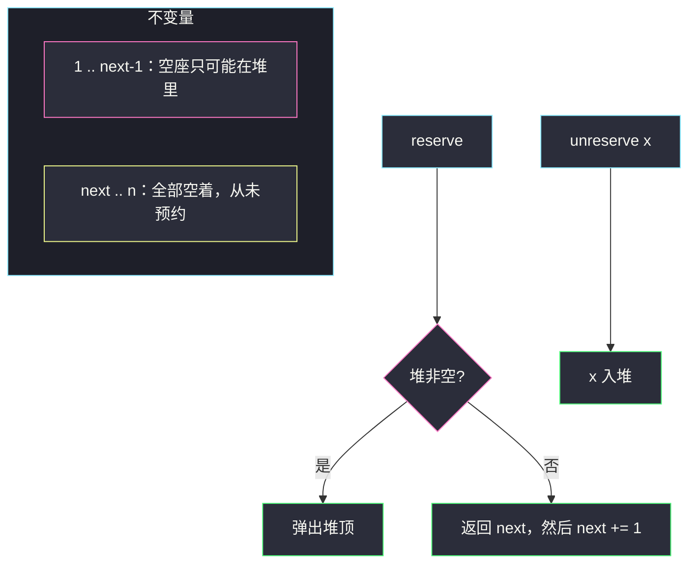
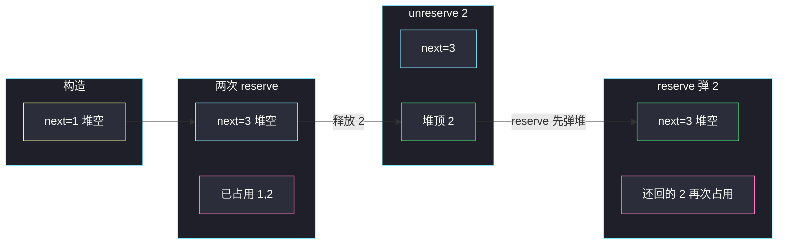

# 座位预约管理系统（小根堆维护最小空座）

## 一、问题描述

设计一个管理 `n` 个座位的系统，编号 `1 .. n`，一开始全部可预约。实现：

- `SeatManager(int n)`：构造，管理这 n 个座位；
- `int reserve()`：预约当前编号**最小**的空座位，返回该编号，该座变为占用；
- `void unreserve(int seatNumber)`：释放座位 `seatNumber`，它重新可预约。

题目保证：每次 `reserve` 时至少还有空座；每次 `unreserve` 的座位当前确实被占用。`reserve` / `unreserve` 合计不超过 `10^5` 次。

> 🔗 LeetCode 1845：https://leetcode.cn/problems/seat-reservation-manager/
>
> 数据范围：`1 <= n <= 10^5`，`1 <= seatNumber <= n`。

**示例**

```
SeatManager(5)
reserve()        → 1     # 空座 1,2,3,4,5
reserve()        → 2     # 空座 2,3,4,5
unreserve(2)             # 空座 2,3,4,5
reserve()        → 2
reserve()        → 3
reserve()        → 4
reserve()        → 5
unreserve(5)             # 空座 5
```

**直观理解**

每次要的是「当前空座位里的最小值」。空座位集合在动态增删，取最小用**小根堆**。不必真的开 `n` 个布尔位每次从头扫。

---

## 二、暴力解法

布尔数组 `free[1..n]`，`reserve` 从 1 扫到 n 找第一个 `true`。

```python
class SeatManager:
    def __init__(self, n: int):
        self.free = [True] * (n + 1)

    def reserve(self) -> int:
        for i in range(1, len(self.free)):
            if self.free[i]:
                self.free[i] = False
                return i

    def unreserve(self, seatNumber: int) -> None:
        self.free[seatNumber] = True
```

### 复杂度

- **时间**：单次 `reserve` 最坏 `O(n)`，总操作 `10^5`、`n` 达 `10^5`，超时。
- **空间**：`O(n)`。

### 🔴 瓶颈在哪里

找最小空座是瓶颈。堆支持 `O(log n)` 取最小、`O(log n)` 插回。还可以更省：从未预约过的座位是一段连续后缀，不必预先全部入堆。

---

## 三、优化探索（核心章节）

> 📚 本题在灵茶题单中属于 **堆 · §5.1 基础**，是设计题。堆维护「当前可预约编号」的最小值。同目录 [#2336 无限集中的最小数字](https://leetcode.cn/problems/smallest-number-in-infinite-set/)（`smallest-number-in-infinite-set.md`）几乎同一不变量：连续未使用的尾巴用一个指针，被释放的小数放小根堆。

### 3.1 写法 A：1..n 全部入堆

构造时把 `1, 2, …, n` 推进小根堆。

- `reserve`：`heappop`，堆顶就是最小空座；
- `unreserve(x)`：`heappush(x)`。

题目保证不会重复释放、不会在没空座时预约，堆里不会有重复，也不需要懒删除。

构造 `O(n)`，空间 `O(n)`。正确，能过。

### 3.2 写法 B：懒标记（主解）

观察：座位总是从 1 开始往右依次被「第一次预约」。任意时刻：

| 区间 | 状态 | 怎么存 |
|------|------|--------|
| `≥ next` | 从未预约过，全部空着 | 只记一个整数 `next` |
| `< next` 且已释放 | 空着 | 小根堆 |
| `< next` 且未释放 | 占用 | 不存 |

不变量：堆里的编号**严格小于 `next`**（它们都曾被预约过，现在还回来了）。

**构造**：`next = 1`，堆为空。

**`reserve`**

1. 若堆非空：堆顶 `< next`，它就是当前最小空座，弹出返回；
2. 否则：最小空座是 `next` 自己。返回它，然后 `next += 1`。

**`unreserve(x)`**

`x` 一定 `< next`（刚被预约过）。推进堆。



### 3.3 各 API 职责

| API | 职责 | 内部变化 |
|-----|------|----------|
| `__init__(n)` | 记下上限 `n`（本题其实用不到，题目保证不会超） | `next=1`，堆空 |
| `reserve()` | 给出最小空座并标记占用 | 优先弹堆；否则消耗 `next` |
| `unreserve(x)` | 把占用座变回空座 | `x` 入堆 |

不需要哈希去重：题目保证 `unreserve` 的座位当前是占用态，不会把同一个 `x` 推两次。2336 那题 `addBack` 可能重复，才要 set；本题更干净。

### 3.4 一句话核心

> **从未预约的座位是 [next, n]；被释放的小数放小根堆。reserve 先堆后 next，unreserve 只把 x 推回堆。**

---

## 四、代码实现

### Python（主解：懒标记）

```python
class SeatManager:
    def __init__(self, n: int):
        self.next = 1                    # [next, n] 全空且从未预约
        self.h = []                      # < next 的已释放空座

    def reserve(self) -> int:
        if self.h:
            return heapq.heappop(self.h)
        x = self.next
        self.next += 1
        return x

    def unreserve(self, seatNumber: int) -> None:
        heapq.heappush(self.h, seatNumber)
```

**变量含义**

| 变量 | 含义 |
|------|------|
| `next` | 下一个从未预约过的座位编号 |
| `h` | 小根堆，装着编号 `< next` 且当前空着的座位 |

### Python（写法 A：全量入堆）

```python
class SeatManager:
    def __init__(self, n: int):
        self.h = list(range(1, n + 1))
        heapq.heapify(self.h)

    def reserve(self) -> int:
        return heapq.heappop(self.h)

    def unreserve(self, seatNumber: int) -> None:
        heapq.heappush(self.h, seatNumber)
```

构造多花 `O(n)` 时间和空间。操作次数远小于 `n` 时，懒标记更省。

### Java（最优解同款：懒标记）

```java
class SeatManager {
    private int next = 1;
    private final PriorityQueue<Integer> h = new PriorityQueue<>();

    public SeatManager(int n) {}

    public int reserve() {
        if (!h.isEmpty()) return h.poll();
        return next++;
    }

    public void unreserve(int seatNumber) {
        h.offer(seatNumber);
    }
}
```

---

## 五、具体例子演示

`n = 5`。逐步跟踪 API 与堆。

| 调用 | 动作 | next | 堆（小根，顶在左） | 返回 |
|------|------|------|---------------------|------|
| `SeatManager(5)` | 初始化 | 1 | `[]` | — |
| `reserve()` | 堆空，取 1，next→2 | 2 | `[]` | **1** |
| `reserve()` | 堆空，取 2，next→3 | 3 | `[]` | **2** |
| `unreserve(2)` | 2 入堆 | 3 | `[2]` | — |
| `reserve()` | 弹堆顶 2 | 3 | `[]` | **2** |
| `reserve()` | 堆空，取 3，next→4 | 4 | `[]` | **3** |
| `reserve()` | 取 4，next→5 | 5 | `[]` | **4** |
| `reserve()` | 取 5，next→6 | 6 | `[]` | **5** |
| `unreserve(5)` | 5 入堆 | 6 | `[5]` | — |

输出序列 `[null, 1, 2, null, 2, 3, 4, 5, null]` ✓。

关键一步：`unreserve(2)` 之后堆顶 2 比 `next=3` 小，下一次 `reserve` 必须先还 2，而不是继续发 3。这就是「最小编号」的含义。



对拍：全量入堆与懒标记在题面序列上结果相同；随机 `reserve`/`unreserve`（遵守「有空座才约、占用才放」）也一致。

---

## 六、复杂度分析

| 方法 | 单次 reserve / unreserve | 额外空间 | 说明 |
|------|--------------------------|----------|------|
| 布尔数组扫最小 | `O(n)` / `O(1)` | `O(n)` | 超时 |
| 全量小根堆 | `O(log n)` / `O(log n)` | `O(n)` | 构造 `O(n)` |
| 懒标记堆（主解） | `O(log m)` / `O(log m)` | `O(m)` | `m` = 释放次数，构造 `O(1)` |

总操作 ≤ `10^5`，两种堆写法时间都过。懒标记在 `n` 很大但前几次操作很少时更干净。

---

## 七、对比总结

| 维度 | 扫数组 | 全量堆 | 懒标记 |
|------|--------|--------|--------|
| 最小空座 | 从头找 | 堆顶 | 堆顶与 `next` 取小（堆非空则堆更小） |
| 未用过的座位 | 布尔 true | 堆里占坑 | 一个指针 |
| 去重 | 布尔天然唯一 | 题面保证 | 题面保证 |

**易错点**

1. **`unreserve` 之后仍去加 `next`**：释放的小数比 `next` 更小，必须先弹堆。
2. **堆与 `next` 比大小写反**：不变量保证堆顶 `< next`，只需「堆非空就弹」，不必再比较。
3. **照搬 2336 的 set**：本题不会重复 `unreserve`，加 set 没错但多余。
4. **`reserve` 在堆空时返回 `next` 却忘了 `+1`**：同一个座位会发出去两次。
5. **座位从 0 编号**：题面从 1 开始。

**模板（§5.1 设计题：指针 + 小根堆）**

```python
# next 表示从未用过的起点；堆装着还回来的小数
def reserve():
    if h: return heappop(h)
    x = next; next += 1; return x
def unreserve(x):
    heappush(h, x)
```

---

## 八、举一反三

| 题目 | 关系 |
|------|------|
| [2336. 无限集中的最小数字](https://leetcode.cn/problems/smallest-number-in-infinite-set/) | 同目录 `smallest-number-in-infinite-set.md`：无穷尾巴 + 加回小数，要多一个 set 去重 |
| [2349. 设计数字容器系统](https://leetcode.cn/problems/design-a-number-container-system/) | 设计题 + 堆，按值维护最小下标 |
| [855. 考场就座](https://leetcode.cn/problems/exam-room/) | 空座位区间用有序结构，取的不是最小编号而是最大间隔 |
| [703. 数据流中的第 K 大元素](https://leetcode.cn/problems/kth-largest-element-in-a-stream/) | 同属 §5.1 设计题，堆维护动态第 K |

**思想迁移**

- 「要当前最小可用编号」→ 小根堆；连续未分配后缀不必预先塞进堆。
- 口诀：**「新号用 next 往后发；还回来的号丢小根堆，下次优先发还回来的。」**
