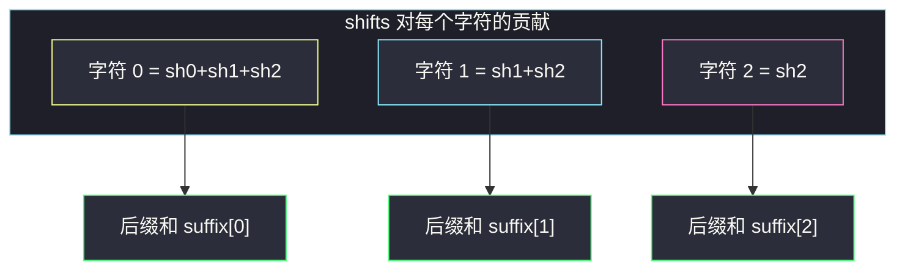
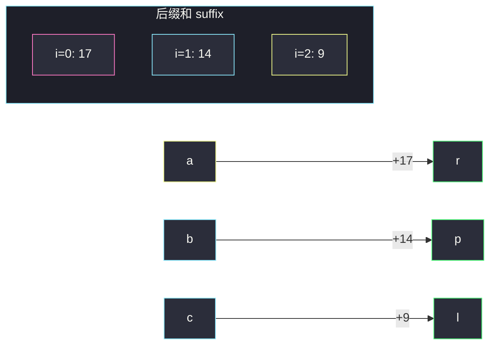

# 字母移位（后缀和 · 从右往左）

## 一、问题描述

给你一个由小写英文字母组成的字符串 `s`，以及一个长度相同的整数数组 `shifts`。

一次「移位」把字母变成字母表中的下一个字母，`'z'` 绕回 `'a'`。对每个下标 `i`，要把 **`s[0..i]` 的每一个字符** 向后移动 `shifts[i]` 次。所有操作叠加后，返回最终字符串。

> 🔗 LeetCode 848：https://leetcode.cn/problems/shifting-letters/
>
> 数据范围：`1 <= s.length == shifts.length <= 10^5`，`s` 只含小写字母，`0 <= shifts[i] <= 10^9`。

**示例 1**

```
输入：s = "abc", shifts = [3,5,9]
输出："rpl"
解释：
  先把前 1 个字母移 3 次：abc → dbc
  再把前 2 个字母移 5 次：dbc → igc
  再把前 3 个字母移 9 次：igc → rpl
```

**示例 2**

```
输入：s = "aaa", shifts = [1,2,3]
输出："gfd"
解释：字符 0 共移 1+2+3=6 次 → g；字符 1 共移 2+3=5 次 → f；字符 2 共移 3 次 → d。
```

**直观理解**

`shifts[i]` 作用在一段前缀上。字符 `j` 会被所有「覆盖到 j 的操作」打中，也就是 `i ≥ j` 的那些 `shifts[i]`。等价于：

```
字符 j 的总移位次数 = shifts[j] + shifts[j+1] + … + shifts[n-1]
```

这正是 `shifts` 的**后缀和**。字母表只有 26 个，边加边对 26 取模即可。

---

## 二、暴力解法

按题面模拟：对每个 `i`，把 `s[0..i]` 每个字符移 `shifts[i]` 次。

```python
class Solution:
    def shiftingLetters(self, s: str, shifts: List[int]) -> str:
        arr = list(s)
        n = len(s)
        for i, k in enumerate(shifts):
            k %= 26
            for j in range(i + 1):
                arr[j] = chr(ord('a') + (ord(arr[j]) - ord('a') + k) % 26)
        return ''.join(arr)
```

### 复杂度

- **时间**：`O(n²)`。每个 `i` 改前 `i+1` 个字符。
- **空间**：`O(n)`（可变字符数组）。

### 🔴 瓶颈在哪里

`n` 达 `10^5`，双重循环必超时。同一字符被反复改写，本质是在累加一段后缀。把这段和一次性算出来，每个字符只改一次。

---

## 三、优化探索（核心章节）

> 📚 本题在灵茶题单中属于 **前缀和 / 差分 · §1.1 基础**。前缀和管「从左到右的累计」；本题操作覆盖的是前缀，落到每个字符上就变成**从右往左的后缀和**。

### 3.1 谁打中了字符 j

`shifts[i]` 修改 `s[0..i]`，所以：

| 操作 | 覆盖范围 |
|------|----------|
| `shifts[0]` | 下标 0 |
| `shifts[1]` | 下标 0, 1 |
| `shifts[2]` | 下标 0, 1, 2 |
| … | … |

画成贡献矩阵：第 `i` 列是一次操作，第 `j` 行是一个字符——字符 `j` 吃到的是第 `j` 列及以右。



### 3.2 从右往左扫一遍

设 `acc` 为「已经扫过的右侧移位总和（模 26）」。从 `i = n-1` 走到 `0`：

1. `acc = (acc + shifts[i]) % 26` —— 此时 `acc` 就是字符 `i` 的总移位次数。
2. `s[i] = 'a' + (ord(s[i]) - 'a' + acc) % 26`。

不必真的开一个 `suffix[]` 数组：`acc` 本身就是滚动的后缀和。`shifts[i]` 最大 `10^9`、`n` 达 `10^5`，直接累加会到 `10^14`，**必须边加边 `% 26`**（Python 整数无上限，但取模后数字更干净；Java 必须用 `long` 或每步取模，否则 `int` 溢出）。

### 3.3 和差分数组的关系

「给前缀 `[0, i]` 整体 `+shifts[i]`」也可以建成差分数组：`d[0] += shifts[i]`，`d[i+1] -= shifts[i]`，再前缀和。因为每次都是「从 0 开始的前缀」，差分会退化成同一套后缀和，多写一圈没有收益。**操作是任意区间时才上差分**（见文末 2381）。

### 3.4 一句话核心

> **字符 i 的移位次数 = `shifts[i..n-1]` 的和；从右往左滚动累加并对 26 取模，每个字符只改一次。**

---

## 四、代码实现

### Python（主解）

```python
class Solution:
    def shiftingLetters(self, s: str, shifts: List[int]) -> str:
        arr = list(s)
        acc = 0
        for i in range(len(s) - 1, -1, -1):
            acc = (acc + shifts[i]) % 26
            arr[i] = chr(ord('a') + (ord(arr[i]) - ord('a') + acc) % 26)
        return ''.join(arr)
```

**变量含义**

| 变量 | 含义 |
|------|------|
| `acc` | 当前后缀和，已模 26，等于字符 `i` 还要移多少位 |
| `arr[i]` | 原地改写后的字符 |

### Java（最优解同款）

```java
class Solution {
    public String shiftingLetters(String s, int[] shifts) {
        char[] arr = s.toCharArray();
        int acc = 0;
        for (int i = arr.length - 1; i >= 0; i--) {
            acc = (int) ((acc + (long) shifts[i]) % 26);
            arr[i] = (char) ('a' + (arr[i] - 'a' + acc) % 26);
        }
        return new String(arr);
    }
}
```

`shifts[i]` 加进 `acc` 前先转 `long` 再 `% 26`，避免 `int` 相加溢出。取模后 `acc` 落在 `0..25`，再写回 `int`。

---

## 五、具体例子演示

### 5.1 `s = "abc"`，`shifts = [3, 5, 9]`

从右往左构造后缀和（这里写出完整数组，代码里用滚动变量即可）：

| i | shifts[i] | acc（更新后）= suffix[i] | 原字符 | (ord-a+acc)%26 | 新字符 |
|---|-----------|-------------------------|--------|----------------|--------|
| 2 | 9 | (0+9)%26 = **9** | c | (2+9)%26=11 | **l** |
| 1 | 5 | (9+5)%26 = **14** | b | (1+14)%26=15 | **p** |
| 0 | 3 | (14+3)%26 = **17** | a | (0+17)%26=17 | **r** |

对照：字符 0 共 3+5+9=17；字符 1 共 5+9=14；字符 2 共 9。结果 `"rpl"` ✓。



### 5.2 `s = "aaa"`，`shifts = [1, 2, 3]`

| i | shifts[i] | suffix[i] | 原 | 新 |
|---|-----------|-----------|----|----|
| 2 | 3 | 3 | a | d |
| 1 | 2 | 5 | a | f |
| 0 | 1 | 6 | a | g |

结果 `"gfd"` ✓。若忘记 `% 26`，本例碰巧也对；但 `shifts[i] = 10^9` 时必须取模。

**绕回**：`s = "z"`，`shifts = [1]` → suffix=1，`'z'` 的偏移 (25+1)%26=0 → `'a'`。

---

## 六、复杂度分析

| 方法 | 时间 | 空间 | 说明 |
|------|------|------|------|
| 按操作模拟 | `O(n²)` | `O(n)` | n=1e5 超时 |
| 后缀和（主解） | `O(n)` | `O(n)` | 每个字符改一次；空间主要是输出数组 |

只扫一遍。滚动 `acc` 是 `O(1)` 额外变量；若语言允许原地改字符串，额外空间仍是输出所需。

---

## 七、对比总结

| 维度 | 暴力 | 后缀和 |
|------|------|--------|
| 每个字符被改几次 | 最多 n 次 | 1 次 |
| 区间加 | 真的扫前缀 | 一次加法并入 `acc` |
| 取模 | 每次移位 | 累加时 `% 26` |

**易错点**

1. **从左往右累加**：那是前缀和，对应「操作覆盖后缀」的题；本题覆盖前缀，必须从右往左。
2. **忘记 `% 26`**：`shifts[i]` 达 `10^9`，和会爆；字母也要绕回。
3. **Java `int` 溢出**：`acc + shifts[i]` 先转 `long` 再取模。
4. **把 `shifts[i]` 理解成只移 `s[i]`**：题面是前 `i+1` 个字母。
5. **`(ord - 'a' + acc) % 26` 漏括号**：加减和取模优先级搞错会越界。

**模板（§1.1 后缀和）**

```python
acc = 0
for i in range(n - 1, -1, -1):
    acc = (acc + shifts[i]) % 26
    # 用 acc 更新位置 i
```

---

## 八、举一反三

| 题目 | 关系 |
|------|------|
| [2381. 字母移位 II](https://leetcode.cn/problems/shifting-letters-ii/) | 升级：任意闭区间移位，必须上**差分数组**再前缀和 |
| [1109. 航班预订统计](https://leetcode.cn/problems/corporate-flight-bookings/) | §1.1 差分经典：区间加、最后求前缀和 |
| [238. 除自身以外数组的乘积](https://leetcode.cn/problems/product-of-array-except-self/) | 前缀积 × 后缀积，同样「左右各扫一遍」 |
| [2090. 半径为 k 的子数组平均值](https://leetcode.cn/problems/k-radius-subarray-averages/) | 同目录 `k-radius-subarray-averages.md`：前缀和取窗口和 |
| [1732. 找到最高海拔](https://leetcode.cn/problems/find-the-highest-altitude/) | 前缀和入门 |

**思想迁移**

- 操作打在「前缀 / 后缀」上 → 对端点做一次滚动和，不要对每个操作扫一遍区间。
- 操作打在「任意区间」上 → 差分数组。
- 口诀：**「前缀操作化后缀和；从右往左滚，边加边模 26。」**
