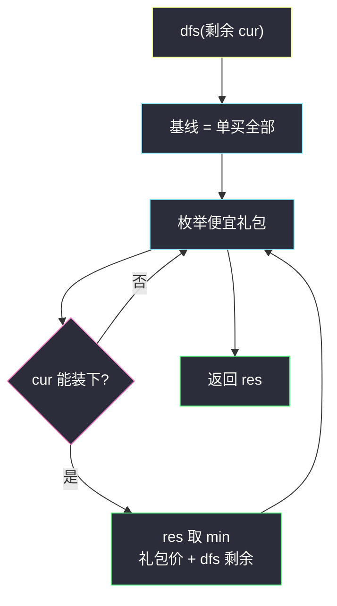
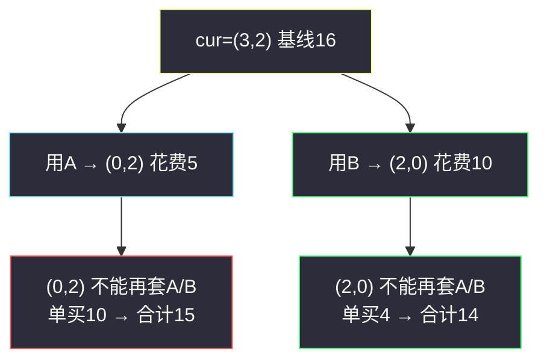

# 大礼包（多维背包 / 需求元组记忆化）

## 一、问题描述

`n` 种物品，单价 `price[i]`，需求 `needs[i]`。另有若干大礼包 `special[j]`：前 `n` 项是礼包里各物品数量，最后一项是礼包售价。每种物品买到的总数**不能超过需求**（多买没用，也不允许超买）。可以任意次使用同一个礼包，也可以不用礼包、按单价补齐。求买齐需求的最低花费。

> 🔗 LeetCode 638：https://leetcode.cn/problems/shopping-offers/
>
> 数据范围：`n ≤ 6`，`needs[i] ≤ 6`，礼包数 ≤ 100。
>
> 📚 灵茶题单：**§7.6 多维 DP**。每种物品一个维度，状态是剩余需求元组。`n` 和每维上限都极小，`7^6 ≈ 1.2×10^5` 个状态，DFS + 记忆化即可。过滤「比单买还贵」的礼包，避免无用分支。

**示例 1**

```
输入：price = [2,5], special = [[3,0,5],[1,2,10]], needs = [3,2]
输出：14
解释：礼包 [1,2,10] 一次 + 再单买 2 个物品 0，花费 10+4=14。
```

**示例 2**

```
输入：price = [2,3,4], special = [[1,1,0,4],[2,2,1,9]], needs = [1,2,1]
输出：11
解释：礼包 [1,1,0,4] 一次 + 单买剩下 [0,1,1]，花费 4+3+4=11。
```

**直观理解**

普通完全背包是一维容量；这里容量是 `n` 维向量。礼包是「一次扣掉一个向量、付一笔钱」。不能超维，所以不是随便贪最便宜的礼包。

---

## 二、暴力解法

对每个礼包枚举买 0,1,2,… 次（以不超需求为限），最后剩余全部按单价买。礼包 100 个、每个最多买 6 次，爆炸。

等价写法：每次决定「用哪个礼包一次」或「不再用礼包」。

```python
class Solution:
    def shoppingOffers(self, price: list[int], special: list[list[int]], needs: list[int]) -> int:
        n = len(price)

        def dfs(cur: list[int]) -> int:
            res = sum(cur[i] * price[i] for i in range(n))
            for sp in special:
                nxt = []
                ok = True
                for i in range(n):
                    if cur[i] < sp[i]:
                        ok = False
                        break
                    nxt.append(cur[i] - sp[i])
                if ok:
                    res = min(res, dfs(nxt) + sp[-1])
            return res

        return dfs(needs)
```

官方两例都能过。同一剩余向量会被不同礼包顺序重复搜到（先 A 后 B 与先 B 后 A），必须记忆化。

### 🔴 瓶颈在哪里

状态是剩余 `needs` 元组，不是搜索路径。把元组丢进缓存，每个状态只算一次。再丢掉「单买更便宜」的礼包，分支更少。

---

## 三、优化探索（核心章节）

> 📚 灵茶 **§7.6 多维 DP**。`dfs(剩余需求)` = 买齐该剩余的最低花费。转移：要么剩余全部单价买；要么选一个能放下的礼包，花费 `礼包价 + dfs(减去礼包后的剩余)`。这是完全背包在向量容量上的 DFS 形态。

### 3.1 状态

`dfs(cur)`：当前还需要 `cur[0], cur[1], …` 件时的最少花费。

- 下限 / 基线：`sum(cur[i] * price[i])`（全单买）。
- 枚举礼包 `sp`：若对所有 i 都有 `cur[i] ≥ sp[i]`，则可以买一次，`dfs(cur - sp) + sp[n]`。
- 取 min。

`cur` 全 0 时，基线是 0，也套不了任何正数量礼包，自然返回 0。

### 3.2 过滤贵礼包

若 `sum(sp[i] * price[i]) ≤ sp[-1]`，这个礼包不比单买便宜（还可能更贵），用了不会让答案变好，直接丢掉。任务书说的「比单买还贵」按严格更贵滤掉即可；等于单买的也可以滤，少搜无效层。下面代码用 `>` 保留「严格更便宜」的礼包。

不能超买：`cur[i] < sp[i]` 的礼包这一层不用。不要先买再 clamp，题面不允许多买。



### 3.3 为什么不用贪心

礼包之间有重叠。例 1 若先把「3 个物品 0 只要 5」当超级划算全买了，剩下 `[0,2]` 只能单买 10，一共 15，比「买 [1,2] 礼包 + 两个物品 0」的 14 更差。必须枚举组合。

### 3.4 一句话核心

> **状态是剩余需求元组；每次套一个不超买的便宜礼包，或把剩余按单价买完。**

---

## 四、代码实现

### Python（主解：DFS + 记忆化）

```python
from functools import cache

class Solution:
    def shoppingOffers(self, price: list[int], special: list[list[int]], needs: list[int]) -> int:
        n = len(price)
        offers = []
        for sp in special:
            if sum(sp[i] * price[i] for i in range(n)) > sp[-1]:
                offers.append(sp)

        @cache
        def dfs(cur: tuple[int, ...]) -> int:
            # dfs(cur): 买齐剩余需求 cur 的最低花费
            res = sum(cur[i] * price[i] for i in range(n))
            for sp in offers:
                nxt = []
                ok = True
                for i in range(n):
                    if cur[i] < sp[i]:
                        ok = False
                        break
                    nxt.append(cur[i] - sp[i])
                if ok:
                    res = min(res, dfs(tuple(nxt)) + sp[-1])
            return res

        return dfs(tuple(needs))
```

**变量含义**

| 写法 | 含义 |
|------|------|
| `offers` | 比单买严格更便宜的礼包 |
| `res` 初值 | 剩余全部单价买 |
| `cur[i] < sp[i]` | 这一维会超买，跳过 |
| `tuple(nxt)` | 可哈希，才能 `@cache` |

### Java（最优解）

Java 没有现成元组缓存，把 `needs[i] ≤ 6` 压进一个 6 进制整数当 key（每位 0..6，`7^6` 够用）。

```java
class Solution {
    public int shoppingOffers(List<Integer> price, List<List<Integer>> special, List<Integer> needs) {
        int n = price.size();
        List<List<Integer>> offers = new ArrayList<>();
        for (List<Integer> sp : special) {
            int single = 0;
            for (int i = 0; i < n; i++) {
                single += sp.get(i) * price.get(i);
            }
            if (single > sp.get(n)) {
                offers.add(sp);
            }
        }
        Map<Integer, Integer> memo = new HashMap<>();
        return dfs(encode(needs), price, offers, memo);
    }

    // dfs(mask): 6 进制压缩后的剩余需求，买齐的最低花费
    private int dfs(int mask, List<Integer> price, List<List<Integer>> offers, Map<Integer, Integer> memo) {
        if (memo.containsKey(mask)) {
            return memo.get(mask);
        }
        int n = price.size();
        int[] cur = decode(mask, n);
        int res = 0;
        for (int i = 0; i < n; i++) {
            res += cur[i] * price.get(i);
        }
        for (List<Integer> sp : offers) {
            int[] nxt = cur.clone();
            boolean ok = true;
            for (int i = 0; i < n; i++) {
                if (nxt[i] < sp.get(i)) {
                    ok = false;
                    break;
                }
                nxt[i] -= sp.get(i);
            }
            if (ok) {
                res = Math.min(res, dfs(encodeArr(nxt), price, offers, memo) + sp.get(n));
            }
        }
        memo.put(mask, res);
        return res;
    }

    private int encode(List<Integer> a) {
        int x = 0;
        for (int i = a.size() - 1; i >= 0; i--) {
            x = x * 7 + a.get(i);
        }
        return x;
    }

    private int encodeArr(int[] a) {
        int x = 0;
        for (int i = a.length - 1; i >= 0; i--) {
            x = x * 7 + a[i];
        }
        return x;
    }

    private int[] decode(int mask, int n) {
        int[] a = new int[n];
        for (int i = 0; i < n; i++) {
            a[i] = mask % 7;
            mask /= 7;
        }
        return a;
    }
}
```

Python 主解更适合默写；Java 的 7 进制只是为了当 map 的 key。

---

## 五、具体例子演示

### 5.1 官方示例 1：DFS 剩余向量

`price = [2, 5]`，礼包 A=`[3,0,5]`（单买值 6>5，保留），礼包 B=`[1,2,10]`（单买值 12>10，保留）。需求 `[3,2]`。单买基线 `3*2+2*5=16`。



逐步：

1. `dfs((3,2))`：基线 16。
2. 套 A：剩余 `(0,2)`。`dfs((0,2))`：基线 10；A 要 3 个物品 0，装不下；B 要 2 个物品 1，装不下。返回 10。路径花费 `5+10=15`。
3. 套 B：剩余 `(2,0)`。`dfs((2,0))` 返回 4。路径花费 `10+4=14`。
4. `min(16, 15, 14) = 14`。不能套两次 B：第二次要再扣 2 个物品 1，剩余已是 0。对拍官方。

### 5.2 官方示例 2

`price = [2,3,4]`，A=`[1,1,0,4]`（单买 5>4），B=`[2,2,1,9]`（单买 14>9）。需求 `[1,2,1]`。单买 12。

| 状态 | 能用的礼包 | 结果 |
|------|------------|------|
| `(1,2,1)` | A 可以；B 要 2 个物品 0，超了 | 套 A → `(0,1,1)` 花费 4 |
| `(0,1,1)` | A、B 都超维 | 单买 `3+4=7` |

合计 `4+7=11`。对拍官方。若强行想用 B，第一维 2>1，代码用 `cur[i] < sp[i]` 拦住，不会买超。

---

## 六、复杂度分析

| 方法 | 时间 | 空间 | 说明 |
|------|------|------|------|
| 无记忆 DFS | 礼包顺序排列级 | 栈深 `O(Σ needs)` | 重复状态 |
| 记忆化 DFS（主解） | `O(S · (n + K n))` | `O(S)` | S ≤ 7^n，K ≤ 100 |

`S` 是剩余向量个数，上限 `(6+1)^6 = 117649`。每个状态枚举礼包并做 `O(n)` 向量减法。

---

## 七、对比总结

| 维度 | #322 零钱兑换 | 本题 |
|------|---------------|------|
| 容量 | 一维金额 | n 维需求 |
| 物品 | 硬币面额 | 礼包向量 + 单价补齐 |
| 约束 | 金额恰好 | **每维不能超** |

**易错点**

1. **允许买超再扔掉**：题面禁止超过 needs，必须先检查再扣。
2. **不滤贵礼包**：答案仍对，但会多很多「越买越亏」的层。
3. **礼包只能用一次**：同一礼包可重复用，直到某一维装不下。
4. **list 当 cache key**：必须转 `tuple`，否则不能哈希。
5. **漏了全单买基线**：一个礼包都不套时也要有合法答案。

---

## 八、举一反三

| 题目 | 关系 |
|------|------|
| [576. 出界的路径数](https://leetcode.cn/problems/out-of-boundary-paths/) | 同批 §7.6 多维 DP，见 `out-of-boundary-paths.md` |
| [322. 零钱兑换](https://leetcode.cn/problems/coin-change/) | 一维完全背包，本题是向量版 |
| [518. 零钱兑换 II](https://leetcode.cn/problems/coin-change-ii/) | 完全背包计数 |
| [474. 一和零](https://leetcode.cn/problems/ones-and-zeroes/) | 二维容量背包 |
| [691. 贴纸拼词](https://leetcode.cn/problems/stickers-to-spell-word/) | 对「剩余需求」DFS，字符计数当状态 |
| [983. 最低票价](https://leetcode.cn/problems/minimum-cost-for-tickets/) | 多种套餐覆盖需求，记忆化 |

**思想迁移**

- 容量维度少、每维上限小 → 状态直接用元组 / 进制压缩；物品是向量就当完全背包枚举「用不用这一次」。
- 口诀：**「剩余需求当状态；不超买才套礼包；贵礼包扔掉；单买做基线。」**
