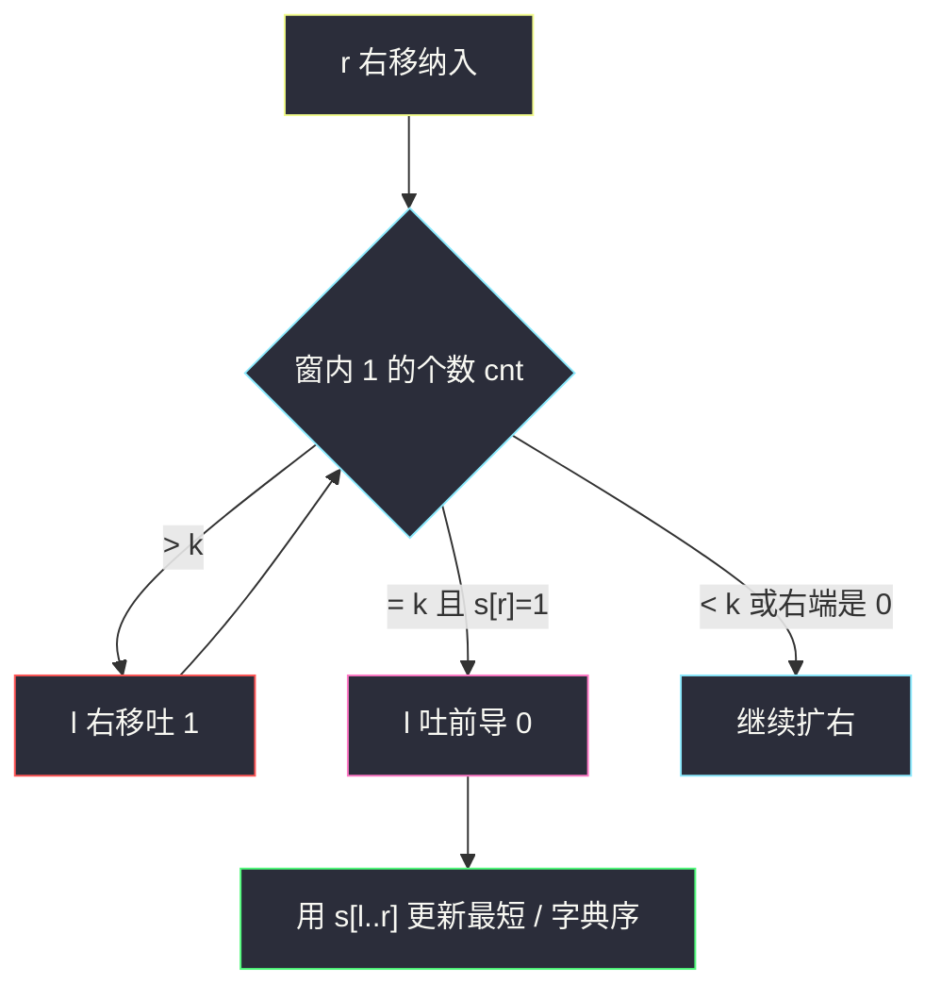

# 最短且字典序最小的美丽子字符串（恰好 k 个 1 的滑窗）

## 一、问题描述

给你二进制串 `s` 和正整数 `k`。**美丽子串** = 恰好含 `k` 个字符 `'1'` 的子串。返回其中**最短**的；同样短则取**字典序最小**的。不存在返回空串 `""`。

> 🔗 LeetCode 2904：https://leetcode.cn/problems/shortest-and-lexicographically-smallest-beautiful-string/
>
> 数据范围（官网）：`1 ≤ s.length ≤ 100`，`1 ≤ k ≤ s.length`，`s` 只含 `0` 和 `1`。
>
> 📚 灵茶题单：**八、后缀数组 / 后缀自动机**。题单把「最短 / 字典序最小子串」放到这一节，但本题不必上 SA：最短美丽窗的两端一定落在 `'1'` 上，枚举「第 i 个 1 到第 i+k-1 个 1」即可。

**示例 1**

```
输入：s = "100011001", k = 3
输出："11001"
解释：恰好 3 个 1 的子串共 7 个。最短长度是 5，唯一的长度 5 是 "11001"。
```

**示例 2**

```
输入：s = "1011", k = 2
输出："11"
解释：美丽子串有 "101"、"011"、"11"。最短是 "11"。
```

**示例 3**

```
输入：s = "000", k = 1
输出：""
解释：一个 1 都没有。
```

**直观理解**

恰好 k 个 1 的子串，最短的一定**以 1 开头、以 1 结尾**：左边或右边多出来的 0 删掉后 1 的个数不变、长度变短。所以只需看「连续的 k 个 1」（按出现顺序），它们夹出来的那一段。

---

## 二、暴力解法

枚举全部 `s[i:j]`，`count('1') == k` 时按「更短优先，同长比字典序」更新答案。`j` 至少 `i+k`，因为 k 个 1 最短也要 k 长。

```python
class Solution:
    def shortestBeautifulSubstring(self, s: str, k: int) -> str:
        n = len(s)
        ans = ""
        for i in range(n):
            for j in range(i + k, n + 1):
                t = s[i:j]
                if t.count("1") != k:
                    continue
                if not ans or len(t) < len(ans) or (len(t) == len(ans) and t < ans):
                    ans = t
        return ans
```

官网 `n ≤ 100` 时 `O(n³)` 能过。任务书按 `n ≤ 1e5` 估的话，这版会爆，必须改滑窗。

### 🔴 瓶颈在哪里

每个子串都 `count` 一遍是 `O(n³)`。真正有用的窗口极少：1 的个数从左到右单调，用双指针维护「恰好 k 个 1」，并且左端吐掉前导 0。更干净的写法是先列出所有 1 的下标。

---

## 三、优化探索（核心章节）

> 📚 题单分类是后缀数组，处理的是「所有子串里取最短再取字典序」。本题美丽的定义只跟 1 的个数有关，**不必真上 SA / SAM**。

### 3.1 最短窗两端是 1

设 `pos[0], pos[1], …` 是 `'1'` 的下标（从左到右）。任意恰好 k 个 1 的子串，覆盖的一定是某段连续的 k 个 1，即 `pos[i] … pos[i+k-1]`。在这段外面再吃 0：

- 左端若 `< pos[i]`，多吃的只能是 0（再左就是上一个 1 了），长度变长；
- 右端若 `> pos[i+k-1]`，同理。

所以**最短**美丽子串就是：

```
s[ pos[i] .. pos[i+k-1] ]    i = 0, 1, …, len(pos)-k
```

一共 `len(pos)-k+1` 个候选。其中取最短，同长比 `s[l:r+1]` 的字典序。

若 `len(pos) < k`，没有美丽子串，返回 `""`。

### 3.2 滑窗版（方便逐步盯 l / r / 1 的个数）

右端 `r` 纳入；`cnt` 为窗内 1 的个数。`cnt > k` 时左端吐到 `cnt == k`。只在 **右端落在 1 上** 时结算（否则尾巴是 0，绝不是最短）。再把左端前导 0 吐掉，使左端也落在 1 上。然后用这段去更新答案。



### 3.3 一句话核心

> **恰好 k 个 1 的最短子串 = 某连续 k 个 1 的下标闭区间；在这些区间里选最短，同长比字典序。**

---

## 四、代码实现

### Python（主解：1 的下标 + 枚举窗口）

```python
class Solution:
    def shortestBeautifulSubstring(self, s: str, k: int) -> str:
        pos = [i for i, ch in enumerate(s) if ch == "1"]
        if len(pos) < k:
            return ""
        ans = None
        for i in range(len(pos) - k + 1):
            l, r = pos[i], pos[i + k - 1]
            t = s[l : r + 1]
            if ans is None or len(t) < len(ans) or (len(t) == len(ans) and t < ans):
                ans = t
        return ans
```

同长比较的次数不多：最短长度一旦确定，只有长度等于它的窗口会走进字典序分支。官网 `n ≤ 100` 时直接比字符串即可。

滑窗等价写法（演示用，主解仍推荐 `pos`）：

```python
class Solution:
    def shortestBeautifulSubstring(self, s: str, k: int) -> str:
        l = cnt = 0
        ans = ""
        for r, ch in enumerate(s):
            if ch == "1":
                cnt += 1
            while cnt > k:
                if s[l] == "1":
                    cnt -= 1
                l += 1
            if cnt == k and ch == "1":
                while l <= r and s[l] == "0":
                    l += 1
                t = s[l : r + 1]
                if not ans or len(t) < len(ans) or (len(t) == len(ans) and t < ans):
                    ans = t
        return ans
```

**变量含义**

| 写法 | 含义 |
|------|------|
| `pos[i]` | 从左数第 `i` 个 `'1'` 的下标 |
| `pos[i+k-1]` | 这段窗口的最后一个 1 |
| `cnt` | 滑窗版里当前 `[l, r]` 中 1 的个数 |
| `ans` | 当前最短、同长字典序最小的美丽串 |

---

## 五、具体例子演示

**示例 1**：`s = "100011001"`，`k = 3`。

```
下标  0 1 2 3 4 5 6 7 8
s     1 0 0 0 1 1 0 0 1
```

`pos = [0, 4, 5, 8]`，共 4 个 1，可以放 2 个长度为 k 的「1-窗口」。

| i | l = pos[i] | r = pos[i+2] | 子串 | 长度 | 更新 |
|---|------------|--------------|------|------|------|
| 0 | 0 | 5 | `"100011"` | 6 | ans 首次 |
| 1 | 4 | 8 | `"11001"` | 5 | 更短，替换 |

答案 `"11001"`。对拍官方。

这 7 个「恰好 3 个 1」的子串（含两端补 0 的更长版）是：

| 覆盖的 1 | 左端可扩 0 | 右端可扩 0 | 其中最短 |
|----------|------------|------------|----------|
| 下标 0,4,5 | 不能再左 | 可接到 7 | `"100011"` 长 6 |
| 下标 4,5,8 | 可从 1 接到 4 | 不能再右 | `"11001"` 长 5 |

最短只有一个，不用比字典序。

**滑窗逐步盯 l / r / cnt**（同一例子）：

| r | s[r] | 纳入后 cnt | 收缩 | l | 结算窗口 | 1 的个数 |
|---|------|------------|------|---|----------|----------|
| 0 | 1 | 1 | — | 0 | cnt≠3 | 1 |
| 1 | 0 | 1 | — | 0 | 否 | 1 |
| 2 | 0 | 1 | — | 0 | 否 | 1 |
| 3 | 0 | 1 | — | 0 | 否 | 1 |
| 4 | 1 | 2 | — | 0 | 否 | 2 |
| 5 | 1 | 3 | 左端是 1，不吐 0 | 0 | `[0,5]="100011"` | 3 |
| 6 | 0 | 3 | 右端是 0，不结算 | 0 | — | 3 |
| 7 | 0 | 3 | 不结算 | 0 | — | 3 |
| 8 | 1 | 4 | cnt>3，吐下标 0 的 1，cnt=3；再吐 1..3 的 0 | 4 | `[4,8]="11001"` | 3 |

```mermaid
flowchart LR
    subgraph g0["r=5, cnt=3"]
        b0["1"] --> b1["0"]
        b1 --> b2["0"]
        b2 --> b3["0"]
        b3 --> b4["1"]
        b4 --> b5["1"]
    end
    subgraph g1["r=8, cnt=3, 更短"]
        c4["1"] --> c5["1"]
        c5 --> c6["0"]
        c6 --> c7["0"]
        c7 --> c8["1"]
    end

    style g0 fill:#1e1f29,stroke:#8be9fd,color:#f8f8f2
    style g1 fill:#1e1f29,stroke:#50fa7b,color:#f8f8f2
    style b0 fill:#2b2d3a,stroke:#f1fa8c,color:#f8f8f2
    style b1 fill:#2b2d3a,stroke:#8be9fd,color:#f8f8f2
    style b2 fill:#2b2d3a,stroke:#8be9fd,color:#f8f8f2
    style b3 fill:#2b2d3a,stroke:#8be9fd,color:#f8f8f2
    style b4 fill:#2b2d3a,stroke:#8be9fd,color:#f8f8f2
    style b5 fill:#2b2d3a,stroke:#ff79c6,color:#f8f8f2
    style c4 fill:#2b2d3a,stroke:#f1fa8c,color:#f8f8f2
    style c5 fill:#2b2d3a,stroke:#8be9fd,color:#f8f8f2
    style c6 fill:#2b2d3a,stroke:#8be9fd,color:#f8f8f2
    style c7 fill:#2b2d3a,stroke:#8be9fd,color:#f8f8f2
    style c8 fill:#2b2d3a,stroke:#50fa7b,color:#f8f8f2
```



黄是左端 1，粉/绿是右端 1。第二窗更短，成为答案。

**示例 2**：`s = "1011"`，`k = 2`。`pos = [0, 2, 3]`。

- `i=0`：`[0,2] → "101"` 长 3
- `i=1`：`[2,3] → "11"` 长 2 → 答案 `"11"`

对拍官方。`"011"` 不是最短窗（左端是 0），`pos` 写法根本不会生成它。

**示例 3**：`pos` 为空，`< k`，返回 `""`。对拍官方。

---

## 六、复杂度分析

| 方法 | 时间 | 空间 | 说明 |
|------|------|------|------|
| 枚举全部子串 + count | `O(n³)` | `O(n)` | 官网 n≤100 能过 |
| 1 的下标枚举（主解） | `O(n²)` 最坏（比字符串） | `O(n)` | 候选窗 ≤ n |
| 滑窗 + 吐前导 0 | `O(n²)` | `O(n)` | 每个 r 最多结算一次 |

比较字典序时两串长度都是当前最短，次数通常很少。即使按任务书 `n = 1e5` 估，先扫一遍最短长度、再只比最短窗，仍然够用。

---

## 七、对比总结

| 维度 | 枚举子串 | pos 窗口 | 后缀数组 |
|------|----------|----------|----------|
| 找最短恰好 k 个 1 | 全扫 | **只扫 k 个连续 1** | 杀鸡 |
| 字典序 | 同长再比 | 同长再比 | 后缀序本来就能比，没必要 |
| 两端是否为 1 | 容易漏，会留下带 0 的更长串 | 天然保证 | — |

**易错点**

1. **问「至少 k 个 1」**：题面是恰好。多吃 1 会变另一段 `pos` 窗口。
2. **结算右端为 0 的窗**：同样 3 个 1，右边多 0 绝对比短窗长，更新不到答案，但逻辑不干净，也浪费比较。
3. **字典序比长短**：必须先比长度。`"011"` 字典序小于 `"11"`，但更长，不能赢。
4. **1 不足 k 个**：直接 `""`，不要返回整串。
5. **被题单分类绑死**：上 SA 能做，面试默写滑窗 / `pos` 即可。

---

## 八、举一反三

| 题目 | 关系 |
|------|------|
| [209. 长度最小的子数组](https://leetcode.cn/problems/minimum-size-subarray-sum/) | 滑窗求最短；本题多一个「同长比字典序」 |
| [76. 最小覆盖子串](https://leetcode.cn/problems/minimum-window-substring/) | 欠债滑窗；本题「债」就是 1 的个数 |
| [3076. 数组中的最短非公共子字符串](https://leetcode.cn/problems/shortest-uncommon-substring-in-an-array/) | 同批、同属题单第八节：最短再字典序，但约束是「别的串里没有」 |
| [1234. 替换子串得到平衡字符串](https://leetcode.cn/problems/replace-the-substring-for-balanced-string/) | 滑窗外的计数约束 |
| [1358. 包含所有三种字符的子字符串数目](https://leetcode.cn/problems/number-of-substrings-containing-all-three-characters/) | 恰好 / 至少 k 种字符的窗 |

**思想迁移**

- 二进制串 + 「恰好 k 个 1」→ 1 的下标数组上的定长（个数定长）窗口。
- 口诀：**「窗口钉在 1 上；先比短，再比字典序。」**
