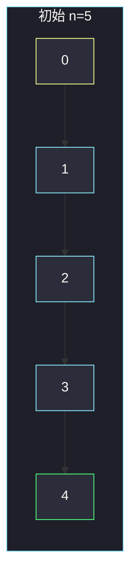
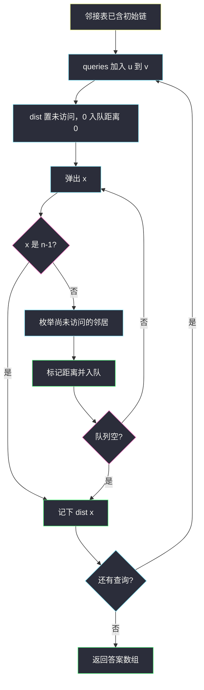

# 新增道路查询后的最短距离 I（每次加边后 BFS）

## 一、问题描述

`n` 座城市 `0 .. n-1`。初始时每座 `i`（`i < n-1`）有一条**单向**边 `i → i+1`。`queries[i] = [ui, vi]` 表示新建单向边 `ui → vi`。每次加边之后，求 **0 到 n-1 的最短路长度**（边数），按查询顺序返回答案数组。

> 🔗 LeetCode 3243：https://leetcode.cn/problems/shortest-distance-after-road-addition-queries-i/
>
> 数据范围：`3 ≤ n ≤ 500`，`1 ≤ queries.length ≤ 500`，`0 ≤ ui < vi < n` 且 `vi - ui > 1`，查询边不重复。
>
> 📚 灵茶题单：**图论 · §1.2 广度优先搜索（BFS）**（1568 分）。

**示例 1**

```
输入：n = 5, queries = [[2,4],[0,2],[0,4]]
输出：[3,2,1]

初始：0→1→2→3→4，距离 4。
加 2→4 后：0→1→2→4，距离 3。
加 0→2 后：0→2→4，距离 2。
加 0→4 后：0→4，距离 1。
```

**示例 2**

```
输入：n = 4, queries = [[0,3],[0,2]]
输出：[1,1]
加 0→3 后距离已是 1；再加 0→2 不会更短，仍是 1。
```

**直观理解**

一条从 0 排到 n-1 的链，中间不断插入「向前跳」的捷径。边权全是 1，最短路 = BFS 层数。`n`、查询次数都 ≤ 500，每次加完边从 0 重新 BFS 完全扛得住。

---

## 二、暴力解法

每次查询把图拆掉重建：先连上全部初始边 `i→i+1`，再把**当前及之前**的查询边全部加上，然后 BFS。正确，但每轮重复建那 `n-1` 条初始边。

```python
from collections import deque

class Solution:
    def shortestDistanceAfterQueries(self, n: int, queries: list[list[int]]) -> list[int]:
        def bfs(edges: list[list[int]]) -> int:
            g = [[] for _ in range(n)]
            for i in range(n - 1):
                g[i].append(i + 1)
            for u, v in edges:
                g[u].append(v)
            dist = [-1] * n
            dist[0] = 0
            q = deque([0])
            while q:
                u = q.popleft()
                if u == n - 1:
                    return dist[u]
                for v in g[u]:
                    if dist[v] == -1:
                        dist[v] = dist[u] + 1
                        q.append(v)
            return dist[n - 1]

        ans = []
        for i in range(len(queries)):
            ans.append(bfs(queries[: i + 1]))
        return ans
```

每次重建邻接表，时间多一个不必要的 `O(n)`，查询一多还反复切片 `queries[:i+1]`。逻辑对，常数差。

### 🔴 瓶颈在哪里

图是**持久**的：边只会增加、不会删。邻接表建一次，之后每次 `append` 新边再 BFS 即可。不必 Floyd：点数 500，`O(q n³)` 太慢也没必要。边权恒为 1，BFS 就是最短路。

---

## 三、优化探索（核心章节）

> 📚 本题在灵茶题单中属于 **图论 · §1.2 BFS**。初始链 `i→i+1`，每来一条查询边就挂到邻接表上，从 0 做一次 BFS 得到到 `n-1` 的距离。

### 3.1 初始图与捷径

初始最短路一定是 `n-1`（沿链走）。新边 `ui → vi` 且 `vi - ui > 1`，所以每条查询都是跳过至少一座城的捷径，距离单调不增。



加 `2→4` 后，2 多一条出边，BFS 在距离 2 到达 2 之后下一步就能到 4，总长 3。

### 3.2 每次加边后从 0 BFS

边权为 1，队列第一次弹出 `n-1` 时的 `dist` 就是答案。入队时标记 `dist[v] = dist[u]+1`，每个点只进队一次。



可选剪枝：若加边前已有 `dist[u] + 1 ≥ dist[v]`（新边不缩短 `v`），答案与上一询相同，可跳过 BFS。不是必须；`O(q (n+q))` 已过。主解每次都 BFS，好写、好对拍。

不要 Floyd：全源最短路与「只问 0 到 n-1」不匹配，复杂度也差一档。

### 3.3 一句话核心

> **链上不断加边权为 1 的捷径；邻接表只增不重建，每询从 0 BFS 一次得到到 n-1 的距离。**

---

## 四、代码实现

### Python（主解：加边 + BFS）

```python
from collections import deque

class Solution:
    def shortestDistanceAfterQueries(
        self, n: int, queries: list[list[int]]
    ) -> list[int]:
        g = [[] for _ in range(n)]
        for i in range(n - 1):
            g[i].append(i + 1)

        def bfs() -> int:
            dist = [-1] * n
            dist[0] = 0
            q = deque([0])
            while q:
                u = q.popleft()
                if u == n - 1:
                    return dist[u]
                for v in g[u]:
                    if dist[v] == -1:
                        dist[v] = dist[u] + 1
                        q.append(v)
            return dist[n - 1]

        ans = []
        for u, v in queries:
            g[u].append(v)
            ans.append(bfs())
        return ans
```

**变量含义**

| 变量 | 含义 |
|------|------|
| `g` | 有向图邻接表，初始含 `i→i+1`，查询只往里追加 |
| `dist` | 本次 BFS 从 0 出发的边数；`-1` 表示未访问 |
| `ans` | 每次加边后 0 到 `n-1` 的距离 |

题目保证图沿链连通，`dist[n-1]` 不会是 `-1`。提前在弹出 `n-1` 时 return，少扩展后面的点。

### Java（可选）

```java
class Solution {
    public int[] shortestDistanceAfterQueries(int n, int[][] queries) {
        List<Integer>[] g = new ArrayList[n];
        Arrays.setAll(g, i -> new ArrayList<>());
        for (int i = 0; i < n - 1; i++) {
            g[i].add(i + 1);
        }
        int[] ans = new int[queries.length];
        for (int i = 0; i < queries.length; i++) {
            g[queries[i][0]].add(queries[i][1]);
            ans[i] = bfs(g, n);
        }
        return ans;
    }

    private int bfs(List<Integer>[] g, int n) {
        int[] dist = new int[n];
        Arrays.fill(dist, -1);
        ArrayDeque<Integer> q = new ArrayDeque<>();
        dist[0] = 0;
        q.add(0);
        while (!q.isEmpty()) {
            int u = q.poll();
            if (u == n - 1) {
                return dist[u];
            }
            for (int v : g[u]) {
                if (dist[v] == -1) {
                    dist[v] = dist[u] + 1;
                    q.add(v);
                }
            }
        }
        return dist[n - 1];
    }
}
```

---

## 五、具体例子演示

`n = 5`，`queries = [[2,4],[0,2],[0,4]]`。跟踪每次 BFS 的队列与 `dist[4]`。

**查询 1：加 `2→4`。** `g[2] = [3, 4]`。

| 步 | 弹出 | dist | 新入队 | 队列 |
|----|------|------|--------|------|
| 初 | — | `[0,-1,-1,-1,-1]` | 0 | `[0]` |
| 1 | 0 | `1` 写入下标 1 | 1 | `[1]` |
| 2 | 1 | `2` 写入下标 2 | 2 | `[2]` |
| 3 | 2 | `3` 写入 3 和 4 | 3, 4 | `[3, 4]` |
| 4 | 3 | 4 已访问 | — | `[4]` |
| 5 | 4 | — | 返回 **3** | |

路径 `0-1-2-4`。旧链 `0-1-2-3-4` 长 4，被捷径取代。

**查询 2：加 `0→2`。** `g[0] = [1, 2]`。

| 步 | 弹出 | 新标记 | 队列 | 说明 |
|----|------|--------|------|------|
| 1 | 0 | 1 距离 1，2 距离 1 | `[1, 2]` | 捷径让 2 提前一轮到达 |
| 2 | 1 | 2 已访问 | `[2]` | |
| 3 | 2 | 3 距离 2，4 距离 2 | `[3, 4]` | |
| 4 | 3 | 4 已访问 | `[4]` | |
| 5 | 4 | 返回 **2** | | `0-2-4` |

**查询 3：加 `0→4`。**

从 0 弹出后邻居含 4，`dist[4] = 1`，入队后下一轮弹出立刻返回 **1**。

示例 2：`n = 4`，先加 `0→3`，BFS 一步到终点，答案 1。再加 `0→2`，从 0 仍一步到 3，答案还是 1（新边不缩短终点）。

---

## 六、复杂度分析

| 方法 | 时间 | 空间 | 说明 |
|------|------|------|------|
| 每询重建全图再 BFS | `O(q (n+q))` 但常数更大 | `O(n+q)` | 重复连初始边 |
| 邻接表追加 + BFS（主解） | `O(q (n+q))` | `O(n+q)` | 边数 `≤ n-1+q`，`n,q ≤ 500` |
| 每询 Floyd | `O(q n³)` | `O(n²)` | 无必要，易 TLE |

---

## 七、对比总结

| 维度 | 每次 Floyd | 每次 Dijkstra | 每次 BFS |
|------|------------|---------------|----------|
| 边权 | 任意 | 非负 | 必须全 1（本题满足） |
| 与题匹配 | 杀鸡用牛刀 | 可以但堆多余 | 正好 |
| 实现 | 长 | 中 | 最短 |

**易错点**

1. **每次重建图却忘了初始链**：只有查询边时 0 可能到不了 `n-1`。
2. **建成无向边**：题目是单向，`ui→vi` 不能反过来加。
3. **用 Dijkstra / Floyd**：正确但慢、代码长；边权 1 用 BFS。
4. **`dist` 复用却不清零**：第二次 BFS 必须重新初始化。
5. **把长度理解成点数**：答案是边数；初始链是 `n-1` 不是 `n`。

---

## 八、举一反三

| 题目 | 关系 |
|------|------|
| [3244. 新增道路查询后的最短距离 II](https://leetcode.cn/problems/shortest-distance-after-road-addition-queries-ii/) | 同题加强：边互相覆盖，需维护「有用捷径」而不能每次 BFS |
| [1976. 到达目的地的方案数](https://leetcode.cn/problems/number-of-ways-to-arrive-at-destination/) | 固定图上 0 到 n-1，Dijkstra + 计数 |
| [1091. 二进制矩阵中的最短路径](https://leetcode.cn/problems/shortest-path-in-binary-matrix/) | 边权 1 的网格 BFS |
| [1368. 使网格图至少有一条有效路径的最小代价](https://leetcode.cn/problems/minimum-cost-to-make-at-least-one-valid-path-in-a-grid/) | 边权 0/1，升级成 0-1 BFS |
| [743. 网络延迟时间](https://leetcode.cn/problems/network-delay-time/) | 正权单源最短路，边权不是 1 时换 Dijkstra |

**思想迁移**

- 边权全 1：最短路就是 BFS；图只加边时，邻接表追加后重跑即可。
- 口诀：**「先铺 i→i+1；每来一条捷径就挂上，从 0 BFS 到 n-1。」**
