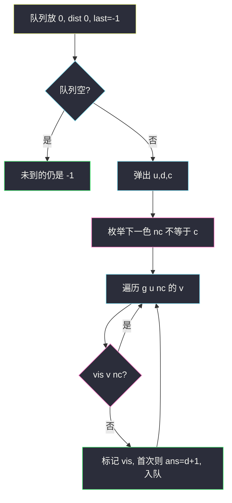

# 颜色交替的最短路径（状态 BFS：点 + 上次颜色）

## 一、问题描述

`n` 个点的**有向**图，边分红色、蓝色两套：`redEdges[i] = [u, v]` 是 `u → v` 红边，`blueEdges` 同理。可能有自环、平行边。求从 `0` 到每个点的**最短交替路径**长度（相邻边颜色必须不同）；到不了则 `-1`。长度为边数。

> 🔗 LeetCode 1129：https://leetcode.cn/problems/shortest-path-with-alternating-colors/
>
> 数据范围：`1 ≤ n ≤ 100`，红蓝边各最多 400。图小，状态 BFS 足够。
>
> 📚 灵茶题单：**§1.2 BFS**（图论②：状态里带「上一条边的颜色」）。

**示例 1**

```
输入：n = 3, redEdges = [[0,1],[1,2]], blueEdges = []
输出：[0, 1, -1]
```

`0 --红--> 1` 合法。再走 `1 --红--> 2` 同色，非法；没有蓝边，2 到不了。

**示例 2**

```
输入：n = 3, redEdges = [[0,1]], blueEdges = [[2,1]]
输出：[0, 1, -1]
```

蓝边从 2 指向 1，从 0 出发用不上。2 不可达。

**示例 3（补充）**

```
输入：n = 3, redEdges = [[0,1]], blueEdges = [[1,2]]
输出：[0, 1, 2]
```

红再蓝，交替，2 步到 2。

**直观理解**

边权全是 1，最短路用 BFS。但不能只记「到过这个点」：红边走进 `x` 和蓝边走进 `x`，下一步能走的颜色相反，是**两个状态**。和二分图染色（[is-graph-bipartite.md](./is-graph-bipartite.md)）一样要带颜色，差别是：那边染的是点，这边染的是**走进来的那条边**。

起点还没走过任何边，红、蓝第一步都合法。用 `last_color = -1` 表示「没有上一条边」，或把 `(0, 红)`、`(0, 蓝)` 两个虚拟到达塞进队列。

---

## 二、暴力解法

DFS 搜所有交替路径，取最短。有环时必须 vis 状态，否则无限绕。一旦 vis 了还用 DFS，第一次到达未必最短（DFS 不保证层序）。所以暴力要么指数枚举简单路径，要么写成「带 vis 的 DFS」但答案错。

错误示范：只按点 vis 的 BFS。

```python
from collections import deque
from typing import List

class Solution:
    def shortestAlternatingPaths(
        self, n: int, redEdges: List[List[int]], blueEdges: List[List[int]]
    ) -> List[int]:
        g = [[] for _ in range(n)]
        for u, v in redEdges:
            g[u].append((v, 0))
        for u, v in blueEdges:
            g[u].append((v, 1))
        ans = [-1] * n
        vis = [False] * n
        q = deque([(0, 0, -1)])
        vis[0] = True
        ans[0] = 0
        while q:
            u, d, c = q.popleft()
            for v, nc in g[u]:
                if nc == c or vis[v]:
                    continue
                vis[v] = True
                ans[v] = d + 1
                q.append((v, d + 1, nc))
        return ans
```

若某点先被红边以较长绕路到达并 vis 死，真正的「蓝边短路径」进不来，后续全废。必须 `vis[点][颜色]`。

### 🔴 瓶颈在哪里

状态数 `n × 2`。BFS 第一次到达某个 `(点, 颜色)` 就是该状态最短，再扩展异色出边。起点两种第一步都要展开。

---

## 三、优化探索（核心章节）

> 📚 本题在灵茶题单中属于 **§1.2 BFS**。有向图、边带 2 色、最短路。

### 3.1 建两套出边

```python
g = [[[] for _ in range(2)] for _ in range(n)]  # g[u][0] 红, g[u][1] 蓝
for u, v in redEdges:
    g[u][0].append(v)
for u, v in blueEdges:
    g[u][1].append(v)
```

有向，只加 `u → v`。红蓝平行边是两条，颜色不同，都能走。

### 3.2 状态 `(node, last_color)`

- `last_color = 0/1`：刚走红/蓝走进当前点，下一步只能走另一种。
- `last_color = -1`：起点，下一步红蓝都行。

`vis[v][nc] = True` 表示已经用颜色 `nc` 到达过 `v`。同一点两种颜色都要允许各来一次。`ans[v]` 取两种到达里更早的那次（BFS 层序，先到先记）。



边权为 1，不必 Dijkstra（对比 [network-delay-time.md](./network-delay-time.md)）。颜色交替是 0-1 以外的「状态维」，不是边权。

### 3.3 一句话核心

> **有向红蓝两套邻接表；BFS 状态 (点, 上一条颜色)；起点 last=-1；vis 必须带颜色。**

---

## 四、代码实现

### Python（主解：状态 BFS）

```python
from collections import deque
from typing import List

class Solution:
    def shortestAlternatingPaths(
        self, n: int, redEdges: List[List[int]], blueEdges: List[List[int]]
    ) -> List[int]:
        g = [[[] for _ in range(2)] for _ in range(n)]
        for u, v in redEdges:
            g[u][0].append(v)
        for u, v in blueEdges:
            g[u][1].append(v)
        ans = [-1] * n
        vis = [[False] * 2 for _ in range(n)]
        q = deque([(0, 0, -1)])  # node, dist, last_color
        ans[0] = 0
        while q:
            u, d, c = q.popleft()
            for nc in (0, 1):
                if nc == c:
                    continue
                for v in g[u][nc]:
                    if vis[v][nc]:
                        continue
                    vis[v][nc] = True
                    if ans[v] < 0:
                        ans[v] = d + 1
                    q.append((v, d + 1, nc))
        return ans
```

`nc == c` 在起点 `c = -1` 时永不成立，红蓝第一步都会走。自环：`0 --红--> 0` 会 vis 成「红到达 0」，之后可以从 0 走蓝边——这是合法交替， vis 按颜色才允许。

等价写法：一开始入队 `(0, 0)` 和 `(0, 1)`（假装两种颜色都已到达起点、距离 0），下一步走反色。`ans[0] = 0` 同样。两种初始化都行。

`ans[v] < 0` 才写入：BFS 先到的那种颜色已经是最短，另一种颜色到达同一点只用于**继续**走另一种出边，不必改 `ans[v]`。

---

## 五、具体例子演示

示例 3：`n=3`，红 `0→1`，蓝 `1→2`。跟踪 `(node, last_color)`。

| 弹出 `(u, d, c)` | 尝试 nc | 到达 | vis / ans | 队列 |
|------------------|---------|------|-----------|------|
| 初 | | `(0,0,-1)` | ans[0]=0 | `(0,0,-1)` |
| `(0, 0, -1)` | 红：`0→1` | `(1, 1, 0)` | vis[1][0]，ans[1]=1 | `(1,1,0)` |
| | 蓝：无 | | | |
| `(1, 1, 0)` | 红跳过（同色） | | | |
| | 蓝：`1→2` | `(2, 2, 1)` | vis[2][1]，ans[2]=2 | `(2,2,1)` |
| `(2, 2, 1)` | 无出边 | | | 空 |

答案 `[0, 1, 2]`。


示例 1：只有红 `0→1`、`1→2`。弹出 `(1,1,红)` 后 `nc` 只能蓝，蓝表空，2 从未入队，`ans[2] = -1`。若 vis 只记点，结果碰巧也对；换成「先红绕远、后蓝抄近」就会暴露。

**同一点两种颜色**

`0 --红--> 1`，`0 --蓝--> 1`，`1 --红--> 2`。  
- 蓝走进 1（步 1）之后下一步可以走红到 2（步 2）。  
- 若只 vis 点，红先到 1 并锁死，蓝进不了 1，2 就丢了。  
状态 vis：`vis[1][红]`、`vis[1][蓝]` 各一次，2 能到。

示例 2：蓝边 `2→1` 是反向的，从 0 的 BFS 到不了 2，答案 `[0,1,-1]`。有向图不能当无向。

双起点写法逐步（同一示例 3）：一开始把 `(0, last=红)`、`(0, last=蓝)` 都放进队列，距离 0，`vis[0][0]=vis[0][1]=True`。

| 弹出 | 下一步颜色 | 扩展 |
|------|------------|------|
| `(0, 红)` | 必须蓝 | 0 没有蓝出边 |
| `(0, 蓝)` | 必须红 | `0→1`，入队 `(1, 红)` dist=1 |
| `(1, 红)` | 必须蓝 | `1→2`，入队 `(2, 蓝)` dist=2 |

和 `last=-1` 一条路径等价：虚拟的「已经用红/蓝到达起点」只是为了强制下一步走反色。不要把起点的 vis 理解成「0 不能再被走进来」——对最短路来说回到 0 再出发只会更长，锁死无妨。

---

## 六、复杂度分析

| 方法 | 时间 | 空间 | 说明 |
|------|------|------|------|
| 状态 BFS（主解） | `O(n + m)` | `O(n + m)` | `m` 为红边+蓝边；状态 `2n` |
| 只 vis 点的 BFS | `O(n + m)` | `O(n + m)` | 更快但错 |
| Dijkstra | `O(m log n)` | `O(n + m)` | 权全 1，没必要 |

每个 `(v, color)` 最多入队一次，每条边被对应颜色扩展一次。

---

## 七、对比总结

| 维度 | 普通最短路 BFS | 二分图染色 | 本题 |
|------|----------------|------------|------|
| 状态 | 点 | 点 + 颜色（相邻异色） | 点 + **入边颜色** |
| 图 | 无向/有向看题 | 无向 | **有向**、两套边 |
| 失败 | 不可达 -1 | 同色相邻 | 某点两种入法都走不通 |

**易错点**

1. **vis 只记节点**：第二种颜色的到达被堵死。
2. **建成无向 / 红蓝混在一张表不标色**：交替条件丢失。
3. **起点只允许一种颜色**：最短路可能必须先走另一种。
4. **自环、平行边**：邻接表照加；靠 `(点, 色)` vis 防死循环。
5. **`ans[0]` 忘了置 0**：`n=1` 无边应返回 `[0]`。

和 [is-graph-bipartite.md](./is-graph-bipartite.md) 都是「颜色进状态」：二分图把颜色涂在点上、相邻必须异色；本题把颜色记在入边上、下一条必须异色。前者无向判可行性，后者有向求最短路。

---

## 八、举一反三

| 题目 | 关系 |
|------|------|
| [785. 判断二分图](https://leetcode.cn/problems/is-graph-bipartite/) | 点 2-染色，站内 [is-graph-bipartite.md](./is-graph-bipartite.md) |
| [1293. 网格中的最短路径](https://leetcode.cn/problems/shortest-path-in-a-grid-with-obstacles-elimination/) | 状态 BFS：`(格, 剩余消除次数)` |
| [847. 访问所有节点的最短路径](https://leetcode.cn/problems/shortest-path-visiting-all-nodes/) | 状态 `(点, 访问集合掩码)` |
| [743. 网络延迟时间](https://leetcode.cn/problems/network-delay-time/) | 边权不是 1 时换 Dijkstra，站内 [network-delay-time.md](./network-delay-time.md) |
| [1129 本题变形](https://leetcode.cn/problems/shortest-path-with-alternating-colors/) | 若改无向，建图双向但仍按颜色交替 |

**思想迁移**

- 约束写在「上一步选了什么」上 → 把该信息塞进 BFS 状态，不要只 vis 点。
- 边权全 1：状态图上 BFS；边权任意正：同一状态图上 Dijkstra。
- 口诀：**「两套出边；状态 (点, 色)；起点无色两边都能走；vis 带色。」**
