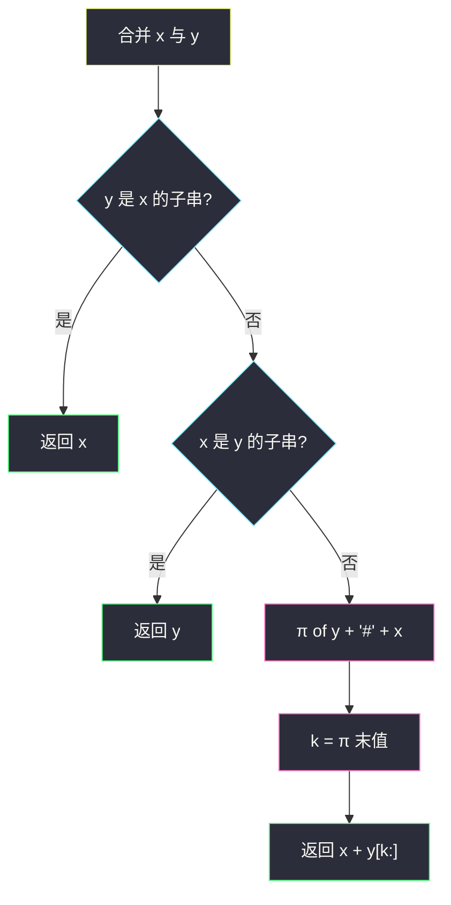
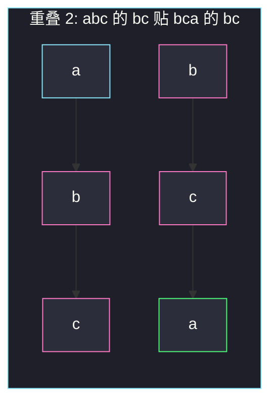

# 包含三个字符串的最短字符串（6 排列 + KMP 重叠）

## 一、问题描述

给你三个字符串 `a`、`b`、`c`，找一个最短字符串 `s`，使得三者都是 `s` 的**子串**。最短不唯一时，返回其中**字典序最小**的。

> 🔗 LeetCode 2800：https://leetcode.cn/problems/shortest-string-that-contains-three-strings/
>
> 数据范围：`1 ≤ a.length, b.length, c.length ≤ 100`，只含小写字母。
>
> 📚 灵茶题单：**一、KMP（前缀的后缀）**。两个串拼成最短超串 = 尽量让「左串的后缀」贴上「右串的前缀」；这段最长重叠正是 KMP 前缀函数在 `y + '#' + x` 末尾给出的值。

**示例 1**

```
输入：a = "abc", b = "bca", c = "aaa"
输出："aaabca"
解释：s[2..4] = "abc"，s[3..5] = "bca"，s[0..2] = "aaa"。
长度至少 6，"aaabca" 是同长里字典序最小的。
```

**示例 2**

```
输入：a = "ab", b = "ba", c = "aba"
输出："aba"
解释：c 已经同时包含 a 和 b。长度下界是 3，答案就是 "aba"。
```

**直观理解**

三个串的最短公共超串，规模小到可以枚举 **6 种拼接顺序**。每种顺序里两两合并：能包含就直接吞掉，否则只补「右边多出来的那截」。6 个候选里取最短，同长比字典序。

---

## 二、暴力解法

合并 `x, y` 时从大到小枚举重叠长度 `k`，检查 `x` 的末 `k` 位是否等于 `y` 的头 `k` 位。

```python
from itertools import permutations

class Solution:
    def minimumString(self, a: str, b: str, c: str) -> str:
        def merge(x: str, y: str) -> str:
            if y in x:
                return x
            if x in y:
                return y
            k = min(len(x), len(y))
            while k > 0 and x[-k:] != y[:k]:
                k -= 1
            return x + y[k:]

        ans = None
        for p in permutations((a, b, c)):
            t = merge(merge(p[0], p[1]), p[2])
            if ans is None or len(t) < len(ans) or (len(t) == len(ans) and t < ans):
                ans = t
        return ans
```

每次合并暴力比重叠是 `O(L²)`，三个串长度 ≤100，6 次排列完全能过。但题单这一节要练的是：**最长「前缀=后缀」用 KMP 一次求完。**

### 🔴 瓶颈在哪里

暴力重叠要从 `min(|x|,|y|)` 试到 1，每次切片比较。KMP 前缀函数在 `O(|x|+|y|)` 内给出同一个最长 `k`。包含关系必须先处理：一个串已经是另一个的子串时，再谈首尾重叠会补出重复字符。

---

## 三、优化探索（核心章节）

> 📚 本题在灵茶题单中属于 **一、KMP（前缀的后缀）**。`π[i]` = 串的前 `i+1` 个字符里，最长的真前缀同时也是真后缀的长度。把 `y + '#' + x` 丢进 `π`，最后一个值就是「`x` 的后缀 ∩ `y` 的前缀」的最长长度。

### 3.1 为什么 6 种顺序够用

最短超串一定对应三个串在最终串里的某种左右顺序（允许一个被另一个完全盖住）。三种串全排列只有 6 个，逐个构造再比长短 / 字典序即可。不必搜索「插到中间某个非相邻位置」——那种覆盖会被「长串在前、短串被包含」的排列吸收。

### 3.2 合并 x 再拼 y

1. **包含**：`y` 已是 `x` 的子串 → 答案就是 `x`；`x` 已是 `y` 的子串 → 答案就是 `y`。双向都要查。只查 `y in x` 时，若 `x = "abc"`、`y = "xyzabc"`，首尾重叠是 0，会拼出 `"abcxyzabc"`，多了一截。
2. **重叠**：求最大的 `k`，使 `x` 的后缀 `k` 个字符 = `y` 的前缀 `k` 个字符。结果 `x + y[k:]`。
3. 求 `k`：构造 `s = y + '#' + x`，算前缀函数 `π`，`k = π[-1]`。分隔符保证匹配不会跨过两段。



对排列 `(p0, p1, p2)`：先 `t = merge(p0, p1)`，再 `merge(t, p2)`。

### 3.3 一句话核心

> **6 种顺序两两合并；合并时先处理包含，再用 KMP 吃掉最长的「左后缀 = 右前缀」。**

---

## 四、代码实现

### Python（主解：前缀函数求重叠）

```python
from itertools import permutations

class Solution:
    def minimumString(self, a: str, b: str, c: str) -> str:
        def pi_of(s: str) -> list[int]:
            n = len(s)
            pi = [0] * n
            for i in range(1, n):
                j = pi[i - 1]
                while j > 0 and s[i] != s[j]:
                    j = pi[j - 1]
                if s[i] == s[j]:
                    j += 1
                pi[i] = j
            return pi

        def merge(x: str, y: str) -> str:
            if y in x:
                return x
            if x in y:
                return y
            k = pi_of(y + "#" + x)[-1]
            return x + y[k:]

        ans = None
        for p in permutations((a, b, c)):
            t = merge(merge(p[0], p[1]), p[2])
            if ans is None or len(t) < len(ans) or (len(t) == len(ans) and t < ans):
                ans = t
        return ans
```

长度 100 时 `y in x` 用 Python 内置即可；重叠是本题要默写的 KMP。`π` 用灵神同款前缀函数：`j = pi[i-1]`，失配跳 `pi[j-1]`。

**变量含义**

| 写法 | 含义 |
|------|------|
| `pi[i]` | `s[0..i]` 的最长真前后缀长度 |
| `y + '#' + x` | 让「`y` 的前缀」去贴「`x` 的后缀」 |
| `k = pi[-1]` | 最长重叠；拼出来是 `x + y[k:]` |
| `permutations` | 6 种拼接顺序 |

---

## 五、具体例子演示

**示例 1**：`a = "abc"`，`b = "bca"`，`c = "aaa"`。

先看 `merge("abc", "bca")` 的 KMP。`s = "bca" + "#" + "abc" = "bca#abc"`：

| i | s[i] | 失配后 j | π[i] | 含义 |
|---|------|----------|------|------|
| 1 | c | 0 | 0 | |
| 2 | a | 0 | 0 | |
| 3 | # | 0 | 0 | 分隔 |
| 4 | a | 0 | 0 | |
| 5 | b | 0→1 | 1 | `b` 对上 `bca` 的 `b` |
| 6 | c | 2 | 2 | `bc` 对上 `bca` 的 `bc` |

`k = 2`，`"abc" + "a" = "abca"`。再与 `"aaa"` 合并：`k = 1`（末尾 `a`），得到 `"abcaaa"`，长度 6。

六种顺序（对拍后取最短、同长取字典序）：

| 顺序 | 第一次合并 | 再并第三个 | 长度 |
|------|------------|------------|------|
| abc, bca, aaa | abca（重叠 2） | abcaaa | 6 |
| abc, aaa, bca | abcaaa（重叠 0） | abcaaa（bca 已含） | 6 |
| bca, abc, aaa | bcabc（重叠 1） | bcabcaaa | 8 |
| bca, aaa, abc | bcaaa | bcaaabc | 7 |
| aaa, abc, bca | aaabc（重叠 1） | **aaabca**（重叠 2） | 6 |
| aaa, bca, abc | aaabca（重叠 0） | aaabca（abc 已含） | 6 |

长度 6 的候选是 `"abcaaa"` 和 `"aaabca"`。`'a'=='a'` 后第二位 `'a' < 'b'`，取 `"aaabca"`。对拍官方示例 1。



粉节点是吃掉的重叠；绿节点是补上的 `"a"`。再把 `"aaa"` 接到最左：`aaa` 的末 `a` 与 `aaabca` 的头重叠，得到官方答案。

**示例 2**：`a = "ab"`，`b = "ba"`，`c = "aba"`。

`merge("ab", "ba")`：重叠 1（`"b"`），得到 `"aba"`。第三次合并发现 `"aba"` 已包含第三个串，停止。其它把 `"aba"` 放前面的排列直接整段吞掉。答案 `"aba"`。对拍官方示例 2。

**包含漏检**：`x = "abc"`，`y = "xyzabc"`。`y` 不是 `x` 的子串，最长首尾重叠为 0；若不写 `x in y`，会得到 `"abcxyzabc"`。写了则返回 `"xyzabc"`。枚举 6 排列时「长串在前」也能救回来，但 merge 本身应双向判断，不要把正确性寄托在排列顺序上。

---

## 六、复杂度分析

| 方法 | 时间 | 空间 | 说明 |
|------|------|------|------|
| 枚举重叠长度 | `O(L²)` 每次合并 | `O(L)` | L≤100，能过 |
| 6 排列 + KMP 重叠（主解） | `O(L)` 每次合并，总共 `O(L)` | `O(L)` | 6 是常数 |
| 最短公共超串近似算法 | 更重 | — | 三个串没必要 |

`L` 为三串长度之和的量级（每次 `π` 扫 `y+'#'+x`）。

---

## 七、对比总结

| 维度 | 暴力重叠 | KMP `π` | 忘记包含 |
|------|----------|---------|----------|
| 最长 k | 从大到小试 | 一次线性 | — |
| 一个串已含另一个 | 需特判 | 同样要特判 | 会重复拼接 |
| 同长字典序 | 6 个候选里 `min` | 同左 | 可能得到更长串，字典序比较也乱 |

**易错点**

1. **只查 `y in x`**：`x` 落在 `y` 中间或末尾时，首尾重叠吃不到整段。
2. **重叠不是最长**：短重叠会得到更长的超串，字典序再小也先被长度刷掉。
3. **KMP 写成 `x+'#'+y`**：求的是 `y` 的后缀与 `x` 的前缀，方向反了。必须是 **pattern 在前**：`y + '#' + x`。
4. **没比字典序**：示例 1 里 `"abcaaa"` 和 `"aaabca"` 一样长，漏比会错。
5. **把子序列当子串**：必须连续。
6. **分隔符缺失**：`y+x` 直接算 `π` 可能跨界匹配。

---

## 八、举一反三

| 题目 | 关系 |
|------|------|
| [686. 重复叠加字符串匹配](https://leetcode.cn/problems/repeated-string-match/) | 同属 **一、KMP**：在 `a` 的重复串里搜 `b` |
| [28. 找出字符串中第一个匹配项的下标](https://leetcode.cn/problems/find-the-index-of-the-first-occurrence-in-a-string/) | `π` + 匹配指针的模板题 |
| [1392. 最长快乐前缀](https://leetcode.cn/problems/longest-happy-prefix/) | 答案就是 `π[-1]` 对应的前缀 |
| [214. 最短回文串](https://leetcode.cn/problems/shortest-palindrome/) | `s + '#' + reverse(s)` 的 `π[-1]` 吃掉已是回文的前缀 |
| [1092. 最短公共超序列](https://leetcode.cn/problems/shortest-common-supersequence/) | 两个串的 SCS 用 LCS；三个串规模小才改枚举排列 |

**思想迁移**

- 「左串尾巴贴右串脑袋」= 前缀函数；「已经盖住」= 子串包含，先判再贴。
- 口诀：**「六种顺序，先吞掉，再贴尾；贴尾的 k 看 π 的末格。」**
