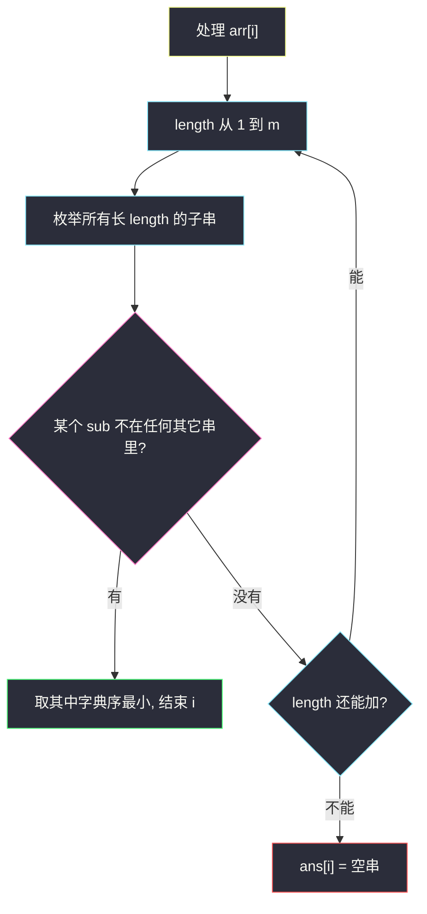
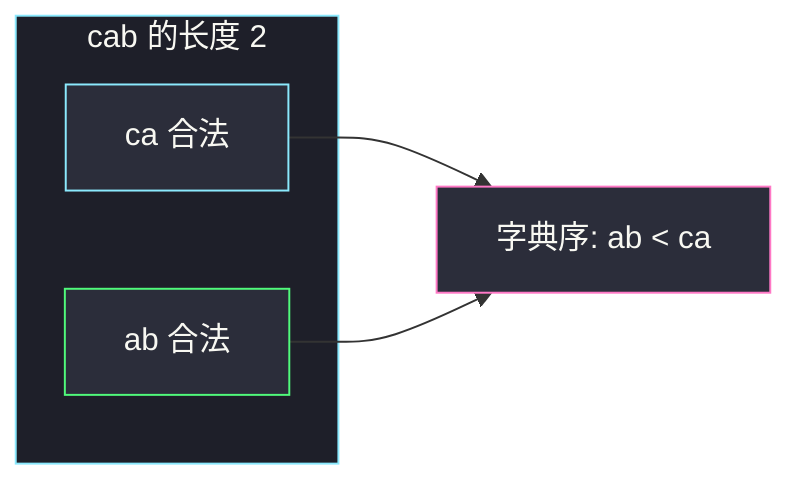

# 数组中的最短非公共子字符串（按长度枚举子串）

## 一、问题描述

给你 `n` 个非空串组成的数组 `arr`。对每个 `arr[i]`，找它的一个**最短子串**，使得这个子串**不是** `arr` 里**其它任何串**的子串。同样短则取字典序最小的；不存在则该位置填 `""`。

注意：只要求不在**别人**里面出现。自己串里重复出现没关系。

> 🔗 LeetCode 3076：https://leetcode.cn/problems/shortest-uncommon-substring-in-an-array/
>
> 数据范围：`2 ≤ n ≤ 100`，`1 ≤ arr[i].length ≤ 20`，小写字母。
>
> 📚 灵茶题单：**八、后缀数组 / 后缀自动机**。题单把「子串唯一性」放到 SAM / SA 常见应用里；本题 n 和串长都极小，**枚举全部子串**即可，不要被分类绑死。

**示例 1**

```
输入：arr = ["cab","ad","bad","c"]
输出：["ab","","ba",""]
解释：
- "cab"：长度 2 的 "ca"、"ab" 都没在别人里出现，字典序取 "ab"
- "ad"：子串 "a"、"d"、"ad" 都能在别人里找到
- "bad"：最短是 "ba"
- "c"：单字符 "c" 是 "cab" 的子串
```

**示例 2**

```
输入：arr = ["abc","bcd","abcd"]
输出：["","","abcd"]
解释："abc"、"bcd" 的所有子串都落在 "abcd" 里；"abcd" 本身不在另外两个里出现。
```

**直观理解**

对每个串，把它的子串按长度 1、2、… 排序，同长按字典序。第一个「插到其它串里都找不到」的就是答案。短的优先查，找到就可以停。

---

## 二、暴力解法

对每个 `arr[i]` 的每个子串 `sub`，扫一遍其它 `arr[j]`，看 `sub in arr[j]`。

```python
class Solution:
    def shortestSubstrings(self, arr: list[str]) -> list[str]:
        n = len(arr)
        ans = [""] * n
        for i in range(n):
            s = arr[i]
            m = len(s)
            best = None
            for l in range(m):
                for r in range(l + 1, m + 1):
                    sub = s[l:r]
                    if any(j != i and sub in arr[j] for j in range(n)):
                        continue
                    if (
                        best is None
                        or len(sub) < len(best)
                        or (len(sub) == len(best) and sub < best)
                    ):
                        best = sub
            if best is not None:
                ans[i] = best
        return ans
```

每个串有 `O(m²)` 个子串，检查 `in` 是 `O(n m²)`，总时间大约 `O(n² m⁴)`。`n ≤ 100`、`m ≤ 20` 仍能过，但同长度的子串会反复更新，逻辑散。

### 🔴 瓶颈在哪里

不在超时，在**枚举顺序**。先按长度从小到大，同一长度里直接取字典序最小的合法者，找到就 `break`。不必生成更长的。后缀自动机能批量判断「子串是否在其它串出现」，对 m=20 是杀鸡。

---

## 三、优化探索（核心章节）

> 📚 题单第八节常见套路是把所有串丢进广义 SAM，查询每个子串的 `endpos` 属于几根串。本题范围允许把「查 in」写成明面循环。

### 3.1 枚举顺序 = 答案的两个关键字

`answer[i]` 的比较关键字：

1. 长度越小越好；
2. 长度相同，字典序越小越好。

所以对 `arr[i]`：

```
for length = 1 .. |s|:
    枚举所有长为 length 的子串，收集「不在任何 arr[j] (j≠i) 里出现」的
    若集合非空：答案 = min(集合)，结束该 i
若所有长度都失败：答案 = ""
```

`min(集合)` 就是同长字典序最小。

### 3.2 「非公共」不含自己

检查时跳过 `j == i`。若 `arr = ["aaa"]` 只有一个串，题面保证 `n ≥ 2`。若两个串相同，例如 `["ab","ab"]`：每个子串都能在另一个里找到，答案 `["",""]`。

### 3.3 一句话核心

> **对每个串，子串按长度从小到大、同长按字典序，第一个不在其它串里出现的就是答案。**



---

## 四、代码实现

### Python（主解：长度升序 + 同长取 min）

```python
class Solution:
    def shortestSubstrings(self, arr: list[str]) -> list[str]:
        n = len(arr)
        ans = [""] * n
        for i in range(n):
            s = arr[i]
            m = len(s)
            found = False
            for length in range(1, m + 1):
                best = None
                for st in range(m - length + 1):
                    sub = s[st : st + length]
                    ok = True
                    for j in range(n):
                        if i != j and sub in arr[j]:
                            ok = False
                            break
                    if ok and (best is None or sub < best):
                        best = sub
                if best is not None:
                    ans[i] = best
                    found = True
                    break
            if not found:
                ans[i] = ""
        return ans
```

`sub in arr[j]` 对短串足够；若改成预处理每串的全部子串集合，检查是 `O(1)`，总时间降到 `O(n² m²)` 量级，m=20 时两种都能过。主解保持「检查 in」以便和题意逐字对应。

**变量含义**

| 写法 | 含义 |
|------|------|
| `length` | 当前尝试的子串长度，从小到大 |
| `st` | 子串起点 |
| `ok` | `sub` 是否对所有 `j ≠ i` 都不是子串 |
| `best` | 本长度下字典序最小的合法 `sub` |

---

## 五、具体例子演示

**示例 1**：`arr = ["cab","ad","bad","c"]`。

对 `"cab"`，子串按长度：

| 长度 | 子串 | 是否出现在其它串 | 结论 |
|------|------|------------------|------|
| 1 | `"c"` | `"c"` 这个串里有 | 不行 |
| 1 | `"a"` | `"ad"`、`"bad"` | 不行 |
| 1 | `"b"` | `"bad"` | 不行 |
| 2 | `"ca"` | 没有 | 合法 |
| 2 | `"ab"` | 没有 | 合法 |

长度 2 第一次出现合法者，`min("ca","ab") = "ab"`。更长的 `"cab"` 不再看。

对 `"ad"`：

| 子串 | 别人 |
|------|------|
| `"a"` | cab、bad |
| `"d"` | bad |
| `"ad"` | bad 的后两字符 |

全部命中，答案 `""`。

对 `"bad"`：长度 1 的 `b/a/d` 都能在别人里找到；长度 2 的 `"ba"` 不在 cab/ad/c 里，`"ad"` 在 `"ad"` 里。最短合法是 `"ba"`。

对 `"c"`：只有 `"c"`，是 `"cab"` 的前缀，答案 `""`。

对拍官方 `["ab","","ba",""]`。



绿是最终选中的 `"ab"`。

**示例 2**：`arr = ["abc","bcd","abcd"]`。

`"abc"` 的 `"a"/"b"/"c"/"ab"/"bc"/"abc"` 全是 `"abcd"` 的子串。`"bcd"` 同理。`"abcd"` 的长度 1–3 子串分别落在前两个里，长度 4 的 `"abcd"` 本身不在 `"abc"` 或 `"bcd"` 里。答案 `["","","abcd"]`。对拍官方。

**相同串**：`["ab","ab"]` → `["",""]`。每个子串都被另一份拷贝覆盖。这不是 bug。

**自己重复没关系**：`["aba","x"]` 里 `"a"` 在 `"aba"` 出现两次，但 `"x"` 不含 `"a"`，所以 `"aba"` 的答案可以是 `"a"`。

---

## 六、复杂度分析

| 方法 | 时间 | 空间 | 说明 |
|------|------|------|------|
| 乱序枚举全部子串再比 | `O(n² m⁴)` 量级 | `O(n)` | m=20 能过 |
| 长度升序 + in 检查（主解） | `O(n² m⁴)` 最坏，常提前停 | `O(m)` | 最短往往很短 |
| 预处理每串子串集合 | `O(n² m² + n m²)` | `O(n m²)` | 检查变 O(1) |
| 广义 SAM | `O(n m)` 建图 | 更大 | 本题不值得 |

`m ≤ 20`，一个串最多 `21×20/2 = 210` 个子串。

---

## 七、对比总结

| 维度 | 按长度枚举 | 后缀自动机 | 把「自己」也当其它串 |
|------|------------|------------|----------------------|
| 范围 | 正好 | 过重 | 答案会全空（自己包含自己） |
| 同长字典序 | `min` 本层 | 后缀序可辅助 | — |
| 两串相同 | 自然得到 `""` | 自然 | — |

**易错点**

1. **检查时没跳过自己**：每个子串都是自己的子串，答案全 `""`。
2. **先比字典序再比长度**：`"b"` 比 `"ab"` 字典序大但更短，短的优先。必须长度外层循环。
3. **子序列**：必须连续。`"cab"` 的 `"cb"` 不是子串。
4. **停在第一个合法子串但不取 min**：同一长度可能有多个，要扫完这一层再 `min`。
5. **被 SAM 分类吓住**：面试写三重循环 + `in` 就对了。

---

## 八、举一反三

| 题目 | 关系 |
|------|------|
| [2904. 最短且字典序最小的美丽子字符串](https://leetcode.cn/problems/shortest-and-lexicographically-smallest-beautiful-string/) | 同批、同属第八节：最短优先、同长字典序；约束从「恰好 k 个 1」换成「别人没有」 |
| [1408. 数组中的字符串匹配](https://leetcode.cn/problems/string-matching-in-an-array/) | 判断一个串是不是另一个的子串，本题的检查内核 |
| [14. 最长公共前缀](https://leetcode.cn/problems/longest-common-prefix/) | 多串之间的「公共」；本题要的是「非公共」 |
| [1065. 字符串的索引对](https://leetcode.cn/problems/index-pairs-of-a-string/) | 枚举子串是否落在词表里 |
| [720. 词典中最长的单词](https://leetcode.cn/problems/longest-word-in-dictionary/) | 也是「按长度」在一堆短串里挑，比较关键字相反 |

**思想迁移**

- 范围 `m ≤ 20`：子串全集只有两百来个，枚举比自动机干净。
- 口诀：**「先短后长，同长取 min；查别人，别查自己。」**
