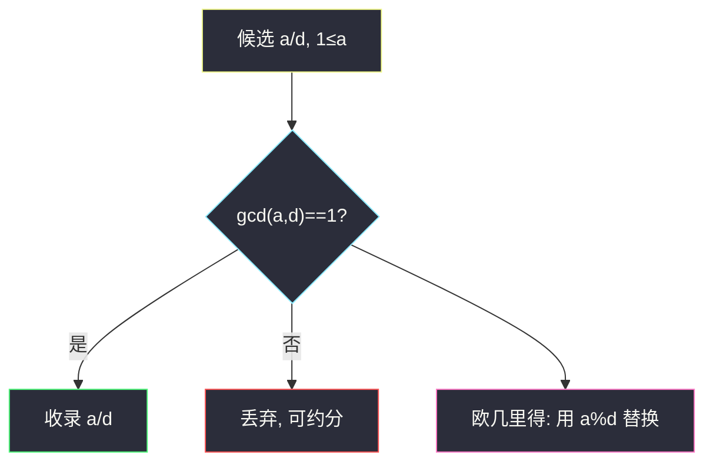
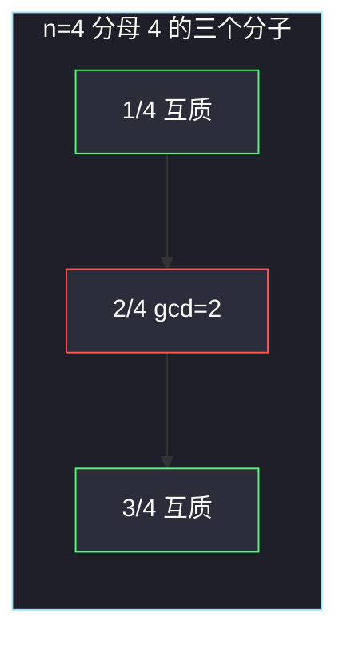

# 最简分数（枚举 + 欧几里得 gcd）

## 一、问题描述

给你整数 `n`，返回所有分母**小于等于** `n` 的最简分数（分子、分母都是正整数，分数值在 0 与 1 之间，不含 0 和 1）。用字符串 `"分子/分母"` 表示，顺序任意。

> 🔗 LeetCode 1447：https://leetcode.cn/problems/simplified-fractions/
>
> 数据范围：`1 ≤ n ≤ 100`。
>
> 📚 灵茶题单：**§1.8 互质**（1400 分）。最简 ⇔ `gcd(分子, 分母) == 1`。枚举分母 `d=2..n`、分子 `a=1..d-1`，用欧几里得算法判互质。`n=1` 没有合法分母，返回 `[]`。

**示例 1**

```
输入：n = 2
输出：["1/2"]
```

**示例 2**

```
输入：n = 3
输出：["1/2","1/3","2/3"]
```

**示例 3**

```
输入：n = 4
输出：["1/2","1/3","1/4","2/3","3/4"]
解释：2/4 可约成 1/2，不是最简。
```

**示例 4**（官方，任务书已点出）

```
输入：n = 1
输出：[]
```

**直观理解**

分母最大是 `n`，分子必须比分母小（否则 ≥ 1）。每个候选 `a/d` 约分到不能再约，当且仅当没有大于 1 的公因子，也就是互质。`2/4` 与 `1/2` 是同一个有理数，只保留已经互质的写法。

---

## 二、暴力解法

枚举所有 `1 ≤ a < d ≤ n`，把分数约分后放进集合去重（约分用反复除 gcd）。

```python
class Solution:
    def simplifiedFractions(self, n: int) -> list[str]:
        def gcd(a: int, b: int) -> int:
            while b:
                a, b = b, a % b
            return a

        seen = set()
        ans = []
        for d in range(2, n + 1):
            for a in range(1, d):
                g = gcd(a, d)
                key = (a // g, d // g)
                if key not in seen:
                    seen.add(key)
                    ans.append(f"{key[0]}/{key[1]}")
        return ans
```

`n ≤ 100` 能过，但做了无用功：先生成 `2/4` 再约成 `1/2`，而 `1/2` 在分母为 2 时已经收过。直接只收 `gcd==1` 的，集合都可以去掉。

### 🔴 瓶颈在哪里

去重版依赖「约分后的 pair」当唯一键，逻辑绕。互质判定本身已经是最简的定义，内层加一句 `gcd(a,d)==1` 即可，不必约分、不必 `seen`。

---

## 三、优化探索（核心章节）

> 📚 本题在灵茶题单中属于 **§1.8 互质**。两个正整数互质 ⇔ `gcd = 1`。求 gcd 用欧几里得：`gcd(a,b) = gcd(b, a%b)`，直到余数为 0。

### 3.1 欧几里得算法

`a = bq + r`（`r = a % b`）时，`a` 与 `b` 的公约数也整除 `r`，所以公因子集合不变。例如 `gcd(8,12)`：

| 步骤 | a | b | a % b |
|------|---|---|-------|
| 1 | 8 | 12 | 8 |
| 2 | 12 | 8 | 4 |
| 3 | 8 | 4 | 0 |
| 结束 | 4 | 0 | — |

`gcd=4 ≠ 1`，所以 `8/12` 不是最简。`gcd(3,4)`：`3,4 → 4,3 → 3,1 → 1,0`，互质，收下 `"3/4"`。



### 3.2 枚举范围

- 分母 `d` 从 **2** 起：分母 1 的分数是整数，值是 0 或 ≥ 1，题目排除。
- 分子 `a` 从 1 到 `d-1`：保证在 (0,1) 开区间。
- `n=1`：`range(2, 2)` 为空，自然返回 `[]`。
- 每个最简分数只对应一对 `(a,d)`，不会重复。`1/2` 只在 `d=2` 出现；`d=4` 的 `2/4` 因 gcd=2 被丢。

分母为 `d` 时，合法分子个数是欧拉函数 `φ(d)`。总数 `Σ_{d=2..n} φ(d)`，不必真去筛 φ，双重循环 + gcd 对 `n=100` 足够。

### 3.3 一句话核心

> **分母 2..n、分子 1..d-1，gcd 等于 1 就收录；n=1 是空列表。**

---

## 四、代码实现

### Python（主解：枚举 + 辗转相除）

```python
class Solution:
    def simplifiedFractions(self, n: int) -> list[str]:
        def gcd(a: int, b: int) -> int:
            while b:
                a, b = b, a % b
            return a

        ans = []
        for d in range(2, n + 1):
            for a in range(1, d):
                if gcd(a, d) == 1:
                    ans.append(f"{a}/{d}")
        return ans
```

`math.gcd` 可以换成库函数，面试当场写 while 更能对应 §1.8 模板。

**变量含义**

| 写法 | 含义 |
|------|------|
| `d` | 分母，`2..n` |
| `a` | 分子，`1..d-1` |
| `while b: a, b = b, a % b` | 欧几里得，结束时 `a` 为 gcd |
| `f"{a}/{d}"` | 题目要求的字符串格式 |

### Java（可选）

```java
class Solution {
    public List<String> simplifiedFractions(int n) {
        List<String> ans = new ArrayList<>();
        for (int d = 2; d <= n; d++) {
            for (int a = 1; a < d; a++) {
                if (gcd(a, d) == 1) {
                    ans.add(a + "/" + d);
                }
            }
        }
        return ans;
    }
    private int gcd(int a, int b) {
        while (b != 0) {
            int t = a % b;
            a = b;
            b = t;
        }
        return a;
    }
}
```

---

## 五、具体例子演示

**示例 1**：`n = 2`。只枚举 `d=2, a=1`。`gcd(1,2)=1`，得 `["1/2"]`。对拍官方。

**示例 2**：`n = 3`。

| 分母 d | 分子 a | gcd | 动作 |
|--------|--------|-----|------|
| 2 | 1 | 1 | 收 1/2 |
| 3 | 1 | 1 | 收 1/3 |
| 3 | 2 | 1 | 收 2/3 |

`["1/2","1/3","2/3"]`。对拍官方。

**示例 3**：`n = 4`。在上一表基础上继续 `d=4`：

| 分子 a | gcd(a,4) | 欧几里得过程 | 动作 |
|--------|----------|--------------|------|
| 1 | 1 | 1,4 → 4,1 → 1,0 | 收 1/4 |
| 2 | 2 | 2,4 → 4,2 → 2,0 | **丢弃**（即 2/4） |
| 3 | 1 | 3,4 → 4,3 → 3,1 → 1,0 | 收 3/4 |

结果 `["1/2","1/3","1/4","2/3","3/4"]`。对拍官方。`2/4` 被丢掉，避免和已有 `1/2` 重复。



**示例 4**：`n = 1`。外层 `d` 从 2 到 1 不进入，`[]`。对拍官方。

**再看 `n=6` 的丢弃列**（把「可约」钉死）：

| 分数 | gcd | 最简? |
|------|-----|-------|
| 1/6, 5/6 | 1 | 是 |
| 2/6 | 2 | 否（=1/3，已在 d=3） |
| 3/6 | 3 | 否（=1/2） |
| 4/6 | 2 | 否（=2/3） |
| 1/5..4/5 | 1 | 全是（5 是质数，`φ(5)=4`） |

质数分母时，`1..d-1` 全部互质，这是 φ(p)=p-1。

---

## 六、复杂度分析

| 方法 | 时间 | 空间 | 说明 |
|------|------|------|------|
| 枚举 + 约分去重 | `O(n² log n)` | `O(n²)` | seen 多余 |
| 枚举 + gcd==1（主解） | `O(n² log n)` | `O(1)` 额外（不计答案） | gcd 每次 `O(log n)` |
| 线性筛 φ 再枚举互质 | `O(n²)` 同阶 | `O(n)` | n=100 无必要 |

答案条数本身是 `O(n²)` 量级（Σ φ(d) 约 `3n²/π²`），输出就得写这么多字符串，枚举平方级无法再降。

---

## 七、对比总结

| 维度 | 约分后去重 | 只收互质 |
|------|------------|----------|
| 每个有理数 | 可能先以可约形式出现 | 只在最简分母处出现一次 |
| 代码 | 要 set | 一行 gcd |
| n=1 | 要特判或自然空 | 循环自然空 |

**易错点**

1. **分母从 1 起**：会混进 `"0/1"` 或整数，题目不要。
2. **分子取到 d**：`d/d = 1`，被排除。
3. **用浮点比较分数值去重**：`1/2` 与 `2/4` 在二进制浮点里可能踩精度；gcd 是正道。
4. **gcd 写成减法版死循环**：必须取模；`a,b` 要交换到 `b=0`。
5. **`n=1` 返回 `["1/1"]`**：官方是空列表。

---

## 八、举一反三

| 题目 | 关系 |
|------|------|
| [1979. 找出数组的最大公约数](https://leetcode.cn/problems/find-greatest-common-divisor-of-array/) | 同目录 `find-greatest-common-divisor-of-array.md`，同一套辗转相除 |
| [1071. 字符串的最大公因子](https://leetcode.cn/problems/greatest-common-divisor-of-strings/) | gcd 从整数迁到串长 |
| [914. 卡牌分组](https://leetcode.cn/problems/x-of-a-kind-in-a-deck-of-cards/) | 多个频数的 gcd > 1 |
| [365. 水壶问题](https://leetcode.cn/problems/water-and-jug-problem/) | 贝祖等式：能测出 z ⇔ `gcd(x,y)` 整除 z |
| [952. 按公因数计算最大组件大小](https://leetcode.cn/problems/largest-component-size-by-common-factor/) | 有公因子就连通，互质的反面 |

**思想迁移**

- 「最简 / 不可再约」翻译成 `gcd==1`，再套欧几里得。
- 口诀：**「枚举真分数，互质才进答案；gcd 辗转相除。」**
