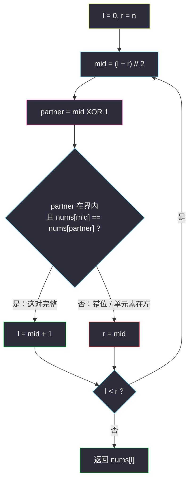
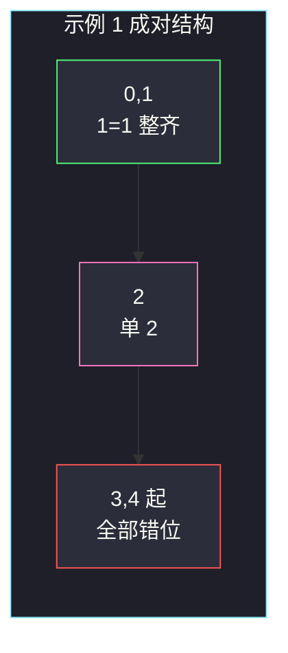

# 有序数组中的单一元素（成对结构上二分）

## 一、问题描述

给你一个只包含整数的**有序**数组 `nums`，其中每个元素都会出现**两次**，唯有一个数出现**一次**。请找出那个只出现一次的元素。

设计 `O(log n)` 时间、`O(1)` 空间的算法。

> 🔗 LeetCode 540：https://leetcode.cn/problems/single-element-in-a-sorted-array/
>
> 数据范围：`1 <= nums.length <= 10^5`，长度为**奇数**，`0 <= nums[i] <= 10^5`。恰好一个元素出现一次，其余均恰好两次。

**示例 1**

```
输入：nums = [1,1,2,3,3,4,4,8,8]
输出：2
```

**示例 2**

```
输入：nums = [3,3,7,7,10,11,11]
输出：10
```

**直观理解**

成对出现时，数组下标应是 `(偶, 奇)` 绑在一起：`nums[0]==nums[1]`，`nums[2]==nums[3]`，……。唯一的单元素会把后面所有对的下标**整体右移一位**，从某一对开始「偶数位 ≠ 后一个」。二分去找这个错位起点，那个偶数下标就是答案。

---

## 二、暴力解法

扫一遍，找第一个与左右都不相等的（或末尾落单）：

```python
class Solution:
    def singleNonDuplicate(self, nums: List[int]) -> int:
        n = len(nums)
        for i in range(n):
            left_ok = i == 0 or nums[i] != nums[i - 1]
            right_ok = i == n - 1 or nums[i] != nums[i + 1]
            if left_ok and right_ok:
                return nums[i]
        return -1
```

亦可用异或全体：`xor` 掉成对的，剩下单元素。时间仍是 `O(n)`。

### 复杂度

- **时间**：`O(n)`。`n = 10^5` 能过，但不满足题目的对数时间。
- **空间**：`O(1)`。

### 🔴 瓶颈在哪里

有序 + 「成对直到被单个打断」给出了下标上的单调性：错位只发生一次，左边成对整齐，右边全部错位。线性扫等于没用这层结构。主解必须 `O(log n)`。

---

## 三、优化探索（核心章节）

> 📚 本题在灵茶题单中属于 **二分算法 · 四、其他**（不是二分答案，而是利用「成对下标」的结构二分）。全程左闭右开 `[l, r)`。

### 3.1 成对时偶数下标的性质

没有单元素时（长度本该为偶），对每个偶数 `i`：`nums[i] == nums[i+1]`。插入一个单元素后长度变奇，设它落在下标 `p`：

- `i < p` 且 `i` 为偶：这对没被打扰，仍有 `nums[i] == nums[i+1]`；
- `i ≥ p` 且 `i` 为偶：右边的对整体右移，`nums[i] != nums[i+1]`（`i = p` 时自己就是单的；`i > p` 时偶数位对上的是下一对的「第二只」）。

因此：**偶数 mid 上，相等 → 单元素在 mid 右侧；不等 → 单元素在 mid 或左侧。**

### 3.2 把 mid 调成偶数；与 1 异或翻转最低位

`(l + r) // 2` 可能是奇数。`mid -= mid & 1` 清掉最低位，变成偶数；或 `mid ^= 1`：**偶数变奇数（搭档是后一个），奇数变偶数（搭档是前一个）**。比较 `nums[mid]` 与 `nums[mid ^ 1]`：

- 相等：当前这对完整，单元素在这对右边 → `l = mid + 1`；
- 不等：单元素在 mid 这一侧（含 mid）→ `r = mid`。

`mid ^ 1` 在 `mid = n-1`（最后一格，n 为奇故必为偶数）时等于 `n`，越界。越界视为「没有搭档」≠，会把 `r` 收到 `n-1`，正好落到末尾那个单元素。

| mid | mid ^ 1 | 含义 |
|-----|---------|------|
| 偶数 4 | 5 | 看后一个，标准成对 |
| 奇数 3 | 2 | 看前一个，仍是同一对 |
| n-1（偶） | n | 越界 = 末尾落单 |

这比 `if mid % 2: mid -= 1` 少一层分支，比较对象永远是「同一对里的另一只」。



### 3.3 左闭右开不变式

`[l, r)` 始终包住单元素的下标。相等说明 `mid` 所在那一对可以整段丢掉（`l = mid + 1`，即使 mid 是奇数，`mid+1` 也刚好跳到对的右边）。不等则单元素不在右侧，`r = mid`。结束时 `l == r` 不行——`while l < r` 结束时 `l` 就是那个下标，区间变成空的 `[l, l)`，答案已落在 `l`。

### 3.4 为何不能哈希 / 不能改数组

`O(1)` 空间排除了哈希表；`O(log n)` 排除了线性异或（异或是 `O(n)`）。必须吃「有序 + 成对」的下标规律。

### 3.5 一句话核心

> **偶数下标本该等于后一个；mid 与 1 异或找到搭档，相等则单元素在右，不等则在左。左闭右开收到空区间，`nums[l]` 即答案。**

---

## 四、代码实现

### Python（主解：O(log n) / O(1)）

```python
class Solution:
    def singleNonDuplicate(self, nums: List[int]) -> int:
        l, r = 0, len(nums)                     # 单元素下标 ∈ [l, r)
        while l < r:
            mid = (l + r) // 2
            partner = mid ^ 1                   # 翻转最低位：偶→+1，奇→-1
            if partner < len(nums) and nums[mid] == nums[partner]:
                l = mid + 1                     # 这对完整，去右边
            else:
                r = mid                         # 错位，去左边（含 mid）
        return nums[l]
```

调成偶数再比较的等价写法（同一套左闭右开）：

```python
class Solution:
    def singleNonDuplicate(self, nums: List[int]) -> int:
        l, r = 0, len(nums)
        while l < r:
            mid = (l + r) // 2
            mid -= mid & 1                      # 清最低位 → 偶数
            if mid + 1 < len(nums) and nums[mid] == nums[mid + 1]:
                l = mid + 2                     # 整对丢掉
            else:
                r = mid
        return nums[l]
```

第二种在 `mid` 被改小后仍用 `l = mid + 2` 收缩，区间同样严格变短（偶数 `mid >= l`，`mid+2 > l`）。两种都不要混用闭区间的 `r = mid - 1`。

**变量含义**

| 变量 | 含义 |
|------|------|
| `l`, `r` | 左闭右开，单元素下标在 `[l, r)` |
| `mid ^ 1` | 与 `mid` 同一对的搭档下标 |
| 相等 | 当前对完整，答案在更右边 |
| 不等 / 越界 | 答案在 `mid` 或左边 |

### Java（最优解同款）

```java
class Solution {
    public int singleNonDuplicate(int[] nums) {
        int l = 0, r = nums.length;              // [l, r)
        while (l < r) {
            int mid = l + (r - l) / 2;
            int partner = mid ^ 1;
            if (partner < nums.length && nums[mid] == nums[partner]) {
                l = mid + 1;
            } else {
                r = mid;
            }
        }
        return nums[l];
    }
}
```

---

## 五、具体例子演示

以示例 1 `nums = [1,1,2,3,3,4,4,8,8]`，`n = 9`。目标下标 2（值 2）。初始 `l = 0`，`r = 9`。

| 轮次 | l | r | mid | mid^1 | nums[mid], 搭档 | 相等? | 动作 |
|------|---|---|-----|-------|-----------------|-------|------|
| 1 | 0 | 9 | 4 | 5 | 3 与 4 | ✗ | `r = 4` |
| 2 | 0 | 4 | 2 | 3 | 2 与 3 | ✗ | `r = 2` |
| 3 | 0 | 2 | 1 | 0 | 1 与 1 | ✓ | `l = 2` |

`l == r == 2`，返回 `nums[2] = 2` ✓。

偶数视角：下标 0 处 `1==1`（单元素在右）；下标 2 处 `2!=3`（单元素就在 2 或左边）。二分在第 3 轮从左边把完整对 `(0,1)` 丢掉，夹出 2。

示例 2 `nums = [3,3,7,7,10,11,11]`，`n = 7`：

| 轮次 | l | r | mid | mid^1 | 比较 | 相等? | 动作 |
|------|---|---|-----|-------|------|-------|------|
| 1 | 0 | 7 | 3 | 2 | 7 与 7 | ✓ | `l = 4` |
| 2 | 4 | 7 | 5 | 4 | 11 与 10 | ✗ | `r = 5` |
| 3 | 4 | 5 | 4 | 5 | 10 与 11 | ✗ | `r = 4` |

返回 `nums[4] = 10` ✓。第 1 轮 mid=3 为奇数，`^1` 看前一个，确认 `(2,3)` 这对 7 完整，直接跳到 4 以后。

单元素在末尾 `[1,1,2]`：

| 轮次 | l | r | mid | mid^1 | 比较 | 动作 |
|------|---|---|-----|-------|------|------|
| 1 | 0 | 3 | 1 | 0 | 1==1 | `l = 2` |
| 2 | 2 | 3 | 2 | 3 | 越界，视为不等 | `r = 2` |

返回 `nums[2] = 2` ✓。

单元素在开头 `[2,3,3,4,4]`：

| 轮次 | l | r | mid | mid^1 | 比较 | 动作 |
|------|---|---|-----|-------|------|------|
| 1 | 0 | 5 | 2 | 3 | 3≠4 | `r = 2` |
| 2 | 0 | 2 | 1 | 0 | 3≠2 | `r = 1` |
| 3 | 0 | 1 | 0 | 1 | 2≠3 | `r = 0` |

返回 `nums[0] = 2` ✓。错位从下标 0 就开始，三次「不等」把右端一路收到 0。



---

## 六、复杂度分析

| 方法 | 时间 | 空间 | 说明 |
|------|------|------|------|
| 线性扫描 / 全体异或 | `O(n)` | `O(1)` | 不满足进阶 |
| 结构二分（主解） | `O(log n)` | `O(1)` | 每轮常数次比较，区间至少缩短 1 |

---

## 七、对比总结

| 维度 | 异或全体 | 本二分 |
|------|----------|--------|
| 利用有序 | 否 | 成对下标规律 |
| 时间 | `O(n)` | `O(log n)` |
| 空间 | `O(1)` | `O(1)` |

与「二分答案」的差别：这里二分的是**下标**，check 不是「某个数值可不可行」，而是「mid 所在那一对有没有错位」。单调性来自「错位只发生一次」：左边所有偶数位仍等于后一个，右边全部错开。

XOR 写法与「先把 mid 调成偶数」等价：前者比较 `nums[mid]` 与搭档，相等就 `l = mid + 1`（奇数 mid 时一步跨出这对；偶数 mid 时下一步还会再看那只奇数搭档）；后者直接 `l = mid + 2` 整对丢掉。区间种类不变，都是左闭右开。

**易错点**

1. **`mid ^ 1` 越界**：`partner == n` 时不能读 `nums[partner]`，先判 `partner < n`。
2. **相等时写成 `l = mid`**：完整对包含 `mid`，必须丢到 `mid + 1`（或偶数写法的 `mid + 2`），否则可能死循环。
3. **混用闭区间**：`r = mid - 1` 会把当前 `mid`（可能就是答案）扔掉。左闭右开配套的是 `r = mid`。
4. **用 `==` 比较相邻却不调偶数**：奇数 mid 的「后一个」是下一对的第一只，相等/不等含义反了；所以要么调偶数，要么用 `^ 1` 找真正的搭档。
5. **长度以为是偶数**：题目保证奇数；若自己构造测试，偶数长度没有单元素，算法不适用。

**模板（成对数组找单个，左闭右开）**

```python
l, r = 0, n
while l < r:
    mid = (l + r) // 2
    if mid ^ 1 < n and nums[mid] == nums[mid ^ 1]:
        l = mid + 1
    else:
        r = mid
return nums[l]
```

---

## 八、举一反三

| 题目 | 关系 |
|------|------|
| [136. 只出现一次的数字](https://leetcode.cn/problems/single-number/) | 无序版：全体异或，`O(n)` / `O(1)` |
| [137. 只出现一次的数字 II](https://leetcode.cn/problems/single-number-ii/) | 其余出现三次，位运算计数 |
| [260. 只出现一次的数字 III](https://leetcode.cn/problems/single-number-iii/) | 两个单元素，异或后按最低不同位分组 |
| [268. 丢失的数字](https://leetcode.cn/problems/missing-number/) | 有序/可排序时也可二分下标与值是否对齐 |
| [287. 寻找重复数](https://leetcode.cn/problems/find-the-duplicate-number/) | 值域二分或环；同样 `O(1)` 额外空间 |
| [153. 寻找旋转排序数组中的最小值](https://leetcode.cn/problems/find-minimum-in-rotated-sorted-array/) | 有序被「一处打断」，二分找分界 |
| [4. 寻找两个正序数组的中位数](https://leetcode.cn/problems/median-of-two-sorted-arrays/) | 有序结构上二分下标，不是二分答案 |

**思想迁移**

- 「几乎成对 / 几乎有序，只有一处异常」→ 异常点左边满足性质 A、右边不满足 → 二分下标。
- `x ^ 1` 是「翻转最低位」：偶数配对后一个、奇数配对前一个，写配对题时比 `if mid % 2` 更短。
- 口诀：**「偶位本该等于下一位；异或 1 找搭档，相等去右，不等去左。」**
