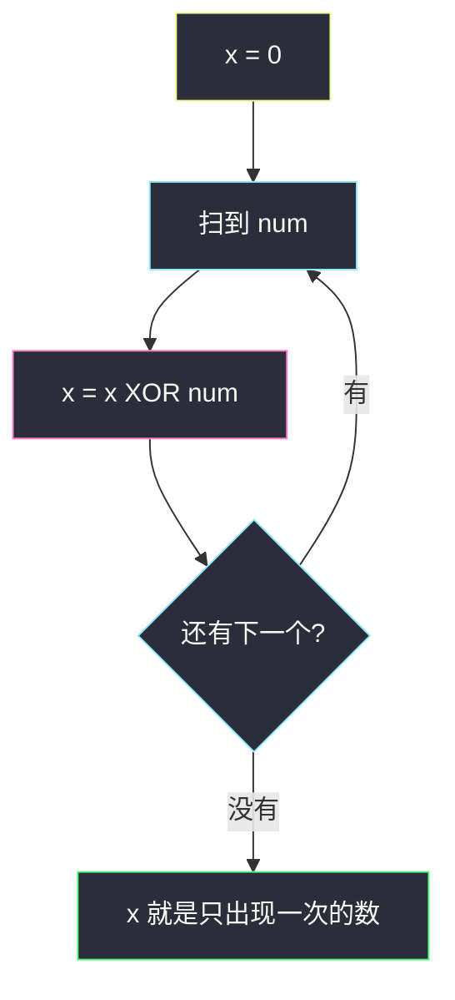
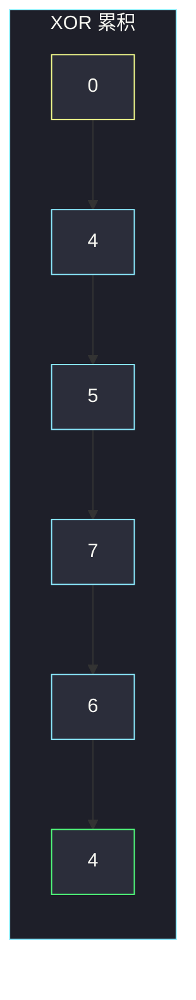

# 只出现一次的数字（全体 XOR）

## 一、问题描述

给你一个非空整数数组 `nums`：除了一个数字只出现**一次**，其余每个数字都恰好出现**两次**。找出那个只出现一次的数。要求线性时间、常数额外空间。

> 🔗 LeetCode 136：https://leetcode.cn/problems/single-number/
>
> 数据范围：`1 ≤ nums.length ≤ 3·10⁴`，数组长度必为奇数；`-3·10⁴ ≤ nums[i] ≤ 3·10⁴`。每个出现两次的元素恰好两次，恰好一个元素出现一次。
>
> 📚 灵茶题单：**九、其他**（无评分）。本题是异或（XOR）的入门：两次还原、交换律、结合律。哈希能过，但不满足常数空间，只能放暴力章。

**示例 1**

```
输入：nums = [2, 2, 1]
输出：1
```

**示例 2**

```
输入：nums = [4, 1, 2, 1, 2]
输出：4
解释：1 和 2 各出现两次，4 只出现一次。
```

**直观理解**

成对出现的数可以「对消」。异或正是按位对消：相同为 0、相异为 1。把全体数异或起来，成对的全部变成 0，剩下的就是只出现一次的那个。

---

## 二、暴力解法

哈希计数：出现次数为 1 的就是答案。

```python
class Solution:
    def singleNumber(self, nums: list[int]) -> int:
        cnt: dict[int, int] = {}
        for x in nums:
            cnt[x] = cnt.get(x, 0) + 1
        for x, c in cnt.items():
            if c == 1:
                return x
        return 0
```

排序后扫相邻对也可以：`O(n log n)` 时间、若原地排序则 `O(1)` 额外空间，但时间不是线性。

### 🔴 瓶颈在哪里

哈希是 `O(n)` 空间，题目明确要常数空间。排序不满足线性时间。真正该用的是异或的三条代数性质，不需要记任何数。

---

## 三、优化探索（核心章节）

> 📚 灵茶题单位运算模板：先写清性质，再写代码。本题只用 XOR。

### 3.1 XOR 的三条性质

把 `^` 看成按位「不进位加法」，每一位独立：

| 性质 | 式子 | 含义 |
|------|------|------|
| 自反消元 | `a ^ a = 0` | 同一个数异或两次变成 0 |
| 单位元 | `a ^ 0 = a` | 和 0 异或不变 |
| 交换 / 结合 | `a ^ b = b ^ a`，`(a ^ b) ^ c = a ^ (b ^ c)` | 顺序无所谓 |

「两次还原」：`(x ^ y) ^ y = x ^ (y ^ y) = x ^ 0 = x`。成对出现的数，无论夹在数组哪，最终都会把自己消掉。

### 3.2 全体异或

令答案为 `t`，其余数两两成对。由交换律把相同的凑到一起：

```
nums[0] ^ nums[1] ^ … ^ nums[n-1]
  = (a ^ a) ^ (b ^ b) ^ … ^ t
  = 0 ^ 0 ^ … ^ t
  = t
```

实现就是一个累加器 `x = 0`，对每个数做 `x ^= num`。



每一位独立：某一 bit 上，成对的 1 出现偶数次，异或后为 0；答案在该位是 1 当且仅当该位被「单身」数贡献了奇数次 1。以 `[4, 1, 2, 1, 2]` 的最低三位为例：

| 位权 | 4=`100` | 1=`001` | 2=`010` | 1=`001` | 2=`010` | 该位 XOR |
|------|---------|---------|---------|---------|---------|----------|
| 4 | 1 | 0 | 0 | 0 | 0 | 1 |
| 2 | 0 | 0 | 1 | 0 | 1 | 0 |
| 1 | 0 | 1 | 0 | 1 | 0 | 0 |

三位拼回 `100₂ = 4`。不必按值分组，按位看已经能读出答案。

### 3.3 一句话核心

> **全体异或：成对的 `a ^ a = 0` 全部消掉，剩下 `0 ^ t = t`。**

---

## 四、代码实现

### Python（主解：一次遍历 XOR）

```python
class Solution:
    def singleNumber(self, nums: list[int]) -> int:
        x = 0
        for num in nums:
            x ^= num
        return x
```

也可以写成 `return functools.reduce(operator.xor, nums, 0)`，面试还是循环更直观。

**变量含义**

| 写法 | 含义 |
|------|------|
| `x` | 到目前为止所有已扫元素的异或 |
| `x ^= num` | 把 `num` 并入累积；若它是第二次出现，会把第一次贡献清掉 |

负数按补码参与按位运算，Python 无限精度下 `^` 对符号位同样成立，本题范围内无需特判。

---

## 五、具体例子演示

**示例 2**：`nums = [4, 1, 2, 1, 2]`。用 3 位二进制跟踪累积 `x`：

| 步 | num | num 二进制 | 操作 | x 二进制 | x |
|----|-----|-----------|------|---------|---|
| 初 | — | — | `x = 0` | `000` | 0 |
| 1 | 4 | `100` | `000 XOR 100` | `100` | 4 |
| 2 | 1 | `001` | `100 XOR 001` | `101` | 5 |
| 3 | 2 | `010` | `101 XOR 010` | `111` | 7 |
| 4 | 1 | `001` | `111 XOR 001` | `110` | 6 |
| 5 | 2 | `010` | `110 XOR 010` | `100` | **4** |

第 4 步把第一次的 1 消掉（`111 XOR 001 = 110`），第 5 步把 2 消掉，剩下 `100₂ = 4`。



**示例 1**：`[2, 2, 1]`。`0 XOR 2 = 2`，`2 XOR 2 = 0`，`0 XOR 1 = 1`。前两个对消，留下 1。

**边界**：只有一个元素 `[7]` → 7；负数 `[-1, -1, 2]` → 2。交换任意两项，结合律保证结果不变。

---

## 六、复杂度分析

| 方法 | 时间 | 空间 | 说明 |
|------|------|------|------|
| 哈希计数 | `O(n)` | `O(n)` | 不满足常数空间 |
| 排序后扫对 | `O(n log n)` | `O(1)` 额外 | 不满足线性时间 |
| 全体 XOR（主解） | `O(n)` | `O(1)` | 一次遍历，一个累加器 |

---

## 七、对比总结

| 维度 | 哈希 | 排序 | XOR |
|------|------|------|-----|
| 时间 | 线性 | 超线性 | 线性 |
| 额外空间 | 线性 | 常数 | 常数 |
| 依赖的性质 | 计数 | 相邻相等 | `a^a=0`、`a^0=a` |
| 能否扩展到「出现三次」 | 能 | 能 | 要改成「每一位 mod 3」，见 137 题 |

**易错点**

1. **用哈希当主解**：能 AC，但空间不符题意。
2. **初始化成 `nums[0]` 再从下标 1 扫**：也对，但漏写空数组保护；初始化 0 更干净（本题非空）。
3. **和「出现两次的找出来」搞反**：本题找的是出现一次的；全体 XOR 给出的就是它。
4. **以为负数不能 XOR**：补码下按位运算照常。
5. **写成加减抵消**：`sum(set)*2 - sum(nums)` 也对，但用了集合，空间不是常数，且有溢出风险（其它语言）。

---

## 八、举一反三

| 题目 | 关系 |
|------|------|
| [137. 只出现一次的数字 II](https://leetcode.cn/problems/single-number-ii/) | 其余出现三次：按位统计 mod 3，或数字电路态 |
| [260. 只出现一次的数字 III](https://leetcode.cn/problems/single-number-iii/) | 两个单身数：全体 XOR 得 `t1^t2`，再按某一位分组 |
| [268. 丢失的数字](https://leetcode.cn/problems/missing-number/) | `0..n` 与数组全体 XOR，缺的那个留在累积里 |
| [389. 找不同](https://leetcode.cn/problems/find-the-difference/) | 两串字符全体 XOR，多出来的那个字符 |
| [136 的「出现两次」对偶：287. 寻找重复数](https://leetcode.cn/problems/find-the-duplicate-number/) | 不能改数组时换快慢指针，XOR 不够用 |

**思想迁移**

- 出现偶数次 → XOR 消掉；出现奇数次 → XOR 留下。
- 口诀：**「全体异或，成对归零，单身留下。」**
