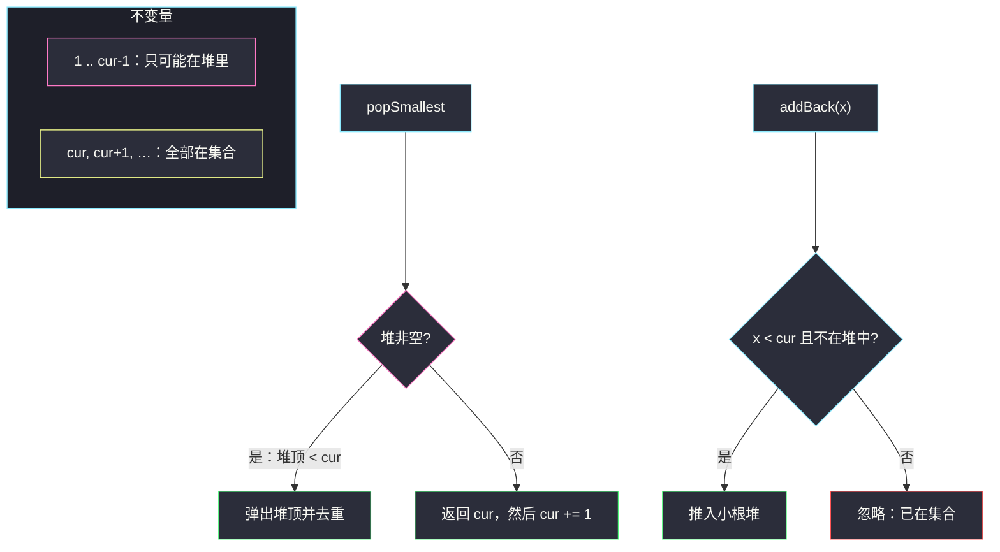
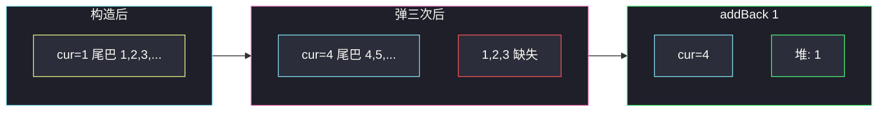

# 无限集中的最小数字（堆 · 设计题）

## 一、问题描述

设计一个数据结构，表示「当前还在集合里的全体正整数」，支持：

- `SmallestInfiniteSet()`：集合初始化为 `{1, 2, 3, …}`。
- `int popSmallest()`：弹出并返回当前集合中的**最小**整数。
- `void addBack(int num)`：若 `num` 已在集合中，什么也不做；否则把它加回去。

> 🔗 LeetCode 2336：https://leetcode.cn/problems/smallest-number-in-infinite-set/
>
> 数据范围：`1 <= num <= 1000`，`popSmallest` 与 `addBack` 一共最多 1000 次。

**示例**

```
SmallestInfiniteSet()
addBack(2)          # 2 本来就在，忽略
popSmallest() → 1
popSmallest() → 2
popSmallest() → 3
addBack(1)          # 1 被弹出过，加回
popSmallest() → 1
popSmallest() → 4
popSmallest() → 5
```

**直观理解**

正整数无穷多，不能真的放进哈希表。集合永远长这样：

- 有一个起点 `cur`：所有 `≥ cur` 的数都还在（从未被弹出，或不必记）；
- `cur` 左边，只有「弹出后又 `addBack` 回来」的那几个小数，数量 ≤ 操作次数。

弹出最小值：先看加回来的小数里有没有比 `cur` 更小的；没有就取 `cur` 并把 `cur` 加一。

---

## 二、暴力解法

用有序集合（TreeSet / `SortedList`）真的存「当前在集合里的数」。初始化塞进 1..1000+操作次数的上界也行，因为 `num ≤ 1000` 且最多弹 1000 次，当前最小值不会超过大约 2000。

```python
from sortedcontainers import SortedList

class SmallestInfiniteSet:
    def __init__(self):
        self.s = SortedList(range(1, 2005))

    def popSmallest(self) -> int:
        return self.s.pop(0)

    def addBack(self, num: int) -> None:
        if num not in self.s:
            self.s.add(num)
```

LeetCode 未必有 `sortedcontainers`。用 `set` + 每次 `min(s)` 也能过本题数据，但每次弹出 `O(n)`。

### 复杂度（每次 `min`）

- **时间**：单次 `popSmallest` 最坏 `O(n)`，总操作 1000 能过，数据变大就炸。
- **空间**：`O(上界)`。

### 🔴 瓶颈在哪里

真正无穷的那一段是连续正整数，没必要存。只存「被挖掉的洞」和「填回来的小数」，无穷尾巴用一个指针 `cur` 表示。

---

## 三、优化探索（核心章节）

> 📚 本题在灵茶题单中属于 **堆 · §5.1 基础**。堆用来维护「加回来且小于 cur 的数」，反复取最小值。

### 3.1 不变量

任意时刻把正整数分成三段：

| 区间 | 状态 | 怎么存 |
|------|------|--------|
| `< cur` 且曾弹出、未加回 | 不在集合 | 不存（缺席） |
| `< cur` 且已 addBack | 在集合 | 小根堆 + 去重集合 |
| `≥ cur` | 全在集合 | 只记一个 `cur` |

因此：

- 当前最小值要么是堆顶（加回来的小数），要么是 `cur`。
- 堆里的数**严格小于 `cur`**（addBack 时若 `num ≥ cur` 说明它还在无穷尾巴上，直接忽略）。



### 3.2 各 API 职责

**构造函数**

- `cur = 1`：`[1, +∞)` 都在。
- `hp = []`，`in_hp = set()`：还没有加回的洞。

**`popSmallest`**

1. 若堆非空：堆顶就是当前最小（不变量保证 `< cur`）。弹出，从 `in_hp` 删掉，返回。
2. 否则：集合最小是 `cur`。返回它，`cur += 1`（这个数暂时离开集合）。

若采用「懒删除」把 `≥ cur` 的脏数据也丢进堆，弹出时要 `while 堆顶 ≥ cur: 丢弃`。下面主解在 `addBack` 入口就把住，堆里不会有脏数据。

**`addBack(x)`**

- `x ≥ cur`：`x` 还在尾巴上，已在集合 → 忽略。
- `x` 已在 `in_hp`：已经加回过 → 忽略。
- 否则：`x` 曾经被弹出且当前不在集合，推入堆并记入 `in_hp`。

### 3.3 为什么堆还要配 set

同一 `x` 可能被 `addBack` 两次。小根堆不能 `O(1)` 查重，必须用哈希集合。弹出时两边一起删。Java 可用 `TreeSet` 一个结构同时有序 + 去重。

### 3.4 一句话核心

> **`cur` 代表无穷尾巴的左端；被挖走又填回的小数放小根堆；pop 先堆后 cur，addBack 只接收 `x < cur` 且不在堆中的数。**

---

## 四、代码实现

### Python（主解）

```python
class SmallestInfiniteSet:
    def __init__(self):
        self.cur = 1           # [cur, +∞) 都在集合中
        self.hp = []           # 加回的、且 < cur 的数（小根堆）
        self.in_hp = set()     # 与 hp 同步，用于去重

    def popSmallest(self) -> int:
        if self.hp:
            x = heapq.heappop(self.hp)
            self.in_hp.remove(x)
            return x
        x = self.cur
        self.cur += 1
        return x

    def addBack(self, num: int) -> None:
        if num < self.cur and num not in self.in_hp:
            heapq.heappush(self.hp, num)
            self.in_hp.add(num)
```

**字段不变量**

| 字段 | 不变量 |
|------|--------|
| `cur` | 从未弹出、或弹出后等价于「尾巴左端」的最小正整数；`[cur, +∞)` ⊆ 集合 |
| `hp` | 恰为集合 ∩ `{1, 2, …, cur-1}`，小根堆 |
| `in_hp` | 与 `hp` 元素相同 |

### Java（TreeSet，最优同款逻辑）

```java
class SmallestInfiniteSet {
    private int cur = 1;
    private final TreeSet<Integer> back = new TreeSet<>();

    public int popSmallest() {
        if (!back.isEmpty()) {
            return back.pollFirst();
        }
        return cur++;
    }

    public void addBack(int num) {
        if (num < cur) {
            back.add(num);   // TreeSet 自动去重
        }
    }
}
```

`TreeSet.add` 已在集合中时是空操作。逻辑与堆版一致：`back` 里的数都 `< cur`。

---

## 五、具体例子演示

逐步跟踪官方调用序列。堆内容按**逻辑升序**写出（堆顶 = 最左）。

| 调用 | cur（调用前） | 堆 / in_hp | 动作 | 返回 | cur / 堆（调用后） |
|------|---------------|------------|------|------|-------------------|
| 构造 | 1 | `[]` | 尾巴从 1 起 | — | cur=1，`[]` |
| `addBack(2)` | 1 | `[]` | 2 ≥ 1，已在尾巴 | — | 不变 |
| `popSmallest` | 1 | `[]` | 堆空，取 cur | **1** | cur=2，`[]` |
| `popSmallest` | 2 | `[]` | 取 cur | **2** | cur=3 |
| `popSmallest` | 3 | `[]` | 取 cur | **3** | cur=4 |
| `addBack(1)` | 4 | `[]` | 1 < 4，推入 | — | 堆=`[1]` |
| `popSmallest` | 4 | `[1]` | 弹堆顶 | **1** | cur=4，`[]` |
| `popSmallest` | 4 | `[]` | 取 cur | **4** | cur=5 |
| `popSmallest` | 5 | `[]` | 取 cur | **5** | cur=6 |

输出 `[null, 1, 2, 3, null, 1, 4, 5]` ✓。

再看「加回已在堆中」：cur=4，堆=`[1]` 时再 `addBack(1)`，`in_hp` 已有 1，忽略，避免堆里两个 1 导致连弹两次。



---

## 六、复杂度分析

设操作次数为 `q`（本题 `q ≤ 1000`），堆里最多 `q` 个加回数。

| 方法 | 单次 pop | 单次 addBack | 空间 |
|------|----------|-------------|------|
| 每次扫 set 取 min | `O(q)` | `O(1)` | `O(q)` |
| 小根堆 + set（主解） | `O(log q)` | `O(log q)` | `O(q)` |
| TreeSet | `O(log q)` | `O(log q)` | `O(q)` |

构造 `O(1)`，不必把无穷集合物化。空间只跟「加回且尚未再弹出」的个数成正比。

---

## 七、对比总结

| 维度 | 物化有限前缀 | cur + 堆 |
|------|--------------|----------|
| 无穷尾巴 | 要估上界塞进去 | 一个整数 `cur` |
| 最小值 | 有序容器 / 扫描 | 堆顶 vs `cur` 二选一 |
| addBack 已在集合 | 查 set | `x ≥ cur` 或已在堆 |

**易错点**

1. **`addBack(x)` 在 `x ≥ cur` 时仍入堆**：堆顶可能 ≥ `cur`，和下一次「取 cur」重复弹出同一个数。
2. **堆不去重**：连续两次 `addBack(1)` 会弹两次 1。
3. **弹出堆顶后忘了从 set 删除**：之后再也加不回这个数。
4. **`pop` 时 `cur += 1` 却同时把 cur 推进堆**：没有这个步骤；cur 只在走尾巴时自增。
5. **把「缺失集合」和「加回堆」搞反**：缺席的数不存；只存加回来的。

**模板（§5.1 堆维护动态最小值）**

```python
# 无穷连续段用指针；被删又插回来的用小根堆
if hp:
    return heappop(hp)
x, cur = cur, cur + 1
return x
```

同类反复取最值见 `maximal-score-after-applying-k-operations.md`。

---

## 八、举一反三

| 题目 | 关系 |
|------|------|
| [1845. 座位预约管理系统](https://leetcode.cn/problems/seat-reservation-manager/) | 同样「指针 + 小根堆」管空座位 |
| [703. 数据流中的第 K 大元素](https://leetcode.cn/problems/kth-largest-element-in-a-stream/) | §5.1 设计题：堆维护动态第 K |
| [295. 数据流的中位数](https://leetcode.cn/problems/find-median-from-data-stream/) | 双堆设计题 |
| [2530. 执行 K 次操作后的最大分数](https://leetcode.cn/problems/maximal-score-after-applying-k-operations/) | 同目录 `maximal-score-after-applying-k-operations.md`：反复取堆顶 |
| [855. 考场就座](https://leetcode.cn/problems/exam-room/) | 有序集合维护可坐位置 |

**思想迁移**

- 「几乎全体整数都在，只有少量插入/删除」→ 连续段用指针，例外放堆 / TreeSet。
- 口诀：**「尾巴用 cur 一把抓；加回的小数进堆；pop 先看堆，空了再啃 cur。」**
