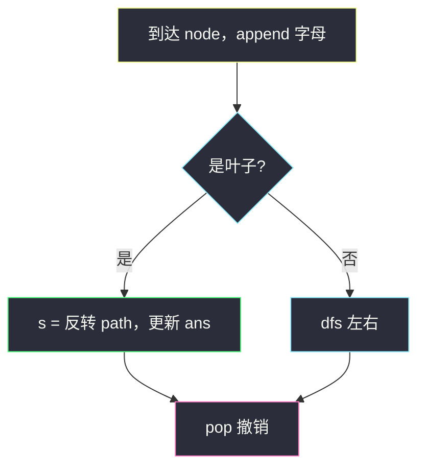
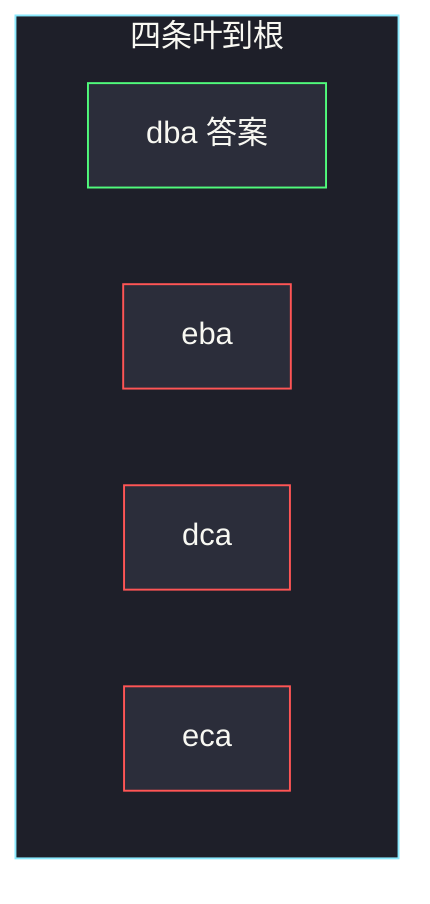

# 从叶结点开始的最小字符串（自顶向下 · 叶子处整串比较）

## 一、问题描述

二叉树每个节点值在 `[0, 25]`，对应字母 `a`–`z`。从某个**叶**走到**根**得到一个字符串，返回这些字符串里字典序最小的那一个。

字典序规则与 Python 比较字符串相同：逐位比到分出大小；若一方是另一方的前缀，**更短的更小**（`"ab" < "aba"`）。更短**不一定**更小：`"ba" > "az"`。

> 🔗 LeetCode 988：https://leetcode.cn/problems/smallest-string-starting-from-leaf/
>
> 数据范围：节点数 `[1, 8500]`，`0 ≤ Node.val ≤ 25`。
>
> 📚 灵茶题单：**二叉树 · §2.2 自顶向下 DFS（先序遍历）**（1429 分）。

**示例 1**

```
输入：root = [0,1,2,3,4,3,4]
输出："dba"
树形（括号内是字母）：
        0(a)
       / \
     1(b) 2(c)
    / \   / \
  3(d) 4(e) 3(d) 4(e)
叶→根：dba、eba、dca、eca。最小是 dba。
```

**示例 2**

```
输入：root = [25,1,3,1,3,0,2]
输出："adz"
        25(z)
       / \
     1(b) 3(d)
    / \   / \
  1(b) 3(d) 0(a) 2(c)
叶→根：bbz、dbz、adz、cdz。最小是 adz。
```

**直观理解**

结果串的**第一位是叶子**，最后一位是根。DFS 从根往下走时，路径是反着的：先压根，最后压叶。所以只在叶子处把路径反过来，拿去和当前答案比。这是 §2.2：祖先（整条根到当前点的路径）当参数往下传。

---

## 二、暴力解法

收集所有叶→根字符串，再 `min`：

```python
class Solution:
    def smallestFromLeaf(self, root: Optional[TreeNode]) -> str:
        strs = []

        def dfs(node: Optional[TreeNode], path: list[str]) -> None:
            if node is None:
                return
            path.append(chr(ord("a") + node.val))
            if node.left is None and node.right is None:
                strs.append("".join(reversed(path)))
            else:
                dfs(node.left, path)
                dfs(node.right, path)
            path.pop()

        dfs(root, [])
        return min(strs)
```

叶子最多 `O(n)` 个，每个串最长 `O(n)`（一条链），可能存下 `O(n²)` 的字符。`n = 8500` 的链没事（只有 1 个串），但「又宽又深」时浪费明显。

### 复杂度

- **时间**：所有路径字符数之和，最坏 `O(n²)`。
- **空间**：存全部字符串，最坏 `O(n²)`。

### 🔴 瓶颈在哪里

只要记住当前最小串。每到一片叶子，构造这一条、比一次、丢掉路径上多出来的那一位（回溯 `pop`）。空间降到「一条路径 + 一个答案串」。

---

## 三、优化探索（核心章节）

> 📚 本题在灵茶题单中属于 **二叉树 · §2.2 自顶向下 DFS（先序遍历）**。祖先信息是「根到当前点的字符列表」；先序走到叶子才产生候选答案。回溯：选择（append）→ 递归 → 撤销（pop）。

### 3.1 只在叶子更新

内部节点对应的串还没到叶，不是题目要的对象。哪怕当前前缀看起来很大，下面也可能接到一个很小的叶（结果串以叶字母开头）。

反例：根是 `z`，左叶 `b`，右子再下一片叶 `a`——答案以 `a` 开头，必须走完右枝才知道。

### 3.2 必须整串比较

两条常见错觉：

- 「更短一定更小」：`"b"` 和 `"az"`，短的反而大。
- 「根这边的字母小就更好」：结果串从叶读起，根是最后一位，几乎不能用来剪枝。

所以叶子处老老实实 `s = "".join(reversed(path))`，再和 `ans` 比。

### 3.3 空串不能当初始答案

`min("", "dba") == ""`。`ans` 初始用 `None`，第一次在叶子赋值。



### 3.4 一句话核心

> **根到叶路径用列表带着走；只在叶子反转整串，和答案比字典序，然后 pop 撤销。**

---

## 四、代码实现

### Python（主解：路径列表 + 回溯）

```python
class Solution:
    def smallestFromLeaf(self, root: Optional[TreeNode]) -> str:
        ans = None
        path = []

        def dfs(node: Optional[TreeNode]) -> None:
            nonlocal ans
            if node is None:
                return
            path.append(chr(ord("a") + node.val))
            if node.left is None and node.right is None:
                s = "".join(reversed(path))
                if ans is None or s < ans:
                    ans = s
            else:
                dfs(node.left)
                dfs(node.right)
            path.pop()

        dfs(root)
        return ans
```

**变量含义**

| 写法 | 含义 |
|------|------|
| `path` | 根 → 当前点的字母，末尾是当前节点 |
| `"".join(reversed(path))` | 叶 → 根的候选串 |
| `path.pop()` | 回溯撤销，左右孩子共享一块列表 |

单节点树：根也是叶，`path` 一个字母，反转后仍是它。

### Java（可选）

```java
class Solution {
    private String ans;
    private StringBuilder path = new StringBuilder();

    public String smallestFromLeaf(TreeNode root) {
        dfs(root);
        return ans;
    }

    private void dfs(TreeNode node) {
        if (node == null) return;
        path.append((char) ('a' + node.val));
        if (node.left == null && node.right == null) {
            String s = new StringBuilder(path).reverse().toString();
            if (ans == null || s.compareTo(ans) < 0) {
                ans = s;
            }
        } else {
            dfs(node.left);
            dfs(node.right);
        }
        path.deleteCharAt(path.length() - 1);
    }
}
```

---

## 五、具体例子演示

**示例 1**：先序走四条根→叶，只在叶子反转。

```
        0(a)
       / \
     1(b) 2(c)
    / \   / \
  3(d) 4(e) 3(d) 4(e)
```

| 步骤 | 动作 | path（根→当前） | 叶→根串 | ans |
|------|------|-----------------|---------|-----|
| 1 | 入 0，append a | `[a]` | — | None |
| 2 | 入 1，append b | `[a,b]` | — | |
| 3 | 入 3，叶子 | `[a,b,d]` | `dba` | **dba** |
| 4 | pop d，入 4，叶子 | `[a,b,e]` | `eba` | dba（eba 更大） |
| 5 | pop e、b，入 2 | `[a,c]` | — | |
| 6 | 入 3，叶子 | `[a,c,d]` | `dca` | dba（dca 更大） |
| 7 | pop d，入 4，叶子 | `[a,c,e]` | `eca` | dba |

四次更新只发生在叶子；内部的 `ab`、`ac` 从不参与比较。



**示例 3**：`[2,2,1,null,1,0,null,0]`，用来钉死「前缀更短」和「必须走完叶子」。

```
      2(c)
     / \
    2(c) 1(b)
     \  /
     1(b) 0(a)
    /
   0(a)
```

| 叶子 | 叶→根 | 比较 |
|------|--------|------|
| 最左下 0 | `abcc` | 先记下 |
| 右子下的 0 | `abc` | `"abc" < "abcc"`，更新 |

`abc` 是 `abcc` 的前缀，更短的赢。若有一条 `"b"`，它比 `"abc"` 大，短反而输——所以不能「长度小就当答案」。

---

## 六、复杂度分析

| 方法 | 时间 | 空间 | 说明 |
|------|------|------|------|
| 收集全部再 min | `O(n²)` | `O(n²)` | 存所有串 |
| 叶子处更新（主解） | `O(n²)` | `O(n)` | 每片叶子 `join` 要 `O(h)`；栈 + path 为 `O(h)`，`h ≤ n ≤ 8500` |

时间最坏仍是 `O(n²)`（链上一个叶子也要拷 `n` 个字符；完全二叉树叶子多为 `n/2`、深度 `log n`，合计 `O(n log n)`）。构造串不可避免，省的是那份全量存储。

---

## 七、对比总结

| 维度 | 本题 | #1448 好节点 | #1325 删叶子 |
|------|------|--------------|--------------|
| 模板 | §2.2 先序 + 路径 | §2.2 先序 + 路上最大值 | §2.4 后序删点 |
| 何时用祖先 | 叶子处反转整串 | 每个点当场判断 | 不看祖先，看孩子 |
| 回溯 | 要，path 共享 | 参数传递即可 | 返回值接指针 |

**易错点**

1. **`ans` 初始化成空串**：空串比任何候选都小，会直接交白卷。
2. **在非叶子更新**：得到的是「从某内部点到根」，缺了叶这边的字母，第一位就错。
3. **忘了反转**：根→叶的串字典序和题意完全不同（示例 1 会变成 `abd` 而不是 `dba`）。
4. **只比长度或只比首字母**：`"ab"` 对 `"aba"` 短的小；`"b"` 对 `"az"` 短的大。必须整串。
5. **忘了 pop**：左枝的字母残留到右枝，串会错位。
6. **单边空孩子**：`if not left and not right` 才是叶子；只有一边空时另一边还要继续走。

---

## 八、举一反三

| 题目 | 关系 |
|------|------|
| [257. 二叉树的所有路径](https://leetcode.cn/problems/binary-tree-paths/) | 同样 path + 回溯，叶子处记录根→叶 |
| [129. 求根节点到叶节点数字之和](https://leetcode.cn/problems/sum-root-to-leaf-numbers/) | 先序把路上数字往下传，叶子处累加 |
| [113. 路径总和 II](https://leetcode.cn/problems/path-sum-ii/) | 回溯记路径，叶子处按和筛选 |
| [1448. 统计二叉树中好节点的数目](https://leetcode.cn/problems/count-good-nodes-in-binary-tree/) | 同节先序，参数更轻（一个最大值）。见 `count-good-nodes-in-binary-tree.md` |
| [112. 路径总和](https://leetcode.cn/problems/path-sum/) | 往下传剩余和，不必存整条 path |

**思想迁移**

- 答案依赖「根到当前的整条链」→ 列表带着走，回溯撤销。
- 字符串从叶读起 → 只在叶子 `reversed` 后比较。
- 口诀：**「路上 append；叶子反转比一把；回来 pop。」**
