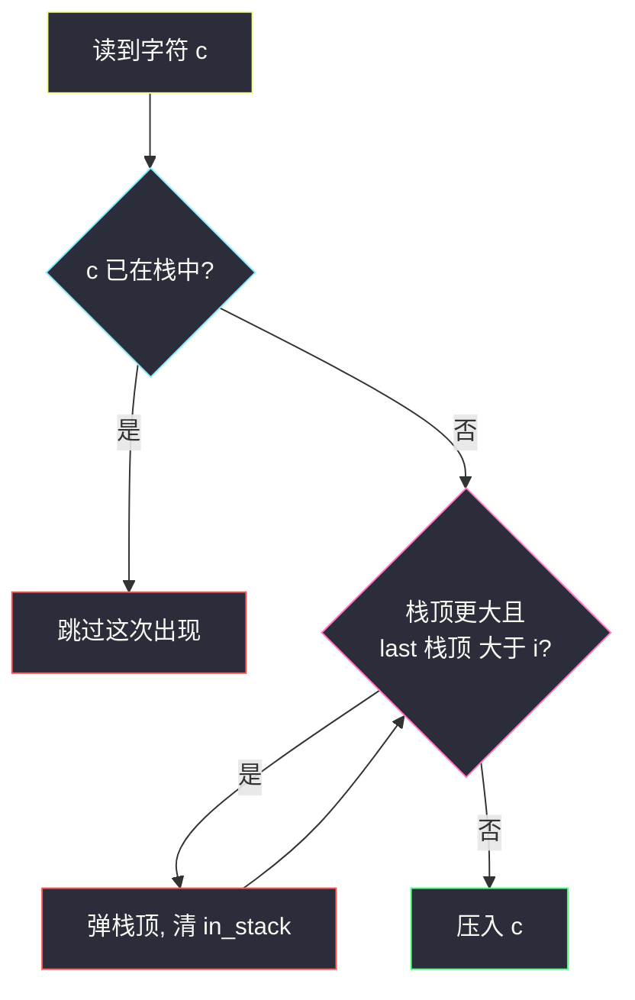
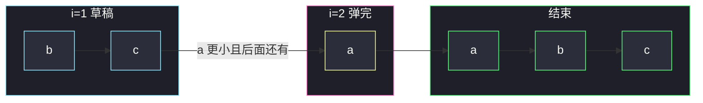

# 不同字符的最小子序列（单调栈 · 后面还有就能弹）

## 一、问题描述

返回 `s` 的一个子序列，满足：

1. 原串里出现过的每种字符**恰好一次**；
2. 所有这样的子序列里，字典序**最小**。

子序列要保持相对顺序，不能打乱。本题与 [#316 去除重复字母](https://leetcode.cn/problems/remove-duplicate-letters/) **完全同一题**，只是题面措辞不同。

> 🔗 LeetCode 1081：https://leetcode.cn/problems/smallest-subsequence-of-distinct-characters/
>
> 数据范围：`1 <= s.length <= 1000`，`s` 只含小写字母。
>
> 📚 灵茶题单：**单调栈 · 316分 · 四、最小字典序**。口诀就是「当前更小、且栈顶后面还出现，则弹栈」。

**示例 1**

```
输入：s = "bcabc"
输出："abc"
```

**示例 2**

```
输入：s = "cbacdcbc"
输出："acdb"
```

**示例 3**

```
输入：s = "cdadabcc"
输出："adbc"
```

**直观理解**

每个字符必须留一次，多出来的要丢掉。丢掉谁、留谁，看字典序：能让答案更靠前的，就尽早把大的踢掉。但踢之前要确认**这个大的后面还出现**——否则踢了就再也拼不齐。栈里从底到顶就是当前答案草稿，单调不降（更小的往前挤）。

---

## 二、暴力解法

每种字符选一个出现位置，枚举所有「每种恰好一次」的递增下标组合，拼出字符串，取字典序最小的。`s` 最长 1000、字符集 26，组合数是各字符频次的乘积，最坏每个字母都出现很多次时指数爆炸。

真正可用的暴力是：按位置递增挑一个子集，字符集合等于 `set(s)` 且无重复，再取字典序最小。`n = 1000` 时 `2^n` 不可做。

```python
class Solution:
    def smallestSubsequence(self, s: str) -> str:
        need = set(s)
        best, n = None, len(s)

        def dfs(i: int, path: list, seen: set) -> None:
            nonlocal best
            if seen == need:
                t = "".join(path)
                if best is None or t < best:
                    best = t
                return
            if i == n:
                return
            dfs(i + 1, path, seen)                 # 不选 s[i]
            if s[i] not in seen:
                path.append(s[i])
                seen.add(s[i])
                dfs(i + 1, path, seen)
                seen.remove(s[i])
                path.pop()

        dfs(0, [], set())
        return best
```

### 复杂度

- **时间**：子集枚举 `O(2^n · n)`，必超时。
- **空间**：`O(n)`。

### 🔴 瓶颈在哪里

「字典序最小 + 每种恰好一次 + 保持相对顺序」并不需要枚举。从左到右贪心：栈里已经是一份草稿；新字符若比栈顶小，且栈顶这个字符**后面还有**，栈顶就可以弹掉、把更小的挤到前面。每个字符进栈、出栈各至多一次，`O(n)`。

---

## 三、优化探索（核心章节）

> 📚 对齐灵神 **四、最小字典序**。模板：**单调栈存字符（或下标）**；弹栈条件不是「比栈顶小就弹」，而是「比栈顶小 **并且** 栈顶后面还会再出现」。

### 3.1 三个数组各管一件事

| 结构 | 作用 |
|------|------|
| `last[c]` | 字符 `c` 最后一次出现的下标。问「后面还有没有」就看 `last[c] > i` |
| `in_stack[c]` | `c` 现在在不在栈里。已经在里面就跳过（每种最多留一次） |
| `stack` | 答案草稿。底是最左边留下的字符，顶是最近留下的 |

`last` 先扫一遍即可。之后再扫一遍做栈。

### 3.2 弹栈条件（必须写死）

读到 `s[i] = c`：

1. 若 `c` 已在栈中：丢掉这次出现（后面再出现也一样会被跳过，因为已经留过一次）。
2. 否则，当栈非空、`c < 栈顶`、且 `last[栈顶] > i`：弹出栈顶，并把它的 `in_stack` 清掉。
3. 把 `c` 压栈，标记 `in_stack[c] = True`。

「后面还有」是安全阀：没有它，`"bcac"` 会把唯一的 `b` 弹掉，答案缺字母。



### 3.3 为什么弹完一定字典序更优

栈里是当前合法草稿。新字符 `c` 比栈顶小，说明如果栈顶还能在后面补回来，现在把栈顶拿掉、让 `c` 往前站，前缀会变小。一直弹到不能弹为止（栈顶更小，或栈顶是最后一次），再压 `c`。这就是「能弹就弹」的字典序贪心。

反例帮助记忆：`s = "cbacdcbc"`，正确答案是 `"acdb"` 不是 `"adbc"`。扫到 `b` 时栈是 `['a','c','d']`，`b < d` 但 `d` 的最后下标是 4、当前已经走到 6，`d` **后面没有了**，不能弹。于是 `c` 被挡在 `d` 后面，不会误弹成 `"adbc"`。

### 3.4 不变式

扫完位置 `i` 之后：

- 栈里字符两两不同，都在 `s[0..i]` 里出现过。
- 栈从底到顶的字符顺序，是 `s[0..i]` 某个合法子序列（保持相对顺序）。
- 对栈里每个非栈顶字符，它后面（到 `i` 为止）没有更小的、可以把他挤掉且还能补回来的机会——否则已经被弹了。
- 还没进栈的字符，要么还没出现，要么已经进过又被弹掉（后面一定还有）。

### 3.5 一句话核心

> **当前字符更小、且栈顶这个字符后面还会出现，就弹栈。`last[]` 管「后面还有」，`in_stack[]` 管去重。**

---

## 四、代码实现

### Python（主解：last + 单调栈）

```python
class Solution:
    def smallestSubsequence(self, s: str) -> str:
        last = {c: i for i, c in enumerate(s)}
        stack = []
        in_stack = set()
        for i, c in enumerate(s):
            if c in in_stack:
                continue
            while stack and c < stack[-1] and last[stack[-1]] > i:
                in_stack.remove(stack.pop())
            stack.append(c)
            in_stack.add(c)
        return "".join(stack)
```

**变量含义**

| 变量 | 含义 |
|------|------|
| `last[c]` | `c` 最后一次出现的下标 |
| `stack` | 答案草稿，从底到顶即最终子序列 |
| `in_stack` | 栈中字符集合，避免重复压入 |

数组写法（`last` / `in_stack` 开 26 格）完全等价，面试两种都能默。

### Java（同款）

```java
class Solution {
    public String smallestSubsequence(String s) {
        int n = s.length();
        int[] last = new int[26];
        for (int i = 0; i < n; i++) {
            last[s.charAt(i) - 'a'] = i;
        }
        Deque<Character> stack = new ArrayDeque<>();
        boolean[] in = new boolean[26];
        for (int i = 0; i < n; i++) {
            char c = s.charAt(i);
            if (in[c - 'a']) {
                continue;
            }
            while (!stack.isEmpty() && c < stack.peek()
                    && last[stack.peek() - 'a'] > i) {
                in[stack.pop() - 'a'] = false;
            }
            stack.push(c);
            in[c - 'a'] = true;
        }
        StringBuilder sb = new StringBuilder();
        while (!stack.isEmpty()) {
            sb.append(stack.pollLast());
        }
        return sb.toString();
    }
}
```

Java 用 `ArrayDeque` 时注意：`push/pop` 走的是队头，拼答案要用 `pollLast` 从栈底往外倒，或改成 `List` 当栈、最后 `join`。

---

## 五、具体例子演示

### 5.1 官方示例 `"bcabc"` —— 两个大的都能弹

`s = "bcabc"`，`last`: `a=2, b=3, c=4`。栈左为底。

| i | c | last 条件 | 动作 | 栈 |
|---|---|-----------|------|----|
| 0 | `b` | 空 | 压 `b` | `[b]` |
| 1 | `c` | `c > b` | 压 `c` | `[b, c]` |
| 2 | `a` | `a < c` 且 `last[c]=4>2`；接着 `a < b` 且 `last[b]=3>2` | 弹 `c`、弹 `b`，压 `a` | `[a]` |
| 3 | `b` | `b > a` | 压 `b` | `[a, b]` |
| 4 | `c` | `c > b` | 压 `c` | `[a, b, c]` |

答案 `"abc"`。`i=2` 是关键：`a` 把前面两个都挤掉，因为 `b`、`c` 后面都还有。



### 5.2 官方示例 `"cbacdcbc"` —— `d` 后面没有，挡路

`last`: `a=2, b=6, c=7, d=4`。

| i | c | 动作 | 栈 |
|---|---|------|----|
| 0 | `c` | 压 | `[c]` |
| 1 | `b` | `b < c` 且 `last[c]=7>1`，弹 `c`，压 `b` | `[b]` |
| 2 | `a` | `a < b` 且 `last[b]=6>2`，弹 `b`，压 `a` | `[a]` |
| 3 | `c` | 压 | `[a, c]` |
| 4 | `d` | 压 | `[a, c, d]` |
| 5 | `c` | 已在栈中，跳过 | `[a, c, d]` |
| 6 | `b` | `b < d` 但 `last[d]=4` 不大于 6，**不能弹**；压 `b` | `[a, c, d, b]` |
| 7 | `c` | 已在栈中，跳过 | `[a, c, d, b]` |

答案 `"acdb"`。若漏掉「后面还有」这一条件，`i=6` 会把 `d` 弹掉，得到错误的 `"acb"`。若弹栈时不看栈顶、误把中间的 `c` 也弹了，会得到错误的 `"adbc"`。只能从栈顶一个一个弹。

### 5.3 `"cdadabcc"` —— last 写错一位就全错

```
下标  0 1 2 3 4 5 6 7
字符  c d a d a b c c
```

`last`: `a=4, b=5, c=7, d=3`（`d` 最后一次在 3，不是 1）。

| i | c | 动作 | 栈 |
|---|---|------|----|
| 0 | `c` | 压 | `[c]` |
| 1 | `d` | 压 | `[c, d]` |
| 2 | `a` | `last[d]=3>2` 且 `last[c]=7>2`，弹 `d`、弹 `c`，压 `a` | `[a]` |
| 3 | `d` | 压 | `[a, d]` |
| 4 | `a` | 已在栈，跳过 | `[a, d]` |
| 5 | `b` | `b < d` 但 `last[d]=3` 不大于 5，不能弹；压 `b` | `[a, d, b]` |
| 6 | `c` | 压 | `[a, d, b, c]` |
| 7 | `c` | 已在栈，跳过 | `[a, d, b, c]` |

答案 `"adbc"`。若把 `last[d]` 误写成 1，`i=2` 会认为 `d` 后面没有了，弹不动，得到错误的 `"cdab"`。`last` 必须是**最后一次**下标。

---

## 六、复杂度分析

| 方法 | 时间 | 空间 | 说明 |
|------|------|------|------|
| 子集枚举 | `O(2^n · n)` | `O(n)` | 不可用 |
| last + 单调栈（主解） | `O(n)` | `O(∣Σ∣)` | 每字符进栈出栈各一次；栈长 ≤ 26 |

字符集是小写字母，空间按常数 26 算也可以说 `O(1)` 额外（不含答案）。

---

## 七、对比总结

| 维度 | 暴力选位置 | 单调栈贪心 |
|------|------------|------------|
| 字典序 | 全部生成再比 | 能弹就弹，前缀就地改小 |
| 去重 | 子集约束 | `in_stack` |
| 「还能不能丢」 | 搜索里回溯 | `last[c] > i` |

**易错点**

1. **只比较大小、不看 `last`**：唯一的较大字符会被弹掉，答案缺字母。
2. **`last[c] >= i` 写成 `>` 的边界**：栈里那次是**更早的下标**，`last` 是最后一次。当前 `i` 不是栈顶字符时，用 `>` 即可；不要把「当前这次」和「栈里那次」搞混。
3. **已在栈中还去弹别人**：先判断 `in_stack`，在里面直接 `continue`，不要用这次重复出现去改栈。
4. **从栈中间删**：只能弹顶。`"cbacdcbc"` 里 `d` 挡着，不能偷弹 `c`。
5. **Java 拼串方向**：`Deque.push` 后若 `pop` 到 `StringBuilder` 会反序。

**模板（最小字典序 · 每种一次）**

```python
# last[c] = 最后下标
# 未在栈中：while 栈顶更大且 last[栈顶] > i: 弹
# 压入 c
```

---

## 八、举一反三

| 题目 | 关系 |
|------|------|
| [316. 去除重复字母](https://leetcode.cn/problems/remove-duplicate-letters/) | **同一题**，代码可一字不改 |
| [402. 移掉 K 位数字](https://leetcode.cn/problems/remove-k-digits/) | 同样「更小就弹」，但次数限制为 `k`，没有 `last` |
| [321. 拼接最大数](https://leetcode.cn/problems/create-maximum-number/) | 402 的加强，两数组各弹再归并 |
| [1673. 找出最具竞争力的子序列](https://leetcode.cn/problems/find-the-most-competitive-subsequence/) | 要留 `k` 个，剩余长度当「还能弹几次」 |
| [84. 柱状图中最大的矩形](https://leetcode.cn/problems/largest-rectangle-in-histogram/) | 同属单调栈，存的是下标，弹栈结算宽度 |
| [85. 最大矩形](https://leetcode.cn/problems/maximal-rectangle/) | 每层当直方图，再套 84 |

**思想迁移**

- 见到「字典序最小 + 去重」，先问：丢掉栈顶之后，它后面还能否补回来？能补就能弹。
- 口诀：**「更小且后面还有，弹；已经在栈里，跳。」**
