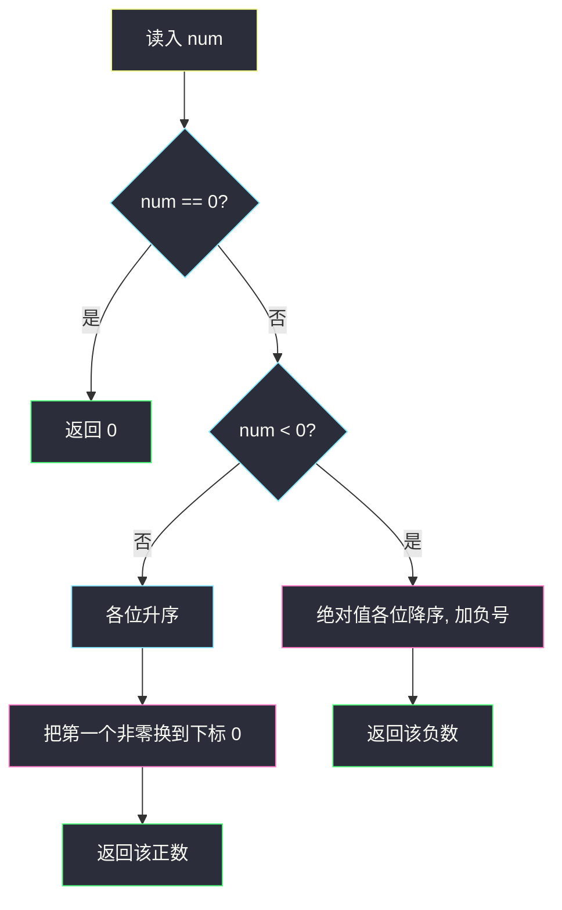
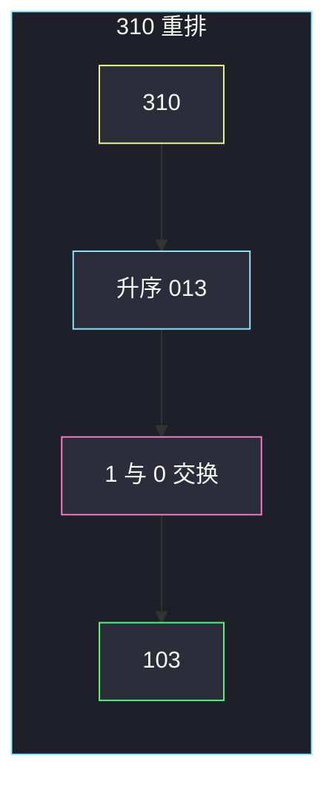

# 重排数字的最小值（分类讨论 · 正数避前导零 / 负数绝对值尽量大）

## 一、问题描述

给定整数 `num`（可正、可负、可为 0）。**重排它的十进制各位**（负号保持不动），得到数值尽可能小的结果，且**不能有前导零**（数字 0 本身除外）。返回这个整数。

> 🔗 LeetCode 2165：https://leetcode.cn/problems/smallest-value-of-the-rearranged-number/
>
> 数据范围：`-10^15 ≤ num ≤ 10^15`（绝对值最多 16 位）。
>
> 📚 灵茶题单：**§5.7 分类讨论**（1362 分）。

**示例 1**

```
输入：num = 310
输出：103
解释：各位的排列有 013、031、103、130、301、310。
去掉前导零后值最小的是 103。
```

**示例 2**

```
输入：num = -7605
输出：-7650
解释：负号保留。绝对值越大，数值越小。7650 > 7605，所以 -7650 更小。
```

**直观理解**

「数值最小」对正负完全不是一回事：

- **正数 / 零**：要让看起来尽量小 → 数字升序，但不能以 0 开头，所以把**最小的非零数字**换到首位，其余保持从小到大（零紧跟在首位后面）。
- **负数**：要让数值更小 = **绝对值更大** → 负号后面数字降序（大的在前，零自然落到末尾，不会前导零）。

---

## 二、暴力解法

抽出各位，枚举全排列，跳过前导零，按正负取 min。`16!` 不可行；即使去重仍过大。位数很少时能打表验证，提交不行。

```python
from itertools import permutations

class Solution:
    def smallestNumber(self, num: int) -> int:
        if num == 0:
            return 0
        sign = -1 if num < 0 else 1
        digits = list(str(abs(num)))
        best = None
        for p in set(permutations(digits)):
            if p[0] == "0":
                continue
            val = sign * int("".join(p))
            if best is None or val < best:
                best = val
        return best
```

`num` 最多 16 位，全排列只适合对拍小例子。

### 🔴 瓶颈在哪里

最优排列的形态是定死的：正数「最小非零 + 剩余升序」，负数「全体降序」。不必搜索，分类后排一次序再最多交换一次。

---

## 三、优化探索（核心章节）

> 📚 本题在灵茶题单中属于 **§5.7 分类讨论**。先按符号分成两条路，每条路上的最优形态用排序直接构造。Python 把绝对值当字符串处理即可，不必担心 `long`。

### 3.1 正数：升序后把第一个非零换到开头

目标：在无前导零的前提下，字典序 / 数值最小。

1. 各位升序。此时若有 0，会全部挤在最前面，形如 `0013`，非法。
2. 找到**最左边的非零**（也就是最小的非零数字），和位置 0 交换。
3. 其余位置仍是升序：零紧挨在首位之后，然后从小到大。

为什么最优：

- 首位必须非零，且应尽量小 → 选全体非零里最小的那个。
- 首位定下来后，剩下的数字从左到右也应尽量小 → 升序（含零）。把最小非零抽到首位，剩下恰好仍是升序。

例：`310` → 排序 `013` → 第一个非零是 `1`，与开头 `0` 交换 → `103`。

### 3.2 负数：降序排在负号后

数值最小 ⟺ 去掉负号后的正数最大 ⟺ 各位降序。

降序后最高位是最大数字，一定非零（`num ≠ 0` 时至少有一个非零位），自动满足无前导零。零会排到末尾，变成「后面补零」，绝对值更大，正是负数想要的。

例：`-7605` → 数字 `7,6,0,5` 降序 `7650` → `-7650`。

### 3.3 零

`num == 0` 只有一种重排，直接返回 0。也可以并进正数分支：`"0"` 排序后没有「非零可换」，原样即可。



### 3.4 一句话核心

> **正数：升序，再把最小非零换到开头。负数：降序挂在负号后面。不要全排列。**

---

## 四、代码实现

### Python（主解：字符串排序 + 一次交换）

```python
class Solution:
    def smallestNumber(self, num: int) -> int:
        if num == 0:
            return 0
        neg = num < 0
        s = list(str(abs(num)))
        s.sort(reverse=neg)
        if not neg:
            i = next(i for i, c in enumerate(s) if c != "0")
            s[0], s[i] = s[i], s[0]
        ans = int("".join(s))
        return -ans if neg else ans
```

**变量含义**

| 写法 | 含义 |
|------|------|
| `neg` | 原数是否为负（符号不能改） |
| `s.sort(reverse=neg)` | 负数降序，正数升序 |
| `i` | 升序串里第一个非零的下标 |
| `s[0], s[i] = s[i], s[0]` | 避免前导零：最小非零换到开头 |
| `int("".join(s))` | 拼回整数；Python int 足够覆盖 `10^15` |

正数且不含 0 时，`i == 0`，自己和自己交换，等于纯升序，例如 `310` 若没有 0 会是 `013` 那种情况才需要真正交换。`21` → `12`，`i=0`，结果 `12`。

### Java（可选，注意用 `long`）

```java
import java.util.Arrays;

class Solution {
    public long smallestNumber(long num) {
        if (num == 0) {
            return 0;
        }
        boolean neg = num < 0;
        char[] s = String.valueOf(Math.abs(num)).toCharArray();
        Arrays.sort(s);
        if (neg) {
            reverse(s);
            return -Long.parseLong(new String(s));
        }
        int i = 0;
        while (s[i] == '0') {
            i++;
        }
        char t = s[0];
        s[0] = s[i];
        s[i] = t;
        return Long.parseLong(new String(s));
    }

    private void reverse(char[] s) {
        for (int l = 0, r = s.length - 1; l < r; l++, r--) {
            char t = s[l];
            s[l] = s[r];
            s[r] = t;
        }
    }
}
```

---

## 五、具体例子演示

**示例 1**：`num = 310`（正数）。

| 步 | 操作 | 结果 |
|----|------|------|
| 1 | 取绝对值各位 | `['3','1','0']` |
| 2 | 升序 | `['0','1','3']` |
| 3 | 从左找第一个非零，下标 `i=1`（`'1'`） | |
| 4 | 交换 `s[0]` 与 `s[1]` | `['1','0','3']` |
| 5 | 拼成整数 | `103` |

若保留 `013`，那是前导零，官方明确排除。`031` 去掉前导零会变成 `31`，位数都变了，不是合法重排。



**示例 2**：`num = -7605`（负数）。

| 步 | 操作 | 结果 |
|----|------|------|
| 1 | 绝对值各位 | `['7','6','0','5']` |
| 2 | 降序 | `['7','6','5','0']` |
| 3 | 加回负号 | `-7650` |

不需要处理前导零：`7` 在最前。若误用升序会得到 `-0567` 一类非法前导零，或 `-5670` 这类绝对值更小、数值反而更大（-5670 > -7650）的错误答案。

再看两个边界（官方范围以内）：

| 输入 | 分类 | 构造过程 | 输出 |
|------|------|----------|------|
| `100` | 正 | 升序 `001`，非零 `1` 换到头 → `001` 变成 `100` | 100 |
| `-10` | 负 | 降序 `10` → `-10` | -10 |
| `0` | 零 | 直接返回 | 0 |

`100` 提醒：正数把非零换到开头后，零全部跟在后面，得到的仍可能和原数相同。

---

## 六、复杂度分析

| 方法 | 时间 | 空间 | 说明 |
|------|------|------|------|
| 全排列 | `O(d!)` | `O(d)` | `d ≤ 16` 仍太大 |
| 排序 + 一次交换（主解） | `O(d log d)` | `O(d)` | `d ≤ 16`，实际常数 |

`d` 是十进制位数，相对 `10^15` 可以看成 `O(1)`。

---

## 七、对比总结

| 维度 | 正数 | 负数 |
|------|------|------|
| 数值变小靠什么 | 高位放小数字 | 高位放大数字（绝对值变大） |
| 排序方向 | 升序 | 降序 |
| 前导零 | 必须处理：最小非零换到首位 | 降序自动避免 |
| 零的位置 | 紧跟首位之后 | 全部在末尾 |

**易错点**

1. **正负用同一套排序**：正数降序会得到最大而不是最小；负数升序会得到最接近 0 的负数，数值更大。
2. **正数直接升序不换位**：`013` 非法。
3. **Java 用 `int` 接返回值**：绝对值到 `10^15`，必须 `long`。
4. **把 `-0567` 当成合法重排**：题目禁止前导零；即便当整数它也不是 4 位数。
5. **符号被 `str(num)` 带进排序**：应先 `abs`，最后再加符号。

---

## 八、举一反三

| 题目 | 关系 |
|------|------|
| [179. 最大数](https://leetcode.cn/problems/largest-number/) | 重排「整段数字」使结果最大，比较器拼接 |
| [670. 最大交换](https://leetcode.cn/problems/maximum-swap/) | 只交换一次，让数值尽量大 |
| [402. 移掉 K 位数字](https://leetcode.cn/problems/remove-k-digits/) | 删位后最小，同样要处理前导零 |
| [738. 单调递增的数字](https://leetcode.cn/problems/monotone-increasing-digits/) | 数位贪心 + 从高到低定形 |
| [2231. 按奇偶性交换后的最大数字](https://leetcode.cn/problems/largest-number-after-digit-swaps-by-parity/) | 受约束的数位重排 |

**思想迁移**

- 最值重排先看符号：越小 vs 越大是两条路；正数额外多一个「首位非零」约束。
- 口诀：**「正数升序再把最小非零换到头；负数降序。」**
