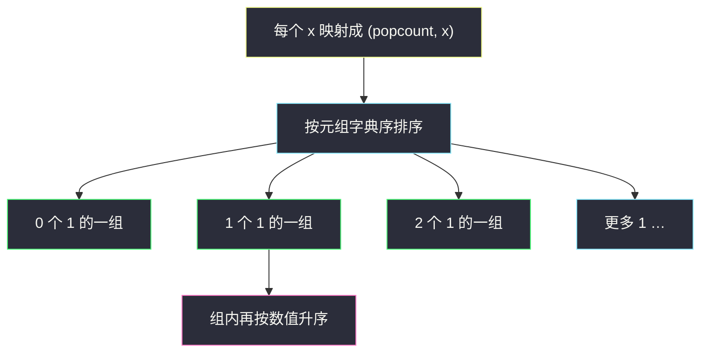
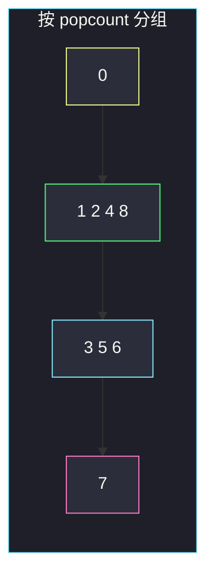

# 根据数字二进制下 1 的数目排序（复合关键字）

## 一、问题描述

给你一个整数数组 `arr`。请按每个数二进制表示中 **1 的个数** 升序排序；1 的个数相同的，再按**数值本身**升序。

> 🔗 LeetCode 1356：https://leetcode.cn/problems/sort-integers-by-the-number-of-1-bits/
>
> 数据范围：`1 ≤ arr.length ≤ 500`，`0 ≤ arr[i] ≤ 10⁴`。
>
> 📚 灵茶题单：**一、基础题**（1258 分）。核心是 popcount（`bit_count`）当第一关键字，原值当第二关键字。不必自己写比较器的稳定性证明，复合键一次说清。

**示例 1**

```
输入：arr = [0, 1, 2, 3, 4, 5, 6, 7, 8]
输出：[0, 1, 2, 4, 8, 3, 5, 6, 7]
解释：
  0 → 0 个 1
  1,2,4,8 → 各 1 个 1，按数值 1 < 2 < 4 < 8
  3,5,6 → 各 2 个 1，按数值 3 < 5 < 6
  7 → 3 个 1
```

**示例 2**

```
输入：arr = [1024, 512, 256, 128, 64, 32, 16, 8, 4, 2, 1]
输出：[1, 2, 4, 8, 16, 32, 64, 128, 256, 512, 1024]
解释：这些数都是 2 的幂，popcount 全是 1，于是完全按数值排。
```

**直观理解**

每个数先被映射成一对 `(popcount(x), x)`，然后按这对元组的字典序排序。`0` 的 popcount 是 0，排在最前。

---

## 二、暴力解法

自定义比较：先算两个数的 1 的个数，不等就按个数比；相等再比数值。手写 popcount 用循环即可。

```python
class Solution:
    def sortByBits(self, arr: list[int]) -> list[int]:
        def ones(x: int) -> int:
            c = 0
            while x:
                c += x & 1
                x >>= 1
            return c

        n = len(arr)
        for i in range(n):
            for j in range(i + 1, n):
                oi, oj = ones(arr[i]), ones(arr[j])
                if oi > oj or (oi == oj and arr[i] > arr[j]):
                    arr[i], arr[j] = arr[j], arr[i]
        return arr
```

选择排序 `O(n² · log A)`（`log A` 来自数 1），`n ≤ 500` 能过，但比较器又臭又长。

### 🔴 瓶颈在哪里

不必手写双重循环。语言自带排序接受一个 **key**：把每个元素映射到「用来比较的元组」。Python 的元组比较就是先比第一项、再比第二项，正好是题目规则。

---

## 三、优化探索（核心章节）

> 📚 灵茶题单 **一、基础题**。popcount 是位运算基础操作；本题把它当作排序键。

### 3.1 popcount

`x.bit_count()` = `x` 的二进制里 1 的个数。例如：

| x | 二进制 | popcount |
|---|--------|----------|
| 0 | `0` | 0 |
| 1 | `1` | 1 |
| 2 | `10` | 1 |
| 3 | `11` | 2 |
| 4 | `100` | 1 |
| 7 | `111` | 3 |
| 8 | `1000` | 1 |

`arr[i] ≤ 10⁴`，最多 14 个二进制位。

### 3.2 复合关键字，不必依赖「稳定」

`sorted(arr, key=lambda x: (x.bit_count(), x))`：

- 第一键 `x.bit_count()` 升序
- 第一键相同，比第二键 `x` 升序

Python 的 `sorted` **是稳定的**：若只按 `bit_count` 排，相同个数的数会保持原相对顺序。可以「先按数值排一遍，再按 popcount 排一遍（稳定排序）」得到同一结果。复合键一次完成，更不易写错，也不依赖稳定性。



### 3.3 一句话核心

> **排序键是二元组 `(popcount(x), x)`：先按 1 的个数，个数相同再按数值。**

---

## 四、代码实现

### Python（主解：复合 key）

```python
class Solution:
    def sortByBits(self, arr: list[int]) -> list[int]:
        return sorted(arr, key=lambda x: (x.bit_count(), x))
```

若不能用 `bit_count`，可写 `bin(x).count("1")`，或用 `x &= x - 1` 循环清最低 1。

**变量含义**

| 写法 | 含义 |
|------|------|
| `x.bit_count()` | 二进制中 1 的个数 |
| `(popcount, x)` | 第一关键字、第二关键字 |
| `sorted(..., key=...)` | 按 key 升序；不修改原逻辑，返回新列表（LeetCode 要返回值） |

`arr.sort(key=...)` 原地排再返回也可以。

---

## 五、具体例子演示

**示例 1**：`arr = [0, 1, 2, 3, 4, 5, 6, 7, 8]`。先列出每个数的键，再按键排序。

| x | 二进制 | popcount | 键 `(popcount, x)` |
|---|--------|----------|---------------------|
| 0 | `0000` | 0 | `(0, 0)` |
| 1 | `0001` | 1 | `(1, 1)` |
| 2 | `0010` | 1 | `(1, 2)` |
| 3 | `0011` | 2 | `(2, 3)` |
| 4 | `0100` | 1 | `(1, 4)` |
| 5 | `0101` | 2 | `(2, 5)` |
| 6 | `0110` | 2 | `(2, 6)` |
| 7 | `0111` | 3 | `(3, 7)` |
| 8 | `1000` | 1 | `(1, 8)` |

按键排序后：

| 顺序 | x | 键 | 组 |
|------|---|-----|----|
| 1 | 0 | `(0, 0)` | 0 个 1 |
| 2 | 1 | `(1, 1)` | 1 个 1 |
| 3 | 2 | `(1, 2)` | 1 个 1 |
| 4 | 4 | `(1, 4)` | 1 个 1 |
| 5 | 8 | `(1, 8)` | 1 个 1 |
| 6 | 3 | `(2, 3)` | 2 个 1 |
| 7 | 5 | `(2, 5)` | 2 个 1 |
| 8 | 6 | `(2, 6)` | 2 个 1 |
| 9 | 7 | `(3, 7)` | 3 个 1 |

结果 `[0, 1, 2, 4, 8, 3, 5, 6, 7]`，与官方一致。注意原数组里 `3` 在 `4` 前面，但 `4` 的 popcount 更小，所以 `4` 要排到 `3` 前面——**不能**只做稳定排序而不改顺序。



**示例 2**：全是 `1` 后面跟若干 0，popcount 全是 1，第二键就是数值本身，从小到大。

**边界**：全 0；已有序；`arr = [3, 3, 3]` 相同元素保持即可。`0` 必须当 0 个 1 处理，不要写成 `while x` 时漏掉对 0 的定义（0 的循环体不执行，计数 0，正好正确）。

---

## 六、复杂度分析

| 方法 | 时间 | 空间 | 说明 |
|------|------|------|------|
| 选择排序 + 手写 popcount | `O(n² · log A)` | `O(1)` | `A ≤ 10⁴` |
| `sorted` + 复合 key（主解） | `O(n log n · log A)` | `O(n)` | 排序额外空间；popcount 线性于位数 |

`n ≤ 500`，哪种都能过。面试写主解即可。

---

## 七、对比总结

| 维度 | 只按 popcount（稳定排序） | 复合 key `(popcount, x)` |
|------|---------------------------|--------------------------|
| 第二规则 | 依赖「先按数值排一遍」 | 第二项直接写进 key |
| 写错风险 | 忘了第一遍排序 | 几乎没有 |
| 与语言稳定性 | 绑定 | 不绑定 |

**易错点**

1. **只按 `bit_count` 排**：`3` 和 `4` 个数不同没问题，但 `1` 和 `8` 个数相同却可能保持输入顺序（若输入是 `[8,1]` 会得到 `[8,1]`，错）。必须带第二关键字。
2. **降序写成升序**：题目两个键都是升序。
3. **`bin(x).count("1")` 对负数**：本题 `arr[i] ≥ 0`，无此问题；若有负数不要用 `bin`。
4. **以为要原地且稳定**：返回新列表即可；复合 key 不依赖稳定。
5. **把 `x` 当成第一关键字**：那就变成普通数值排序，示例 1 会得到 `[0,1,2,3,4,5,6,7,8]`，错。

---

## 八、举一反三

| 题目 | 关系 |
|------|------|
| [338. 比特位计数](https://leetcode.cn/problems/counting-bits/) | 预处理 `0..n` 的 popcount，可用 `i & (i-1)` 递推 |
| [191. 位 1 的个数](https://leetcode.cn/problems/number-of-1-bits/) | 单次 popcount |
| [762. 二进制表示中质数个计算置位](https://leetcode.cn/problems/prime-number-of-set-bits-in-binary-representation/) | popcount 落在质数集合里则计数 |
| [461. 汉明距离](https://leetcode.cn/problems/hamming-distance/) | `popcount(x ^ y)` |
| [401. 二进制手表](https://leetcode.cn/problems/binary-watch/) | 时 + 分的 popcount 之和等于点亮的灯数 |

**思想迁移**

- 多规则排序 = 把规则做成一个元组当 key，从左到右优先级递减。
- 口诀：**「先数 1，个数相同再比大小；写成 `(bit_count, x)`。」**
