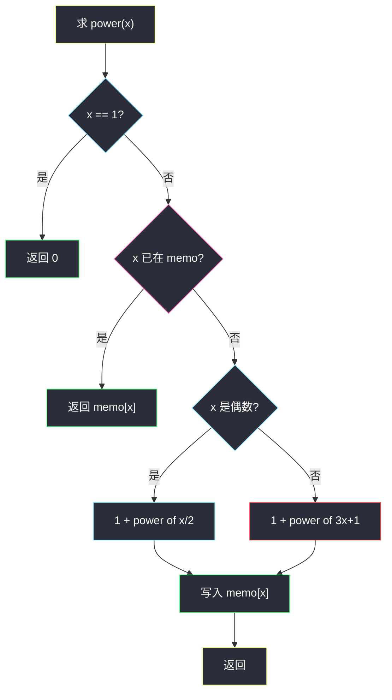
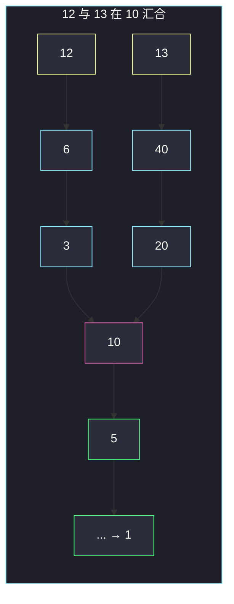

# 将整数按权重排序（Collatz 步数 + 记忆化）

## 一、问题描述

一个正整数 `x` 的**权重**定义为：重复下面变换直到变成 1 的**步数**——若 `x` 是偶数则变成 `x/2`，若是奇数则变成 `3x+1`（考拉兹 / Collatz 规则）。

给定闭区间 `[lo, hi]` 和 `k`（从 1 开始数），把区间内每个整数按「权重升序，权重相同则数值升序」排好，返回第 `k` 个数。

> 🔗 LeetCode 1387：https://leetcode.cn/problems/sort-integers-by-the-power-value/
>
> 数据范围：`1 ≤ lo ≤ hi ≤ 1000`，`1 ≤ k ≤ hi-lo+1`。中间的 `3x+1` 可能比 1000 大很多，需要记忆化；Python 整数不溢出，Java 过程值用 `long`。
>
> 📚 灵茶题单：**动态规划 · 其他**。权重是带重叠子问题的递推（到 1 的步数），算完当排序键，再取第 k。和「按 popcount 排序」同一套路：先映射再复合关键字排序。

**示例 1**

```
输入：lo = 12, hi = 15, k = 2
输出：13
解释：12 和 13 的权重都是 9，14 和 15 都是 17。
排序后 [12, 13, 14, 15]，第 2 个是 13。
```

**示例 2**

```
输入：lo = 7, hi = 11, k = 4
输出：7
解释：权重为 8→3，10→6，11→14，7→16，9→19。
排序后 [8, 10, 11, 7, 9]，第 4 个是 7。
```

**直观理解**

每个数先变成「要几步才能掉到 1」，再用这对 `(步数, 数值)` 当排序键。区间最多 1000 个数，瓶颈不在排序，而在权重计算会反复走到同一条链上（比如很多数都会经过 10→5→16→…→1）。

---

## 二、暴力解法

对每个 `x` 从 `lo` 到 `hi` 单独模拟到 1，不缓存。

```python
class Solution:
    def getKth(self, lo: int, hi: int, k: int) -> int:
        def power(x: int) -> int:
            steps = 0
            while x != 1:
                if x % 2 == 0:
                    x //= 2
                else:
                    x = 3 * x + 1
                steps += 1
            return steps

        arr = list(range(lo, hi + 1))
        arr.sort(key=lambda x: (power(x), x))
        return arr[k - 1]
```

`hi≤1000` 时链不长，这样也能过。相邻的 12、13、14 会把 `10→5→16→8→4→2→1` 算很多遍，是重复工作。

### 🔴 瓶颈在哪里

`power(x)` 算完后，链上每个后继的权重都知道了：`power(x) = 1 + power(next(x))`。用哈希表记下已经算过的值，后面的数撞到同一后继就直接加。这是最浅的 DP / 记忆化。

---

## 三、优化探索（核心章节）

> 📚 灵茶题单把本题放在 DP **其他**：不是线性数组 DP，而是「状态 = 正整数，转移 = 偶除二 / 奇乘三加一」，目标是到 1 的距离。

### 3.1 权重递推

```
power(1) = 0
power(x) = 1 + power(x/2)     若 x 为偶
power(x) = 1 + power(3x+1)    若 x 为奇
```

`3x+1` 对奇数一定是偶数，有人会再除一次二；不必，递归/递推一层层走即可。

### 3.2 记忆化

全局一张 `memo`。递归时先查表；算出后写入。迭代也可以：从 `x` 往下走，路上没见过的推进栈，撞到已算过的再往回填。区间很小，递归深度几十到一百多，Python 默认栈够用。



粉节点是缓存命中：示例里算完 12 之后，13 走到 10 就不必再走到 1。

### 3.3 排序取第 k

键 `(power(x), x)`，升序。`k` 是 1-index，取排序后下标 `k-1`。不必手写比较器。

### 3.4 一句话核心

> **权重是 Collatz 到 1 的步数，记忆化避免重复链；再按 `(权重, 数值)` 排序取第 k 个。**

---

## 四、代码实现

### Python（主解：记忆化 + 复合 key）

```python
class Solution:
    def getKth(self, lo: int, hi: int, k: int) -> int:
        memo = {1: 0}

        def power(x: int) -> int:
            if x not in memo:
                if x % 2 == 0:
                    memo[x] = 1 + power(x // 2)
                else:
                    memo[x] = 1 + power(3 * x + 1)
            return memo[x]

        arr = list(range(lo, hi + 1))
        arr.sort(key=lambda x: (power(x), x))
        return arr[k - 1]
```

**变量含义**

| 写法 | 含义 |
|------|------|
| `memo[x]` | `x` 变到 1 的步数 |
| `power(x)` | 查表或按偶/奇递推 |
| `(power(x), x)` | 第一键权重，第二键数值 |
| `arr[k-1]` | 题目 k 从 1 数 |

Java 里 `3*x+1` 可能超过 `int`（过程值可到数万以上），用 `long` 做 Collatz，权重本身仍是 `int`。区间长度 ≤ 1000，排序 `O(m log m)` 可忽略。

---

## 五、具体例子演示

按任务要求列出 **Collatz 步数表**，并展示记忆化如何复用。

### 5.1 官方示例 1：`lo=12, hi=15, k=2`

**12 的链（9 步）**

| 步 | 当前 | 规则 | 下一步 |
|----|------|------|--------|
| 1 | 12 | 偶 /2 | 6 |
| 2 | 6 | 偶 | 3 |
| 3 | 3 | 奇 3x+1 | 10 |
| 4 | 10 | 偶 | 5 |
| 5 | 5 | 奇 | 16 |
| 6 | 16 | 偶 | 8 |
| 7 | 8 | 偶 | 4 |
| 8 | 4 | 偶 | 2 |
| 9 | 2 | 偶 | 1 |

写入：`power(12)=9`，并且链上 `power(10)=6`、`power(5)=5`、`power(16)=4`……都可顺手记下。

**13 的链（9 步）**

`13 → 40 → 20 → 10`，此时 10 已在表里，权重 6，因此 `power(13)=3+6=9`。不必再走到 1。

**14 的链（17 步）**

`14 → 7 → 22 → 11 → 34 → 17 → 52 → 26 → 13`，撞到刚算过的 13（9 步），所以 `power(14)=8+9=17`。

**15 的链（17 步）**

`15 → 46 → 23 → 70 → 35 → 106 → 53 → 160 → 80 → 40`，40 在 13 的链上（`power(40)=8`），`power(15)=9+8=17`。

| x | 权重 | 键 |
|---|------|-----|
| 12 | 9 | (9, 12) |
| 13 | 9 | (9, 13) |
| 14 | 17 | (17, 14) |
| 15 | 17 | (17, 15) |

排序 `[12, 13, 14, 15]`，`k=2` → **13**。对拍官方。



粉节点 `10` 是缓存命中点。

### 5.2 官方示例 2：`lo=7, hi=11, k=4`

| x | 权重 | 怎么数 |
|---|------|--------|
| 8 | 3 | 8→4→2→1 |
| 10 | 6 | 10→5→16→8→4→2→1 |
| 11 | 14 | 走到 10 再加前缀 |
| 7 | 16 | 7→22→11，再加 14 |
| 9 | 19 | 9→28→14，14 的权重 17 再 +2 |

按键排序：`(3,8), (6,10), (14,11), (16,7), (19,9)` → `[8,10,11,7,9]`。`k=4` → **7**。对拍官方。

注意 7 的数值比 8 小，但权重大，所以排在后面——**不能**只按数值排，也不能只按权重（权重相同才比数值）。

### 5.3 边界

`lo=hi=1`，`k=1`：`power(1)=0`，返回 1。不要把 1 再做 `3*1+1`。
`k=1` 取权重最小、同权取最小数值。

---

## 六、复杂度分析

| 方法 | 时间 | 空间 | 说明 |
|------|------|------|------|
| 每数独立模拟 | `O(m · L)` | `O(m)` | `m=hi-lo+1`，`L` 为链长 |
| 记忆化 + 排序（主解） | `O(m log m + T)` | `O(T)` | `T` 为出现过的不同整数个数 |

`hi≤1000`，两种都能过。记忆化让相交的链只走一次。排序占 `O(m log m)`。

---

## 七、对比总结

| 维度 | 无缓存模拟 | 记忆化权重 |
|------|------------|------------|
| 公共后缀 | 重复走 | `memo` 命中直接加 |
| 正确性 | 对 | 对，且 `power(1)=0` |
| 排序 | 同样复合键 | 同样 |

**易错点**

1. **`k` 当 0-index**：要 `arr[k-1]`。
2. **权重相同没比数值**：`12` 和 `13` 都是 9，必须 12 在前。
3. **`power(1)` 写成 1**：变成 1 的步数是 0，题目定义为「直到变成 1」。
4. **Java `int` 做 `3*x+1`**：过程值可能溢出，用 `long`。
5. **奇数先 `/2`**：规则是先 `3x+1`。虽说结果常为偶数，但步数要一步一步计。
6. **只排序权重**：第二关键字必须是数值本身。

---

## 八、举一反三

| 题目 | 关系 |
|------|------|
| [1356. 根据数字二进制下 1 的数目排序](https://leetcode.cn/problems/sort-integers-by-the-number-of-1-bits/)（`sort-integers-by-the-number-of-1-bits.md`） | 同样复合键 `(映射值, x)` |
| [397. 整数替换](https://leetcode.cn/problems/integer-replacement/) | 也是到 1 的步数，奇数可 +1 或 -1 |
| [202. 快乐数](https://leetcode.cn/problems/happy-number/) | 迭代数字映射，用集合判环 |
| [263. 丑数](https://leetcode.cn/problems/ugly-number/) | 只允许 /2 /3 /5 的另一条链 |
| [1337. 矩阵中战斗力最弱的 K 行](https://leetcode.cn/problems/the-k-weakest-rows-in-a-matrix/) | 映射后取第 k |
| [1636. 按照频率将数组升序排序](https://leetcode.cn/problems/sort-array-by-increasing-frequency/) | 频次第一键、数值第二键（数值这次是降序） |

**思想迁移**

- 「先给每个元素算一个权，再按权排序」：权用记忆化 DP 算，排序用元组 key。
- 口诀：**「Collatz 步数当权，表记住公共链；先权后值，取第 k。」**
