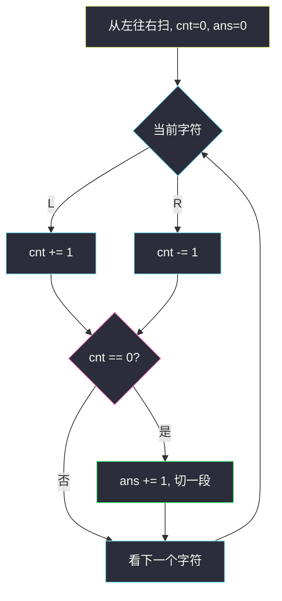
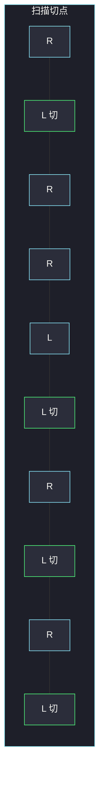

# 分割平衡字符串（划分型贪心 · 能切就切）

## 一、问题描述

平衡字符串：`'L'` 和 `'R'` 的数量相等。给你一个**已经平衡**的字符串 `s`，把它切成尽可能多段，每一段仍是平衡字符串。返回最多能切出多少段。

> 🔗 LeetCode 1221：https://leetcode.cn/problems/split-a-string-in-balanced-strings/
>
> 数据范围：`2 ≤ s.length ≤ 1000`，`s[i]` 只能是 `'L'` 或 `'R'`，且 `s` 本身是平衡串。
>
> 📚 灵茶题单：**§1.5 划分型贪心**（1220 分）。

**示例 1**

```
输入：s = "RLRRLLRLRL"
输出：4
解释：切成 "RL"、"RRLL"、"RL"、"RL"。
```

**示例 2**

```
输入：s = "RLRRRLLRLL"
输出：2
解释：切成 "RL"、"RRRLLRLL"。不能切成 "RL"、"RR"、"RL"、"LR"、"LL"：
第二段 "RR" 和第五段 "LL" 都不是平衡串。
```

**示例 3**

```
输入：s = "LLLLRRRR"
输出：1
解释：只能整段保留，中间任何切法都会让前半全是 L。
```

**直观理解**

要的是**段数最多**，不是每段尽量长。一旦扫到一段 L/R 已经配平，再往下吞字符只会把两段并成一段，段数变少。所以：**能切就立刻切**。

---

## 二、暴力解法

枚举所有切法：在 `n-1` 个缝里选若干刀，检查每段是否平衡，取合法方案的最大段数。

```python
class Solution:
    def balancedStringSplit(self, s: str) -> int:
        n = len(s)
        best = 1

        def ok(t: str) -> bool:
            return t.count("L") == t.count("R")

        def dfs(i: int, parts: int) -> None:
            nonlocal best
            if i == n:
                best = max(best, parts)
                return
            for j in range(i + 1, n + 1):
                if ok(s[i:j]):
                    dfs(j, parts + 1)

        dfs(0, 0)
        return best
```

切点指数级，还要反复数 L/R。`n ≤ 1000` 会超时。

### 🔴 瓶颈在哪里

「最多段」意味着每一段都该尽量短。一旦某个前缀已经平衡，最优方案**一定在这里下一刀**——不必回头枚举「把这一段再拉长」。计数器扫一遍就能代替搜索。

---

## 三、优化探索（核心章节）

> 📚 本题在灵茶题单中属于 **§1.5 划分型贪心**。同节另一面是「段数最少 → 每段尽量长」；本题目标是段数**最多**，所以每段尽量**短**：局部一旦合法就切。

### 3.1 计数器代替真切字符串

令 `cnt` 表示「目前多出来的 L」（遇 `L` 加 1，遇 `R` 减 1；反过来也行）。`cnt == 0` 当且仅当当前这段 L、R 一样多。

不必 `s[l:r]` 切片，碰到 `cnt == 0` 就把答案加 1，计数器归零后继续往后走。

### 3.2 为什么「能切就切」最优

设第一次 `cnt == 0` 出现在下标 `i`（0-based）。前缀 `s[0..i]` 是最短的平衡前缀。

- 若在 `i` 处切：答案 = `1 + 后缀的最多段数`。
- 若硬把前缀拉长到 `j > i` 再切：前半只贡献 1 段，且吃掉了本可再切的字符，段数不会更多。

原串平衡，切掉一个平衡前缀后，**后缀仍平衡**，可以归纳。



### 3.3 一句话核心

> **遇 L 加一、遇 R 减一；`cnt` 回到 0 就切一段。不要真的切字符串。**

---

## 四、代码实现

### Python（主解：一次扫描）

```python
class Solution:
    def balancedStringSplit(self, s: str) -> int:
        ans = cnt = 0
        for ch in s:
            cnt += 1 if ch == "L" else -1
            if cnt == 0:
                ans += 1
        return ans
```

**变量含义**

| 写法 | 含义 |
|------|------|
| `cnt` | 当前未闭合段里，L 比 R 多几个（可为负） |
| `ans` | 已经切出的平衡段数 |
| `cnt == 0` | 当前段刚好配平，下一刀落在这里 |

把 `L/R` 换成 `+1/-1` 即可，不必 `count`。原串保证平衡，扫完 `cnt` 一定回到 0，最后一段会被计入。

---

## 五、具体例子演示

**示例 1**：`s = "RLRRLLRLRL"`，`L → +1`，`R → -1`。

| 步 | 字符 | cnt | 切一段? | ans |
|----|------|-----|---------|-----|
| 1 | R | -1 | 否 | 0 |
| 2 | L | 0 | **是** `"RL"` | 1 |
| 3 | R | -1 | 否 | 1 |
| 4 | R | -2 | 否 | 1 |
| 5 | L | -1 | 否 | 1 |
| 6 | L | 0 | **是** `"RRLL"` | 2 |
| 7 | R | -1 | 否 | 2 |
| 8 | L | 0 | **是** `"RL"` | 3 |
| 9 | R | -1 | 否 | 3 |
| 10 | L | 0 | **是** `"RL"` | 4 |



绿格是 `cnt` 回到 0 的切点，共 4 段。

**示例 3**：`s = "LLLLRRRR"`。`cnt` 走 `1,2,3,4,3,2,1,0`，只在最后一格归零，所以 `ans = 1`。

---

## 六、复杂度分析

| 方法 | 时间 | 空间 | 说明 |
|------|------|------|------|
| 枚举切点 | 指数级 | `O(n)` 递归栈 | 每个缝切或不切 |
| 计数器扫描（主解） | `O(n)` | `O(1)` | 每个字符看一次 |

---

## 七、对比总结

| 维度 | 本题（最多段） | §1.5 最少段（如「值不超过 K」） |
|------|----------------|----------------------------------|
| 贪心方向 | 每段尽量短，能切就切 | 每段尽量长 |
| 切点信号 | 计数器回到 0 | 再吃一个就会违规 |
| 实现 | 一个 `cnt` | 累加数值 / 右端点 |

**易错点**

1. **真的去切字符串**：`split` 或反复切片没有必要，计数器即可。
2. **把「平衡」理解成括号匹配**：`"LR"` 和 `"RL"` 都合法，不要求 `L` 在前。
3. **提前在中间乱切**：示例 2 的 `"RR"` 看起来「对称」，但 L/R 数量不等。
4. **`cnt` 加减方向反了但忘了判 0**：两种方向都行，关键是配平时恰好为 0。

---

## 八、举一反三

| 题目 | 关系 |
|------|------|
| [763. 划分字母区间](https://leetcode.cn/problems/partition-labels/) | 划分型：每段覆盖该段字母的最远出现位置 |
| [2405. 子字符串的最优划分](https://leetcode.cn/problems/optimal-partition-of-string/) | 最多段：字符一重复就切新段 |
| [1525. 字符串的好分割数目](https://leetcode.cn/problems/number-of-good-ways-to-split-a-string/) | 也是扫一遍计数，但目标是「左右字符种类相等」 |
| [1963. 使字符串平衡的最小交换次数](https://leetcode.cn/problems/minimum-number-of-swaps-to-make-the-string-balanced/) | 同样用括号型计数，求的是交换而不是切段 |

**思想迁移**

- 划分型贪心先问目标：最多段 → 局部合法立刻切；最少段 → 局部能延就延。
- 口诀：**「L 加 R 减，归零就切一段。」**
