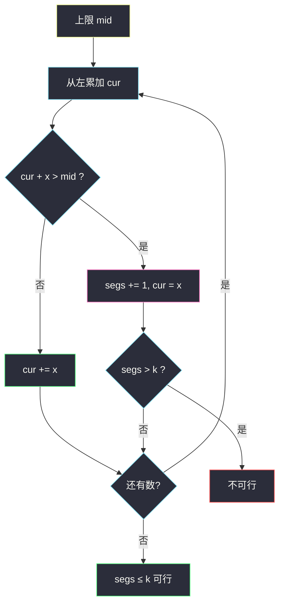
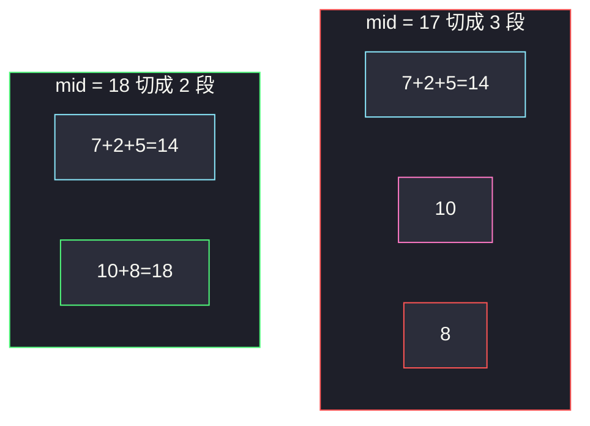

# 分割数组的最大值（二分段和上限 + 贪心切段）

## 一、问题描述

给定非负整数数组 `nums` 和整数 `k`，要把数组分成 **恰好 k 个非空连续子数组**。每个子数组有一个「段和」。请最小化「这 k 个段和里的最大值」，返回这个最小的可能最大值。

> 🔗 LeetCode 410：https://leetcode.cn/problems/split-array-largest-sum/
>
> 数据范围：`1 <= nums.length <= 1000`，`1 <= k <= min(50, nums.length)`，`0 <= nums[i] <= 10^6`。
>
> 📚 灵茶题单：**二分算法 · §2.4 最小化最大值**。

**示例 1**

```
输入：nums = [7,2,5,10,8], k = 2
输出：18
解释：分成 [7,2,5] 和 [10,8]，段和 14 与 18，最大值 18。
改成 [7,2,5,10] | [8] 最大值 24，更差。
```

**示例 2**

```
输入：nums = [1,2,3,4,5], k = 2
输出：9
解释：[1,2,3] | [4,5]，最大值 9。
```

**直观理解**

段数固定为 k，连续不能打乱。最大值上限设得越松，越容易用 ≤ k 段装完；设得越紧，可能被迫拆出第 k+1 段。问的是「还能装下」的最紧上限——最小化最大值，§2.4，本质仍是 §2.1 求最小。

---

## 二、暴力解法（DP）

`dp[j][i]` = 前 `i` 个数（`nums[0..i)`）分成 `j` 段，所能做到的最小「段和最大值」。枚举上一段的结尾 `t`：

```
dp[j][i] = min over t  of  max( dp[j-1][t],  sum(nums[t..i)) )
```

`j` 从 1 到 k，`i` 从 j 到 n（j 段至少 j 个数），`t` 从 j-1 到 i-1。

```python
class Solution:
    def splitArray(self, nums: List[int], k: int) -> int:
        n = len(nums)
        prefix = [0] * (n + 1)
        for i, x in enumerate(nums):
            prefix[i + 1] = prefix[i] + x
        INF = 10**18
        dp = [[INF] * (n + 1) for _ in range(k + 1)]
        dp[0][0] = 0
        for j in range(1, k + 1):
            for i in range(j, n + 1):
                for t in range(j - 1, i):
                    cost = prefix[i] - prefix[t]
                    dp[j][i] = min(dp[j][i], max(dp[j - 1][t], cost))
        return dp[k][n]
```

### 复杂度

- **时间**：`O(n² k)`。n=1000、k=50 约 `5·10^7` 次，勉强能过，常作为对照。
- **空间**：`O(nk)`，可滚成 `O(n)`。

### 🔴 瓶颈在哪里

决策是「在哪切」，状态随切点个数指数膨胀；DP 用段数维度压掉指数，仍是立方。真正该吃的性质：上限 `mid` 越大越好装——**左假右真**。二分 `mid` 后，check 只需贪心从左切，`O(n log SUM)`。

---

## 三、优化探索（核心章节）

> 📚 本题在灵茶题单中属于 **二分算法 · §2.4 最小化最大值**（求最小的可行上限）。与 [供暖器](https://leetcode.cn/problems/heaters/)（`heaters.md`）同一套左闭右开求最小；check 换成「贪心切段数 ≤ k」。

### 3.1 check(mid)：段和上限为 mid 时，k 段够不够

从左往右攒当前段。下一个数加进来会超过 `mid`，就在这里切开，新开一段从该数开始。单个 `nums[i] > mid` 直接不可行（一段至少要装下它）。切完后看用了几段：`≤ k` 则可行。

这是「每段尽量装」的贪心：能晚切就晚切。

```
segs, cur = 1, 0
for x in nums:
    if cur + x > mid:
        segs += 1
        cur = x
        if segs > k: return False
    else:
        cur += x
return True
```

### 3.2 贪心 check 为什么正确

问的是存在性：「是否存在一种切法，使每段和 ≤ mid 且恰好（或至多）k 段」。至多 k 段若能装下，多切几刀变成恰好 k 段只会使最大值不变或变小，所以上限可行时「至多」与「恰好」等价（k 不超过 n）。

**最少段数**由「每段尽量装满」给出：任意合法切法的第一段结束位置 `p`，贪心第一段会延伸到 `p' ≥ p`（上限允许的最远）。剩下的后缀更短，归纳可知贪心段数 ≤ 任意合法切法的段数。因此：

- 贪心段数 ≤ k ⇔ 存在合法切法 ⇔ `check(mid)` 为真。

晚切不会「占掉后面的额度导致段数变多」——段数只会更少或相等。早切只会多用段。



### 3.3 check 关于 mid 的单调性

`mid` 增大，原先能切的仍然能切，原先超限的格子可能不再超。贪心段数不增。所以 `check(mid)` **左假右真**。答案 = 最小的蓝色 `mid`。

下界：`max(nums)`（再小装不下最大那个数）。上界：`sum(nums)`（k=1 时一整段）。


### 3.4 左闭右开求最小 mid（一套走到底）

```
l, r = max(nums), sum(nums) + 1     # 最小可行上限 ∈ [l, r)
while l < r:
    mid = (l + r) // 2
    if check(mid): r = mid          # 蓝：还能压
    else:          l = mid + 1      # 红：必须放松
return l
```

和 §2.1 完全同一套：真收右，假丢左。不要改成 `r = mid - 1`。`r` 取 `sum+1` 作为开区间右端，`sum` 本身必可行。

### 3.5 和 DP 的关系

DP 求出的就是这个最小上限，还能顺便恢复切点。只问答案时，二分 + 贪心更短、更快。DP 适合当暴力对照、或 k、n 都很小且要输出方案。

### 3.6 一句话核心

> **上限越松越好切（左假右真）→ 左闭右开求最小 mid；check = 贪心晚切，段数 ≤ k。**

---

## 四、代码实现

### Python（主解：二分上限 + 贪心切段）

```python
class Solution:
    def splitArray(self, nums: List[int], k: int) -> int:
        def check(limit: int) -> bool:
            segs, cur = 1, 0
            for x in nums:
                if cur + x > limit:
                    segs += 1
                    cur = x
                    if segs > k:
                        return False
                else:
                    cur += x
            return True

        l, r = max(nums), sum(nums) + 1          # 最小可行上限 ∈ [l, r)
        while l < r:
            mid = (l + r) // 2
            if check(mid):
                r = mid
            else:
                l = mid + 1
        return l
```

单个元素不会超过 `l` 的初值 `max(nums)`，check 里不必再写 `if x > limit`。若把下界写成 0，就必须判。

**变量含义**

| 变量 | 含义 |
|------|------|
| `limit` / `mid` | 猜测的段和上限 |
| `cur` | 当前这一段已装的和 |
| `segs` | 已经开了几段（含当前段） |
| `l` / `r` | 左闭右开：`[max, l)` 已确认太紧，`[r, sum+1)` 已确认够松 |

### Java（最优解同款，和用 long）

```java
class Solution {
    public int splitArray(int[] nums, int k) {
        long lo = 0, hi = 1;                     // hi 最终 = sum+1
        for (int x : nums) {
            lo = Math.max(lo, x);
            hi += x;
        }
        long l = lo, r = hi;                     // [l, r)
        while (l < r) {
            long mid = l + (r - l) / 2;
            if (check(nums, k, mid)) r = mid;
            else l = mid + 1;
        }
        return (int) l;
    }

    private boolean check(int[] nums, int k, long limit) {
        int segs = 1;
        long cur = 0;
        for (int x : nums) {
            if (cur + x > limit) {
                segs++;
                cur = x;
                if (segs > k) return false;
            } else {
                cur += x;
            }
        }
        return true;
    }
}
```

`nums[i]` 最大 `10^6`、n=1000，和 `10^9` 仍在 `int` 内；写成 `long` 更稳。

---

## 五、具体例子演示

以示例 1：`nums = [7,2,5,10,8]`，`k = 2`。`l = 10`，`r = 32 + 1 = 33`。

手工看分界：`mid = 17` 时贪心 `7+2+5=14`，再加 10 超限，新开 `[10]`，再加 8 又超，第三段 `[8]`，3 > 2，不可行。`mid = 18`：`[7,2,5]` 和 `[10,8]`，2 段，可行。故 `check(mid) ⇔ mid ≥ 18`。

| 轮次 | l | r | mid | 贪心切段（段和列表） | 段数 | check | 动作 |
|------|---|---|-----|----------------------|------|-------|------|
| 1 | 10 | 33 | 21 | `[14, 18]` | 2 | 真 | `r = 21` |
| 2 | 10 | 21 | 15 | `[14, 10, 8]` | 3 | 假 | `l = 16` |
| 3 | 16 | 21 | 18 | `[14, 18]` | 2 | 真 | `r = 18` |
| 4 | 16 | 18 | 17 | `[14, 10, 8]` | 3 | 假 | `l = 18` |

`l == r == 18`，返回 **18** ✓。

逐步跟踪第 4 轮 `mid = 17`（关键的假）：

| 读入 | cur | cur+x vs 17 | 动作 | segs |
|------|-----|-------------|------|------|
| 7 | 0 | 7 ≤ 17 | cur=7 | 1 |
| 2 | 7 | 9 ≤ 17 | cur=9 | 1 |
| 5 | 9 | 14 ≤ 17 | cur=14 | 1 |
| 10 | 14 | 24 > 17 | 新开，cur=10 | 2 |
| 8 | 10 | 18 > 17 | 新开，cur=8 | 3 |

三段超过 k，check 假。把上限加到 18 后，最后一次 `10+8=18` 刚好不超。

示例 2 ` [1,2,3,4,5], k=2 `：下界 5，上界 16。`check(8)`：`1+2+3=6` 再加 4 超，新开 `4+5=9>8` 又新开，3 段，假。`check(9)`：`[1,2,3]` 与 `[4,5]`，真。二分锁到 9。



---

## 六、复杂度分析

| 方法 | 时间 | 空间 | 说明 |
|------|------|------|------|
| DP 枚举切点（暴力） | `O(n² k)` | `O(nk)` | n=1000、k=50 可过，作对照 |
| 二分上限 + 贪心切（主解） | `O(n log SUM)` | `O(1)` | SUM ≤ `10^9`，约 30 轮 |

---

## 七、对比总结

| 维度 | DP | 二分答案 |
|------|----|----------|
| 求出的东西 | 最小上限（可恢复方案） | 只求最小上限 |
| 单调性 | 隐含在 max/min 转移里 | 显式左假右真 |
| 代码量 | 三重循环 | 一层二分 + 一层贪心 |

**易错点**

1. **下界写成 0 或 `min(nums)`**：上限小于 `max(nums)` 时有元素永远装不进任何段。
2. **check 用恰好 k 段且每段和尽量均分**：存在性只问 ≤ k；贪心晚切求的是最少段数。
3. **提前切开「给后面留空」**：那会让段数变多，check 更悲观，可能把可行 mid 判成假，答案偏大。
4. **`cur + x >= limit` 就切**：等于上限时这一段还能装，应 `>` 才切。`10+8=18` 刚好合法。
5. **求最大模板搞反**：本题是求最小蓝，真应收 `r = mid`。
6. **k=1 / k=n**：分别等于 `sum` 和 `max`，二分也会落到这两个端点，不必特判。

**模板（§2.4 最小化最大值 = §2.1 求最小）**

```python
l, r = max(nums), sum(nums) + 1
while l < r:
    mid = (l + r) // 2
    if check(mid): r = mid
    else:          l = mid + 1
return l
```

---

## 八、举一反三

| 题目 | 关系 |
|------|------|
| [1011. 在 D 天内送达包裹的能力](https://leetcode.cn/problems/capacity-to-ship-packages-within-d-days/) | 几乎同一题：天数 ↔ 段数，载重 ↔ 段和上限 |
| [875. 爱吃香蕉的珂珂](https://leetcode.cn/problems/koko-eating-bananas/) | §2.1 求最小速度 |
| [410 本题](https://leetcode.cn/problems/split-array-largest-sum/) | 最小化最大值的招牌题 |
| [475. 供暖器](https://leetcode.cn/problems/heaters/) | 同家族求最小，见 `heaters.md` |
| [1898. 可移除字符的最大数目](https://leetcode.cn/problems/maximum-number-of-removable-characters/) | 单调反过来求最大，见 `maximum-number-of-removable-characters.md` |
| [1231. 分享巧克力](https://leetcode.cn/problems/divide-chocolate/) | 最大化最小值：check 方向相反 |

**思想迁移**

- 「连续分段 + 最小化各段代价的最大值」→ 二分上限，check 用贪心晚切数段。
- 最小化最大值 与 最大化最小值 是一对：前者左假右真求最小蓝，后者左真右假求最大真。
- 口诀：**「上限左假右真，往左压到不能压；从左能装就装，超了再开一段。」**
