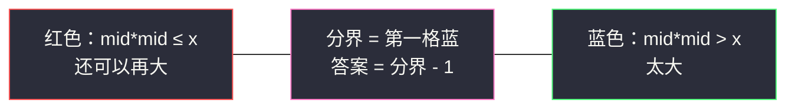
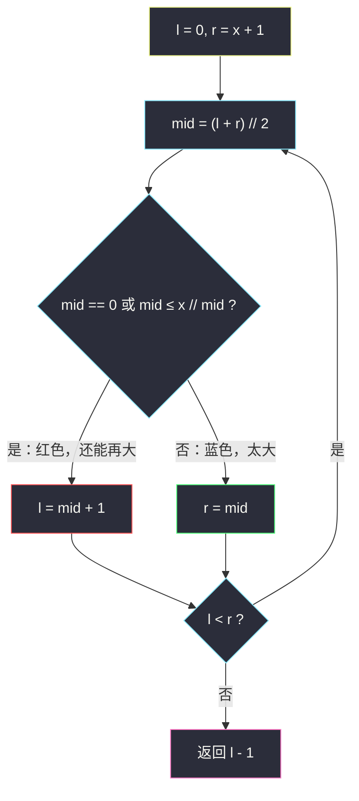

# x 的平方根（二分答案 · 求最大可行值）

## 一、问题描述

给你一个非负整数 `x`，计算并返回 `x` 的**算术平方根**。由于返回类型是整数，结果只保留**整数部分**，小数部分将被**舍去**（向下取整）。

不能使用任何内置指数函数或算符，例如 `pow(x, 0.5)` 或 `x ** 0.5`。

> 🔗 LeetCode 69：https://leetcode.cn/problems/sqrtx/
>
> 数据范围：`0 <= x <= 2^31 - 1`。

**示例 1**

```
输入：x = 4
输出：2
解释：4 的算术平方根是 2。
```

**示例 2**

```
输入：x = 8
输出：2
解释：8 的算术平方根是 2.82842...，向下取整得 2。
```

**示例 3**

```
输入：x = 0
输出：0
解释：0 的平方根仍是 0。
```

**直观理解**

要的不是「最接近 √x 的实数」，而是**满足 `k * k ≤ x` 的最大整数 k**。`x = 8` 时 2×2=4 ≤ 8，3×3=9 > 8，所以答案是 2。候选只有 `0, 1, 2, …, x` 这一段有序整数，单调性一眼能看出来——正是二分答案。

---

## 二、暴力解法

从 0 往上试，找到最后一个平方仍不超过 `x` 的整数：

```python
class Solution:
    def mySqrt(self, x: int) -> int:
        k = 0
        while k * k <= x:
            k += 1
        return k - 1
```

`k = 0` 时 `0 ≤ x` 恒成立，循环至少走一轮；退出时 `k * k > x`，答案是 `k - 1`。`x = 0` 会在 `k = 1` 时退出，返回 0，正确。

### 复杂度

- **时间**：`O(√x)`。答案大约是 √x，循环走这么多轮。
- **空间**：`O(1)`。

`x = 2^31 - 1` 时约走 46341 轮，本题能过，但浪费了「平方函数单调」这一性质，也不是二分题单想练的写法。

### 🔴 瓶颈在哪里

`k * k` 随 `k` 单调递增：存在一个分界点，左边全是 `k² ≤ x`，右边全是 `k² > x`。线性扫等于把这条分界线一格一格挪，二分一次就能砍掉一半候选。

---

## 三、优化探索（核心章节）

> 📚 本题在灵茶题单中属于 **02-二分查找 · 四、其他**，是「二分答案」里最干净的一题：候选是整数，check 是比较平方与 `x`。

### 3.1 红蓝染色：求第一个「太大」的位置

沿用同站 `search-insert-position.md` 的**左闭右开**模板。把整数轴 `[0, x]` 染色：

- **红色（还能再大）**：`mid * mid ≤ x`；
- **蓝色（太大了）**：`mid * mid > x`。

答案是**最后一格红色** = **第一格蓝色减 1**。于是 check 写成「是不是太大」，套「求最小」模板，最后 `return l - 1`。



### 3.2 区间与溢出

- `l = 0`，`r = x + 1`：候选是 `[0, x]`，把 `x+1` 预染成蓝挂在开区间右端（`(x+1)²` 对 `x ≥ 0` 一定大于 `x`，`x = 0` 时 `r = 1` 也对）。
- 循环 `l < r`，`mid = (l + r) // 2`。
- **不要写 `mid * mid`**：Java / C++ 里 `mid` 最大约 46341，平方会爆 32 位 int。改成 `mid <= x // mid`（`mid > 0` 时）。`mid == 0` 单独视为红色（`0 ≤ x` 恒真）。



### 3.3 一句话核心

> **答案 = 满足 `k² ≤ x` 的最大 k；用左闭右开找到第一个 `k² > x`，减 1。比较写成 `mid <= x // mid`，躲开乘法溢出。**

---

## 四、代码实现

### Python（主解）

```python
class Solution:
    def mySqrt(self, x: int) -> int:
        l, r = 0, x + 1                     # 左闭右开 [l, r)
        while l < r:
            mid = (l + r) // 2
            if mid == 0 or mid <= x // mid: # 红色：mid² ≤ x
                l = mid + 1
            else:                           # 蓝色：mid² > x
                r = mid
        return l - 1                        # 第一格蓝的左边
```

**变量含义**

| 变量 | 含义 |
|------|------|
| `l` | 第一格尚未判定为蓝的位置；结束后是第一个 `k² > x` |
| `r` | 蓝区左边界（开侧），`[r, x+1)` 全蓝 |
| `mid` | 未染色区间中点 |
| 返回 `l - 1` | 最后一个满足 `k² ≤ x` 的整数 |

循环不变量：`[0, l)` 全红，`[r, x+1)` 全蓝，未染色是 `[l, r)`。每轮至少减半，终止时 `l == r`。

---

## 五、具体例子演示

**例 1：`x = 8`，答案 2**

初始 `l = 0`，`r = 9`。比较用 `mid <= 8 // mid`（`mid = 0` 视为成立）。

| 轮次 | l | r | mid | 8 // mid | mid ≤ 8//mid ? | 染色 | 新区间 |
|------|---|---|-----|----------|----------------|------|--------|
| 1 | 0 | 9 | 4 | 2 | 4 ≤ 2？否 | 蓝 | `[0, 4)` |
| 2 | 0 | 4 | 2 | 4 | 2 ≤ 4？是 | 红 | `[3, 4)` |
| 3 | 3 | 4 | 3 | 2 | 3 ≤ 2？否 | 蓝 | `[3, 3)` |

`l == r == 3`，返回 `3 - 1 = **2**` ✓。`2² = 4 ≤ 8`，`3² = 9 > 8`。

**例 2：`x = 4`，答案 2（恰好平方）**

| 轮次 | l | r | mid | 比较 | 新区间 |
|------|---|---|-----|------|--------|
| 1 | 0 | 5 | 2 | 2 ≤ 4//2=2，红 | `[3, 5)` |
| 2 | 3 | 5 | 4 | 4 ≤ 4//4=1？否，蓝 | `[3, 4)` |
| 3 | 3 | 4 | 3 | 3 ≤ 4//3=1？否，蓝 | `[3, 3)` |

返回 `2` ✓。恰好平方时答案落在分界左侧，模板不用改。

**例 3：`x = 0`**

`l = 0`，`r = 1`，`mid = 0` 走红色分支 `l = 1`，返回 `0` ✓。`mid == 0` 的特判避免了 `x // 0`。

---

## 六、复杂度分析

| 方法 | 时间 | 空间 | 说明 |
|------|------|------|------|
| 从 0 往上试 | `O(√x)` | `O(1)` | 能过，不是二分 |
| 二分答案（主解） | `O(log x)` | `O(1)` | 区间 `[0, x+1)` 每轮减半 |

---

## 七、对比总结

| 维度 | #35 搜索插入位置 | 本题 |
|------|------------------|------|
| 求什么 | 第一个 `≥ target` | 最后一个 `k² ≤ x` |
| check | `nums[mid] >= target` | `mid * mid > x`（太大） |
| 返回 | `l` | `l - 1` |
| 区间 | `l, r = 0, n` | `l, r = 0, x+1` |

**易错点**

1. **乘法溢出**：写成 `mid * mid <= x` 在 32 位语言会炸；用 `mid <= x // mid`。
2. **`mid == 0`**：除法版必须躲开 `x // 0`，把它当作红色即可。
3. **`r = x + 1` 不是 `x`**：`x = 1` 时答案可以是 1，右开端要能覆盖到 `x` 本身。
4. 返回的是 `l - 1` 不是 `l`：模板求的是第一格蓝，平方根要的是最后一格红。
5. 题目是**下取整**，不要四舍五入；`x = 8` 绝不能回 3。

**模板（左闭右开 · 求最大可行，转成第一个不可行减 1）**

```python
l, r = 0, x + 1
while l < r:
    mid = (l + r) // 2
    if mid == 0 or mid <= x // mid:
        l = mid + 1
    else:
        r = mid
return l - 1
```

---

## 八、举一反三

| 题目 | 关系 |
|------|------|
| [35. 搜索插入位置](https://leetcode.cn/problems/search-insert-position/) | 同一套左闭右开；本题多一步「减 1」变成求最大 |
| [367. 有效的完全平方数](https://leetcode.cn/problems/valid-perfect-square/) | 先求出 ⌊√x⌋，再看平方是否恰好等于 `x` |
| [875. 爱吃香蕉的珂珂](https://leetcode.cn/problems/koko-eating-bananas/) | 二分答案：check 从「平方」换成「吃得完吗」 |
| [69 的镜像 · 50. Pow(x, n)](https://leetcode.cn/problems/powx-n/) | 快速幂，不是二分，但同属「别用内置幂」 |
| [704. 二分查找](https://leetcode.cn/problems/binary-search/) | 有序数组上的红蓝地基 |

**思想迁移**

- 整数答案 + check 单调 → 先写清「要最大还是最小」，再决定返回 `l` 还是 `l - 1`。
- 口诀：**「平方比 x，找第一格超；左闭右开减 1，除法防溢出。」**
