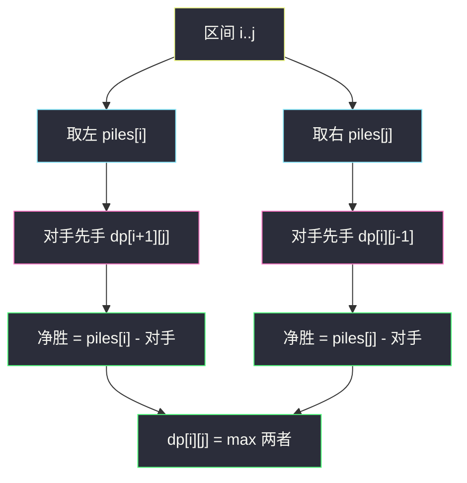
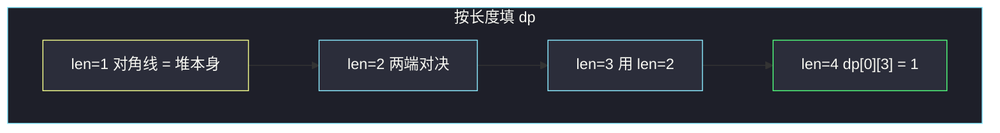

# 石子游戏（博弈区间 DP）

## 一、问题描述

偶数堆石子排成一行，`piles[i]` 是第 `i` 堆的数量。Alice 先手，两人轮流从**当前这一行的两端**取走整整一堆，直到取完。双方都按最优策略，问 Alice 的得分是否**严格大于** Bob。

> 🔗 LeetCode 877：https://leetcode.cn/problems/stone-game/
>
> 数据范围：`2 ≤ piles.length ≤ 500`，长度为偶数；`1 ≤ piles[i] ≤ 500`。
>
> 📚 灵茶题单：**十四、博弈 DP**。标准区间 DP：`dp[i][j]` = 面对子区间 `[i,j]` 的先手，相对后手的最大净胜分。本题还有「先手恒不败 / 官方可直接 true」的观察，但主解必须把区间 DP 讲透，才能迁移到 486。

**示例 1**

```
输入：piles = [5,3,4,5]
输出：true
```

双方最优时 Alice 9、Bob 8，Alice 仍胜。若 Bob 走次优，Alice 有可能拿到两个端点的 5（10 vs 7）。官方案例文字常写成「10>8」，与总和 17 对不上，以最优对局 9>8 为准。

**直观理解**

每一回合只在左右两端里挑一堆。剩下的仍是连续一段，所以子问题是「区间 `[i,j]` 轮到我时能领先多少」。先手选左，则后手变成 `[i+1,j]` 上的先手；净胜分 = `piles[i] - dp[i+1][j]`。选右同理。

---

## 二、暴力解法

递归枚举当前先手取左还是取右，对方最优后再比较。

```python
class Solution:
    def stoneGame(self, piles: list[int]) -> bool:
        def dfs(i, j):
            if i == j:
                return piles[i]
            # 当前先手相对后手的净胜分
            return max(piles[i] - dfs(i + 1, j), piles[j] - dfs(i, j - 1))

        return dfs(0, len(piles) - 1) > 0
```

官方例能过。同一区间被反复计算，时间指数级，`n=500` 不可用。加上 `@cache` 就变成 `O(n²)` 的区间 DP。

### 🔴 瓶颈在哪里

`[i,j]` 只依赖更短的 `[i+1,j]` 和 `[i][j-1]`。按区间长度从小到大填表，每个区间算一次。

---

## 三、优化探索（核心章节）

> 📚 本题在灵茶题单中属于 **十四、博弈 DP**。先手净胜分模板：`dp[i][j] = max(piles[i] - dp[i+1][j], piles[j] - dp[i][j-1])`。Alice 胜 ⇔ `dp[0][n-1] > 0`。

### 3.1 状态

`dp[i][j]` = 只剩下 `piles[i..j]`、轮到当前玩家取时，**先手得分减去后手得分**的最大值（双方最优）。

长度为 1：先手拿走唯一一堆，后手 0，`dp[i][i] = piles[i]`。

### 3.2 转移

当前先手两个选择：

- 取 `piles[i]`：对手在 `[i+1,j]` 上成为先手，对手净胜分为 `dp[i+1][j]`。自己的净胜分 = `piles[i] - dp[i+1][j]`（自己拿了这堆，再减去对手相对自己的领先）。
- 取 `piles[j]`：同理 `piles[j] - dp[i][j-1]`。

取较大者。按 `len = 2..n` 填，保证短区间先算完。

另一种等价定义：`f[i][j]` = 先手在 `[i,j]` 拿到的石子总数，则 `f[i][j] = max(piles[i] + s[i+1][j] - f[i+1][j], …)`，即 `sum(i,j) - min(f[i+1][j], f[i][j-1])`。净胜分版少维护一个区间和，默写更短。



### 3.3 数学观察：偶数堆时 Alice 总能拿到「一种颜色」

把下标涂成黑白相间：偶数下标一色，奇数下标一色。`n` 为偶数时，整段两端颜色不同。Alice 第一次选中某色之后：剩下奇数长度，两端变成**同一色**（对方那色），Bob 被迫拿该色；然后又恢复偶数长度、两端异色，Alice 继续自由选色。于是 Alice **可以强制拿走全部偶数下标，或全部奇数下标**，她选和更大的那种。

因此 Alice 得分 ≥ Bob。两色和不相等时严格领先；相等则平局（如 `[1,1]`，净胜分 0）。LeetCode 本题可直接 `return true` 通过，那是题面特化，**不要当成博弈 DP 的主解**。486 没有偶数长度保证，必须老老实实填表。

### 3.4 一句话核心

> **dp[i][j] = max(取左 − 对手在剩余区间的净胜, 取右 − 对手净胜)；Alice 赢看 dp[0][n-1] > 0。偶数堆可强制取走一色，故本题恒不败。**

---

## 四、代码实现

### Python（主解：区间 DP）

```python
class Solution:
    def stoneGame(self, piles: list[int]) -> bool:
        n = len(piles)
        # dp[i][j]: [i,j] 上先手相对后手的最大净胜分
        dp = [[0] * n for _ in range(n)]
        for i in range(n):
            dp[i][i] = piles[i]
        for length in range(2, n + 1):
            for i in range(n - length + 1):
                j = i + length - 1
                dp[i][j] = max(piles[i] - dp[i + 1][j], piles[j] - dp[i][j - 1])
        return dp[0][n - 1] > 0
```

空间可压成一维（倒着刷 `j`），面试先写二维。

**变量含义**

| 写法 | 含义 |
|------|------|
| `dp[i][i]` | 只剩一堆，先手全拿 |
| `length` | 区间长度，短的先算 |
| `piles[i] - dp[i+1][j]` | 取左后，减去对手在剩余区间的净胜 |
| `dp[0][n-1] > 0` | Alice 严格领先 |

### 观察写法（不作为主解）

```python
class Solution:
    def stoneGame(self, piles: list[int]) -> bool:
        return True
```

能 AC，但 486、石子游戏 II/III 不能这么写。

### Java（最优解：区间 DP）

```java
class Solution {
    public boolean stoneGame(int[] piles) {
        int n = piles.length;
        int[][] dp = new int[n][n];
        for (int i = 0; i < n; i++) {
            dp[i][i] = piles[i];
        }
        for (int length = 2; length <= n; length++) {
            for (int i = 0; i + length - 1 < n; i++) {
                int j = i + length - 1;
                dp[i][j] = Math.max(piles[i] - dp[i + 1][j], piles[j] - dp[i][j - 1]);
            }
        }
        return dp[0][n - 1] > 0;
    }
}
```

---

## 五、具体例子演示

### 5.1 官方示例：按长度填表

`piles = [5, 3, 4, 5]`，`n=4`，总和 17。`dp[i][j]` 是净胜分。

**长度 1**（对角线）：`[5, 3, 4, 5]`

**长度 2**

| 区间 | 取左 | 取右 | dp |
|------|------|------|----|
| `[0,1]` 5,3 | 5-3=2 | 3-5=-2 | 2 |
| `[1,2]` 3,4 | 3-4=-1 | 4-3=1 | 1 |
| `[2,3]` 4,5 | 4-5=-1 | 5-4=1 | 1 |

**长度 3**

| 区间 | 取左 | 取右 | dp |
|------|------|------|----|
| `[0,2]` 5,3,4 | 5-dp[1][2]=5-1=4 | 4-dp[0][1]=4-2=2 | 4 |
| `[1,3]` 3,4,5 | 3-dp[2][3]=3-1=2 | 5-dp[1][2]=5-1=4 | 4 |

**长度 4**

`dp[0][3] = max(5 - dp[1][3], 5 - dp[0][2]) = max(5-4, 5-4) = 1`

Alice 净胜 1：得分 `(17+1)/2 = 9`，Bob 8。`1 > 0`，返回 true。对拍官方输出。

偶数下标和 `5+4=9`，奇数下标和 `3+5=8`。Alice 强制取走偶数下标，正好 9 vs 8，与 DP 一致。她**不能**在 Bob 也最优时保证两个 5（那是 10 vs 7，净胜 3，大于表里的 1，说明那是 Bob 失误）。



完整上三角：

```
j→     0   1   2   3
i=0    5   2   4   1
i=1        3   1   4
i=2            4   1
i=3                5
```

### 5.2 平局边界 `[1,1]`

`dp[0][0]=1`，`dp[1][1]=1`，`dp[0][1]=max(1-1, 1-1)=0`。严格领先不成立。两色和都是 1。区间 DP 返回 false；本题 one-liner `true` 仍会 AC。迁移到 486（平局算先手赢）时改成 `>= 0`。

---

## 六、复杂度分析

| 方法 | 时间 | 空间 | 说明 |
|------|------|------|------|
| 递归无记忆化 | 指数 | `O(n)` 栈 | 超时 |
| 区间 DP（主解） | `O(n²)` | `O(n²)` 或 `O(n)` | `n≤500` 足够 |
| `return true` | `O(1)` | `O(1)` | 仅本题；平局语义含糊 |

---

## 七、对比总结

| 维度 | 暴力递归 | 区间 DP | `return true` |
|------|----------|---------|---------------|
| 正确性 | 对 | 对（严格领先） | 本题 AC；平局时与 DP 不同 |
| 可迁移 | 是 | 是（486 / 石子 II） | 否 |
| 要讲什么 | 选择左右 | 净胜分 + 长度循环 | 黑白染色强制取一色 |

**易错点**

1. **只写 `return true` 当主解**：过不了面试，也过不了 486。
2. **转移加错符号**：取完一堆后是**减去**对手净胜，不是加上对手得分。
3. **循环顺序**：必须先短后长；`i` 从大到小、`j` 从小到大的另一种填法也可以，但不要读未计算的格子。
4. **平局当赢**：本题题面要严格大于；486 是 `≥`。
5. **相信「拿两个 5 一定 10 分」**：那是对手不优时的线路；表里最优净胜是 1。

---

## 八、举一反三

| 题目 | 关系 |
|------|------|
| [486. 预测赢家](https://leetcode.cn/problems/predict-the-winner/) | 同一套区间 DP，长度可为奇数，平局算先手赢 |
| [1140. 石子游戏 II](https://leetcode.cn/problems/stone-game-ii/) | 前缀后缀 + `M` 状态，不再是两端 |
| [1406. 石子游戏 III](https://leetcode.cn/problems/stone-game-iii/) | 只能从剩余的**开头**取 1/2/3 堆 |
| [1690. 石子游戏 VII](https://leetcode.cn/problems/stone-game-vii/) | 两端取，但得分是「剩下的和」 |
| [375. 猜数字大小 II](https://leetcode.cn/problems/guess-number-higher-or-lower-ii/) | 区间 DP 另一经典：枚举猜点 |
| [312. 戳气球](https://leetcode.cn/problems/burst-balloons/) | 区间 DP，枚举最后戳的位置 |

**思想迁移**

- 博弈在数组两端取物：把「相对分」放进区间 DP，短区间喂长区间。偶数长度外加染色观察，只是本题的免费彩蛋。
- 口诀：**「先手净胜 = max(取端 − 对手净胜)；短区间先填；本题可染色，换题就老老实实 DP。」**
