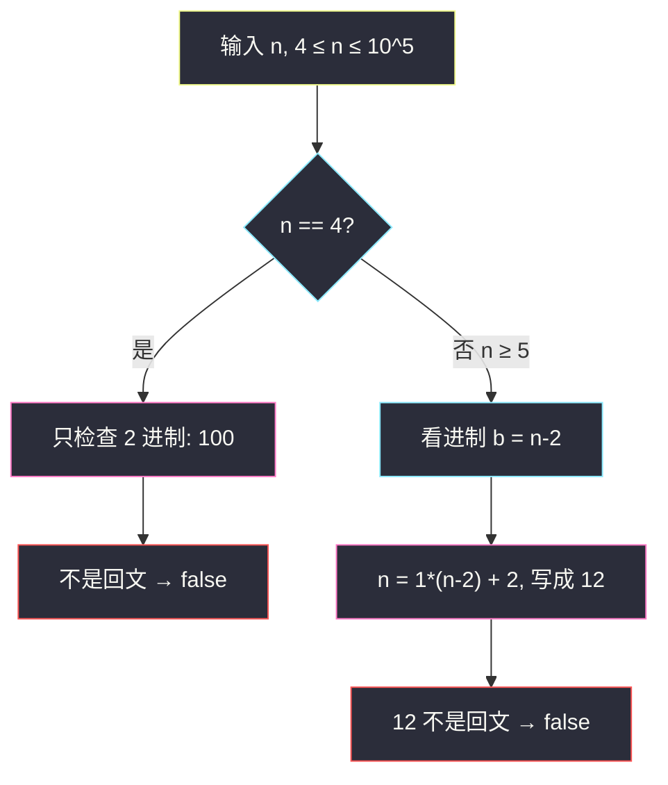

# 严格回文的数字（脑筋急转弯：答案恒为 false）

## 一、问题描述

如果整数 `n` 在 **所有** 进制 `b`（`2 ≤ b ≤ n−2`）下的表示都是回文，就称它是**严格回文**的，返回 `true`；否则返回 `false`。

进制表示按惯例：从高位到低位、不含前导零。回文指这个数位序列正着反着一样。

> 🔗 LeetCode 2396：https://leetcode.cn/problems/strictly-palindromic-number/
>
> 数据范围：`4 ≤ n ≤ 10^5`。
>
> 📚 灵茶题单：**§5.2 脑筋急转弯**（1329 分）。

**示例 1**

```
输入：n = 9
输出：false
解释：在 2 进制下 9 = 1001，这是回文；但题目要求 2 ≤ b ≤ 7 的每一种都回文。
4 进制下 9 = 21，不是回文。所以不是严格回文。
```

**示例 2**

```
输入：n = 4
输出：false
解释：合法进制只剩 b = 2。4 = 100₂，"100" 反转是 "001"，不是回文。
```

**直观理解**

「所有进制都回文」听起来要枚举 `b`、反复做除法取余。约束里 `n` 从 4 开始，而合法进制的**上界刚好是 `n−2`**——盯住这一个进制看，会发现表示几乎永远是两位的 `"12"`，两个字符不相等，直接不是回文。于是对题目给定的全部 `n`，答案**恒为 `false`**。

不要真的去转进制。提交一行 `return false` 即可。

---

## 二、暴力解法

对每个 `b ∈ [2, n−2]`，把 `n` 转成 `b` 进制数位，检查是否回文。有一个失败就返回 `false`；全部成功才 `true`。

```python
class Solution:
    def isStrictlyPalindromic(self, n: int) -> bool:
        def pal_in_base(x: int, b: int) -> bool:
            digits = []
            while x:
                digits.append(x % b)
                x //= b
            return digits == digits[::-1]

        for b in range(2, n - 1):
            if not pal_in_base(n, b):
                return False
        return True
```

单个 `n` 转一次进制是 `O(log n)`，枚举 `O(n)` 个进制，总时间 `O(n log n)`。以本题 `n ≤ 10^5` 的单测规模，暴力其实能过——但这完全走错了方向：你在用算法验证一个**恒假**的命题。

### 🔴 瓶颈在哪里

题面把进制上界设成 `n−2`，不是随手写的。`b = n−2` 时，`n` 的表示有闭式，看一眼就知道不是回文。继续写转换函数，是没读出出题人埋的结构。

---

## 三、优化探索（核心章节）

> 📚 本题在灵茶题单中属于 **§5.2 脑筋急转弯**：先找「会不会所有输入都是同一个答案」，再决定要不要写正经算法。

### 3.1 合法进制区间非空

`4 ≤ n`，所以 `n−2 ≥ 2`，区间 `[2, n−2]` 至少包含 `b = 2`。每个 `n` 都至少要检查一种进制，不存在「没有进制、空条件为真」的空子句。

### 3.2 盯住 `b = n−2`：绝大多数 `n` 写成 `"12"`

把 `n` 除以 `b = n−2`：

```
n = 1 × (n − 2) + 2
```

商是 1，余数是 2。若 `2` 是合法数位（必须严格小于进制），表示就是两位的 `"12"`。

`"12"` 反转是 `"21"`，不相等，**不是回文**。只要这一种进制失败，整体就是 `false`。

`2 < n−2` 当且仅当 `n > 4`。所以：

- **`n ≥ 5`**：`b = n−2 ≥ 3`，数位 `2` 合法，`n` 的 `n−2` 进制就是 `"12"`，直接不是回文。
- **`n = 4`**：`b = n−2 = 2`，数位只能是 `0/1`，不能写 `"12"`。单独算：`4 = 1×2² + 0×2 + 0`，写成 `"100"`，不是回文。

两种情况覆盖了题目全部输入。



### 3.3 为什么一定是两位，不会进到三位数？

`b` 进制下，最小的三位数是 `b²`。这里 `b = n−2`，`b² = (n−2)²`。当 `n ≥ 5` 时 `(n−2)² ≥ 9 > n`，所以 `n < b²`，到不了三位数。

最小的两位数是 `b` 本身。`n > n−2 = b`，所以至少两位。夹在中间，恰好两位，且就是 `1, 2` 这两位。

### 3.4 「某种进制是回文」不能救它

示例 `n = 9` 在 **2 进制**下是 `1001`，确实回文。严格回文要求 **每一种** `b` 都回文，有一个反例就整题为假。`b = n−2 = 7` 时 `9 = 12₇`，已经足够宣判。

不必再检查 `b = 2, 3, …` 里有没有回文——那与答案无关。

### 3.5 题面为什么把上界收到 `n−2`

若上界是 `n−1`，则 `b = n−1` 时：

```
n = 1 × (n − 1) + 1
```

表示是 `"11"`，**是**回文。出题人若允许检查到 `n−1`，「所有进制都回文」仍然会在 `n−2` 处被 `"12"` 打假，答案还是 false；但把上界写成 `n−2`，是故意让你撞上最关键的那个反例，而不是在 `"11"` 上产生错觉。

进制下界是 2 也刚好卡死 `n=4`：没有比 2 更小的合法进制可逃。

### 3.6 一句话核心

> **`n≥5` 时，`n−2` 进制下必为 `"12"`；`n=4` 时是 `"100"`。全部不是回文，直接 `return false`。**

证明一旦写清，代码就没有分支。不要为了「看起来像做了题」去循环进制——那既慢、又掩盖了你其实已经证完。

---

## 四、代码实现

### Python（主解：恒 false）

```python
class Solution:
    def isStrictlyPalindromic(self, n: int) -> bool:
        return False
```

`n` 在签名里用不到。面试时请把 §3 的论证讲出来，不要只丢这一行。

若一定要写「看起来在干活」的版本，至少应只检查 `b = n−2`，而不是循环全部进制：

```python
class Solution:
    def isStrictlyPalindromic(self, n: int) -> bool:
        # 上面已经证明恒 false；若只查关键进制：
        b = n - 2
        if n == 4:
            return False  # 100 in base 2
        # n = 1 * b + 2 → digits [1, 2]
        return False
```

提交请用第一段。第二段仅作讲解，逻辑上仍然直接返回 `false`。

### Java（同样一行）

```java
class Solution {
    public boolean isStrictlyPalindromic(int n) {
        return false;
    }
}
```

---

## 五、具体例子演示

**`n = 9`（官方示例）**。合法 `b` 从 2 到 7。不必全转，但为了「看见恒 false」，把每一位写开：

| 进制 `b` | 除法 | 数位 | 回文? |
|----------|------|------|-------|
| 2 | 9=8+1 | `1001` | 是 |
| 3 | 9=9+0 | `100` | 否 |
| 4 | 9=2×4+1 | `21` | 否 |
| 5 | 9=1×5+4 | `14` | 否 |
| 6 | 9=1×6+3 | `13` | 否 |
| 7 = n−2 | 9=1×7+2 | **`12`** | **否** |

2 进制碰巧回文，但 3 进制起就已经失败。关键反例其实只要最后一行。


**`n = 4`（边界）**。只有 `b=2`：

| 权 | 系数 |
|----|------|
| `2²` | 1 |
| `2¹` | 0 |
| `2⁰` | 0 |

数位 `"100"`，中间是 0、两头不对称，不是回文。

**`n = 5`**。`b` 从 2 到 3。`b = 3 = n−2`：`5 = 1×3 + 2` → `"12"`，不是回文。这是 `"12"` 论证开始成立的最小 `n`。

**`n = 6`**。`b = 4`：`6 = 1×4 + 2` → `"12"`，同样失败。

从 5 往上，模式不再变化：永远在最大合法进制下撞上 `"12"`。

**`n = 10`（再对一次闭式）**。`b = 8`：`10 = 1×8 + 2` → `"12"`。不必列出 2 到 7 进制。提交代码甚至不读 `n`。

把 `n=4,5,9,10` 放在一起看：只有 4 走 `"100"` 这条特例，其余一律 `"12"`，没有第三种形态。约束从 4 起、到 `10^5` 止，全部被这两种盖住。单测再大也不会出现「某天突然变成 true」的 n。

面试时建议按这个顺序讲：先说合法区间非空 → 代入 `b = n−2` 得到商 1 余 2 → 说明 `n>4` 时数位合法且必为两位 → 单独补 `n=4` 的 `"100"` → 结论恒 false。评委听完这段，就不会觉得你是「看了题解只会 return false」。

---

## 六、复杂度分析

| 方法 | 时间 | 空间 | 说明 |
|------|------|------|------|
| 枚举全部进制 | `O(n log n)` | `O(log n)` 数位数组 | 能过但没必要 |
| 只检查 `b = n−2` | `O(1)` | `O(1)` | 已经足够证明 false |
| 直接 `return false`（主解） | `O(1)` | `O(1)` | 证明写在脑子里 |

---

## 七、对比总结

| 维度 | 本题 | 普通「判断回文进制」 |
|------|------|----------------------|
| 要不要转进制 | 不要 | 要 |
| 答案形态 | 对所有合法 `n` 恒 `false` | 依赖具体 `n` 和 `b` |
| 关键观察 | 上界 `n−2` 把 `n` 卡成 `"12"` | 无此结构 |

同类「答案形态被约束写死」的题：Nim 游戏（`n % 4 != 0`）、灯泡开关（答案是 `⌊√n⌋`）。共同点是先证明，再写极短代码。本题比它们更极端：证明完连公式都不用，布尔值钉死在 false。

**易错点**

1. **看见 `n=9` 的 `1001` 就返回 true**：严格 = 每一种进制，不是某一种。
2. **对 `n=4` 生搬 `"12"`**：进制 2 里没有数位 2；要改写成 `"100"`，结论仍是 false。
3. **真去枚举 `b`**：面试会问「为什么这么写」，枚举过不了讲道理这一关。
4. **把 `b ≤ n−1` 记错**：`n` 在 `n−1` 进制下是 `"11"`，那倒是回文。题面故意把上界收到 `n−2`，避开 `"11"`。
5. **担心 `n` 很大时 `"12"` 会变成三位数**：`n < (n−2)²`（`n≥5`）保证仍是两位。

---

## 八、举一反三

| 题目 | 关系 |
|------|------|
| [9. 回文数](https://leetcode.cn/problems/palindrome-number/) | 真的去判断十进制回文，和「恒 false」相反 |
| [504. 七进制数](https://leetcode.cn/problems/base-7/) | 正经做进制转换 |
| [292. Nim 游戏](https://leetcode.cn/problems/nim-game/) | 同属脑筋急转弯：先证答案形态，再写一行 |
| [319. 灯泡开关](https://leetcode.cn/problems/bulb-switcher/) | 证明后变成 `⌊√n⌋`，不要模拟 n 轮 |
| [869. 重新排序得到 2 的幂](https://leetcode.cn/problems/reordered-power-of-2/) | 也是先观察数字结构，而不是硬搜所有排列 |

**思想迁移**

- 约束里出现 `n−2`、`n−1` 这种「跟 n 绑在一起的进制」，优先代入闭式，而不是写通用转换。
- 先问「会不会所有输入同一个答案」，再决定要不要写循环。
- 口诀：**「上界 n−2，写成 12，全是 false。」**
