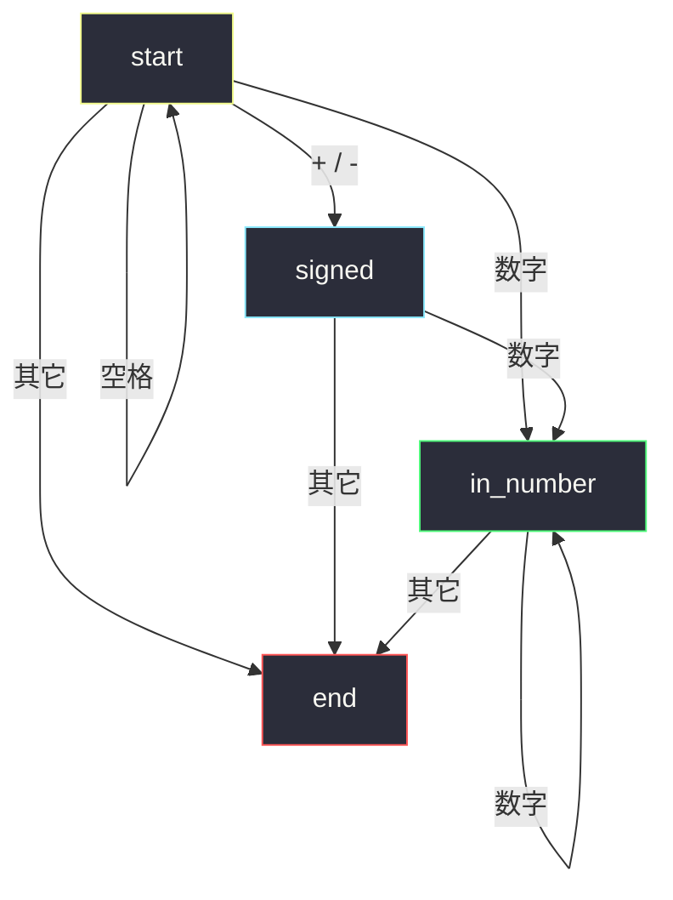
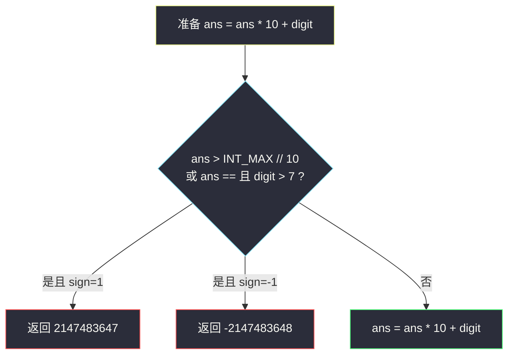

# 字符串转换整数 (atoi)

## 一、问题描述

实现 `atoi`：读入字符串 `s`，按下列顺序解析出一个 32 位有符号整数。

1. 跳过前导空格。
2. 若下一个字符是 `'+'` 或 `'-'`，记下符号（默认正）。
3. 读入连续数字，前导零合法；遇到第一个非数字就**停止**（后面的字全部丢掉）。
4. 若数字超出 32 位范围 `[-2^31, 2^31 - 1]`，夹到边界：正溢出返回 `2147483647`，负溢出返回 `-2147483648`。
5. 读不到任何数字则返回 0。

> 🔗 LeetCode 8：https://leetcode.cn/problems/string-to-integer-atoi/
>
> 数据范围：`0 <= s.length <= 200`，字符为英文字母、数字、空格或 `'+'` `'-'` `'.'`。

**示例 1**

```
输入：s = "42"
输出：42
```

**示例 2**

```
输入：s = "   -42"
输出：-42
解释：跳过空格，读到负号，再读 42。
```

**示例 3**

```
输入：s = "4193 with words"
输出：4193
解释：数字后面的字母使读取停止，前面的 4193 留下。
```

**直观理解**

不是把整串当 Python `int(s)`。是一台小状态机：空格 → 可选符号 → 数字；任何不合拍的字符直接停。溢出在「再乘 10」之前就要拦住。

---

## 二、暴力解法

用正则抠出「可选符号 + 连续数字」，再转整数、夹紧。空串、只有符号、对不上正则都返回 0：

```python
import re

class Solution:
    def myAtoi(self, s: str) -> int:
        m = re.match(r"^\s*([+-]?\d+)", s)
        if not m:
            return 0
        ans = int(m.group(1))
        return max(-2**31, min(ans, 2**31 - 1))
```

Python 大整数让 `int(...)` 不会溢出，最后 clamp 即可。面试里正则常被追问「溢出怎么在乘 10 前判断」，所以主解改成指针扫描。

### 复杂度

- **时间**：`O(n)`。
- **空间**：`O(n)`（正则匹配串）。

### 🔴 瓶颈在哪里

正确性够，但状态被藏进正则。手写指针能看清：空格只在开头吃、符号只吃一次、数字中途遇字母立刻停。溢出判断也必须显式写出来。

---

## 三、优化探索（核心章节）

> 📚 本题在灵茶题单中属于 **栈 · §3.5 表达式解析**。不必真用栈，但解析顺序是固定的状态机：空白 → 符号 → 数字 → 结束。

### 3.1 四个状态



实现时不必真建枚举：三个 `while` / `if` 顺序执行，等价于这条链。读完符号后若不是数字，直接返回 0。

### 3.2 溢出必须在乘 10 之前判断

32 位上限 `INT_MAX = 2147483647`，下限 `INT_MIN = -2147483648`。设当前绝对值是 `ans`，下一位数字是 `digit`。若先算 `ans * 10 + digit`，在 Java / C++ 里已经溢出。应在更新前判断：

- `ans > 214748364`（即 `INT_MAX // 10`）：再乘 10 一定爆
- `ans == 214748364` 且 `digit > 7`：正数会超过 2147483647

负数这边：若按上面条件判爆，返回 `INT_MIN`。恰好卡在 `-2147483648` 时（`ans==214748364` 且 `digit==8`），`digit > 7` 也成立，返回 `INT_MIN`，值仍然正确。



Python 可以先用大整数读完再 `clamp`，下面主解仍写出乘 10 前判断，和 Java 面试同一套逻辑。

### 3.3 必须覆盖的边界

| 输入 | 期望 | 原因 |
|------|------|------|
| `""` / `"   "` | 0 | 没有数字 |
| `"+"` / `"-"` | 0 | 只有符号 |
| `"000123"` | 123 | 前导零照乘 |
| `"2147483648"` | 2147483647 | 正溢出夹上限 |
| `"-91283472332"` | -2147483648 | 负溢出夹下限 |
| `"4193 with words"` | 4193 | 中间非数字停止 |
| `"words and 987"` | 0 | 数字不在开头 |
| `"3.14159"` | 3 | 小数点处停 |
| `"+-12"` | 0 | 符号只能出现一次且紧贴数字 |

### 3.4 一句话核心

> **空格 → 可选正负号 → 连续数字即停；乘 10 前用 `INT_MAX // 10` 判断溢出并夹到 32 位边界。**

---

## 四、代码实现

### Python（主解：指针扫描 + 乘 10 前判溢出）

```python
class Solution:
    def myAtoi(self, s: str) -> int:
        n = len(s)
        i = 0
        while i < n and s[i] == " ":
            i += 1
        if i == n:
            return 0

        sign = 1
        if s[i] in "+-":
            if s[i] == "-":
                sign = -1
            i += 1

        INT_MAX, INT_MIN = 2**31 - 1, -2**31
        ans = 0
        while i < n and s[i].isdigit():
            digit = ord(s[i]) - ord("0")
            if ans > INT_MAX // 10 or (ans == INT_MAX // 10 and digit > 7):
                return INT_MAX if sign == 1 else INT_MIN
            ans = ans * 10 + digit
            i += 1
        return sign * ans
```

**变量含义**

| 变量 | 含义 |
|------|------|
| `i` | 当前扫描下标 |
| `sign` | 1 或 -1，默认正 |
| `ans` | 已读入数字的绝对值 |
| `digit` | 下一位 0..9 |

中间出现 `'.'`、字母、第二份符号，都会因 `isdigit()` 为假而跳出。`"000123"` 前导零不影响，`ans` 从 0 乘起。

### Java（最优解同款，必须判溢出）

```java
class Solution {
    public int myAtoi(String s) {
        int n = s.length(), i = 0;
        while (i < n && s.charAt(i) == ' ') i++;
        if (i == n) return 0;
        int sign = 1;
        if (s.charAt(i) == '+' || s.charAt(i) == '-') {
            if (s.charAt(i) == '-') sign = -1;
            i++;
        }
        int ans = 0;
        int INT_MAX = Integer.MAX_VALUE;       // 2147483647
        while (i < n && Character.isDigit(s.charAt(i))) {
            int digit = s.charAt(i) - '0';
            if (ans > INT_MAX / 10 || (ans == INT_MAX / 10 && digit > 7)) {
                return sign == 1 ? INT_MAX : Integer.MIN_VALUE;
            }
            ans = ans * 10 + digit;
            i++;
        }
        return sign * ans;
    }
}
```

---

## 五、具体例子演示

逐步跟踪指针 `i` 和 `ans`。

**1. `"   -42"`**

| 步 | i | 字符 | 状态 | sign | ans |
|----|---|------|------|------|-----|
| 1–3 | 0..2 | 空格 | 跳过 | 1 | 0 |
| 4 | 3 | `-` | 读符号 | -1 | 0 |
| 5 | 4 | `4` | 数字 | -1 | 4 |
| 6 | 5 | `2` | 数字 | -1 | 42 |
| 结束 | 6 | 结束 | — | — | 返回 `-42` |

**2. `"4193 with words"`**：读完 4193 后遇到空格，停止，返回 4193。后面的单词不参与。

**3. 只有符号 / 空串 / 先字母**

- `""`、`"   "`：跳空格后 `i==n`，返回 0。
- `"+"`、`"-"`：读完符号没有数字，循环不进，返回 0。
- `"words and 987"`：第一个非空字符是字母，不进数字循环，返回 0。
- `"+-12"`：`i` 吃掉 `+`，下一个是 `-`，`isdigit()` 为假，立刻停，返回 0。
- `"3.14159"`：读到 `3` 后遇到 `'.'` 停止，返回 3。

**4. 前导零**：`s = "000123"` → `ans` 依次 0,0,0,1,12,123，返回 123。

**5. 溢出**：`s = "2147483648"`（正，超过 `INT_MAX`）

| 步 | ans（更新前） | digit | 判溢出 | 动作 |
|----|---------------|-------|--------|------|
| … | 214748364 | 8 | `ans == 214748364` 且 `8 > 7` | 返回 **2147483647** |

`s = "-2147483648"` 最后一位是 8：条件同样触发，返回 `INT_MIN`。这个值本身刚好是合法下限，夹完仍是 `-2147483648`。`s = "-91283472332"` 更早就会爆，同样返回 `-2147483648`。

**6. 中间空格**：`"  +  413"` 读完 `+` 后是空格，不是数字，返回 0（不会跳过中间空格再去读 413）。

---

## 六、复杂度分析

| 方法 | 时间 | 空间 | 说明 |
|------|------|------|------|
| 正则 + 大整数 clamp | `O(n)` | `O(n)` | Python 能过，面试弱在溢出 |
| 指针扫描（主解） | `O(n)` | `O(1)` | 每个字符最多看一次 |
| Java 同款 | `O(n)` | `O(1)` | `int` 必须预先判溢出 |

---

## 七、对比总结

| 维度 | 正则 clamp | 指针 + 预判溢出 |
|------|-----------|-----------------|
| 空格/符号/停读 | 藏在模式里 | 三段顺序代码 |
| 溢出 | 读完再夹 | 乘 10 前夹 |
| 跨语言 | Python 省事 | Java/C++ 同一套 |

**易错点**

1. **中间空格当分隔**：`"  1  2"` 应在第二个空格停下，得到 1，不是 12。
2. **符号出现在数字后**：`"+-12"` 读完 `+` 下一个是 `-`，不是数字，返回 0。
3. **先乘 10 再比 `INT_MAX`**：在定长整数里已经未定义；必须用 `INT_MAX // 10`。
4. **溢出只处理正数**：负数要返回 `INT_MIN`，不是把正的上限加负号。
5. **把 `'.'` 当小数继续读**：题目在小数点处停止，`"3.14"` 得到 3。

**模板（§3.5 解析顺序）**

```python
# 1 跳空格  2 可选符号  3 while 数字：先判溢出再 ans*10+d
```

---

## 八、举一反三

| 题目 | 关系 |
|------|------|
| [7. 整数反转](https://leetcode.cn/problems/reverse-integer/) | 同一套「乘 10 前」溢出判断 |
| [65. 有效数字](https://leetcode.cn/problems/valid-number/) | 状态机更完整：符号、小数点、指数 |
| [150. 逆波兰表达式求值](https://leetcode.cn/problems/evaluate-reverse-polish-notation/) | §3.5：token 流 + 栈 |
| [227. 基本计算器 II](https://leetcode.cn/problems/basic-calculator-ii/) | 解析数字 + 运算符优先级 |
| [224. 基本计算器](https://leetcode.cn/problems/basic-calculator/) | 括号嵌套，符号进栈 |

**思想迁移**

- 见到「按规则抠数字」，先画状态：谁只能出现一次、谁遇到非法就停。
- 定长整数累加：永远在 `ans = ans * 10 + d` **之前**和 `INT_MAX // 10` 比。
- 口诀：**「空格符号数字停；乘十之前看 214748364。」**
