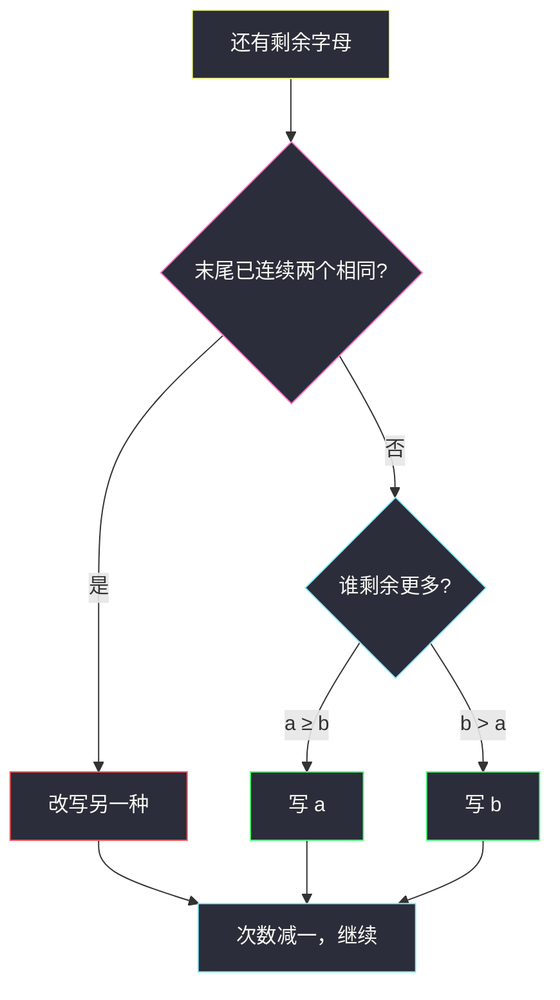
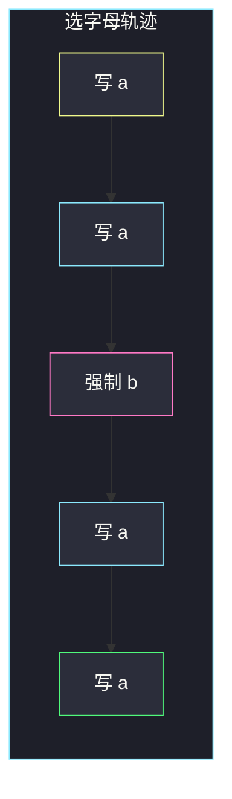

# 不含 AAA 或 BBB 的字符串（重排贪心）

## 一、问题描述

给定两个整数 `a` 和 `b`，构造一个长度恰好为 `a + b` 的字符串，满足：

- 恰好包含 `a` 个字符 `'a'` 和 `b` 个字符 `'b'`
- 不含连续子串 `"aaa"` 或 `"bbb"`（即任意位置都不能连写三个相同字母）

题目保证答案存在。返回其中任意一个合法字符串即可。

> 🔗 LeetCode 984：https://leetcode.cn/problems/string-without-aaa-or-bbb/
>
> 数据范围：`0 <= a, b <= 100`，且保证存在合法构造。存在条件等价于 `a ≤ 2*(b+1)` 且 `b ≤ 2*(a+1)`（多的一方最多用「两个一组」被少的一方隔开）。

**示例 1**

```
输入：a = 1, b = 2
输出："bab"（"abb"、"bba" 也合法）
```

**示例 2**

```
输入：a = 4, b = 1
输出："aabaa"
解释：4 个 a、1 个 b，必须把 b 插在中间，两边各两个 a。
```

**直观理解**

字母只有两种，约束是「同种不能连三个」。多的那种容易扎堆，所以每次应优先消化剩余次数更多的字母；一旦已经连写了两个，就必须换另一种，避免第三个。

---

## 二、暴力解法

`a + b ≤ 200`，理论上可以回溯：每次放 `'a'` 或 `'b'`，剪掉「已经连三个」或「某种字母用超」的分支。

```python
class Solution:
    def strWithout3a3b(self, a: int, b: int) -> str:
        ans = []

        def dfs(ra: int, rb: int) -> bool:
            if ra == 0 and rb == 0:
                return True
            if ra > 0:
                if not (len(ans) >= 2 and ans[-1] == ans[-2] == 'a'):
                    ans.append('a')
                    if dfs(ra - 1, rb):
                        return True
                    ans.pop()
            if rb > 0:
                if not (len(ans) >= 2 and ans[-1] == ans[-2] == 'b'):
                    ans.append('b')
                    if dfs(ra, rb - 1):
                        return True
                    ans.pop()
            return False

        dfs(a, b)
        return ''.join(ans)
```

### 复杂度

- **时间**：最坏接近指数。`a, b ≤ 100` 时未剪枝会爆；剪枝后多数数据能过，但不是本题该写的解。
- **空间**：`O(a + b)` 递归栈。

### 🔴 瓶颈在哪里

保证有解时，每一步其实没有真正的「分叉」：该写谁，看剩余数量和「是否已经连了两个」就能唯一（或几乎唯一）定下来。不必搜索。

---

## 三、优化探索（核心章节）

> 📚 本题在灵茶题单中属于 **贪心 · §5.4 重排元素**。和「重构字符串 / 最长快乐字符串」同一骨架：每次选剩余最多的那种；若选它会破坏「连续上限」，就改选第二多的。

### 3.1 贪心规则

维护已写出的字符串。当还剩字母时：

1. 默认写**剩余次数更多**的那个（相等时写哪个都行，下面实现里写 `'a'`）。
2. 若已经连续写了**两个相同**字母，下一步必须写**另一种**，哪怕它剩余更少。

规则 2 是为了堵住 `"aaa"` / `"bbb"`；规则 1 是为了尽快消耗多数派，给少数派留下「隔离槽」。若先把少数派用光，多数派可能在末尾连成三个——这正是 `a=4, b=1` 时若先写 `b` 再连写 `aaaa` 会失败的原因。

题目保证有解，所以规则 2 要写的那种字母一定还剩至少 1 个。



### 3.2 另一种构造：按 aab / bba 分组铺开

若 `a ≥ b`，多出来的 `a` 用 `"aab"` 消化：先写 `a - b` 组 `"aab"`，再写剩下的 `"ab"`（组数 `2*b - a`，有解时非负；若 `a` 更大则末尾还能再挂最多两个 `a`）。`b > a` 时对称，改用 `"bba"`。

这和「每次写多数派、必要时换人」本质相同：分组法把决策一次做完，循环贪心逐步做。面试默写循环版更不容易算错组数。

### 3.3 一句话核心

> **每次写剩余更多的字母；若已经连写两个相同，就强制换另一个。**

---

## 四、代码实现

### Python（主解）

```python
class Solution:
    def strWithout3a3b(self, a: int, b: int) -> str:
        ans = []
        while a or b:
            if len(ans) >= 2 and ans[-1] == ans[-2]:
                # 已经连续两个相同，必须换
                if ans[-1] == 'a':
                    ans.append('b')
                    b -= 1
                else:
                    ans.append('a')
                    a -= 1
            elif a >= b:
                ans.append('a')
                a -= 1
            else:
                ans.append('b')
                b -= 1
        return ''.join(ans)
```

**变量含义**

| 变量 | 含义 |
|------|------|
| `a, b` | 还剩多少个 `'a'` / `'b'` |
| `ans` | 已写出的字符列表 |

`a, b ≤ 100`，用列表再 `join` 即可，不必纠结字符串拼接。

### Java（最优解同款）

```java
class Solution {
    public String strWithout3a3b(int a, int b) {
        StringBuilder ans = new StringBuilder();
        while (a > 0 || b > 0) {
            int n = ans.length();
            if (n >= 2 && ans.charAt(n - 1) == ans.charAt(n - 2)) {
                if (ans.charAt(n - 1) == 'a') {
                    ans.append('b');
                    b--;
                } else {
                    ans.append('a');
                    a--;
                }
            } else if (a >= b) {
                ans.append('a');
                a--;
            } else {
                ans.append('b');
                b--;
            }
        }
        return ans.toString();
    }
}
```

---

## 五、具体例子演示

### 5.1 `a = 4, b = 1`（逐步选字母）

| 步 | 剩余 (a,b) | 末尾 | 决策 | 写出 |
|----|------------|------|------|------|
| 1 | (4,1) | 空 | `a>b`，写 a | `a` |
| 2 | (3,1) | `a` | 未连两个，`a>b`，写 a | `aa` |
| 3 | (2,1) | `aa` | 已连两个 a，**强制写 b** | `aab` |
| 4 | (2,0) | `ab` | 未连两个，`a>b`，写 a | `aaba` |
| 5 | (1,0) | `ba` | 未连两个，写 a | `aabaa` |

没有 `"aaa"` / `"bbb"`，a 用完 4 个、b 用完 1 个。若第 1 步误先写 b，后面只剩 4 个 a，必出 `"aaa"`。



### 5.2 `a = 1, b = 2`

| 步 | 剩余 | 末尾 | 决策 | 写出 |
|----|------|------|------|------|
| 1 | (1,2) | 空 | `b>a`，写 b | `b` |
| 2 | (1,1) | `b` | `a≥b`，写 a | `ba` |
| 3 | (0,1) | `a` | 写 b | `bab` |

`bab` 合法。回溯可能得到 `abb` / `bba`，题面接受任意一种。

### 5.3 `a = 3, b = 3`

本实现 `a ≥ b` 时写 a，但写完一个 a 后变成 `a=2,b=3`，下一步改写 b，于是交错：

| 步 | 剩余 | 决策 | 写出 |
|----|------|------|------|
| 1 | (3,3) | `a≥b`，写 a | `a` |
| 2 | (2,3) | `b>a`，写 b | `ab` |
| 3 | (2,2) | 写 a | `aba` |
| 4 | (1,2) | 写 b | `abab` |
| 5 | (1,1) | 写 a | `ababa` |
| 6 | (0,1) | 写 b | `ababab` |

不会连写两个（双方一直打平或差 1）。分组法此时也是 `"ab"*3`。

---

## 六、复杂度分析

| 方法 | 时间 | 空间 | 说明 |
|------|------|------|------|
| 回溯 | 指数级 | `O(a+b)` | 能过小数据，非目标 |
| 逐步贪心（主解） | `O(a+b)` | `O(a+b)` | 每步写 1 个字符 |
| 分组铺开 | `O(a+b)` | `O(a+b)` | 组数要算对，易写错边界 |

---

## 七、对比总结

| 维度 | 回溯 | 贪心选多数派 |
|------|------|----------------|
| 决策 | 试探 + 回退 | 剩余数量 + 末尾是否双连 |
| 正确性依赖 | 搜完全空间 | 有解 ⇒ 强制换人时另一种必还有 |

**易错点**

1. **先写少数派**：`a=4,b=1` 先 `b` 再四个 `a`，必出 `aaa`。
2. **只看剩余、不看末尾**：已经 `aa` 时若仍写 a，直接非法。
3. **连写上限记成 3**：禁止的是三个，已经两个就必须换，不是等到三个再处理。
4. **`a=0` 或 `b=0`**：有解时另一侧最多 2，循环会写成 `"aa"` / `"bb"` / `""`，不必特判。
5. **分组法算错 `2*b-a`**：当 `a>2b` 时组数公式要改挂尾，循环贪心更稳。

**模板（§5.4 重排 · 连续上限 2）**

```python
while a or b:
    if 末尾已两个相同:
        写另一种
    else:
        写剩余更多的那个
```

---

## 八、举一反三

| 题目 | 关系 |
|------|------|
| [1405. 最长快乐字符串](https://leetcode.cn/problems/longest-happy-string/) | 三字母版同一贪心：选剩余最多，连续 2 个则改选次多 |
| [767. 重构字符串](https://leetcode.cn/problems/reorganize-string/) | 连续上限变成 1（不能相邻相同），常用堆 |
| [1054. 距离相等的条形码](https://leetcode.cn/problems/distant-barcodes/) | 与 767 同构，条形码计数重排 |
| [2182. 构造限制重复的字符串](https://leetcode.cn/problems/construct-string-with-repeat-limit/) | 连续上限改成 `repeatLimit`，贪心骨架不变 |
| [358. K 距离间隔重排字符串](https://leetcode.cn/problems/rearrange-string-k-distance-apart/) | 相邻约束推广到距离 k |

**思想迁移**

- 「字符重排 + 不能连续太多」→ 每次取剩余最多；取了会违规就取第二。
- 口诀：**「先写多的；已经两个相同，必须换人。」**
