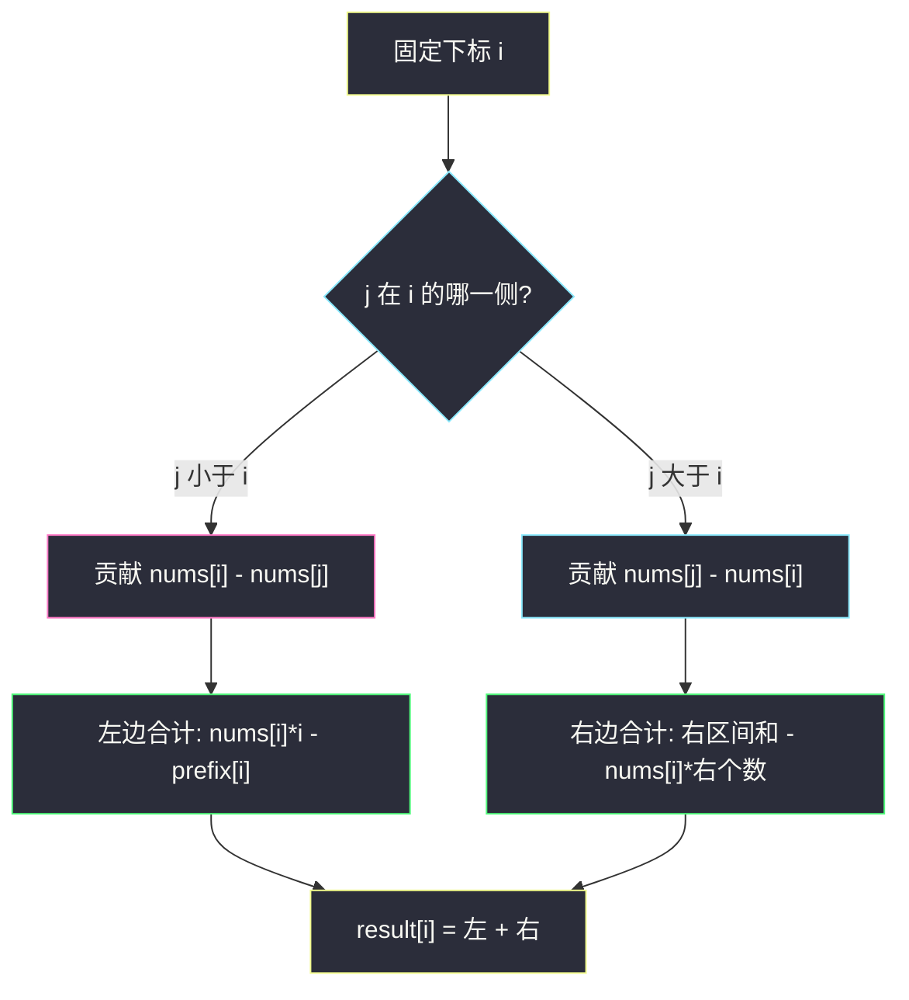
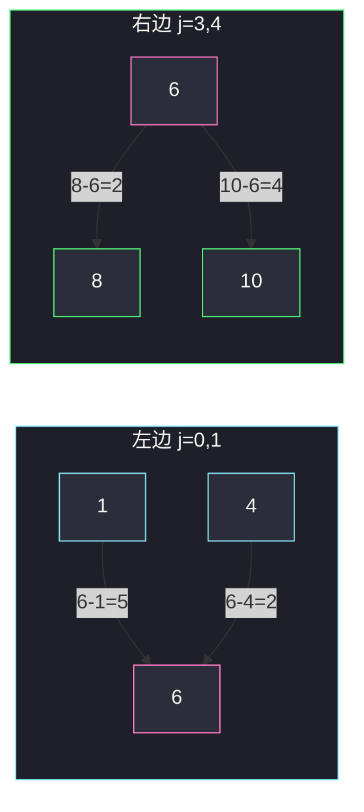

# 有序数组中差绝对值之和（前缀和拆左右）

## 一、问题描述

给你一个**非递减**排序的整数数组 `nums`。对每个下标 `i`，计算

`result[i] = |nums[i] - nums[0]| + |nums[i] - nums[1]| + … + |nums[i] - nums[n-1]|`

返回数组 `result`。

> 🔗 LeetCode 1685：https://leetcode.cn/problems/sum-of-absolute-differences-in-a-sorted-array/
>
> 数据范围：`1 <= nums.length <= 10^5`，`1 <= nums[i] <= 10^4`，`nums` 已按非递减排好。
>
> 📚 灵茶题单：**前缀和 · §1.3 距离和**（1496 分）。

**示例 1**

```
输入：nums = [2,3,5]
输出：[4,3,5]
解释：
result[0] = |2-2| + |2-3| + |2-5| = 4
result[1] = |3-2| + |3-3| + |3-5| = 3
result[2] = |5-2| + |5-3| + |5-5| = 5
```

**示例 2**

```
输入：nums = [1,4,6,8,10]
输出：[24,15,13,15,21]
```

**直观理解**

每个位置都要跟全数组比一遍「差的绝对值再求和」。无序时这是 `O(n²)` 的距离和；**有序之后绝对值可以拆掉**：左边全是「我减它」，右边全是「它减我」，于是变成两次区间和，前缀和一次算完。

---

## 二、暴力解法

对每个 `i` 扫一遍 `j`：

```python
class Solution:
    def getSumAbsoluteDifferences(self, nums: List[int]) -> List[int]:
        n = len(nums)
        result = [0] * n
        for i in range(n):
            for j in range(n):
                result[i] += abs(nums[i] - nums[j])
        return result
```

### 复杂度

- **时间**：`O(n²)`。`n` 达 `10^5`，超时。
- **空间**：`O(1)` 额外（不计答案数组）。

### 🔴 瓶颈在哪里

绝对值让每一对 `(i, j)` 都像独立加法。但 `nums` 已经排好序：对固定的 `i`，所有 `j < i` 的符号都相同，所有 `j > i` 的符号也相同。不必一对对取 `abs`，改成「左边和 / 右边和」各一次减法。

---

## 三、优化探索（核心章节）

> 📚 本题在灵茶题单中属于 **§1.3 距离和**。一维有序点到其余点的曼哈顿距离，标准手段就是前缀和拆左右。

### 3.1 拆掉绝对值

`nums` 非递减，所以：

- `j < i`：`nums[j] ≤ nums[i]`，`|nums[i] - nums[j]| = nums[i] - nums[j]`
- `j > i`：`nums[j] ≥ nums[i]`，`|nums[i] - nums[j]| = nums[j] - nums[i]`
- `j = i`：贡献 `0`，可以忽略

于是

```
result[i]
  = Σ_{j=0..i-1} (nums[i] - nums[j])     // 左边 i 个数
  + Σ_{j=i+1..n-1} (nums[j] - nums[i])   // 右边 n-i-1 个数
```

左边提出 `nums[i]`：

```
左边 = nums[i] * i - (nums[0] + … + nums[i-1])
```

右边提出 `-nums[i]`：

```
右边 = (nums[i+1] + … + nums[n-1]) - nums[i] * (n - i - 1)
```

### 3.2 前缀和一次取出

令 `prefix[0] = 0`，`prefix[k] = nums[0] + … + nums[k-1]`（前 `k` 个数的和）。则：

- 左边区间和 `nums[0..i-1]` = `prefix[i]`
- 右边区间和 `nums[i+1..n-1]` = `prefix[n] - prefix[i+1]`
- 全数组和 = `prefix[n]`

代入：

```
result[i] = nums[i] * i - prefix[i]
          + (prefix[n] - prefix[i+1]) - nums[i] * (n - i - 1)
```

扫一遍 `i` 即可。不必真的建 `prefix` 数组：从左往右累加 `left_sum`，右边用 `total - left_sum - nums[i]` 也能写。



### 3.3 一个等价变形

把左右合并，用全数组和 `S = prefix[n]`：

```
result[i] = nums[i] * (2*i - n + 1) - 2 * prefix[i] + S
```

推导：左边 `i*nums[i] - prefix[i]`，右边 `(S - prefix[i] - nums[i]) - nums[i]*(n-i-1)`，加起来即上式。面试写「左右分开」更不容易算错下标。

### 3.4 一句话核心

> **有序 ⇒ 绝对值按左右拆号；左边是「我 × 个数 − 左和」，右边是「右和 − 我 × 个数」，前缀和 `O(1)` 取出。**

---

## 四、代码实现

### Python（主解：前缀和）

```python
class Solution:
    def getSumAbsoluteDifferences(self, nums: List[int]) -> List[int]:
        n = len(nums)
        prefix = [0] * (n + 1)
        for i, x in enumerate(nums):
            prefix[i + 1] = prefix[i] + x
        total = prefix[n]
        result = [0] * n
        for i, x in enumerate(nums):
            left = x * i - prefix[i]
            right = (total - prefix[i + 1]) - x * (n - i - 1)
            result[i] = left + right
        return result
```

滚动版，少一个数组：

```python
class Solution:
    def getSumAbsoluteDifferences(self, nums: List[int]) -> List[int]:
        n = len(nums)
        total = sum(nums)
        left_sum = 0
        result = [0] * n
        for i, x in enumerate(nums):
            right_sum = total - left_sum - x
            result[i] = x * i - left_sum + right_sum - x * (n - i - 1)
            left_sum += x
        return result
```

**变量含义**

| 变量 | 含义 |
|------|------|
| `prefix[k]` | `nums[0] + … + nums[k-1]` |
| `left` | `i` 左侧全部 `|x - nums[j]|` |
| `right` | `i` 右侧全部 `|x - nums[j]|` |
| `left_sum` | 滚动版里已经扫过的左侧元素和 |

### Java

```java
class Solution {
    public int[] getSumAbsoluteDifferences(int[] nums) {
        int n = nums.length;
        int[] prefix = new int[n + 1];
        for (int i = 0; i < n; i++) {
            prefix[i + 1] = prefix[i] + nums[i];
        }
        int[] result = new int[n];
        for (int i = 0; i < n; i++) {
            int left = nums[i] * i - prefix[i];
            int right = (prefix[n] - prefix[i + 1]) - nums[i] * (n - i - 1);
            result[i] = left + right;
        }
        return result;
    }
}
```

---

## 五、具体例子演示

用示例 2：`nums = [1, 4, 6, 8, 10]`，`n = 5`。

```
prefix:  k     0  1  2   3   4   5
         值    0  1  5  11  19  29
```

`prefix[5] = 29` 是全数组和。挑中间的 `i = 2`（值为 `6`）把左右拆开，再核对两端。

### 5.1 拆开 `i = 2`（值为 6）

左边 2 个数 `[1, 4]`：

```
6*2 - prefix[2] = 12 - 5 = 7
逐项核：|6-1| + |6-4| = 5 + 2 = 7
```

右边 2 个数 `[8, 10]`：

```
(prefix[5] - prefix[3]) - 6*(5-2-1)
= (29 - 11) - 6*2
= 18 - 12 = 6
逐项核：|6-8| + |6-10| = 2 + 4 = 6
```

`result[2] = 7 + 6 = 13`，和官方输出一致。



### 5.2 其余下标（同一套公式）

| i | x | 左边 `x*i - prefix[i]` | 右边 `(29-prefix[i+1]) - x*(4-i)` | result |
|---|---|------------------------|-------------------------------------|--------|
| 0 | 1 | `0 - 0 = 0` | `(29-1) - 1*4 = 24` | 24 |
| 1 | 4 | `4 - 1 = 3` | `(29-5) - 4*3 = 12` | 15 |
| 2 | 6 | `12 - 5 = 7` | `(29-11) - 6*2 = 6` | 13 |
| 3 | 8 | `24 - 11 = 13` | `(29-19) - 8*1 = 2` | 15 |
| 4 | 10 | `40 - 19 = 21` | `(29-29) - 10*0 = 0` | 21 |

两端的「空一侧」自然得 0：`i = 0` 没有左边，`i = n-1` 没有右边。输出 `[24, 15, 13, 15, 21]` ✓。

回看示例 1 `[2, 3, 5]`：`prefix = [0, 2, 5, 10]`。`i = 0` 时右边 `(10-2) - 2*2 = 4`；`i = 1` 时左 `3-2=1`、右 `(10-5)-3*1=2` 合计 3。与逐项 `abs` 一致。

---

## 六、复杂度分析

| 方法 | 时间 | 空间 | 说明 |
|------|------|------|------|
| 双重循环取 `abs` | `O(n²)` | `O(1)` | `n = 10^5` 超时 |
| 前缀和拆左右（主解） | `O(n)` | `O(n)` 或 `O(1)` 额外 | 每个 `i` 常数时间 |

答案数组本身 `O(n)`，滚动版额外空间 `O(1)`。

---

## 七、对比总结

| 维度 | 暴力 | 前缀和 |
|------|------|--------|
| 绝对值 | 每对都算 | 有序后按左右定号 |
| 区间和 | 重复累加 | `prefix` 一次预处理 |
| 下标 | 无坑 | 左边个数是 `i`（0-based），右边是 `n-i-1` |

**易错点**

1. **右边个数写成 `n-i`**：`i` 自己不能算进右边，必须是 `n-i-1`。
2. **`prefix[i]` 的定义混乱**：本文 `prefix[i]` = 前 `i` 个之和、不含 `nums[i]`。若建成 `prefix[i] = nums[0]+…+nums[i]`，左边要改成 `prefix[i-1]`，`i = 0` 还要特判。
3. **数组并非「严格递增」**：相等时绝对值为 0，公式仍然成立（`≤` / `≥` 取等即可）。
4. **溢出**：本题 `result[i]` 最大约 `10^9`，32 位够用；同类题若 `nums[i]` 更大，Java 要用 `long` 再转回。

**模板（§1.3 有序距离和）**

```python
left = x * i - prefix[i]
right = (total - prefix[i + 1]) - x * (n - i - 1)
```

---

## 八、举一反三

| 题目 | 关系 |
|------|------|
| [238. 除自身以外数组的乘积](https://leetcode.cn/problems/product-of-array-except-self/) | 同样「左右各扫一遍」，只是乘法版 |
| [303. 区域和检索 - 数组不可变](https://leetcode.cn/problems/range-sum-query-immutable/) | 前缀和取出任意区间 |
| [462. 最小操作次数使数组元素相等 II](https://leetcode.cn/problems/minimum-moves-to-equal-array-elements-ii/) | 一维绝对值距离，中位数是最优汇合点 |
| [2448. 使数组相等的最小开销](https://leetcode.cn/problems/minimum-cost-to-make-array-equal/) | 带权绝对值距离，仍按有序拆左右 |
| [2615. 等值距离和](https://leetcode.cn/problems/sum-of-distances/) | 相同值下标的距离和，分组后再用本题公式 |

**思想迁移**

- 见到「每个点到其余点的 `|x_i - x_j|`」，先问数组能不能排序（或已经有序）。能排序就把绝对值拆成左右两段区间和。
- 口诀：**「有序拆符号，左边我减它，右边它减我；前缀和取出区间。」**
