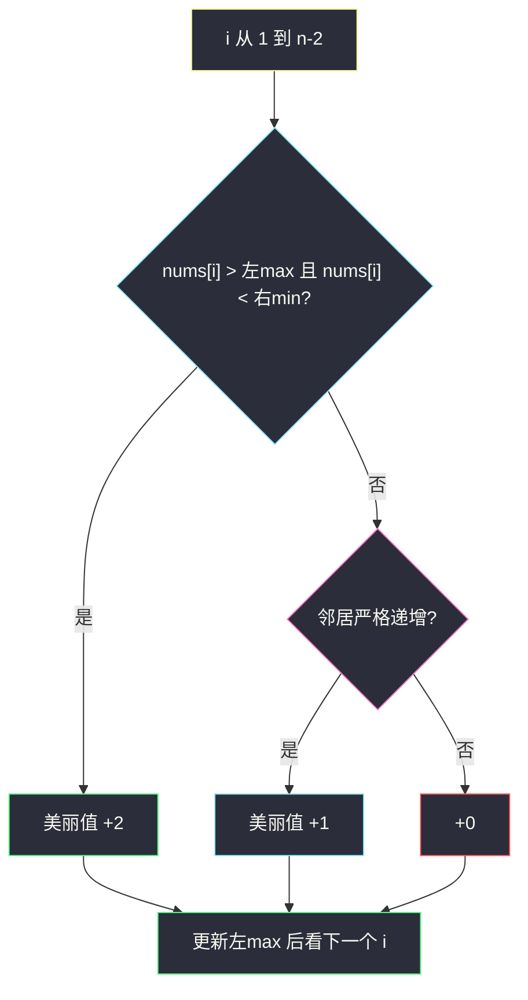
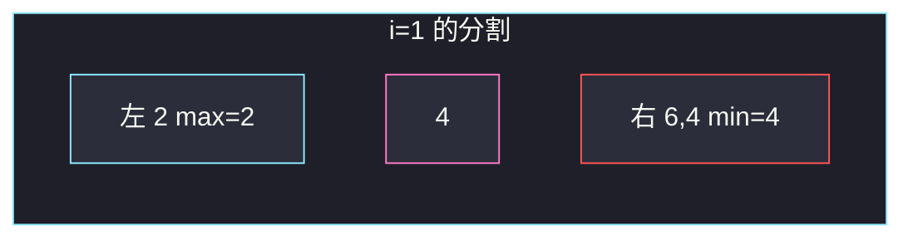

# 数组美丽值求和（前后缀分解）

## 一、问题描述

给你下标从 0 开始的整数数组 `nums`。对每个 `i ∈ [1, n-2]`（两端不下标）定义美丽值：

- **2**：`nums[i]` **严格大于左边所有数**，并且 **严格小于右边所有数**；
- 否则若 `nums[i-1] < nums[i] < nums[i+1]`：**1**（只是局部递增三元组）；
- 否则：**0**。

返回所有这些 `i` 的美丽值之和。2 和 1 不叠加：够格拿 2 就只计 2。

> 🔗 LeetCode 2012：https://leetcode.cn/problems/sum-of-beauty-in-the-array/
>
> 数据范围：`3 ≤ n ≤ 10^5`，`1 ≤ nums[i] ≤ 10^5`。
>
> 📚 灵茶题单：**专题：前后缀分解**。条件「比左边所有都大、比右边所有都小」= 比左前缀最大值大、比右后缀最小值小。预处理 `prefix_max` / `suffix_min` 后每个 `i` 判断 `O(1)`。

**示例 1**

```
输入：nums = [1,2,3]
输出：2
解释：只有 i=1。2 大于左边全部（1），小于右边全部（3），美丽值 2。
```

**示例 2**

```
输入：nums = [2,4,6,4]
输出：1
解释：i=1 的 4 只满足局部 2<4<6，得 1；i=2 的 6 右边有 4，得 0。
```

**示例 3**

```
输入：nums = [3,2,1]
输出：0
解释：i=1 的 2 既不是全局峰，也不是局部递增。
```

**直观理解**

「比左边所有都大」看左半段最大值；「比右边所有都小」看右半段最小值。这是前后缀的经典拆法。局部三个数的比较不需要预处理，当场看邻居即可。

---

## 二、暴力解法

对每个 `i`，再扫一遍左边求 max、右边求 min。

```python
class Solution:
    def sumOfBeauties(self, nums: list[int]) -> int:
        n = len(nums)
        ans = 0
        for i in range(1, n - 1):
            if nums[i] > max(nums[:i]) and nums[i] < min(nums[i + 1 :]):
                ans += 2
            elif nums[i - 1] < nums[i] < nums[i + 1]:
                ans += 1
        return ans
```

官方三例都能过。每个 `i` 扫描左右，总时间 `O(n²)`，`n=10^5` 超时。

### 🔴 瓶颈在哪里

`max(nums[0..i-1])` 随 `i` 右移只多看一个数；`min(nums[i+1..n-1])` 可以先从右往左预处理成数组。每个 `i` 变成两次比较。

---

## 三、优化探索（核心章节）

> 📚 本题在灵茶题单中属于 **专题：前后缀分解**。模板：`prefix_max[i] = max(nums[0..i])`，`suffix_min[i] = min(nums[i..n-1])`。判断 2 分时看的是 **不含 i 自己** 的左 max、右 min。

### 3.1 分割点

对下标 `i`，数组被切成三段：左 `[0..i-1]`、自己、右 `[i+1..n-1]`。

```
        左 max          nums[i]         右 min
    [  0 .. i-1  ]        i        [ i+1 .. n-1 ]
```

得 2 的充要条件：`nums[i] > prefix_max[i-1]` 且 `nums[i] < suffix_min[i+1]`。

得 1：上面不成立，但邻居满足 `nums[i-1] < nums[i] < nums[i+1]`。

注意：若已得 2，则邻居不等式自动成立（左邻居 ≤ 左 max < 自己 < 右 min ≤ 右邻居），所以先判 2 再判 1，不会漏、也不会重复加。



### 3.2 预处理

```
suffix_min[n-1] = nums[n-1]
从 i = n-2 降到 0:
    suffix_min[i] = min(suffix_min[i+1], nums[i])

左 max 可以边扫边维护，不必整表：
pre_max = nums[0]
对 i = 1 .. n-2:
    用 pre_max 与 suffix_min[i+1] 判断
    再 pre_max = max(pre_max, nums[i])
```

`pre_max` 必须在判断**之后**再并入 `nums[i]`，否则变成「含自己的左 max」，永远无法严格大于。

### 3.3 一句话核心

> **先备好不含 i 的左 max / 右 min；大于左 max 且小于右 min 得 2，否则只看三个邻居能否得 1。**

---

## 四、代码实现

### Python（主解）

```python
class Solution:
    def sumOfBeauties(self, nums: list[int]) -> int:
        n = len(nums)
        suf = [0] * n
        suf[-1] = nums[-1]
        for i in range(n - 2, -1, -1):
            suf[i] = min(suf[i + 1], nums[i])
        pre_max = nums[0]
        ans = 0
        for i in range(1, n - 1):
            if nums[i] > pre_max and nums[i] < suf[i + 1]:
                ans += 2
            elif nums[i - 1] < nums[i] < nums[i + 1]:
                ans += 1
            pre_max = max(pre_max, nums[i])
        return ans
```

**变量含义**

| 写法 | 含义 |
|------|------|
| `suf[i]` | `min(nums[i..n-1])` |
| `suf[i+1]` | 严格右边的最小值 |
| `pre_max` | 判断前是 `max(nums[0..i-1])` |
| 先 2 后 1 | 互斥计分 |

### Java（最优解）

```java
class Solution {
    public int sumOfBeauties(int[] nums) {
        int n = nums.length;
        int[] suf = new int[n];
        suf[n - 1] = nums[n - 1];
        for (int i = n - 2; i >= 0; i--) {
            suf[i] = Math.min(suf[i + 1], nums[i]);
        }
        int preMax = nums[0], ans = 0;
        for (int i = 1; i <= n - 2; i++) {
            if (nums[i] > preMax && nums[i] < suf[i + 1]) {
                ans += 2;
            } else if (nums[i - 1] < nums[i] && nums[i] < nums[i + 1]) {
                ans += 1;
            }
            preMax = Math.max(preMax, nums[i]);
        }
        return ans;
    }
}
```

---

## 五、具体例子演示

### 5.1 官方示例 1：画出分割点

`nums = [1,2,3]`。只有 `i=1`。

```
左 [1]  max=1     自己 2     右 [3]  min=3
```

`2 > 1` 且 `2 < 3` → 2。对拍官方输出 2。局部 `1<2<3` 也成立，但已经拿 2，不再加 1。

### 5.2 官方示例 2：逐步跟踪每个 i

`nums = [2,4,6,4]`。`n=4`，要看 `i=1,2`。

后缀最小：

| i | nums[i] | suf[i] = min(i..末) |
|---|---------|---------------------|
| 3 | 4 | 4 |
| 2 | 6 | min(6,4)=4 |
| 1 | 4 | min(4,4)=4 |
| 0 | 2 | min(2,4)=2 |

从左扫，`pre_max` 初值 `nums[0]=2`。

| i | nums[i] | 左 max | 右 min `suf[i+1]` | 全局? | 局部? | 分 | 之后 pre_max |
|---|--------|--------|-------------------|-------|-------|----|--------------|
| 1 | 4 | 2 | suf[2]=4 | 4>2 且 4<4？否 | 2<4<6 是 | 1 | max(2,4)=4 |
| 2 | 6 | 4 | suf[3]=4 | 6>4 且 6<4？否 | 4<6<4 否 | 0 | 6 |

和 = 1。对拍官方。



`i=1` 时 4 没有严格小于右 min（右 min 也是 4），全局失败；邻居仍递增，拿 1。`i=2` 的 6 被右边的 4 挡住，局部也不是递增。

### 5.3 官方示例 3

`[3,2,1]`，`i=1`：左 max=3，`2>3`？否。局部 `3<2<1`？否。得 0。对拍官方。

### 5.4 左有相等时不能给 2

`[2, 3, 3, 4]`，`i=2` 的第二个 3：左 max 已是 3，`3>3` 失败。局部 `3<3<4` 也失败。得 0。严格大于必须连相等都不行。

---

## 六、复杂度分析

| 方法 | 时间 | 空间 | 说明 |
|------|------|------|------|
| 每个 i 再扫左右 | `O(n²)` | `O(1)` | 超时 |
| 后缀 min + 滚动左 max（主解） | `O(n)` | `O(n)` | `suf` 数组 |
| 再开 prefix_max 表 | `O(n)` | `O(n)` | 与主解同阶 |

---

## 七、对比总结

| 维度 | 暴力 | 前后缀 |
|------|------|--------|
| 左 max / 右 min | 每个 i 重算 | 预处理 / 滚动 |
| 2 分判定 | 语义相同 | `> pre_max` 且 `< suf[i+1]` |
| 1 分 | 三个邻居 | 同样当场比 |

**易错点**

1. **左 max 含 `nums[i]`**：先更新再比较，自己和自己比永远得不到「严格大于」。
2. **右 min 含 `nums[i]`**：得 2 看的是 `i+1..n-1`，用 `suf[i+1]` 不是 `suf[i]`。
3. **两端也计分**：`i` 只在 `[1, n-2]`。
4. **2 和 1 都加**：题意是 if-else，拿 2 就不要再加 1。
5. **`≥` 当成严格**：左边有相等元素时不能给 2。
6. **只看邻居就给 2**：示例 2 的 `i=1` 邻居递增但右边还有更小的 4，只能给 1。

---

## 八、举一反三

| 题目 | 关系 |
|------|------|
| [2256. 最小平均差](https://leetcode.cn/problems/minimum-average-difference/) | 同批前后缀：枚举刀口看左右 |
| [724. 寻找数组的中心下标](https://leetcode.cn/problems/find-pivot-index/) | 左右和，空段当 0 |
| [2874. 有序三元组中的最大值 II](https://leetcode.cn/problems/maximum-value-of-an-ordered-triplet-ii/) | 枚举中间，左 max、右 max |
| [2908. 元素和最小的山形三元组 I](https://leetcode.cn/problems/minimum-sum-of-mountain-triplets-i/) | 左右更小元素 |
| [915. 分割数组](https://leetcode.cn/problems/partition-array-into-disjoint-intervals/) | 左 max ≤ 右 min 的最左刀口 |
| [121. 买卖股票的最佳时机](https://leetcode.cn/problems/best-time-to-buy-and-sell-stock/) | 滚动维护「左边最小值」 |

**思想迁移**

- 「比某一侧所有元素都 …」先变成那一侧的 max / min。
- 口诀：**「左 max、右 min 都不含自己；先判全局 2，再判局部 1。」**
