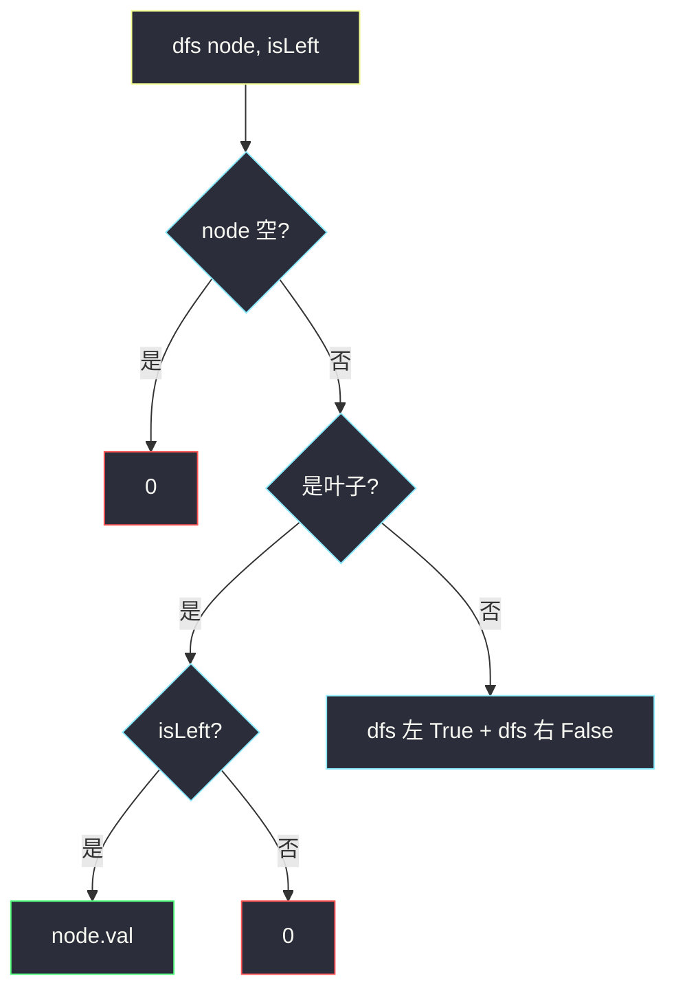
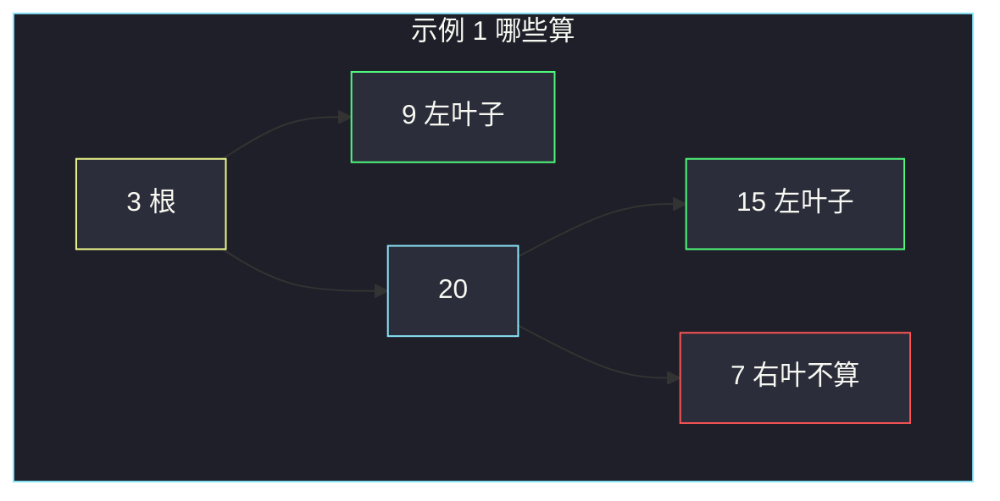

# 左叶子之和（父看左孩 · 不是左子树所有叶）

## 一、问题描述

给定二叉树根节点 `root`，返回所有**左叶子**的值之和。左叶子 = **某个节点的左孩子**，且该节点自己没有左右子。根不算左叶子（它没有父）。

> 🔗 LeetCode 404：https://leetcode.cn/problems/sum-of-left-leaves/
>
> 数据范围：节点数 `[1, 1000]`，`-1000 <= Node.val <= 1000`。
>
> 📚 灵神题单 **§2.1 遍历二叉树**。

**示例 1**

```
输入：root = [3,9,20,null,null,15,7]
输出：24
树形：
      3
     / \
    9   20
       /  \
      15   7
左叶子：9（3 的左孩且为叶）、15（20 的左孩且为叶）。7 是右叶子，不算。9+15=24。
```

**示例 2**

```
输入：root = [1]
输出：0
解释：单独一个根不是左叶子。
```

**直观理解**

「左」是相对**父亲**说的：我是不是爸爸的左孩子。不是「长在左子树里的所有叶子」——右子树里也可以有左叶子（示例里的 15）。

---

## 二、暴力解法

先收集全部叶子，再判断每个叶子是不是左孩子。要知道「是不是左孩子」，遍历时得带父亲信息，或建父指针。直接带一个 `is_left` 标记更干净，见下一章。若误把「左子树里所有叶子」相加，示例 1 会得到 `9`（丢掉 15）或把 7 也算进去，都错。

```python
class Solution:
    def sumOfLeftLeaves(self, root: Optional[TreeNode]) -> int:
        leaves = []

        def dfs(node: Optional[TreeNode]) -> None:
            if not node:
                return
            if not node.left and not node.right:
                leaves.append(node)
            dfs(node.left)
            dfs(node.right)

        dfs(root)
        # 没有父指针，根本判不了「左」——这条路走不通
        return 0
```

### 🔴 瓶颈在哪里

叶子本身看不出左右。信息必须在**父亲访问它的那一刻**带下去，或父亲当场检查 `node.left` 是不是叶子。

---

## 三、优化探索（核心章节）

> 📚 灵神 **§2.1 遍历二叉树**：遍历时多带一个布尔，表示「这次是从左边走进来的」。

### 3.1 带 isLeft

```
dfs(node, is_left):
    空 → 0
    叶子 → is_left ? node.val : 0
    否则 → dfs(左, True) + dfs(右, False)
```

根调用 `dfs(root, False)`：根不是任何人的左孩子。



### 3.2 父亲现场检查

不必把标记传到孩子：在 `node` 上若 `node.left` 存在且左右都空，就把 `node.left.val` 加上，再照常递归两边。和 `is_left` 等价，默写任选。

### 3.3 一句话核心

> **左叶子看父亲：我是左孩并且我没有孩子；根和右叶子都不算。**

---

## 四、代码实现

### Python（主解：isLeft 递归）

```python
class Solution:
    def sumOfLeftLeaves(self, root: Optional[TreeNode]) -> int:
        def dfs(node: Optional[TreeNode], is_left: bool) -> int:
            if not node:
                return 0
            if not node.left and not node.right:
                return node.val if is_left else 0
            return dfs(node.left, True) + dfs(node.right, False)

        return dfs(root, False)
```

**等价：父亲检查左孩**

```python
class Solution:
    def sumOfLeftLeaves(self, root: Optional[TreeNode]) -> int:
        if not root:
            return 0
        ans = 0
        left = root.left
        if left and not left.left and not left.right:
            ans += left.val
        return ans + self.sumOfLeftLeaves(root.left) + self.sumOfLeftLeaves(root.right)
```

单节点：`dfs(1, False)` 是叶子但 `is_left=False`，返回 0。

---

## 五、具体例子演示

示例 1，标出每个节点角色：

```
          3 根（不是左叶子）
         / \
   左叶子 9   20 内部
           /  \
    左叶子 15   7 右叶子（不算）
```

| 调用 | is_left | 角色 | 贡献 |
|------|---------|------|------|
| `dfs(3, F)` | 否 | 内部 | 0+24 |
| `dfs(9, T)` | 是 | 叶子 | **9** |
| `dfs(20, F)` | 否 | 内部 | 15+0 |
| `dfs(15, T)` | 是 | 叶子 | **15** |
| `dfs(7, F)` | 否 | 叶子 | **0** |

和 = 24。

再看 ` [1,2,3,4,5]`：

```
      1
     / \
    2   3
   / \
  4   5
```

4 是左叶子；5 是 2 的右叶子；3 是 1 的右叶子。答案只有 **4**。若把「左子树所有叶子」相加会得到 4+5=9，错。



---

## 六、复杂度分析

| 方法 | 时间 | 空间 | 说明 |
|------|------|------|------|
| isLeft DFS（主解） | `O(n)` | `O(h)` 栈 | 每节点一次 |
| 父亲检查左孩 | `O(n)` | `O(h)` | 同上 |

---

## 七、对比总结

| 说法 | 对不对 |
|------|--------|
| 左子树里的叶子 | 错（漏掉右子里的左叶子，可能多算左子里的右叶子） |
| 所有叶子的左值 | 无意义 |
| 父.left 且该节点为叶 | **对** |

**易错点**

1. 根当左叶子：单节点答案变成 `root.val`。
2. 左孩子是内部节点时把 `node.left.val` 也加上——它不是叶子。
3. 只递归左子树：15 这种「右子里的左叶」全丢。
4. 和 [257. 所有路径](https://leetcode.cn/problems/binary-tree-paths/) 搞混：本题不需要路径，只认身份。

---

## 八、举一反三

| 题目 | 关系 |
|------|------|
| [257. 二叉树的所有路径](https://leetcode.cn/problems/binary-tree-paths/) | 同批叶子题，见 `binary-tree-paths.md` |
| [513. 找树左下角的值](https://leetcode.cn/problems/find-bottom-left-tree-value/) | 「最底层最靠左」，不是左叶子 |
| [872. 叶子相似的树](https://leetcode.cn/problems/leaf-similar-trees/) | 从左到右收集**所有**叶子 |
| [1325. 删除给定值的叶子节点](https://leetcode.cn/problems/delete-leaves-with-a-given-value/) | 后序删叶，先识别叶子再动手 |
| [111. 二叉树的最小深度](https://leetcode.cn/problems/minimum-depth-of-binary-tree/) | 同批：最近叶子，见 `minimum-depth-of-binary-tree.md` |

**思想迁移**

- 口诀：**「左叶子问爹：我是左孩且没娃；根和右叶都是零。」**
