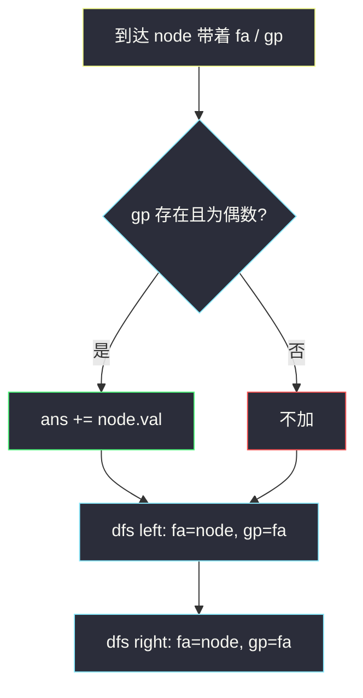
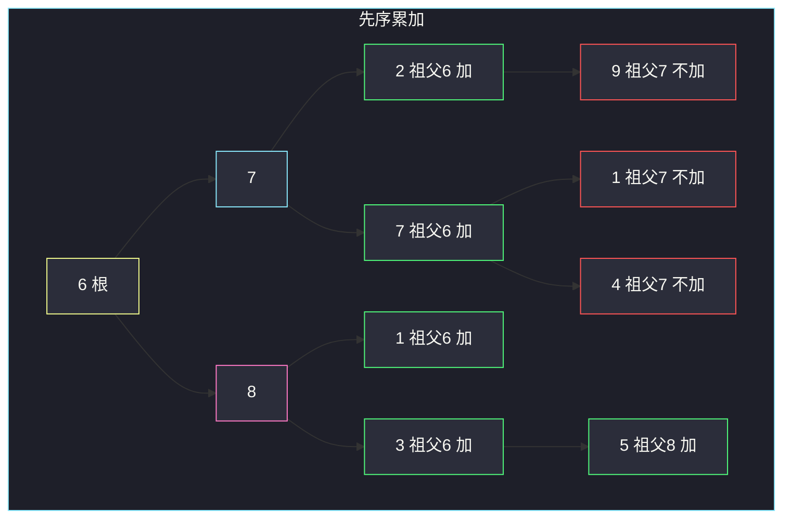

# 祖父节点值为偶数的节点和（自顶向下 · 把祖先带着走）

## 一、问题描述

给定二叉树根 `root`，求所有「祖父节点值为偶数」的节点值之和。祖父 = 父节点的父节点。没有这样的节点则返回 0。

> 🔗 LeetCode 1315：https://leetcode.cn/problems/sum-of-nodes-with-even-valued-grandparent/
>
> 数据范围：节点数 `[1, 10^4]`，`1 ≤ Node.val ≤ 100`。
>
> 📚 灵茶题单：**二叉树 · §2.2 自顶向下 DFS（先序遍历）**（1427 分）。

**示例 1**

```
输入：root = [6,7,8,2,7,1,3,9,null,1,4,null,null,null,5]
输出：18
树形：
            6
          /   \
         7     8
        / \   / \
       2   7 1   3
      /   / \     \
     9   1   4     5
祖父为偶数的节点：6 的四个孙（2+7+1+3=13），以及 8 的孙 5。合计 18。
9、1、4 的祖父是 7（奇数），不加。
```

**示例 2**

```
输入：root = [1]
输出：0
单节点没有祖父。
```

**直观理解**

一个点加不加，只取决于**它上面第二层**是不是偶数。从根往下走时把「父亲、祖父」带着，到一个点立刻能判断，再把自己当父亲、原父亲当祖父，交给左右孩子。这就是 §2.2 的自顶向下：祖先信息当参数往下传。

---

## 二、暴力解法

先建父指针表，再对每个点往上爬两步看祖父：

```python
class Solution:
    def sumEvenGrandparent(self, root: Optional[TreeNode]) -> int:
        parent = {root: None}

        def build(node: Optional[TreeNode]) -> None:
            if node is None:
                return
            if node.left:
                parent[node.left] = node
                build(node.left)
            if node.right:
                parent[node.right] = node
                build(node.right)

        def grandparent(node: TreeNode) -> Optional[TreeNode]:
            p = parent[node]
            return parent[p] if p else None

        build(root)
        ans = 0
        for node in parent:
            gp = grandparent(node)
            if gp is not None and gp.val % 2 == 0:
                ans += node.val
        return ans
```

两遍遍历，还要一张 `O(n)` 的表。深度只有 2 的信息，不值得单独存。

### 复杂度

- **时间**：`O(n)`，但常数是两遍 + 哈希。
- **空间**：父指针表 `O(n)`。

`n = 10^4` 能过，但祖先就在递归栈上，参数传下去即可。

### 🔴 瓶颈在哪里

DFS 进入某个点时，调用者已经知道它的父和祖父。把这两个值（或节点）当参数往下传，先序里当场累加，一遍、额外空间只有递归栈。

---

## 三、优化探索（核心章节）

> 📚 本题在灵茶题单中属于 **二叉树 · §2.2 自顶向下 DFS（先序遍历）**。与 [1448. 统计好节点](https://leetcode.cn/problems/count-good-nodes-in-binary-tree/) 同一模板：祖先信息做参数，先处理自己，再交给左右。

### 3.1 传到哪一层

当前节点需要的是祖父的值。进入 `node` 时带上：

- `fa`：父节点（可能为 `None`，根没有父）
- `gp`：祖父（可能为 `None`）

判断：`gp` 存在且 `gp.val` 为偶数 → 加上 `node.val`。

递归孩子时平移一代：

```
dfs(child, fa=node, gp=fa)
```

根的调用是 `dfs(root, None, None)`。

也可以不传节点、只传两个值，用 `-1` 表示「没有这一代」。语义一样。

### 3.2 先序骨架

```
到达 node（已带着 fa、gp）
if gp 是偶数:
    ans += node.val
dfs(left,  node, fa)
dfs(right, node, fa)
```

不必等左右回来——加不加只看祖先，跟子树无关。所以是先序，不是后序。



### 3.3 一句话核心

> **往下传父和祖父；祖父为偶数就把当前值累上，再平移一代继续走。**

---

## 四、代码实现

### Python（主解：先序传祖先）

```python
class Solution:
    def sumEvenGrandparent(self, root: Optional[TreeNode]) -> int:
        ans = 0

        def dfs(node: Optional[TreeNode], fa: Optional[TreeNode], gp: Optional[TreeNode]) -> None:
            nonlocal ans
            if node is None:
                return
            if gp is not None and gp.val % 2 == 0:
                ans += node.val
            dfs(node.left, node, fa)
            dfs(node.right, node, fa)

        dfs(root, None, None)
        return ans
```

**变量含义**

| 写法 | 含义 |
|------|------|
| `fa` / `gp` | 当前点的父、祖父；根处都是 `None` |
| `dfs(child, node, fa)` | 对孩子来说：父变成自己，祖父变成原父 |

只判断 `gp.val % 2 == 0`，不要误写成「父为偶数」（那是另一道题）。

不必单独处理深度 < 2：`gp is None` 时自然不加。

### Java（可选）

```java
class Solution {
    private int ans;

    public int sumEvenGrandparent(TreeNode root) {
        ans = 0;
        dfs(root, null, null);
        return ans;
    }

    private void dfs(TreeNode node, TreeNode fa, TreeNode gp) {
        if (node == null) return;
        if (gp != null && gp.val % 2 == 0) {
            ans += node.val;
        }
        dfs(node.left, node, fa);
        dfs(node.right, node, fa);
    }
}
```

---

## 五、具体例子演示

**示例 1**：先序，每步带着父 / 祖父。

```
            6
          /   \
         7     8
        / \   / \
       2   7 1   3
      /   / \     \
     9   1   4     5
```

| 步骤 | 入栈节点 | fa | gp | gp 偶数? | 累加 | 返回 |
|------|----------|----|----|----------|------|------|
| 1 | 6 | — | — | 无祖父 | — | 再下左右 |
| 2 | 7 | 6 | — | 无祖父 | — | |
| 3 | 2 | 7 | 6 | 是 | **+2** | |
| 4 | 9 | 2 | 7 | 否 | — | 叶子返回 |
| 5 | 7（中） | 7 | 6 | 是 | **+7** | |
| 6 | 1 | 7 | 7 | 否 | — | |
| 7 | 4 | 7 | 7 | 否 | — | |
| 8 | 8 | 6 | — | 无祖父 | — | |
| 9 | 1 | 8 | 6 | 是 | **+1** | |
| 10 | 3 | 8 | 6 | 是 | **+3** | |
| 11 | 5 | 3 | 8 | 是 | **+5** | |

合计 `2+7+1+3+5 = 18`。



绿节点计入答案；红节点祖父是奇数；粉节点 8 自己是偶数祖父，把它的孙 5 染绿。

根和第一层永远没有祖父，前两层贡献恒为 0。

---

## 六、复杂度分析

| 方法 | 时间 | 空间 | 说明 |
|------|------|------|------|
| 父指针表再爬两步 | `O(n)` | `O(n)` | 多一张表 |
| 先序传 fa / gp（主解） | `O(n)` | `O(h)` 递归栈 | 每点进出一次；`n ≤ 10^4`，`h ≤ n` |

---

## 七、对比总结

| 维度 | 本题 / #1448 自顶向下 | #814 / #1325 自底向上删点 |
|------|----------------------|---------------------------|
| 信息方向 | 祖先参数往下 | 孩子返回值往上 |
| 默认假设 | 父、祖父已知 | **子树已经处理好** |
| 遍历顺序 | 先序：先用再走 | 后序：先走再用 |

**易错点**

1. **加的是父不是祖父**：`fa` 偶数时加的是「父为偶数的节点和」，题意要再往上一层。
2. **根也去模 2**：根没有祖父，必须允许 `gp is None`。
3. **后序才累加**：加不加跟子树无关，等左右回来再加只是把判断推迟，还能写对，但模板上这是先序题。
4. **传错平移**：孩子调用应是 `(child, node, fa)`，写成 `(child, fa, gp)` 等于祖先没更新。
5. **奇数祖父下面的偶数父**：例如 7（奇）→ 2 → 9，9 的祖父仍是 7，不能因为路上有偶数就加。

---

## 八、举一反三

| 题目 | 关系 |
|------|------|
| [1448. 统计二叉树中好节点的数目](https://leetcode.cn/problems/count-good-nodes-in-binary-tree/) | 同节先序；往下传的是路上最大值。见 `count-good-nodes-in-binary-tree.md` |
| [1026. 节点与其祖先之间的最大差值](https://leetcode.cn/problems/maximum-difference-between-node-and-ancestor/) | 往下传路径最大 / 最小 |
| [112. 路径总和](https://leetcode.cn/problems/path-sum/) | 往下传剩余和 |
| [1325. 删除给定值的叶子节点](https://leetcode.cn/problems/delete-leaves-with-a-given-value/) | 对比：删点看孩子，必须后序。见 `delete-leaves-with-a-given-value.md` |
| [814. 二叉树剪枝](https://leetcode.cn/problems/binary-tree-pruning/) | 后序删点。见 `binary-tree-pruning.md` |

**思想迁移**

- 当前点的决策只依赖祖先 → 先序，参数往下传。
- 口诀：**「带着父和祖父往下走；祖父偶数就把自己加上。」**
