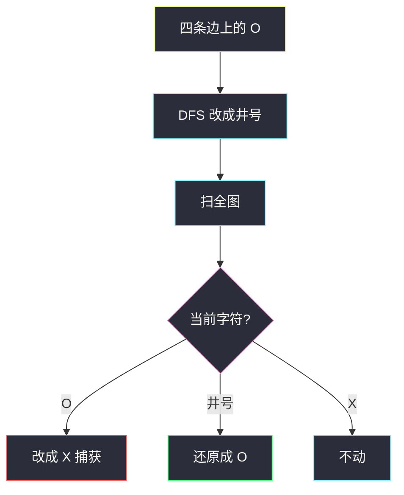
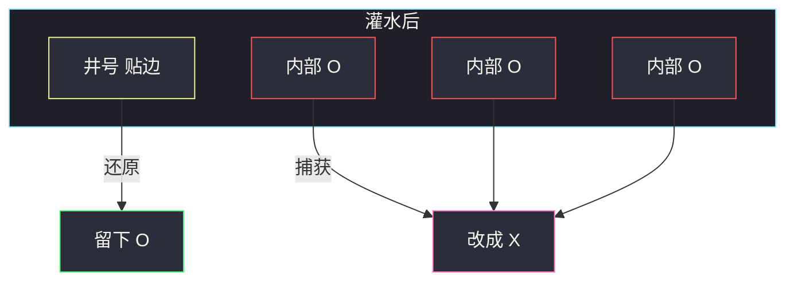

# 被围绕的区域（从边界灌水 · 反向标记）

## 一、问题描述

`m × n` 棋盘，格子是 `'X'` 或 `'O'`。把所有**被围绕**的 `'O'` 改成 `'X'`（捕获）。一个 `'O'` 区域被围绕，当且仅当它**不与棋盘边缘相连**——四周（含通过其他 `'O'`）碰不到边界。

必须原地修改 `board`，无需返回值。四连通。

> 🔗 LeetCode 130：https://leetcode.cn/problems/surrounded-regions/
>
> 数据范围：`1 ≤ m, n ≤ 200`。
>
> 📚 灵茶题单：**一、网格图 DFS**。

**示例 1**

```
输入：
X X X X
X O O X
X X O X
X O X X

输出：
X X X X
X X X X
X X X X
X O X X

内部三块 O 被 X 围死，改成 X。
最底行那个 O 贴边，不能改。
```

**示例 2**

```
输入：board = [['X']]
输出：[['X']]
```

**直观理解**

内部的 O 像被城墙围住的湖，要填成 X。贴边的 O 通向「棋盘外」，灌不满，留下。

不要对每个内部 O 问「我有没有被围」——要从**边界上的 O 往里灌**，能灌到的都安全。

---

## 二、暴力解法

对每个 `'O'`，单独 DFS 看这条连通块能不能走到边界。碰边则整块安全，否则整块改成 `'X'`。

```python
class Solution:
    def solve(self, board: List[List[str]]) -> None:
        m, n = len(board), len(board[0])
        DIRS = ((0, 1), (0, -1), (1, 0), (-1, 0))

        def can_escape(i: int, j: int, seen: set) -> bool:
            if i < 0 or i >= m or j < 0 or j >= n:
                return False
            if board[i][j] != 'O' or (i, j) in seen:
                return False
            if i == 0 or i == m - 1 or j == 0 or j == n - 1:
                return True
            seen.add((i, j))
            return any(can_escape(i + di, j + dj, seen) for di, dj in DIRS)

        for i in range(m):
            for j in range(n):
                if board[i][j] == 'O' and not can_escape(i, j, set()):
                    board[i][j] = 'X'
```

这段还有语义坑：同一连通块里先改掉的格子，会把后面格子的「逃逸路径」切断，可能误杀贴边块。就算用「先收集再统一改」修掉，每个起点仍可能扫 `O(mn)`，总共 `O((mn)²)`。`m, n ≤ 200` 会超时。

### 🔴 瓶颈在哪里

「被围绕」的补集更好算：连到边界的 O 一定不被围绕。从四条边上的 O 出发染一次，剩下的 O 全是俘虏。一遍 `O(mn)`。

---

## 三、优化探索（核心章节）

> 📚 本题在灵茶题单中属于 **一、网格图 DFS**。与油漆桶相反：不是从内部点出发，而是**从边界往里灌**。同族还有飞地、闭岛。

### 3.1 三种格子

| 类型 | 处理 |
|------|------|
| `'X'` | 墙，不走 |
| 贴边（或连到贴边）的 `'O'` | **安全**，最后仍是 `'O'` |
| 其余 `'O'` | 被围绕，改成 `'X'` |

### 3.2 三步

1. 遍历四条边。遇到 `'O'` 就 DFS / BFS，沿四连通把整块改成 `'#'`（临时安全标记）。
2. 扫全图：剩下的 `'O'` → `'X'`（捕获）；`'#'` → `'O'`（还原）。
3. `'X'` 不动。



`#` 只是占位，任何不等于 `'O'` 的标记都行。改原地省掉 `visited`。

### 3.3 一句话核心

> **从边界 O 灌水标安全；剩下的 O 全部翻成 X。**

---

## 四、代码实现

### Python（主解：边界 DFS）

```python
from typing import List

class Solution:
    def solve(self, board: List[List[str]]) -> None:
        m, n = len(board), len(board[0])
        DIRS = ((0, 1), (0, -1), (1, 0), (-1, 0))

        def dfs(i: int, j: int) -> None:
            if not (0 <= i < m and 0 <= j < n) or board[i][j] != 'O':
                return
            board[i][j] = '#'
            for di, dj in DIRS:
                dfs(i + di, j + dj)

        for i in range(m):
            dfs(i, 0)
            dfs(i, n - 1)
        for j in range(n):
            dfs(0, j)
            dfs(m - 1, j)

        for i in range(m):
            for j in range(n):
                if board[i][j] == 'O':
                    board[i][j] = 'X'
                elif board[i][j] == '#':
                    board[i][j] = 'O'
```

四角会被左右边、上下边各扫到一次，第二次 `board` 已是 `'#'`，DFS 立刻返回，无妨。

也可以把 `dfs` 换成 `deque`：边界 `'O'` 入队并改成 `'#'`，再按 `01-matrix.md` 的层序向外灌。标记集合相同，只是栈换成队列。`m, n ≤ 200` 递归深度最坏 `O(mn)`，一般能过；若担心栈，改 BFS。

### Java（可选）

```java
class Solution {
    private static final int[][] DIRS = {{0, 1}, {0, -1}, {1, 0}, {-1, 0}};

    public void solve(char[][] board) {
        int m = board.length, n = board[0].length;
        for (int i = 0; i < m; i++) {
            dfs(board, i, 0);
            dfs(board, i, n - 1);
        }
        for (int j = 0; j < n; j++) {
            dfs(board, 0, j);
            dfs(board, m - 1, j);
        }
        for (int i = 0; i < m; i++) {
            for (int j = 0; j < n; j++) {
                if (board[i][j] == 'O') board[i][j] = 'X';
                else if (board[i][j] == '#') board[i][j] = 'O';
            }
        }
    }

    private void dfs(char[][] board, int i, int j) {
        int m = board.length, n = board[0].length;
        if (i < 0 || i >= m || j < 0 || j >= n || board[i][j] != 'O') return;
        board[i][j] = '#';
        for (int[] d : DIRS) dfs(board, i + d[0], j + d[1]);
    }
}
```

---

## 五、具体例子演示

示例 1。四条边上的 `'O'` 只有 `(3,1)`。

**第 1 步：从边界灌水**

`dfs(3, 1)`：格子是 `'O'`，改成 `'#'`。四邻全是 `'X'` 或出界，停。内部 `(1,1)`、`(1,2)`、`(2,2)` 根本走不到。

```
灌水后：
X X X X
X O O X
X X O X
X # X X
```

**第 2 步：翻盘**

| 格子 | 原值 | 结果 |
|------|------|------|
| (1,1) (1,2) (2,2) | O | **X**（被捕获） |
| (3,1) | # | **O**（还原） |



连通块只要**有一个**格子贴边，整块都会在第 1 步被标成 `'#'`。本题底边那块只有 1 格；若底边 O 连着一串伸进内部，那一串全部安全。

再看一块「贴边拖进内部」的 3×4 盘（不是官方样例，只为把灌水走完）：

```
O X X O
O X O X
X O O X
```

边界 DFS 会先吞掉左列两个 O，再从右上角 `(0,3)` 灌——它四邻是 X / 出界，单独成块。中间 `(1,2)(2,1)(2,2)` 互连但不碰边，第二步全部变 X。左列两个 O 还原。这就是「不要从内部枚举」：内部那三格若逐个问能不能出界，路径还可能被你自己先改掉的格子切断。

---

## 六、复杂度分析

| 方法 | 时间 | 空间 | 说明 |
|------|------|------|------|
| 每个 O 再判能否出界 | `O((mn)²)` | `O(mn)` | 重复搜同一块 |
| 边界灌水（主解） | `O(mn)` | `O(mn)` 递归栈 | 每格常数次；`m, n ≤ 200` |

---

## 七、对比总结

| 维度 | 从内部枚举 | 从边界灌水 |
|------|------------|------------|
| 问法 | 「这块有没有被围？」 | 「哪些 O 连到外界？」 |
| 次数 | 每个 O 一次 DFS | 边界 O 各一次，整块共享 |
| 正确性 | 易误改、易超时 | 补集一次标清 |

**易错点**

1. **忘了把 `'#'` 还原成 `'O'`**：安全格会留着非法字符。
2. **只检查四条边本身、不往里走**：贴边 O 连着的内部 O 也安全。
3. **从某个内部 O 出发再 BFS 判围绕**：难写且慢，不要走这条。
4. **对角相邻当成连通**：中间 `(2,2)` 与底边 `(3,1)` 只对角，不能互相救。
5. **把 `'X'` 也改成 `'#'`**：墙不能走；`dfs` 入口必须是 `'O'`。

边界上的 `'X'` 调用 `dfs` 会立刻返回，所以「整行整列扫过去」比手工挑 `'O'` 更不容易漏。

---

## 八、举一反三

| 题目 | 关系 |
|------|------|
| [1020. 飞地的数量](https://leetcode.cn/problems/number-of-enclaves/) | 同「边界灌水」；统计剩下的 1 的个数 |
| [1254. 统计封闭岛屿的数目](https://leetcode.cn/problems/number-of-closed-islands/) | 先把贴边岛淹掉，再数内部岛 |
| [200. 岛屿数量](https://leetcode.cn/problems/number-of-islands/) | 连通块个数，见同族 `max-area-of-island.md` |
| [733. 图像渲染](https://leetcode.cn/problems/flood-fill/) | 同方向数组，从指定格灌，见 `flood-fill.md` |
| [417. 太平洋大西洋水流问题](https://leetcode.cn/problems/pacific-atlantic-water-flow/) | 也是从边界反向 DFS，见 `pacific-atlantic-water-flow.md` |

**思想迁移**

- 「被围 / 封闭 / 飞地」优先想：**从边界把能逃的淹掉（或标掉），剩下的才是答案。**
- 口诀：**「边上清 O 灌成井号；O 变 X，井号变回 O。」**
