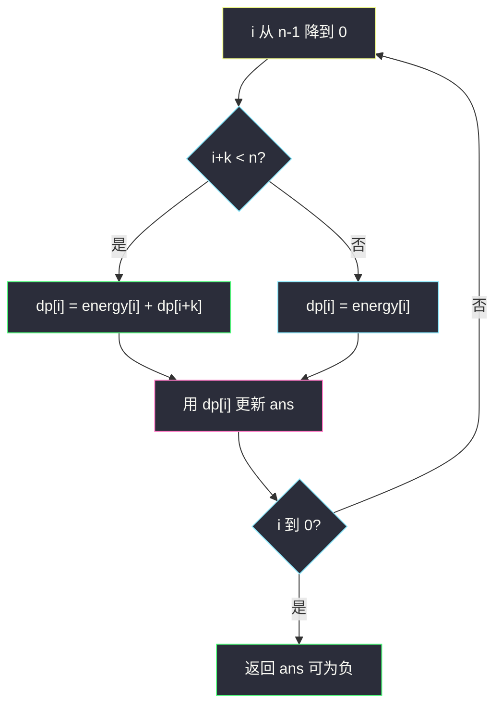
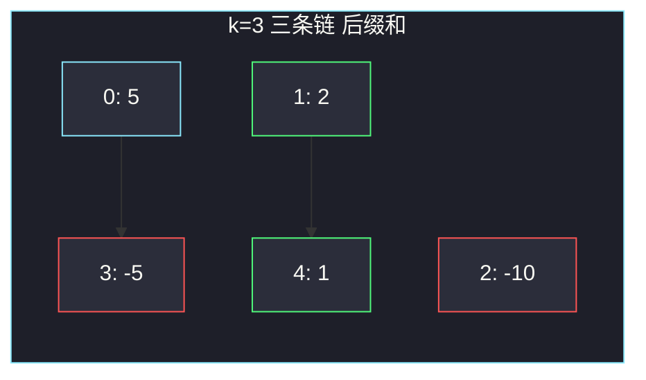

# 从魔法师身上吸取的最大能量（一维 DP · 倒序跳 k）

## 一、问题描述

在神秘地牢里有 `n` 个魔法师排成一列，`energy[i]` 可正可负（负表示从你身上抽走能量）。你必须选一个起点 `i`，然后不断跳到 `i+k`、`i+2k`、… 直到越界。**沿途能量必须全部吸收**，不能跳过中间的人。返回能得到的最大能量。

> 🔗 LeetCode 3147：https://leetcode.cn/problems/taking-maximum-energy-from-the-mystic-dungeon/
>
> 数据范围：`1 ≤ n ≤ 10^5`，`-1000 ≤ energy[i] ≤ 1000`，`1 ≤ k ≤ n-1`。
>
> 📚 灵茶题单：**§7.1 一维 DP**。状态只跟「从 i 出发跳到尽头」有关，`dp[i]` 依赖 `dp[i+k]`，必须从后往前填。`n=10^5`，不能 `O(n²)`。

本题是新题，题面要点再钉一句：起点任选，步长固定为 `k`，路径是一条公差为 `k` 的下标链，链上每个值都要吃掉。全为负时也必须选一个人，答案可以是负数，**不是 0**。

**示例 1**

```
输入：energy = [5,2,-10,-5,1], k = 3
输出：3
解释：从下标 1 出发：2 + 1 = 3。
```

**示例 2**

```
输入：energy = [-2,-3,-1], k = 2
输出：-1
解释：必须选起点。从下标 2 出发只吃 -1，是最大（负得最少）。
```

**直观理解**

选起点 = 选定一条「下标模 k 相同」的链，并且必须从某节车厢坐到终点。所以每条链上合法得分就是它的**所有后缀和**，不是任意子段和（不能在中途下车）。

---

## 二、暴力解法

枚举每个起点，顺着 `i, i+k, i+2k, …` 累加。

```python
class Solution:
    def maximumEnergy(self, energy: list[int], k: int) -> int:
        n = len(energy)
        ans = -10**18
        for i in range(n):
            s, j = 0, i
            while j < n:
                s += energy[j]
                j += k
            ans = max(ans, s)
        return ans
```

官方两例都能过。最坏 `k=1` 时每个起点都扫到末尾，总时间 `O(n²)`，`n=10^5` 超时。

### 🔴 瓶颈在哪里

从 `i` 出发的路径 = `energy[i]` + 从 `i+k` 出发的路径。后者被算了很多遍。记下 `dp[i]`，从后往前每个下标只算一次。

---

## 三、优化探索（核心章节）

> 📚 本题在灵茶题单中属于 **§7.1 一维 DP**。后继下标更大，先算后面。模板：`dp[i] = energy[i] + (dp[i+k] if i+k < n else 0)`，答案 `max(dp)`。

### 3.1 状态

`dp[i]` = 从下标 `i` 出发、一直跳到越界，沿途能量之和。

- `i+k ≥ n`：后面没人，`dp[i] = energy[i]`；
- 否则：`dp[i] = energy[i] + dp[i+k]`。

答案是所有起点里最大的 `dp[i]`。没有「不选」这个选项，所以不要和 0 取 max。

### 3.2 为什么倒着填

`dp[i]` 只依赖 `dp[i+k]`，下标更大。`i` 从 `n-1` 降到 `0` 时，`i+k` 要么越界、要么已经算过。

可以原地：`energy[i] += energy[i+k]`（当 `i+k < n`），最后 `max(energy)`。额外空间 `O(1)`。



### 3.3 余数类视角（同一件事）

下标按 `i % k` 分成 `k` 条互不相交的链。例如 `k=3`、`n=5`：

- 余 0：`0 → 3`
- 余 1：`1 → 4`
- 余 2：`2`

每条链必须跳到该链最后一个下标。从链尾往头累加后缀和，记录过程中的最大值。所有余数类再取 max。时间仍是 `O(n)`：每个下标恰好属于一条链。

**不能**对链做 Kadane。Kadane 会丢掉中间或尾部，等于中途下车，违反题意。反例：链 `[5, 10, -100]`，Kadane 得到 `5+10=15`，但你不能停；三个合法得分是 `-100`、`10-100=-90`、`5+10-100=-85`，答案应是 `-85`。

### 3.4 一句话核心

> **dp[i] = energy[i] + 后面那一跳的 dp；从后往前填，答案是 max(dp)，全负也要选。**

---

## 四、代码实现

### Python（主解：倒序 DP，可原地）

```python
class Solution:
    def maximumEnergy(self, energy: list[int], k: int) -> int:
        n = len(energy)
        for i in range(n - 1, -1, -1):
            if i + k < n:
                energy[i] += energy[i + k]
        return max(energy)
```

原地后 `energy[i]` 就是 `dp[i]`。若不能改入参数，复制一份或另开 `dp` 数组即可。

**变量含义**

| 写法 | 含义 |
|------|------|
| `i` 从后往前 | 保证 `i+k` 已是「从那里跳到尽头的和」 |
| `energy[i] += energy[i+k]` | 接上后继 |
| `max(energy)` | 枚举所有起点 |

### 等价写法：按余数类从后累加

```python
class Solution:
    def maximumEnergy(self, energy: list[int], k: int) -> int:
        n = len(energy)
        ans = -10**18
        for r in range(min(k, n)):
            s = 0
            for i in range(r + (n - 1 - r) // k * k, r - 1, -k):
                s += energy[i]
                ans = max(ans, s)
        return ans
```

从该余数类的最后一个下标往回走，`s` 始终是某个后缀和。

### Java（最优解）

```java
class Solution {
    public int maximumEnergy(int[] energy, int k) {
        int n = energy.length;
        int ans = Integer.MIN_VALUE;
        for (int i = n - 1; i >= 0; i--) {
            if (i + k < n) {
                energy[i] += energy[i + k];
            }
            ans = Math.max(ans, energy[i]);
        }
        return ans;
    }
}
```

能量和的范围大约 `n * 1000 = 10^8`，`int` 够用。

---

## 五、具体例子演示

### 5.1 官方示例 1：倒序填 dp

`energy = [5, 2, -10, -5, 1]`，`k = 3`，`n = 5`。

| i | energy[i] | i+k | 动作 | dp[i] |
|---|-----------|-----|------|-------|
| 4 | 1 | 7 越界 | 只吃自己 | 1 |
| 3 | -5 | 6 越界 | 只吃自己 | -5 |
| 2 | -10 | 5 越界 | 只吃自己 | -10 |
| 1 | 2 | 4 | 2+dp[4]=2+1 | 3 |
| 0 | 5 | 3 | 5+dp[3]=5+(-5) | 0 |

`max(dp) = max(0, 3, -10, -5, 1) = 3`。从下标 1 出发：`2 → 1`。对拍官方。



绿链后缀：`1` 与 `2+1=3`，最大 3；青链：`-5` 与 `0`；红链只有 `-10`。全局最大 3。

倒序时先算出链尾，再往左加，和「余数类从后累加」是同一张表：

- 余 1：先 `s=1`，再 `s=1+2=3`
- 余 0：先 `s=-5`，再 `s=-5+5=0`
- 余 2：`s=-10`

### 5.2 官方示例 2：全负也要选

`energy = [-2, -3, -1]`，`k = 2`。

| i | 后继 | dp[i] |
|---|------|-------|
| 2 | 无 | -1 |
| 1 | 3 越界 | -3 |
| 0 | 2 | -2 + (-1) = -3 |

`max = -1`。从下标 2 出发。对拍官方。若误写成 `max(0, dp)` 会返回 0，错。

### 5.3 为什么不是 Kadane

链 `[5, 10, -100]`（相当于 `k=1` 的整段）。倒序：

| i | dp[i] |
|---|-------|
| 2 | -100 |
| 1 | 10-100 = -90 |
| 0 | 5-90 = -85 |

答案 `-85`。Kadane 会给出 `15`，那是「中途下车」，本题不允许。

---

## 六、复杂度分析

| 方法 | 时间 | 空间 | 说明 |
|------|------|------|------|
| 枚举起点再跳 | `O(n²/k)` 最坏 `O(n²)` | `O(1)` | `k=1` 超时 |
| 倒序 DP / 余数类（主解） | `O(n)` | `O(1)` 原地，或 `O(n)` 另开 dp | 每个下标一次 |

---

## 七、对比总结

| 维度 | 2606 Kadane | 本题 |
|------|-------------|------|
| 路径 | 任意连续子段 | 固定步长跳到尽头 |
| 负前缀 | 可以扔 | 起点左边本来就没选；起点之后一个都不能扔 |
| 负后缀 | 可以扔 | **不能扔** |
| 全负 | 回 0 | 取最大的（负得最少的）后缀和 |

**易错点**

1. **和 0 取 max**：题意必须选起点，全负时答案为负。
2. **对每条链跑 Kadane**：丢掉后缀等于提前结束跳跃。
3. **正着 DP**：`dp[i]` 依赖 `dp[i+k]`，从左往右会读到未计算的值（若当 0 用，等于假设后面没人）。
4. **`O(n²)` 枚举起点**：`n=10^5` 过不了，必须线性。
5. **`k` 与 `n` 搞反**：后继是 `i+k` 不是 `i+1`（除非 `k=1`）。

---

## 八、举一反三

| 题目 | 关系 |
|------|------|
| [2140. 解决智力问题](https://leetcode.cn/problems/solving-questions-with-brainpower/) | 同样「做了就跳到 i+k+1」，倒序一维 DP |
| [198. 打家劫舍](https://leetcode.cn/problems/house-robber/) | §7.1：`dp[i]` 依赖更小下标，从左往右 |
| [3259. 超级饮料的最大强化能量](https://leetcode.cn/problems/maximum-energy-boost-from-two-drinks/) | 同批能量题，两序列可切换 |
| [2606. 找到最大开销的子字符串](https://leetcode.cn/problems/find-the-substring-with-maximum-cost/) | 同批：那题是 Kadane 可弃段，本题不能 |
| [53. 最大子数组和](https://leetcode.cn/problems/maximum-subarray/) | 对比「可在任意处截断」 |
| [740. 删除并获得点数](https://leetcode.cn/problems/delete-and-earn/) | 一维 DP，选了 i 就不能选邻居 |

**思想迁移**

- 后继下标更大，就倒着填；合法方案是链的后缀，不是链的任意子段。
- 口诀：**「倒序跳 k 累加后缀；答案取 max(dp)，全负也认。」**
