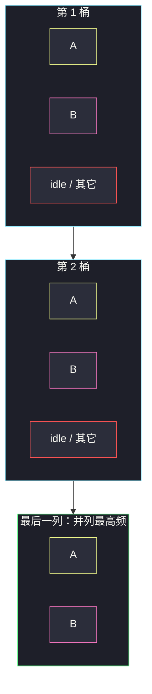

# 任务调度器（填桶公式）

## 一、问题描述

给你一个用字符数组 `tasks` 表示的 CPU 任务列表，每个字母代表一种任务。任务可以以任意顺序执行，每个任务恰好执行 1 个单位时间。在任意一个单位时间内，CPU 可以完成一个任务，或者处于待命状态。

然而，两个**相同种类**的任务之间必须有长度为整数 `n` 的冷却时间，因此至少有 `n` 个单位时间，CPU 在执行这两个任务的间隔期间不能再执行相同任务（可以执行别的任务，或待命）。

返回完成所有任务所需的**最短**时间。

> 🔗 LeetCode 621：https://leetcode.cn/problems/task-scheduler/
>
> 数据范围：`1 <= tasks.length <= 10^4`，`tasks[i]` 是大写字母，`0 <= n <= 100`。

**示例 1**

```
输入：tasks = ["A","A","A","B","B","B"], n = 2
输出：8
解释：A -> B -> idle -> A -> B -> idle -> A -> B，共 8。
```

**示例 2**

```
输入：tasks = ["A","C","A","B","D","B"], n = 1
输出：6
解释：A -> B -> C -> D -> A -> B，无需待命。
```

**示例 3**

```
输入：tasks = ["A","A","A","B","B","B"], n = 3
输出：10
解释：A -> B -> idle -> idle -> A -> B -> idle -> idle -> A -> B。
```

**直观理解**

最「难安排」的是出现次数最多的那种任务：它们之间必须硬生生隔开 `n` 格。先把这些坑位摆成桶，再用别的任务去填空；填不满就只好 idle，填溢出了说明任务总数本身已经比桶大，答案就是 `len(tasks)`。

---

## 二、暴力解法

每个时刻在「冷却已结束」的任务里选剩余次数最多的那个。可用计数 + 每轮扫 26 个字母，或优先队列模拟。

```python
class Solution:
    def leastInterval(self, tasks: List[str], n: int) -> int:
        cnt = [0] * 26
        for t in tasks:
            cnt[ord(t) - 65] += 1
        time = 0
        remain = len(tasks)
        cool = [0] * 26                       # 最早可再执行的时刻
        while remain:
            best, pick = -1, -1
            for i in range(26):
                if cnt[i] and cool[i] <= time and cnt[i] > best:
                    best, pick = cnt[i], i
            time += 1
            if pick < 0:
                continue                      # 待命
            cnt[pick] -= 1
            remain -= 1
            cool[pick] = time + n
        return time
```

### 复杂度

- **时间**：`O(T · 26)`，`T` 是答案（可能大于 `len(tasks)`）。
- **空间**：`O(1)`。

### 🔴 瓶颈在哪里

模拟能过 `10^4`，但每一拍都在选任务，看不出「最短时间」的闭合形式。冷却约束其实只由**最高频**决定桶的骨架，其余任务只是填充物。

---

## 三、优化探索（核心章节）

> 📚 本题在灵茶题单中属于 **贪心 · §5.4 重排元素**。相同元素之间至少隔 `n` 个位置，是「重排 + 插入空位」的经典填桶。

### 3.1 只盯最高频任务

设最高频次为 `maxFreq`（出现 `maxFreq` 次的任务可能有 `maxCount` 种）。把一种最高频任务写成：

```
A  _ _ _  A  _ _ _  A     （n = 3 时，两 A 之间 3 个空槽）
```

共 `maxFreq` 个 A，中间有 `maxFreq - 1` 段空隙。每一段要放下 `n` 个「非这个 A」的位置（别的任务或 idle）。最后再挂上最后一个 A。骨架长度：

```
(maxFreq - 1) * (n + 1) + 1
```

若有 `maxCount` 种任务并列最高频（例如 A、B 都是 3 次），它们可以肩并肩占满每一轮的开头：

```
A B _ _  A B _ _  A B
```

骨架变成：`(maxFreq - 1) * (n + 1) + maxCount`。



### 3.2 任务太多：桶装不下

若其它任务把所有空槽填满还有剩余，公式算出的骨架会**小于** `len(tasks)`。此时不必 idle，CPU 一直有活干，最短时间就是任务个数。所以最终：

```
max(len(tasks), (maxFreq - 1) * (n + 1) + maxCount)
```

`n = 0` 时公式变成 `maxFreq - 1 + maxCount`，一定 `≤ len(tasks)`，答案退回任务个数，符合「没有冷却」。

### 3.3 为什么这样最短

最高频任务的间隔是硬约束：少一个空位就会有两个相同任务靠得太近。并列最高频的那几种必须出现在最后一列，否则某一轮会挤不下。其余任务频次更低，一定能塞进空隙（或溢出到「总长度 = n」的那一侧）。这是贪心，不是搜索。

### 3.4 一句话核心

> **用最高频任务划 `(maxFreq-1)` 个宽为 `n+1` 的桶，最后一列放并列最高频的种类数；再和任务总数取 max。**

---

## 四、代码实现

### Python（主解：公式）

```python
class Solution:
    def leastInterval(self, tasks: List[str], n: int) -> int:
        freq = [0] * 26
        for t in tasks:
            freq[ord(t) - 65] += 1
        max_freq = max(freq)
        max_count = freq.count(max_freq)
        return max(len(tasks), (max_freq - 1) * (n + 1) + max_count)
```

**变量含义**

| 变量 | 含义 |
|------|------|
| `max_freq` | 出现次数最多的那种任务的次数 |
| `max_count` | 有多少种任务达到 `max_freq` |
| `(max_freq-1)*(n+1)` | 前 `max_freq-1` 个完整桶 |
| `+ max_count` | 最后一列只放并列冠军 |

### Java（最优解同款）

```java
class Solution {
    public int leastInterval(char[] tasks, int n) {
        int[] freq = new int[26];
        for (char t : tasks) freq[t - 'A']++;
        int maxFreq = 0, maxCount = 0;
        for (int f : freq) {
            if (f > maxFreq) {
                maxFreq = f;
                maxCount = 1;
            } else if (f == maxFreq) {
                maxCount++;
            }
        }
        return Math.max(tasks.length, (maxFreq - 1) * (n + 1) + maxCount);
    }
}
```

模拟版（优先队列）可作为对照：每轮最多取 `n+1` 个不同任务，不够就补 idle。时间 `O(T log 26)`，面试能写，但公式才是本题该记住的。

---

## 五、具体例子演示

以示例 1：`tasks = [A,A,A,B,B,B]`，`n = 2`。

`freq[A]=3`，`freq[B]=3`，其余 0。`max_freq = 3`，`max_count = 2`。

```
骨架：(3-1) * (2+1) + 2 = 8
任务数：6
答案：max(6, 8) = 8
```

桶面：

| 桶 | 槽 0 | 槽 1 | 槽 2 |
|----|------|------|------|
| 第 1 个完整桶 | A | B | idle |
| 第 2 个完整桶 | A | B | idle |
| 最后一列 | A | B | （没有第 3 槽） |

逐步：时刻 0 放 A，时刻 1 放 B，时刻 2 空槽没别的字母 → idle；重复一轮；最后 A、B。总长 8 ✓。

若再多两个 C、D：`tasks` 长度为 8，公式仍是 8，空槽被 C、D 填满，不再 idle。

若 `n = 1`：公式 `(3-1)*(1+1)+2 = 6`，与任务数相同，`A B A B A B`，冷却恰好够。


---

## 六、复杂度分析

| 方法 | 时间 | 空间 | 说明 |
|------|------|------|------|
| 每时刻选最高剩余 | `O(T · 26)` | `O(1)` | T 为答案 |
| 优先队列模拟 | `O(T log 26)` | `O(1)` | 26 种任务 |
| 填桶公式（主解） | `O(n)` | `O(1)` | 扫一遍任务计数 |

这里 `n` 指 `tasks.length`。字母种类恒为 26，计数数组常数空间。

---

## 七、对比总结

| 维度 | 模拟调度 | 填桶公式 |
|------|----------|----------|
| 过程 | 真的排出时间表 | 只算长度，不构造序列 |
| 冷却 | 每个任务记冷却到期 | 由桶宽 `n+1` 保证 |
| 代码量 | 长 | 三行核心 |

**易错点**

1. **忘了和 `len(tasks)` 取 max**：任务种类多、冷却小时，公式偏小。
2. **最后一列只加 1**：并列最高频有几种就要加几，不是只加一个 A。
3. **桶宽写成 `n`**：每一轮是「1 个自己 + n 个间隔」，宽是 `n+1`。
4. **`n = 0`**：没有冷却，答案就是数组长度；公式取 max 后自动正确。
5. **小写字母**：题目是大写；`ord(t)-65` 不要写成 `-97`。

**模板（§5.4 相同元素最小间隔）**

```python
ans = max(len(tasks), (max_freq - 1) * (n + 1) + max_count)
```

---

## 八、举一反三

| 题目 | 关系 |
|------|------|
| [767. 重构字符串](https://leetcode.cn/problems/reorganize-string/) | 间隔至少 1，本质 `n=1` 的重排；不够间隔则失败 |
| [358. K 距离间隔重排字符串](https://leetcode.cn/problems/rearrange-string-k-distance-apart/) | 本题要构造序列版：优先队列 + 冷却队列 |
| [1405. 最长快乐字符串](https://leetcode.cn/problems/longest-happy-string/) | 贪心每次取剩余最多且不违法的字符 |
| [1054. 距离相等的条形码](https://leetcode.cn/problems/distant-barcodes/) | 间隔 1 重排，先排最高频 |
| [621 的构造](https://leetcode.cn/problems/task-scheduler/) | 若追问「给出一种调度」，改用优先队列模拟 |

**思想迁移**

- 见到「相同元素之间至少隔 k」，先数最高频，用 `(maxFreq-1)*(k+1)+并列数` 估骨架，再和元素总数比大小。
- 口诀：**「最高频划桶，桶宽 n+1，最后一列放并列冠军；任务比桶多就没有空闲。」**
