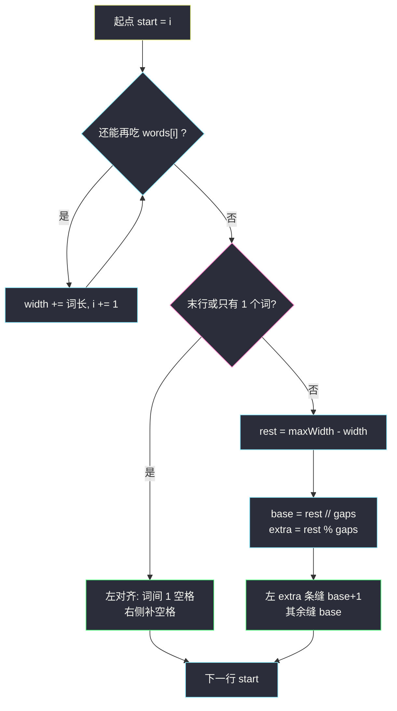
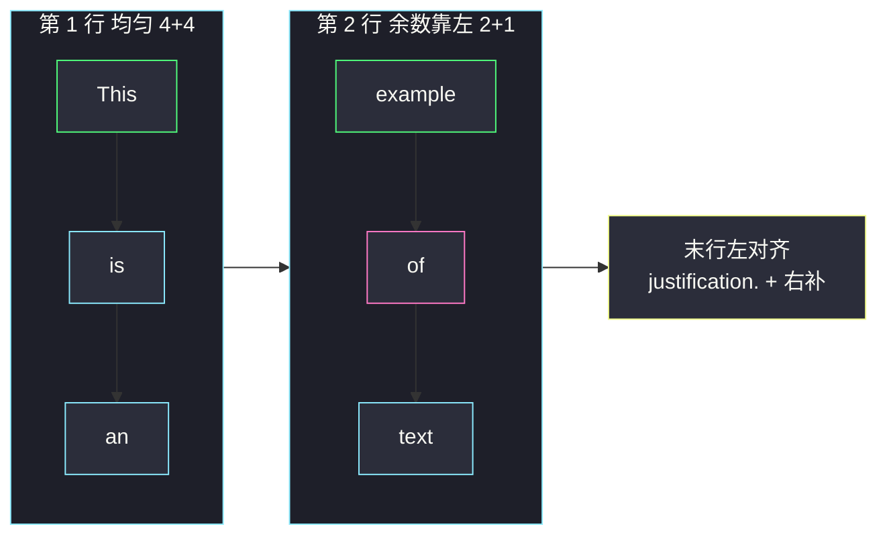

# 文本左右对齐（分组循环 · 贪心装行）

## 一、问题描述

给定单词数组 `words` 和行宽 `maxWidth`。按从左到右的顺序把单词排成多行，每行恰好 `maxWidth` 个字符，规则如下：

1. **贪心装行**：每一行尽可能多放单词，单词之间至少 1 个空格；放不下下一个就换行。
2. **非末行且该行有 ≥ 2 个单词**：左右对齐——空格尽量均匀，多出来的空格**优先给左边的缝**。
3. **最后一行**，或某行只有 **1 个单词**：左对齐——词与词之间恰好 1 个空格，右侧用空格补到 `maxWidth`。

返回排版后的字符串列表。题目保证单词长度不超过 `maxWidth`，用贪心装行总能放下。

> 🔗 LeetCode 68：https://leetcode.cn/problems/text-justification/
>
> 数据范围：`1 <= words.length <= 300`，`1 <= words[i].length <= 20`，`1 <= maxWidth <= 100`，`words[i]` 由英文字母组成。

**示例 1**

```
输入：words = ["This","is","an","example","of","text","justification."], maxWidth = 16
输出：
[
   "This    is    an",
   "example  of text",
   "justification.  "
]
```

**示例 2**

```
输入：words = ["What","must","be","acknowledgment","shall","be"], maxWidth = 16
输出：
[
  "What   must   be",
  "acknowledgment  ",
  "shall be        "
]
解释：acknowledgment 独占一行（左对齐补空格）；末行 "shall be" 词间一个空格再右补。
```

**示例 3**

```
输入：words = ["Science","is","what","we","understand","well","enough","to","explain","to","a","computer.","Art","is","everything","else","we","do"], maxWidth = 20
输出：
[
  "Science  is  what we",
  "understand      well",
  "enough to explain to",
  "a  computer.  Art is",
  "everything  else  we",
  "do                  "
]
```

**直观理解**

先**切段**再**填空格**。切段是灵神 **六、分组循环**：外层锁定本行第一个单词，内层尽量把后续单词吃进来，直到再吃就超过 `maxWidth`。填空格是纯算术：剩余空格数除以缝数，商是每缝保底，余数从左往右每缝再 +1。末行 / 单词单独走另一套左对齐。

---

## 二、暴力解法

「暴力」在这里不是指数枚举换行点——题目规定了贪心，换行位置唯一。真正浪费的是：每次从行首重新数「能装几个词」，并且用字符串反复 `+` 拼接。正确但慢、且把「分组」和「填空」搅在一起不好测。

```python
class Solution:
    def fullJustify(self, words: List[str], maxWidth: int) -> List[str]:
        n, ans, i = len(words), [], 0
        while i < n:
            j, width = i, 0
            while j < n and width + len(words[j]) + (j - i) <= maxWidth:
                width += len(words[j])
                j += 1
            line = self._fill(words[i:j], width, maxWidth, j == n)
            ans.append(line)
            i = j
        return ans

    def _fill(self, row, width, maxWidth, is_last):
        if is_last or len(row) == 1:
            s = " ".join(row)
            return s + " " * (maxWidth - len(s))
        gaps = len(row) - 1
        rest = maxWidth - width
        base, extra = divmod(rest, gaps)
        parts = []
        for k in range(gaps):
            parts.append(row[k])
            parts.append(" " * (base + (1 if k < extra else 0)))
        parts.append(row[-1])
        return "".join(parts)
```

这已经接近最优。下面把分组循环写清楚，并逐步对拍空格公式——Hard 的坑全在填空，不在渐近复杂度。

### 复杂度

- **时间**：`O(n · maxWidth)` 量级（每个单词写入答案一次，每行构造 `O(maxWidth)`）。
- **空间**：`O(1)` 额外（不计答案字符串）。

### 🔴 瓶颈在哪里

没有算法瓶颈，有的是实现瓶颈：缝数、余数、末行、单单词四套边界一旦写错，肉眼看「好像对齐了」也过不了对拍。分组循环把「本行有哪些词」一次性切出来，填空变成纯函数，便于单独验证。

---

## 三、优化探索（核心章节）

> 📚 本题在灵茶题单中属于 **六、分组循环**（无评分）。外层 `while i < n` 锁定本行起点 `start`，内层按「当前词长 + 已有词之间的最少空格」判断能否再吃一个词，得到半开区间 `[start, i)`；再按是否末行 / 是否只一词决定空格分配。

### 3.1 一组是「一行能装下的单词」

设本行已选 `words[start .. j-1]`，它们的**纯字母总长**为 `width`，共 `cnt = j - start` 个词。再加入 `words[j]` 时：

- 新字母总长 `width + len(words[j])`；
- 最少空格数 = 词与词之间各 1 个 = `cnt`（加入后有 `cnt+1` 个词，缝有 `cnt` 条）。

能加入当且仅当：

```
width + len(words[j]) + cnt <= maxWidth
```

即 `width + len(words[j]) + (j - start) <= maxWidth`。内层 `while` 吃到不能再吃，本行就是 `words[start:i]`。

### 3.2 空格分配公式

令 `cnt` 为本行单词数，`width` 为字母总长，`rest = maxWidth - width` 为全部空格预算。

**情况 A：末行，或 `cnt == 1`（左对齐）**

词间恰好 1 个空格，右侧补齐：

```
" ".join(本行单词) + " " * (maxWidth - 该串长度)
```

单单词时 `join` 不加缝，整段预算都堆在右边，例如 `"acknowledgment"` + 2 个空格。

**情况 B：非末行且 `cnt ≥ 2`（左右对齐）**

缝数 `gaps = cnt - 1`（一定 ≥ 1）。每条缝至少 `base = rest // gaps` 个空格，前 `extra = rest % gaps` 条缝再多 1 个：

```
第 k 条缝的空格数 = base + (1 if k < extra else 0)    k = 0 .. gaps-1
```

「多的空格优先给左边」= 余数从左往右发完。最后一词后面**没有缝**，不要往行尾再塞空格——`rest` 已全部分到缝里，行长恰好 `maxWidth`。



### 3.3 为什么贪心装行是对的

题目明确要求「尽可能多放」，所以一行的单词集合由贪心唯一确定，不存在「少放一个词、空格更好看」的优化空间。算法要做的只是把这份唯一的切分 + 唯一的空格规则实现出来。

### 3.4 一句话核心

> **分组循环切出本行单词；非末行把 rest 个空格按「商 + 余数靠左」塞进 cnt-1 条缝，末行左对齐右补空。**

---

## 四、代码实现

### Python（主解：分组循环 + 填缝）

```python
class Solution:
    def fullJustify(self, words: List[str], maxWidth: int) -> List[str]:
        n, ans, i = len(words), [], 0
        while i < n:
            start, width = i, 0
            while i < n and width + len(words[i]) + (i - start) <= maxWidth:
                width += len(words[i])
                i += 1
            # 本行 words[start:i]，字母总长 width
            is_last = i == n
            ans.append(self._pack(words, start, i, width, maxWidth, is_last))
        return ans

    def _pack(self, words, start, end, width, maxWidth, is_last) -> str:
        row = words[start:end]
        if is_last or len(row) == 1:
            s = " ".join(row)
            return s + " " * (maxWidth - len(s))
        gaps = len(row) - 1
        rest = maxWidth - width
        base, extra = divmod(rest, gaps)
        parts = []
        for k in range(gaps):
            parts.append(row[k])
            parts.append(" " * (base + (1 if k < extra else 0)))
        parts.append(row[-1])
        return "".join(parts)
```

把 `_pack` 内联进主循环也可以，拆开更易测。`divmod(rest, gaps)` 在 `gaps ≥ 1` 时安全：左右对齐分支保证 `cnt ≥ 2`。

**变量含义**

| 变量 | 含义 |
|------|------|
| `start`, `i` | 本行单词半开区间 `[start, i)` |
| `width` | 本行字母总长（不含空格） |
| `rest` | `maxWidth - width`，全部空格预算 |
| `base`, `extra` | 每缝保底空格、需要 +1 的左边缝数 |

**循环不变式**：内层结束后，`words[start:i]` 是以 `start` 开头时能装下的最长前缀；`words[i]` 要么不存在（末行），要么再加入必超宽。

### Java（最优解同款）

```java
class Solution {
    public List<String> fullJustify(String[] words, int maxWidth) {
        List<String> ans = new ArrayList<>();
        int n = words.length, i = 0;
        while (i < n) {
            int start = i, width = 0;
            while (i < n && width + words[i].length() + (i - start) <= maxWidth) {
                width += words[i].length();
                i++;
            }
            ans.add(pack(words, start, i, width, maxWidth, i == n));
        }
        return ans;
    }

    private String pack(String[] words, int start, int end, int width,
                        int maxWidth, boolean isLast) {
        int cnt = end - start;
        StringBuilder sb = new StringBuilder();
        if (isLast || cnt == 1) {
            for (int k = start; k < end; k++) {
                if (k > start) sb.append(' ');
                sb.append(words[k]);
            }
            while (sb.length() < maxWidth) sb.append(' ');
            return sb.toString();
        }
        int gaps = cnt - 1, rest = maxWidth - width;
        int base = rest / gaps, extra = rest % gaps;
        for (int k = 0; k < gaps; k++) {
            sb.append(words[start + k]);
            for (int t = 0; t < base + (k < extra ? 1 : 0); t++) sb.append(' ');
        }
        sb.append(words[end - 1]);
        return sb.toString();
    }
}
```

---

## 五、具体例子演示

以示例 1：`words = ["This","is","an","example","of","text","justification."]`，`maxWidth = 16`。

### 5.1 分组：每行起止

| 行 | start | 尝试加入 | 累计 width + 最少空格 | 能否加入 | 本行单词 |
|----|-------|----------|----------------------|----------|----------|
| 0 | 0 | This (4) | 4 + 0 = 4 | 是 | |
|  |  | is (2) | 6 + 1 = 7 | 是 | |
|  |  | an (2) | 8 + 2 = 10 | 是 | |
|  |  | example (7) | 15 + 3 = 18 > 16 | **否** | This, is, an |
| 1 | 3 | example (7) | 7 | 是 | |
|  |  | of (2) | 9 + 1 = 10 | 是 | |
|  |  | text (4) | 13 + 2 = 15 | 是 | |
|  |  | justification. (14) | 27 + 3 > 16 | **否** | example, of, text |
| 2 | 6 | justification. (14) | 14 | 是 | |
|  |  | （没有下一个） | | 末行 | justification. |

### 5.2 填空格：第一行 `This / is / an`

`cnt = 3`，`width = 4+2+2 = 8`，`rest = 8`，`gaps = 2`，非末行。

```
base = 8 // 2 = 4
extra = 8 % 2 = 0
```

两条缝都是 4 个空格：

```
This + "    " + is + "    " + an
     ^^^^           ^^^^
```

得到 `"This    is    an"`，长度 4+4+2+4+2 = 16 ✓。

### 5.3 第二行 `example / of / text`

`width = 7+2+4 = 13`，`rest = 3`，`gaps = 2`。

```
base = 3 // 2 = 1
extra = 3 % 2 = 1
```

缝 0（靠左）`1+1 = 2` 个空格，缝 1 仅 `1` 个：

```
example + "  " + of + " " + text
          ^^         ^
```

得到 `"example  of text"`，长度 7+2+2+1+4 = 16 ✓。余数 1 给了**左边**那条缝，这就是「多的空格优先给左边」。

### 5.4 第三行末行 `justification.`

左对齐：`"justification." + "  "` → `"justification.  "`，长度 14+2 = 16 ✓。

### 5.5 示例 2 的两处左对齐

- `"acknowledgment"` 单独成行：`cnt == 1`，走左对齐，右补 2 空格。
- `"shall be"` 是末行：词间 1 空格（shall 与 be 之间），右侧再补到 16：`"shall be"` 长 8，补 8 个空格。

若误把末行也按左右对齐处理，`"shall be"` 中间会塞 7 个空格变成 `"shall       be"`，是错的。



示例 3 第一行 `Science / is / what / we`：`width = 7+2+4+2 = 15`，`rest = 5`，`gaps = 3`，`base = 1`，`extra = 2`。左两条缝 2 个空格，第三条 1 个：`"Science  is  what we"` ✓。

---

## 六、复杂度分析

| 方法 | 时间 | 空间 | 说明 |
|------|------|------|------|
| 分组循环 + 填缝（主解） | `O(总输出长度)` = `O(行数 · maxWidth)` ≤ `O(n · maxWidth)` | `O(maxWidth)` 构造一行 | 每个单词被读取常数次、写入答案一次 |

`words.length ≤ 300`、`maxWidth ≤ 100`，常数毫无压力。线性已经是下界：必须把每个字符写进结果。

---

## 七、对比总结

| 维度 | 本题 | #1592 重新排列单词间空格 | #830 较大分组 |
|------|------|---------------------------|---------------|
| 分组依据 | 贪心装到 maxWidth | 整句一次切词 | 连续相同字符 |
| 空格 | 按行 rest/gaps，余数靠左 | 均匀分配到词间，余数靠右尾 | 无 |
| 末行特例 | 必须左对齐 | 无「末行」 | 无 |

同目录 `positions-of-large-groups.md`、`adding-spaces-to-a-string.md` 同属分组 / 按位置塞空格家族：前者切连续段，后者按给定下标插空格，都没有「均匀 + 余数靠左 + 末行例外」这套排版规则。

**易错点**

1. **加入判定漏算已有空格**：只比 `width + len(next) <= maxWidth` 会多塞单词。必须加 `(i - start)` 条最少缝。
2. **末行左右对齐**：示例 2 第三行是专门的陷阱。
3. **单单词非末行**：`acknowledgment` 独占一行时 `gaps = 0`，不能 `rest // 0`。必须先把 `cnt == 1` 并进左对齐。
4. **余数给右边**：题目明确多的给左边，`k < extra` 不能写成 `k >= gaps - extra`。
5. **行尾再补空格（左右对齐分支）**：缝已经用尽 `rest`，再补会超宽。
6. **用 `ljust` 却词间空格数不对**：先 `join` 一个空格再 `ljust` 只适用于左对齐，不能用于中间行。
7. 空格用 `" "*n` 时 `n` 要算对；Java 里循环 `append(' ')` 更不易错。

**模板（六、分组循环 · 装行）**

```python
i = 0
while i < n:
    start, width = i, 0
    while i < n and width + len(words[i]) + (i - start) <= maxWidth:
        width += len(words[i]); i += 1
    # 处理 words[start:i]，区分 i==n 或 i-start==1
```

---

## 八、举一反三

| 题目 | 关系 |
|------|------|
| [1592. 重新排列单词间的空格](https://leetcode.cn/problems/rearrange-spaces-between-words/) | 同样 `rest // gaps`，余数改放到**行尾** |
| [830. 较大分组的位置](https://leetcode.cn/problems/positions-of-large-groups/) | 同目录 `positions-of-large-groups.md`：分组循环入门 |
| [2109. 向字符串添加空格](https://leetcode.cn/problems/adding-spaces-to-a-string/) | 同目录 `adding-spaces-to-a-string.md`：按下标插入空格 |
| [6. Z 字形变换](https://leetcode.cn/problems/zigzag-conversion/) | 按行桶收集字符再拼，也是「先分组后拼接」 |
| [1328. 破坏回文串](https://leetcode.cn/problems/break-a-palindrome/) | 字符串构造类，边界同样要单独处理长度为 1 |
| [151. 反转字符串中的单词](https://leetcode.cn/problems/reverse-words-in-a-string/) | 同样要切词再拼，空格规则更简单（词间一个空格） |

**思想迁移**

- 分组循环：外层定段首，内层把本段吃完，段间互不影响。本题「段」= 一行单词。
- 均匀分配整数：`base, extra = divmod(rest, gaps)`，前 `extra` 份多 1。方向（靠左 / 靠右）由题目决定。
- 口诀：**「贪心切行；缝里商均分、余数往左塞；末行和单词独自左对齐。」**
