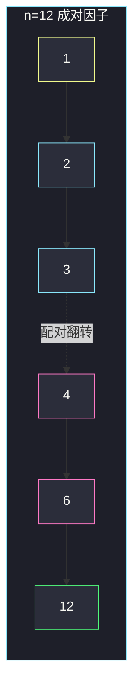
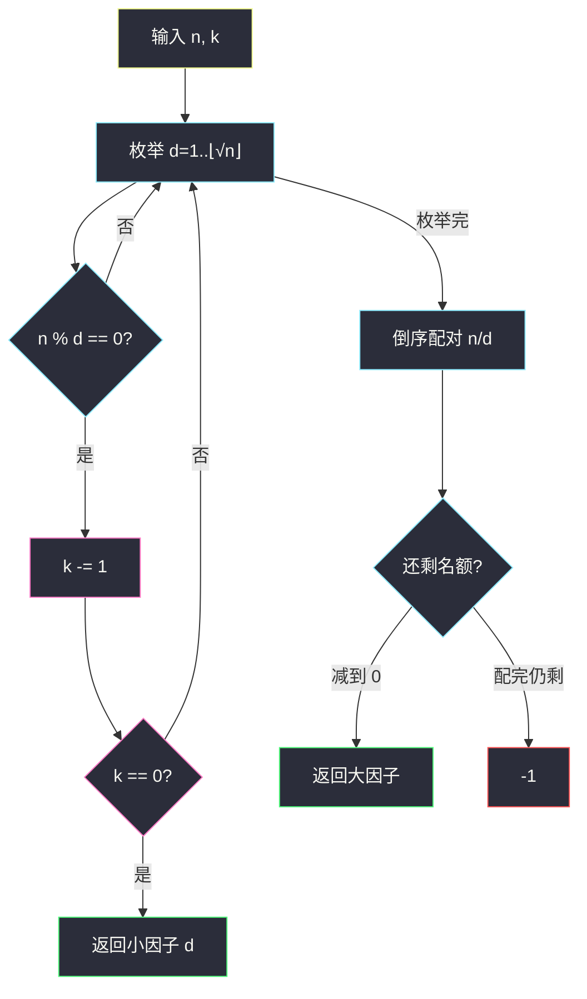

# n 的第 k 个因子（成对枚举）

## 一、问题描述

给你两个正整数 `n` 和 `k`。把 `n` 的所有正因子**升序**排列，返回第 `k` 个（从 1 开始计）。因子不足 `k` 个则返回 `-1`。

> 🔗 LeetCode 1492：https://leetcode.cn/problems/the-kth-factor-of-n/
>
> 数据范围：`1 ≤ k ≤ n ≤ 1000`。题目另有进阶：能否做到小于 `O(n)`。
>
> 📚 灵茶题单：**§1.5 因子**（1232 分）。因子成对出现：`d` 整除 `n` 则 `n/d` 也整除 `n`。枚举到 `⌊√n⌋` 就能拿到全部。

**示例 1**

```
输入：n = 12, k = 3
输出：3
解释：因子 [1, 2, 3, 4, 6, 12]，第 3 个是 3。
```

**示例 2**

```
输入：n = 7, k = 2
输出：7
解释：因子 [1, 7]，第 2 个是 7。
```

**示例 3**（官方，任务书未列）

```
输入：n = 4, k = 4
输出：-1
解释：因子 [1, 2, 4]，只有 3 个。
```

**直观理解**

从小到大扫一遍 `1..n`，能整除的就是因子，数到第 `k` 个即可。`n ≤ 1000` 这样写能过。真正要带走的是成对结构：小因子 `1, 2, 3, …` 从小到大排在前面，对应的大因子 `n, n/2, n/3, …` 从大到小排在后面。第 `k` 个既可能落在左半段，也可能落在右半段。

---

## 二、暴力解法

从 1 枚举到 `n`，每碰到一个因子就把剩余名额 `k` 减一，减到 0 就返回答案。扫完还没减完，说明不够 `k` 个。

```python
class Solution:
    def kthFactor(self, n: int, k: int) -> int:
        for d in range(1, n + 1):
            if n % d == 0:
                k -= 1
                if k == 0:
                    return d
        return -1
```

### 🔴 瓶颈在哪里

时间 `O(n)`。本题范围能过，但因子最多 `O(√n)` 对，扫到 `n` 浪费了后半段。进阶要求小于 `O(n)`，标准做法是枚举到根号，再用「成对」把大因子倒着数出来。

---

## 三、优化探索（核心章节）

> 📚 本题在灵茶题单中属于 **§1.5 因子**。模板：`for d in 1..⌊√n⌋`，若 `n % d == 0`，则 `d` 与 `n/d` 都是因子（`d * d == n` 时只算一次）。

### 3.1 因子成对、有序

以 `n = 12` 为例：

| 小因子 d（≤ √12 ≈ 3.46） | 配对大因子 n/d |
|--------------------------|----------------|
| 1 | 12 |
| 2 | 6 |
| 3 | 4 |

升序完整列：`1, 2, 3 | 4, 6, 12`。竖线左边是「从小到大枚举试除」直接得到的；右边是把左边**倒过来**取配对。完全平方时中间还有一个「对折」因子（如 `36` 的 `6`），只出现一次。



黄/青是小因子（先遇到）；粉/绿是大因子（后遇到）。`k=3` 落在青节点 3；`k=5` 落在粉节点 6。

### 3.2 算法

1. 用列表 `small` 收集所有 `d * d ≤ n` 且 `n % d == 0` 的 `d`（已按升序）。每收一个，`k -= 1`，减到 0 就返回这个小因子。
2. 若还没返回：大因子按 `n/small[j]`、`j` 从大到小。若 `n` 是完全平方，`small` 末尾那个平方根已经数过，要从倒数第二个开始，避免把根数两次。
3. 大因子也数完仍剩 `k`，返回 `-1`。



### 3.3 一句话核心

> **小因子从小到大、大因子从大到小成对出现；第 k 个可能落在右半段，完全平方的根只数一次。**

---

## 四、代码实现

### Python（主解：√n 成对）

```python
class Solution:
    def kthFactor(self, n: int, k: int) -> int:
        small = []
        d = 1
        while d * d <= n:
            if n % d == 0:
                small.append(d)
                k -= 1
                if k == 0:
                    return d
            d += 1
        # 大因子：从最大的配对开始倒着数
        j = len(small) - 1
        if small[j] * small[j] == n:
            j -= 1  # 平方根已计入
        while j >= 0:
            k -= 1
            if k == 0:
                return n // small[j]
            j -= 1
        return -1
```

`n ≤ 1000` 时暴力也能过；这版是进阶写法，`n` 到 `10^12` 同样适用（只要把 `d * d` 改成注意溢出，Python 不用改）。

**变量含义**

| 写法 | 含义 |
|------|------|
| `small` | 不超过 `√n` 的因子，升序 |
| `k` | 还剩几个名额 |
| `small[j] * small[j] == n` | `n` 完全平方，根已在 `small` 末尾 |
| `n // small[j]` | 与 `small[j]` 配对的大因子 |

### Java（可选）

```java
class Solution {
    public int kthFactor(int n, int k) {
        List<Integer> small = new ArrayList<>();
        for (int d = 1; (long) d * d <= n; d++) {
            if (n % d == 0) {
                small.add(d);
                if (--k == 0) return d;
            }
        }
        int j = small.size() - 1;
        if ((long) small.get(j) * small.get(j) == n) j--;
        while (j >= 0) {
            if (--k == 0) return n / small.get(j);
            j--;
        }
        return -1;
    }
}
```

---

## 五、具体例子演示

**示例 1**：`n = 12, k = 3`。`⌊√12⌋ = 3`。

| 试除 d | d*d ≤ 12? | 12 % d | 动作 | k 剩余 | small |
|--------|-----------|--------|------|--------|-------|
| 1 | 是 | 0 | 收下，k: 3→2 | 2 | [1] |
| 2 | 是 | 0 | 收下，k: 2→1 | 1 | [1,2] |
| 3 | 是 | 0 | 收下，k: 1→0 | 0 | 返回 3 |

第 3 个因子就是 3，不必看大因子。对拍官方。

**示例 2**：`n = 7, k = 2`。

| 试除 d | 7 % d | 动作 | k |
|--------|-------|------|---|
| 1 | 0 | 收下 | 2→1 |
| 2 | 1 | 跳过 | 1 |
| 3 | `9 > 7` 停 | — | 1 |

`small = [1]`，不是完全平方。倒序配对：`j=0`，`7/1 = 7`，`k: 1→0`，返回 7。对拍官方。

**示例 3**：`n = 4, k = 4`（完全平方 + 不够 k 个）。

| 试除 d | 动作 | k | small |
|--------|------|---|-------|
| 1 | 收下 | 3 | [1] |
| 2 | 收下（根） | 2 | [1,2] |

`2*2 == 4`，`j` 从 0 开始（跳过根）。只剩配对 `4/1 = 4`，`k: 2→1`，列表走完仍剩 1，返回 -1。对拍官方。

**再走一遍 `n=12, k=5`**（第 k 个落在大因子一侧）：

小因子收完 `small=[1,2,3]`，`k: 5→2`。非平方，`j` 从 2 起：

| j | small[j] | 大因子 12/small[j] | k |
|---|----------|--------------------|---|
| 2 | 3 | 4 | 2→1 |
| 1 | 2 | 6 | 1→0 → 返回 6 |

因子列 `[1,2,3,4,6,12]` 的第 5 个确是 6。

**边界**：`k=1` 恒为 1；`k=n` 只有 `n=1` 时成立（1 的因子仅 `[1]`），否则因子个数远小于 `n`，多半 `-1`。`n` 为质数时因子恰好 `[1, n]`。

---

## 六、复杂度分析

| 方法 | 时间 | 空间 | 说明 |
|------|------|------|------|
| 枚举 1..n | `O(n)` | `O(1)` | 范围能过 |
| √n 成对（主解） | `O(√n)` | `O(√n)` | `small` 最坏存下全部小因子 |
| √n 两次扫描不存列表 | `O(√n)` | `O(1)` | 先数小因子个数，再决定走哪一侧 |

主解空间可再压：先扫一遍只计数，若 `k` 落在小侧再扫一遍返回；落在大侧从 `⌊√n⌋` 往下找第 `(cnt-k+1)` 个小因子再取配对。面试默写带 `small` 更清楚。

---

## 七、对比总结

| 维度 | 枚举到 n | 成对到 √n |
|------|----------|-----------|
| 有序性 | 自然升序 | 小段升序 + 大段降序拼 |
| 完全平方 | 无特殊 | 根只数一次 |
| 进阶 | 不满足 | 满足 |

**易错点**

1. **平方根数两次**：`n=36` 的 6 既是 `d` 又是 `n/d`。
2. **大因子没倒序**：`n/1, n/2, n/3` 是降序才对；正序会得到 `12,6,4` 而不是 `4,6,12`。
3. **循环写成 `d * d < n`**：漏掉平方根。
4. **`k` 从 0 计**：题目从 1 开始，减到 0 再返回。
5. **因子不足仍返回 `n`**：必须 `-1`。

---

## 八、举一反三

| 题目 | 关系 |
|------|------|
| [1952. 三除数](https://leetcode.cn/problems/three-divisors/) | 同目录 `three-divisors.md`，§1.5：因子形态锁成 `p²` |
| [1390. 四因数](https://leetcode.cn/problems/four-divisors/) | 枚举 `√n` 收集因子再判定个数 |
| [507. 完美数](https://leetcode.cn/problems/perfect-number/) | 枚举 `√n` 以内真因子求和 |
| [1979. 找出数组的最大公约数](https://leetcode.cn/problems/find-greatest-common-divisor-of-array/) | 同目录 `find-greatest-common-divisor-of-array.md`，因子与 gcd |
| [204. 计数质数](https://leetcode.cn/problems/count-primes/) | 质数的因子恰好两个：1 和自身 |

**思想迁移**

- 要「第 k 个因子 / 因子和 / 因子个数」，上界先想到 `√n`，不要扫到 `n`。
- 口诀：**「小的正着数，大的倒着配，根只算一次。」**
