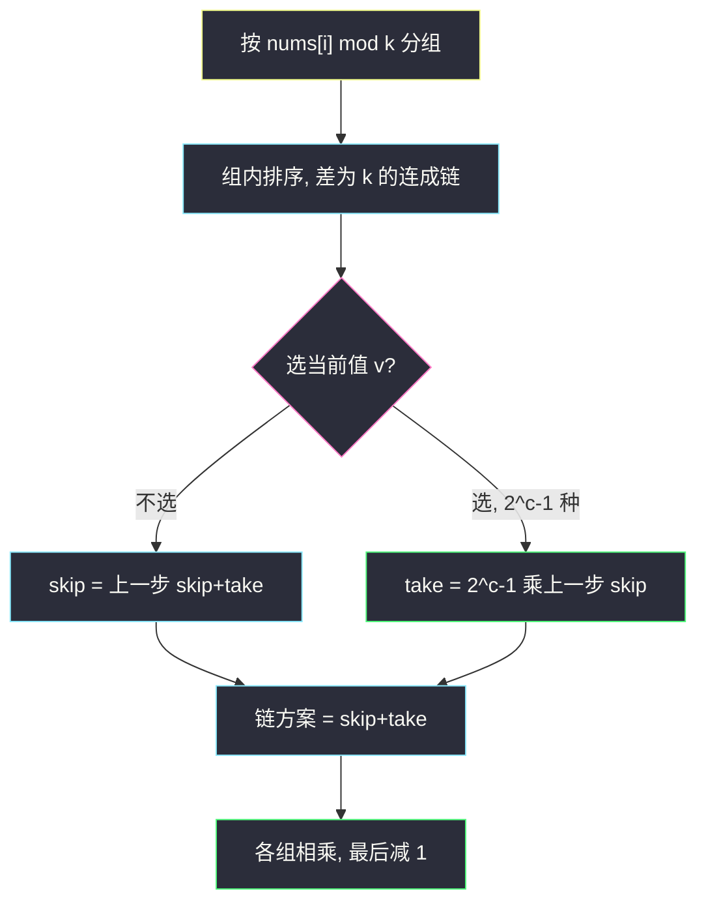
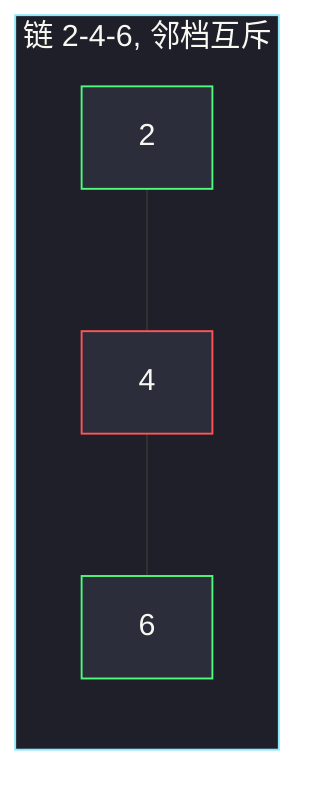

# 美丽子集的数目（模 k 分组 · 链上打家劫舍）

## 一、问题描述

数组 `nums` 和一个正整数 `k`。一个子集是**美丽的**，当且仅当子集里任意两个数的差的绝对值都不等于 `k`。下标不同就算不同元素（值相同的两个 4 是两个可区分的数）。求**非空**美丽子集的个数。

> 🔗 LeetCode 2597：https://leetcode.cn/problems/the-number-of-beautiful-subsets/
>
> 数据范围：`1 ≤ n ≤ 20`，`1 ≤ nums[i], k ≤ 1000`。
>
> 📚 灵茶题单：**§7.1 一维 DP**。`n=20` 回溯也能过。更贴本节的做法：按 `nums[i] % k` 分组，组内排序后拆成差恰好为 `k` 的链，每条链像打家劫舍——选了这个值就不能选相邻值；同一值出现 `c` 次有 `2^c-1` 种非空选法。各组方案相乘，最后减掉空集。

**示例 1**

```
输入：nums = [2,4,6], k = 2
输出：4
解释：美丽子集是 [2]、[4]、[6]、[2,6]。[2,4] 与 [4,6] 差为 2，不合法。
```

**示例 2**

```
输入：nums = [1], k = 1
输出：1
解释：只有单元素子集。
```

**直观理解**

冲突边只连「差恰好为 `k`」的两个数。`k ≥ 1`，相同值之间差为 0，**永远不冲突**，可以任意选或不选。冲突图是若干条链，链上相邻不能一起选——正是打家劫舍在「方案数」上的版本。

---

## 二、暴力解法

`n ≤ 20`，每个下标选或不选，检查是否与已选数字差为 `k`。

```python
from collections import Counter

class Solution:
    def beautifulSubsets(self, nums: list[int], k: int) -> int:
        n = len(nums)
        cnt = Counter()

        def dfs(i: int) -> int:
            if i == n:
                return 1  # 含空集
            ans = dfs(i + 1)  # 不选 nums[i]
            if cnt[nums[i] - k] == 0 and cnt[nums[i] + k] == 0:
                cnt[nums[i]] += 1
                ans += dfs(i + 1)
                cnt[nums[i]] -= 1
            return ans

        return dfs(0) - 1
```

官方两例都能过。`2^20 ≈ 10^6`，再乘一点检查，可以过本题。本节要练的是把它收成一维 DP，而不是停在回溯。

### 🔴 瓶颈在哪里

回溯没揭示结构：冲突只发生在「模 `k` 相同、数值差恰好 `k`」的数之间。不同余数组互不影响，方案数直接相乘。组内再拆链，每条链独立做打家劫舍。

---

## 三、优化探索（核心章节）

> 📚 本题在灵茶题单中属于 **§7.1 一维 DP**。和 [740. 删除并获得点数](https://leetcode.cn/problems/delete-and-earn/) 同一骨架：`f[i] = f[i-1]`（不选当前值）或 `f[i] = w[i] * f[i-2]`（选当前值，断开邻居）。这里的 `w[i]` 不是点数，是「这个值至少选一个」的方案数 `2^c-1`。

### 3.1 为什么按模 k 分组

若 `|a-b| = k`，则 `a ≡ b (mod k)`。余数不同的两个数**不可能**差为 `k`，分在不同组里互不干涉。

同一余数组内，把不同的值从小到大排。相邻两个值：

- 差恰好为 `k`：冲突，是链上的邻居；
- 差 ≥ `2k`：中间至少隔了一个没出现的值，不冲突，应拆成两条独立的链。

### 3.2 一条链上的转移

链：`v, v+k, v+2k, …`，值 `v` 出现 `c` 次。

- 不选这个值：前面怎么选都行，方案 = `skip + take`（上一步的两种）。
- 选这个值：这个值的 `c` 个下标，每个独立选或不选，但不能全不选，有 `2^c-1` 种；同时上一个值必须不选，乘上一步的 `skip`。

记：

```
# skip = 不选当前值的方案数（含「到目前为止仍是空集」）
# take = 选当前值（至少 1 个）的方案数
skip, take = skip + take, (2^c - 1) * skip
```

初值：还没开始时 `skip=1, take=0`（只有空集一种）。

一条链的方案数（含空集）= 最后的 `skip + take`。多条链、多组之间相乘。全部乘完后减 1，去掉「每个组都空」的那一个全局空集。



### 3.3 同值为什么是 `2^c-1`

题目按下标区分。三个相同的 4、`k=1`：`|4-4| ≠ 1`，`2^3-1=7` 个非空子集全合法。若误写成「同值只能选一次」，会少算。

### 3.4 一句话核心

> **余数分组互不干涉；组内差为 k 的链做打家劫舍；同值 c 个贡献 `2^c-1`；最后减空集。**

---

## 四、代码实现

### Python（主解：分组 + 链上 DP）

```python
from collections import defaultdict, Counter

class Solution:
    def beautifulSubsets(self, nums: list[int], k: int) -> int:
        groups = defaultdict(Counter)
        for x in nums:
            groups[x % k][x] += 1

        ans = 1
        for cnt in groups.values():
            vals = sorted(cnt)

            def chain_ways(chain: list[int]) -> int:
                # skip/take：处理到当前值时，不选 / 选该值的方案数（含前缀空集）
                skip, take = 1, 0
                for v in chain:
                    c = cnt[v]
                    skip, take = skip + take, ((1 << c) - 1) * skip
                return skip + take

            i, ways = 0, 1
            while i < len(vals):
                chain = [vals[i]]
                i += 1
                while i < len(vals) and vals[i] - vals[i - 1] == k:
                    chain.append(vals[i])
                    i += 1
                ways *= chain_ways(chain)
            ans *= ways
        return ans - 1
```

**变量含义**

| 写法 | 含义 |
|------|------|
| `groups[x%k][x]` | 余数组里数值 `x` 的出现次数 |
| `skip` | 不选当前值 |
| `take` | 当前值至少选 1 个，且上一个值没选 |
| `(1<<c)-1` | `c` 个相同值的非空选法 |

### Java（最优解）

```java
import java.util.*;

class Solution {
    public int beautifulSubsets(int[] nums, int k) {
        Map<Integer, Map<Integer, Integer>> groups = new HashMap<>();
        for (int x : nums) {
            groups.computeIfAbsent(x % k, t -> new TreeMap<>())
                    .merge(x, 1, Integer::sum);
        }
        int ans = 1;
        for (Map<Integer, Integer> cnt : groups.values()) {
            List<Integer> vals = new ArrayList<>(cnt.keySet());
            int i = 0, ways = 1;
            while (i < vals.size()) {
                List<Integer> chain = new ArrayList<>();
                chain.add(vals.get(i++));
                while (i < vals.size() && vals.get(i) - vals.get(i - 1) == k) {
                    chain.add(vals.get(i++));
                }
                ways *= chainWays(chain, cnt);
            }
            ans *= ways;
        }
        return ans - 1;
    }

    // skip/take：不选 / 选当前值的方案数
    private int chainWays(List<Integer> chain, Map<Integer, Integer> cnt) {
        int skip = 1, take = 0;
        for (int v : chain) {
            int c = cnt.get(v);
            int nskip = skip + take;
            int ntake = ((1 << c) - 1) * skip;
            skip = nskip;
            take = ntake;
        }
        return skip + take;
    }
}
```

方案数上限 `2^20-1`，`int` 够用。

---

## 五、具体例子演示

### 5.1 官方示例 1：`[2,4,6], k=2` → 4

全是偶数，一组。排序 `2,4,6`，相邻差都是 2，一条链。每个值 `c=1`，`2^1-1=1`。

| 值 | skip | take | skip+take | 含义 |
|----|------|------|-----------|------|
| 2 | 1 | 1 | 2 | 空 / {2} |
| 4 | 2 | 1 | 3 | 不选 4：空与 {2}；选 4：只能 {4} |
| 6 | 3 | 2 | 5 | 不选 6：上一行 3 种；选 6：上一步 skip=2 → {6} 与 {2,6} |

含空集 5 种，减 1 得 4：`{2}` `{4}` `{6}` `{2,6}`。对拍官方。



绿的 2 和 6 可以一起选（差 4 ≠ k）；红的 4 与两边都冲突。

### 5.2 官方示例 2：`[1], k=1` → 1

一条链一个值，`2^1-1=1`，减空集后仍是 1。对拍官方。

### 5.3 拆链：`[1,2,3,4], k=2`

- 余数 1：`1,3`（差 2）一条链，方案 3（含空）。
- 余数 0：`2,4` 同理 3。
- `3×3-1=8`。

非空合法子集：4 个单元素，加上 `{1,2}` `{1,4}` `{2,3}` `{3,4}`。`{1,3}`、`{2,4}` 非法。逐步乘出来的 8 与枚举一致。

同值课：`[4,4,4], k=1` → `2^3-1=7`，三个下标任意非空组合都美丽。

---

## 六、复杂度分析

| 方法 | 时间 | 空间 | 说明 |
|------|------|------|------|
| 回溯（第二节） | `O(2^n)` | `O(n)` | `n ≤ 20` 可过 |
| 分组打家劫舍（主解） | `O(n log n)` | `O(n)` | 排序分组；链上线性 |

---

## 七、对比总结

| 维度 | 198 打家劫舍 | 本题一条链 |
|------|--------------|------------|
| 决策 | 偷或不偷 | 这个**值**选或不选 |
| 权重 | `nums[i]` 点数 | `2^c-1` 种选法 |
| 目标 | 最大点数 | 方案数相乘 |
| 相邻 | 下标差 1 | 数值差恰好 `k` |

**易错点**

1. **空集没减**：各组含空方案相乘后必须 `-1`。
2. **同值当成冲突**：`k ≥ 1`，同值差为 0，应 `2^c` 全选。
3. **差为 `2k` 仍当邻居**：只有差恰好 `k` 才断；`2` 与 `6`、`k=2` 合法。
4. **不同余数还去比差**：余数不同不可能差为 `k`，应直接乘。
5. **回溯里用值去重**：下标不同要算不同子集，不能 `set(nums)`。

---

## 八、举一反三

| 题目 | 关系 |
|------|------|
| [198. 打家劫舍](https://leetcode.cn/problems/house-robber/) | 同一转移骨架 |
| [740. 删除并获得点数](https://leetcode.cn/problems/delete-and-earn/) | 同值打包后邻档互斥；见 `delete-and-earn.md` |
| [3186. 施咒的最大总伤害](https://leetcode.cn/problems/maximum-total-damage-with-spell-casting/) | 选 `x` 不能选 `x-2..x+2`，链更宽 |
| [78. 子集](https://leetcode.cn/problems/subsets/) | 无冲突时就是 `2^n-1` |
| [526. 优美的排列](https://leetcode.cn/problems/beautiful-arrangement/) | 另一个「美丽」计数，状压 |

**思想迁移**

- 冲突图若能按模拆成独立链，计数就变成打家劫舍乘积。
- 口诀：**「模 k 分组；差 k 成链；选值乘 2^c-1；乘完减空。」**
