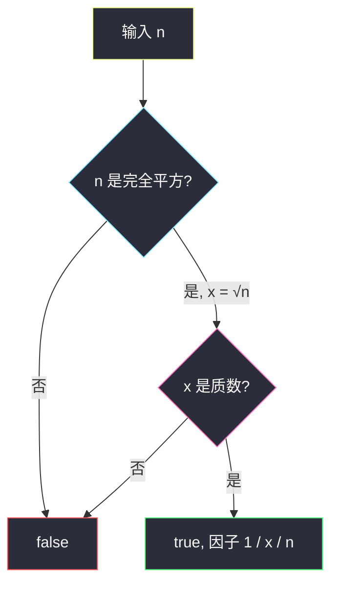
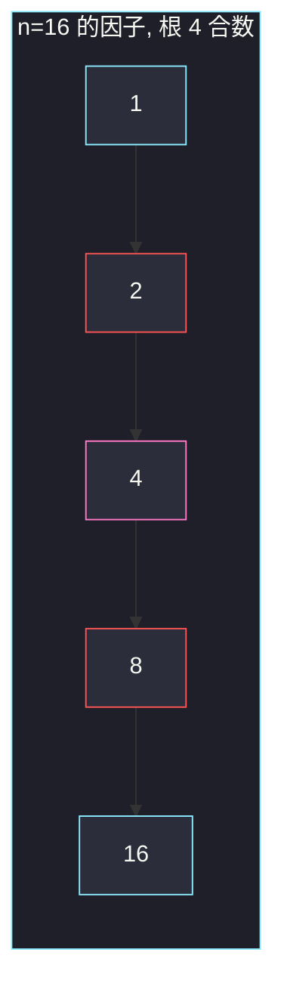

# 三除数（完全平方且根为质数）

## 一、问题描述

给你一个整数 `n`，判断它是否**恰好有 3 个正因子**。有则返回 `true`，否则 `false`。

> 🔗 LeetCode 1952：https://leetcode.cn/problems/three-divisors/
>
> 数据范围：`1 ≤ n ≤ 10^4`。
>
> 📚 灵茶题单：**§1.5 因子**（1204 分）。恰好 3 个正因子 ⇔ `n = p²` 且 `p` 为质数（因子只有 `1, p, p²`）。

**示例 1**

```
输入：n = 2
输出：false
解释：正因子只有 1 和 2，共 2 个。
```

**示例 2**

```
输入：n = 4
输出：true
解释：正因子是 1、2、4，恰好 3 个。
```

**直观理解**

因子总是成对出现：`d` 整除 `n` 则 `n/d` 也整除 `n`。要正好 3 个，多出来的那一个必须是「对折在中间」的平方根，所以 `n` 先得是完全平方；中间那个根还必须是质数，否则还会再拆出别的因子。`4 = 2²` 满足；`9 = 3²` 满足；`16 = 4²` 不满足，因为 4 不是质数，因子变成 `1,2,4,8,16` 五个。

---

## 二、暴力解法

从 1 枚举到 `n`，数有多少个能整除 `n` 的。

```python
class Solution:
    def isThree(self, n: int) -> bool:
        cnt = 0
        for d in range(1, n + 1):
            if n % d == 0:
                cnt += 1
        return cnt == 3
```

`n ≤ 10^4` 能过，但枚举到 `n` 没吃到 §1.5 的结构：因子个数由质因子指数决定，不必真去数。

### 🔴 瓶颈在哪里

枚举到 `n` 是 `O(n)`；即使改成枚举到 `⌊√n⌋` 数因子，也还是在「计数」而不是「判定形态」。本题形态唯一：`p²`。先判完全平方，再判根是否质数，枚举上界从 `n` 掉到 `⌊√p⌋ ≤ ⌊n^{1/4}⌋`。

---

## 三、优化探索（核心章节）

> 📚 本题在灵茶题单中属于 **§1.5 因子**。先复习：若 `n = p1^a1 · p2^a2 · …`，正因子个数是 `(a1+1)(a2+1)…`。

### 3.1 因子个数等于 3 的充要条件

3 是质数，乘积 `(a1+1)(a2+1)… = 3` 只能是「单独一个因子等于 3」：某个 `ai + 1 = 3`，其余指数不存在。于是 `n = p^2`，`p` 为质数。

此时因子恰好是：

| 因子 | 来源 |
|------|------|
| 1 | `p^0` |
| p | `p^1` |
| p² | `p^2` |

没有第四个。若 `n` 有两个不同质因子，因子个数至少 `(1+1)(1+1)=4`（例如 `6=2×3` → `1,2,3,6`）。若 `n = p^k` 且 `k ≠ 2`：`k=1` 只有两个因子，`k=3` 有四个（`1,p,p²,p³`，如 8）。

### 3.2 判定步骤

1. `n < 4` 直接否：最小的 `p²` 是 `2² = 4`。`1` 只有因子 1。
2. 令 `x = ⌊√n⌋`，检查 `x * x == n`。不是完全平方则否。
3. 判断 `x` 是否质数：试除到 `⌊√x⌋`。是则 `n` 恰好三因子。

不要枚举到 `n`。平方根用整数：`x * x == n` 避免浮点 `sqrt` 打到 `3.999999`。



### 3.3 一句话核心

> **恰好三个正因子，当且仅当 n 是某个质数的平方。**

---

## 四、代码实现

### Python（主解：平方 + 素性）

```python
class Solution:
    def isThree(self, n: int) -> bool:
        if n < 4:
            return False
        x = int(n**0.5)
        if x * x != n:
            return False
        if x < 2:
            return False
        d = 2
        while d * d <= x:
            if x % d == 0:
                return False
            d += 1
        return True
```

`n ≤ 10^4` 时 `x ≤ 100`，`int(n**0.5)` 对这个范围是安全的；更稳也可以从 1 扫到 100 找 `x*x==n`。

**变量含义**

| 写法 | 含义 |
|------|------|
| `x` | 候选平方根，也是唯一可能的中间因子 |
| `x * x == n` | 完全平方 |
| `d * d <= x` | 试除判定 `x` 是否质数 |

---

## 五、具体例子演示

**示例 1**：`n = 2`。`2 < 4`，直接 false。因子列表 `{1,2}`，对拍官方。

**示例 2**：`n = 4`。

| 步骤 | 结果 |
|------|------|
| `⌊√4⌋ = 2`，`2*2 == 4` | 完全平方 |
| 判 2 是否质数：`d` 从 2 起，`d*d=4 > 2`，试除循环不进 | 2 是质数 |
| 因子 | `1, 2, 4` |

返回 true。对拍官方。

**再看几个形态**（把「为什么必须是 p²」钉死）：

| n | √n | 是否平方 | 根是否质 | 正因子 | 结论 |
|---|-----|----------|----------|--------|------|
| 1 | 1 | 是 | 1 不是质数 | 1 | false |
| 8 | — | 否 | — | 1,2,4,8 | false |
| 9 | 3 | 是 | 是 | 1,3,9 | true |
| 16 | 4 | 是 | 4=2×2 否 | 1,2,4,8,16 | false |
| 25 | 5 | 是 | 是 | 1,5,25 | true |
| 36 | 6 | 是 | 否 | 1,2,3,4,6,9,12,18,36 | false |
| 49 | 7 | 是 | 是 | 1,7,49 | true |

`16` 最容易写错：看见完全平方就返回 true，忘了根必须是质数。



粉节点是平方根 4；红节点是多出来的 2 和 8。三除数只允许黄/青那一列的三个位置，这里涨到五个。

**边界**：`n=1` false；`n=4` 最小的 true；`n=10^4=100²`，100 合数，false。最大的合法值在范围内是 `97²=9409`（97 是 ≤100 的质数）。

---

## 六、复杂度分析

| 方法 | 时间 | 空间 | 说明 |
|------|------|------|------|
| 枚举到 n | `O(n)` | `O(1)` | 能过但不该写 |
| 枚举到 √n 数因子 | `O(√n)` | `O(1)` | 仍在计数 |
| 平方 + 试除素性（主解） | `O(n^{1/4})` | `O(1)` | 试除到 `√√n` |

`n ≤ 10^4` 时主解几乎是常数。不要用埃氏筛整张表，单次查询杀鸡用牛刀。

---

## 七、对比总结

| 维度 | 恰好 3 个因子 | 恰好 4 个因子（1390） | 完全平方 |
|------|---------------|----------------------|----------|
| 形态 | `p²`，p 质数 | `p³` 或 `p×q` | `k²`，k 任意 |
| 判定 | 平方 + 根质数 | 更分支 | 只做第一步 |
| 反例 | 16 = 4² | — | 16 是平方但不是三除数 |

**易错点**

1. **把 1 当质数**：`n=1` 是平方，但不是三除数。
2. **只判平方**：`16、36、100` 全会误判 true。
3. **枚举到 n**：能过但没学到因子公式。
4. **浮点开方**：大数上 `sqrt` 可能偏 1，用 `x*x==n` 回校；本题范围小，仍建议回校。
5. **试除从 1 开始**：`x%1==0` 永远成立，应从 2 起。

---

## 八、举一反三

| 题目 | 关系 |
|------|------|
| [1390. 四因数](https://leetcode.cn/problems/four-divisors/) | 因子个数 = 4：`p³` 或 `p×q` 两种形态 |
| [204. 计数质数](https://leetcode.cn/problems/count-primes/) | 素性判定的批量版：埃氏筛 |
| [279. 完全平方数](https://leetcode.cn/problems/perfect-squares/) | 平方作为「形态」而不是因子个数 |
| [507. 完美数](https://leetcode.cn/problems/perfect-number/) | 枚举 `√n` 以内因子求和 |
| [1492. n 的第 k 个因子](https://leetcode.cn/problems/the-kth-factor-of-n/) | 仍是 §1.5：枚举到根号再对称写出另一半 |

**思想迁移**

- 因子个数看指数 +1 的乘积；3 是质数，形态被锁成 `p²`。
- 口诀：**「先平方，再问根是不是质数。」**
