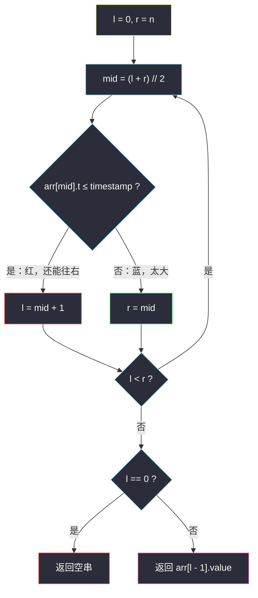
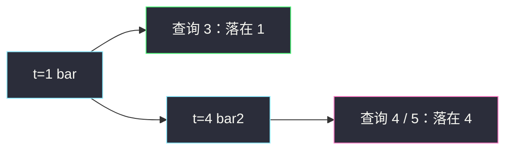

# 基于时间的键值存储（二分 · 最右不超过）

## 一、问题描述

设计一个时间戳键值存储结构 `TimeMap`，它支持两个操作：

- `set(key, value, timestamp)`：存储键 `key`、值 `value`，以及给定的时间戳 `timestamp`。
- `get(key, timestamp)`：返回先前调用 `set` 存入的、满足 `timestamp_prev ≤ timestamp` 的**最大** `timestamp_prev` 所对应的 `value`。如果没有这样的记录，返回空字符串 `""`。

题目保证：对同一个 `key`，`set` 的 `timestamp` **严格递增**。

> 🔗 LeetCode 981：https://leetcode.cn/problems/time-based-key-value-store/
>
> 数据范围：`1 <= key.length, value.length <= 100`，`1 <= timestamp <= 10^7`，`set` 和 `get` 总调用次数均 ≤ `2·10^5`。

**示例 1**

```
输入：
["TimeMap","set","get","get","set","get","get"]
[[],["foo","bar",1],["foo",1],["foo",3],["foo","bar2",4],["foo",4],["foo",5]]
输出：[null,null,"bar","bar",null,"bar2","bar2"]
解释：
set("foo","bar",1)
get("foo",1) → "bar"     （恰好等于 1）
get("foo",3) → "bar"     （没有 3，用 ≤ 3 的最大时间 1）
set("foo","bar2",4)
get("foo",4) → "bar2"
get("foo",5) → "bar2"    （≤ 5 的最大时间是 4）
```

**示例 2**

```
输入：get 一个从未 set 过的 key，或 timestamp 比该 key 第一次 set 还小
输出：""
```

**直观理解**

每个 key 底下是一条按时间**升序**的记录链。`get` 不是精确匹配，而是「不超过查询时刻的最近一次写入」——有序数组上找 **`≤ timestamp` 的最右位置**。`set` 的时间戳严格递增，直接 append，不必再排序。

---

## 二、暴力解法

用哈希表 `key → 列表[(timestamp, value)]`。`set` 追加；`get` 从后往前扫，碰到第一个 `t ≤ timestamp` 就返回。

```python
class TimeMap:
    def __init__(self):
        self.store = {}

    def set(self, key: str, value: str, timestamp: int) -> None:
        self.store.setdefault(key, []).append((timestamp, value))

    def get(self, key: str, timestamp: int) -> str:
        arr = self.store.get(key, [])
        for i in range(len(arr) - 1, -1, -1):
            if arr[i][0] <= timestamp:
                return arr[i][1]
        return ""
```

从后往前扫是对的：列表已按时间递增，第一个满足 `≤` 的就是最大合法时间。

### 复杂度

- **set**：`O(1)`。
- **get**：`O(n)`，`n` 为该 key 的记录数。总调用 `2·10^5`，最坏每次扫满，会超时。
- **空间**：`O(总 set 次数)`。

### 🔴 瓶颈在哪里

有序却线性扫。`get` 要的是「最后一个 `t ≤ timestamp`」，正是二分的 upper_bound 再退一格。

---

## 三、优化探索（核心章节）

> 📚 本题在灵茶题单中属于 **02-二分查找 · §1.2 进阶**：在已排序的附属数组上做 lower / upper bound，而不是在原题数组上找 target。

### 3.1 存什么

`dict[key] → [(t0, v0), (t1, v1), …]`，`t` 严格递增。`set` 只 append。

### 3.2 get：第一个「太大」的下标减 1

左闭右开 `[l, r) = [0, n)`。check：`arr[mid][0] ≤ timestamp` 表示「还能再往右」，染红并 `l = mid + 1`；否则染蓝 `r = mid`。结束时 `l` 是**第一个时间戳 > timestamp** 的下标（可能等于 `n`）。

- `l == 0`：所有记录都比查询时刻大 → `""`；
- 否则答案在 `l - 1`。

这和 `sqrtx`「第一个太大减 1」是同一模板，check 从平方换成时间戳。



### 3.3 为什么不用平衡树

`set` 已保证时间递增，列表天然有序，二分足够。若 `set` 能乱序插入，才需要 `TreeMap` / 手写平衡树。本题不要把简单问题升级成红黑树。

### 3.4 一句话核心

> **每个 key 一条按时间递增的列表；get 在列表上二分，找第一个 `t > timestamp`，答案是它前一个 value。**

---

## 四、代码实现

### Python（主解）

```python
class TimeMap:
    def __init__(self):
        self.store = {}                         # key -> [(timestamp, value), ...]

    def set(self, key: str, value: str, timestamp: int) -> None:
        self.store.setdefault(key, []).append((timestamp, value))

    def get(self, key: str, timestamp: int) -> str:
        arr = self.store.get(key)
        if not arr:
            return ""
        l, r = 0, len(arr)                      # 左闭右开 [l, r)
        while l < r:
            mid = (l + r) // 2
            if arr[mid][0] <= timestamp:        # 红色：还可以再右
                l = mid + 1
            else:
                r = mid                         # 蓝色：mid 已经太大
        if l == 0:
            return ""
        return arr[l - 1][1]
```

**变量含义**

| 变量 | 含义 |
|------|------|
| `store[key]` | 该 key 的时间升序记录 |
| `l` | 结束后 = 第一个 `t > timestamp` 的下标 |
| `arr[l - 1]` | `≤ timestamp` 的最右一条 |

循环不变量与 #35 / #69 相同：`[0, l)` 的时间戳都 `≤ timestamp`，`[r, n)` 都 `> timestamp`。结束时 `l == r`，前一条（若存在）就是最右合法记录。

等价写法：先抽出时间戳数组，再 `bisect.bisect_right(ts, timestamp)`，得到的插入点就是这里的 `l`。手写二分是为了把左闭右开模板练熟。

### Java（最优解同款）

```java
class TimeMap {
    private static class Pair {
        int t;
        String v;
        Pair(int t, String v) { this.t = t; this.v = v; }
    }
    private final Map<String, List<Pair>> store = new HashMap<>();

    public TimeMap() {}

    public void set(String key, String value, int timestamp) {
        store.computeIfAbsent(key, k -> new ArrayList<>())
             .add(new Pair(timestamp, value));
    }

    public String get(String key, int timestamp) {
        List<Pair> arr = store.get(key);
        if (arr == null) return "";
        int l = 0, r = arr.size();
        while (l < r) {
            int mid = l + (r - l) / 2;
            if (arr.get(mid).t <= timestamp) l = mid + 1;
            else r = mid;
        }
        return l == 0 ? "" : arr.get(l - 1).v;
    }
}
```

---

## 五、具体例子演示

沿用示例 1。两次 `set` 之后，`foo` 的列表是 `[(1,"bar"), (4,"bar2")]`，`n = 2`。

**get("foo", 3)**：要 ≤ 3 的最右。初始 `l = 0`，`r = 2`。

| 轮次 | l | r | mid | arr[mid].t | t ≤ 3 ? | 动作 | 新区间 |
|------|---|---|-----|------------|---------|------|--------|
| 1 | 0 | 2 | 1 | 4 | 4 ≤ 3？否 | `r = 1` | `[0, 1)` |
| 2 | 0 | 1 | 0 | 1 | 1 ≤ 3？是 | `l = 1` | `[1, 1)` |

`l = 1 ≠ 0`，返回 `arr[0].value = "bar"` ✓。

**get("foo", 4)**（恰好命中 4）：

| 轮次 | l | r | mid | arr[mid].t | t ≤ 4 ? | 新区间 |
|------|---|---|-----|------------|---------|--------|
| 1 | 0 | 2 | 1 | 4 | 是 | `[2, 2)` |

`l = 2`，返回 `arr[1] = "bar2"` ✓。恰好相等时 `≤` 把这条染红，继续往右，最终停在它的下一格。

**get("foo", 5)**（超过最后一次写入）：

| 轮次 | l | r | mid | arr[mid].t | t ≤ 5 ? | 新区间 |
|------|---|---|-----|------------|---------|--------|
| 1 | 0 | 2 | 1 | 4 | 是 | `[2, 2)` |

与查询 4 走法相同，返回 `"bar2"` ✓——列表里没有 5，最右 `≤ 5` 仍是 4。

**get("foo", 0)**：第一轮 `mid = 1`，`4 ≤ 0` 否，`r = 1`；第二轮 `mid = 0`，`1 ≤ 0` 否，`r = 0`。`l = 0`，返回 `""` ✓。



---

## 六、复杂度分析

| 方法 | set | get | 空间 | 说明 |
|------|-----|-----|------|------|
| 倒序线性扫 | `O(1)` | `O(n)` | `O(总记录)` | 调用多次会超时 |
| 二分最右 ≤（主解） | `O(1)` | `O(log n)` | `O(总记录)` | `n` 为该 key 的记录数 |

---

## 七、对比总结

| 维度 | #35 插入位置 | #69 平方根 | 本题 get |
|------|--------------|------------|----------|
| 求 | 第一个 `≥ target` | 最后一个 `k² ≤ x` | 最后一个 `t ≤ timestamp` |
| 返回 | `l` | `l - 1` | `l - 1` 的 value |
| 空结果 | `l = n` 合法 | 不会空（0 总可行） | `l = 0` 回 `""` |

**易错点**

1. **`<=` 不是 `<`**：查询时刻恰好有记录时必须命中它；写成 `<` 会错把相等当成「太大」。
2. **`l == 0` 才是空**：`l == n` 表示全部 `≤ timestamp`，应取最后一条，不是返回空。
3. 不同 key 的列表互不相干；`get` 到未知 key 直接 `""`。
4. 不要在 `get` 里再排序：题目已保证 `set` 时间递增。
5. 返回的是 **value 字符串**，不是时间戳。

**模板（左闭右开 · 最右 `≤ x`）**

```python
l, r = 0, n
while l < r:
    mid = (l + r) // 2
    if arr[mid] <= x:
        l = mid + 1
    else:
        r = mid
# 答案下标 l - 1（l == 0 表示没有）
```

---

## 八、举一反三

| 题目 | 关系 |
|------|------|
| [34. 在排序数组中查找元素的第一个和最后一个位置](https://leetcode.cn/problems/find-first-and-last-position-of-element-in-sorted-array/) | 同一个「第一个 > x / 第一个 ≥ x」模板 |
| [35. 搜索插入位置](https://leetcode.cn/problems/search-insert-position/) | 求第一个 `≥`；本题求最后一个 `≤`，差在减 1 |
| [1146. 快照数组](https://leetcode.cn/problems/snapshot-array/) | 每个下标一条时间线，get 同样二分历史 |
| [911. 在线选举](https://leetcode.cn/problems/online-election/) | 前缀领先者 + 按时间二分 |
| [2034. 股票价格波动](https://leetcode.cn/problems/stock-price-fluctuation/) | 按时间更新最新价，结构更重，思想同族 |

**思想迁移**

- 「不超过某时刻的最近一次」= 有序数组上的最右 `≤`。
- 口诀：**「按 key 分桶、时间递增 append；二分找第一格超，退一格取 value。」**
