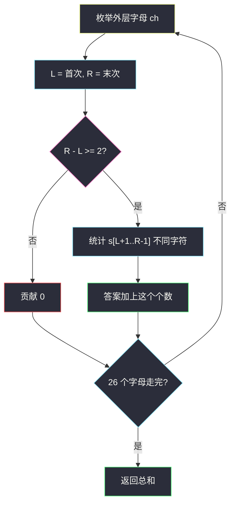
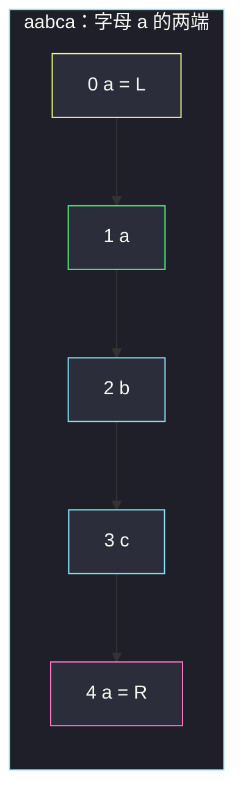

# 长度为 3 的不同回文子序列（两端 first / last）

## 一、问题描述

给你字符串 `s`，求其中长度为 **3** 的**不同**回文**子序列**个数。子序列不要求连续；两个子序列只要拼出来的字符串相同，只计一次。形如 `aba`，中间字母可以等于两边（即 `aaa` 也算）。

> 🔗 LeetCode 1930：https://leetcode.cn/problems/unique-length-3-palindromic-subsequences/
>
> 数据范围：`3 ≤ s.length ≤ 10^5`，小写字母。
>
> 📚 灵茶题单：**专题：前后缀分解**。长 3 的回文一定是 `x ? x`。对每个字母 `ch`，第一次出现位置 `L` 和最后一次 `R` 就是这对 `x` 能张开的最宽两端；中间 `s[L+1..R-1]` 有几种不同字符，就能配出几种不同的 `x _ x`。最多 `26×26=676`。

**示例 1**

```
输入：s = "aabca"
输出：3
解释：不同回文子序列 "aba"、"aaa"、"aca"。
```

**示例 2**

```
输入：s = "adc"
输出：0
解释：每个字母只出现一次，张不成长度为 3 的回文子序列。
```

**示例 3**

```
输入：s = "bbcbaba"
输出：4
解释："bbb"、"bcb"、"bab"、"aba"。
```

**直观理解**

不要枚举所有三元组下标（那是 `O(n³)` 且会重复计数字符串）。问的是**有多少种不同的长度为 3 的回文字符串**曾经作为子序列出现过。外层字母只有 26 种：把每种字母第一次和最后一次出现当作两扇门，门缝里有哪些字符能当中心。

---

## 二、暴力解法

三重循环枚举下标 `i<j<k`，若 `s[i]==s[k]` 则把 `s[i]+s[j]+s[k]` 丢进集合。

```python
class Solution:
    def countPalindromicSubsequence(self, s: str) -> int:
        n = len(s)
        seen: set[str] = set()
        for i in range(n):
            for k in range(i + 2, n):
                if s[i] != s[k]:
                    continue
                for j in range(i + 1, k):
                    seen.add(s[i] + s[j] + s[k])
        return len(seen)
```

`n=10^5` 不可用。即使外两重只在 `s[i]==s[k]` 时扫中间，最坏仍接近立方。两例小串能对。

### 🔴 瓶颈在哪里

对固定外层字母 `ch`，所有 `ch _ ch` 能用到的最宽区间就是「该字母的首次与末次」。更窄的一对 `ch` 能夹到的中心字符，一定已经被这最宽区间覆盖。所以每种外层字母只看一个区间，中间做一次去重。总时间 `O(26n)`。

---

## 三、优化探索（核心章节）

> 📚 本题在灵茶题单中属于 **专题：前后缀分解**。`L` 是前缀方向上该字母的第一次，`R` 是后缀方向上的最后一次；中间那段的「不同字符数」就是对这个分割的答案贡献。

### 3.1 长 3 回文的形状

长度为 3 的回文，首尾必须相同。记作 `x y x`，`x,y` 都是小写，独立，故最多 676 种。题目要的是「出现过多少种」，不是「出现过多少次」。

### 3.2 为什么只要 first / last

固定 `x = 'a'`。任选两个 `'a'` 下标 `i<k` 当两端，中间字符来自 `s[i+1..k-1]`。`i` 最小只能是 first，`k` 最大只能是 last，这个开区间最大，包含任何更窄一对 `'a'` 的中间。因此：

- 若 `R - L < 2`（只出现一次，或两次但相邻），中间没有位置，贡献 0；
- 否则贡献 = `s[L+1..R-1]` 中不同字符的个数。

对 26 个 `x` 累加。



### 3.3 中间去重

`len(set(s[L+1:R]))` 即可。也可用 `bool[26]` 扫一遍，避免切片。每种 `x` 扫中间 `O(n)`，26 次仍线性。

`y` 可以等于 `x`：中间出现过 `x` 就计入 `"xxx"`。`"aaa"` 需要至少三个 `'a'`，此时 `R-L≥2` 且中间至少还有一个 `'a'`，条件一致。

### 3.4 一句话核心

> **每种外层字母只看它的 first 和 last；中间有几种字符，就有几种 `x y x`。**

---

## 四、代码实现

### Python（主解：26 次 first/last + 中间 set）

```python
class Solution:
    def countPalindromicSubsequence(self, s: str) -> int:
        ans = 0
        for c in range(26):
            ch = chr(c + 97)
            L = s.find(ch)
            if L < 0:
                continue
            R = s.rfind(ch)
            if R - L >= 2:
                ans += len(set(s[L + 1 : R]))
        return ans
```

一次遍历记下 `first[26]` / `last[26]` 再扫中间，少掉 26 次 `find`，常数更好，逻辑相同：

```python
class Solution:
    def countPalindromicSubsequence(self, s: str) -> int:
        first, last = [-1] * 26, [-1] * 26
        for i, ch in enumerate(s):
            x = ord(ch) - 97
            if first[x] < 0:
                first[x] = i
            last[x] = i
        ans = 0
        for x in range(26):
            L, R = first[x], last[x]
            if L >= 0 and R - L >= 2:
                seen = [False] * 26
                for i in range(L + 1, R):
                    seen[ord(s[i]) - 97] = True
                ans += sum(seen)
        return ans
```

面试默写第一段即可；第二段展示「不用切片、中间也是 26 桶」，与前后缀数组同一气味。

**变量含义**

| 写法 | 含义 |
|------|------|
| `L` / `R` | 字母 `ch` 首次 / 末次下标 |
| `R - L >= 2` | 中间至少一格 |
| `set(s[L+1:R])` | 开区间内不同中心字母 |
| `ans` | 不同的 `x y x` 种数 |

---

## 五、具体例子演示

按任务要求跟踪每端的 **first / last**。

### 5.1 官方示例 1：`s = "aabca"`

下标：`0:a 1:a 2:b 3:c 4:a`。

| 字母 | L | R | R-L | 中间 s[L+1..R-1] | 不同字符 | 贡献的回文 |
|------|---|---|-----|------------------|----------|------------|
| a | 0 | 4 | 4 | abc | a,b,c → 3 | aaa, aba, aca |
| b | 2 | 2 | 0 | — | 0 | |
| c | 3 | 3 | 0 | — | 0 | |

答案 3。对拍官方。注意 `"aaa"` 来自两端的 `'a'` 加上中间下标 1 的 `'a'`，三个位置不连续也行。



黄是 first，粉是 last，绿是中间那个能构成 `"aaa"` 的 `'a'`。中间三种字符 → 三种回文。

### 5.2 官方示例 2：`s = "adc"`

三个字母各出现一次，`R==L`，全部跳过。答案 0。对拍官方。

### 5.3 官方示例 3：`s = "bbcbaba"`

下标：`0:b 1:b 2:c 3:b 4:a 5:b 6:a`。

| 字母 | L | R | 中间 | 不同字符 | 回文 |
|------|---|---|------|----------|------|
| b | 0 | 5 | bcbab | a,b,c → 3 | bab, bbb, bcb |
| c | 2 | 2 | — | 0 | |
| a | 4 | 6 | b | b → 1 | aba |

答案 3+1=4。对拍官方。`'b'` 的 last 是下标 5 不是 6：最后一格是 `'a'`。若误把 last 写成 `n-1`，中间会多吃一个不该属于 `'b'` 两端的字符。

`bbb`：两端两个 `'b'` 加上中间某个 `'b'`（下标 1 或 3）。只计一次字符串 `"bbb"`。

---

## 六、复杂度分析

| 方法 | 时间 | 空间 | 说明 |
|------|------|------|------|
| 三重下标 + 集合 | `O(n³)` | `O(1)` 种数上限 676 | 超时 |
| 26 次 first/last + 中间 set（主解） | `O(n)` | `O(n)` 切片；字母 26 | `26n` |
| first/last 数组 + bool[26] | `O(n)` | `O(1)` 额外 | 同上，无切片 |

种数上限 676，答案用 `int` 足够。

---

## 七、对比总结

| 维度 | 枚举三元组 | first/last 夹中间 |
|------|------------|-------------------|
| 计数对象 | 下标组合，还要再去重 | 直接按字符串种类加 |
| 每种外层字母 | 很多对 `i,k` | 只一对最宽 |
| `n=10^5` | 不行 | 线性 |

**易错点**

1. **算子序列条数而不是不同字符串**：`"bbb"` 出现多次只加 1。
2. **`R-L>=2` 写成 `>2`**：相邻再隔一个就够，`R=L+2` 中间恰好一格。
3. **中间写成闭区间 `s[L..R]`**：两端的 `x` 会被算进中心；应用开区间。
4. **漏掉 `"aaa"`**：中间出现过 `x` 就要计。三个相同字母时 first/last 之间一定还有至少一个。
5. **只用首次出现当两端**：last 必须是最后一次，否则中间偏窄，漏中心字符。
6. **把子序列当成子串**：`"aba"` 在 `"abca"` 里下标 0,1,3 不连续，仍然算。

---

## 八、举一反三

| 题目 | 关系 |
|------|------|
| [2483. 商店的最少代价](https://leetcode.cn/problems/minimum-penalty-for-a-shop/)（`minimum-penalty-for-a-shop.md`） | 同批前后缀：枚举分割点 |
| [1525. 字符串的好分割数目](https://leetcode.cn/problems/number-of-good-ways-to-split-a-string/)（`number-of-good-ways-to-split-a-string.md`） | 同批：左右种类数；本题是两端字母夹中间种类 |
| [516. 最长回文子序列](https://leetcode.cn/problems/longest-palindromic-subsequence/) | 回文子序列，长度不限，区间 DP |
| [647. 回文子串](https://leetcode.cn/problems/palindromic-substrings/) | 连续子串，中心扩展 |
| [730. 统计不同回文子序列](https://leetcode.cn/problems/count-different-palindromic-subsequences/) | 不同回文子序列的 Hard 版，不限长度 |
| [5. 最长回文子串](https://leetcode.cn/problems/longest-palindromic-substring/) | 子串不是子序列，中心扩展 / Manacher |

**思想迁移**

- 「不同的短模式」往往先固定两端字符，再用一次线性扫描统计中间能填什么。
- 口诀：**「外层 26 个字母看 first/last；中间有几种，就有几种 xyx。」**
