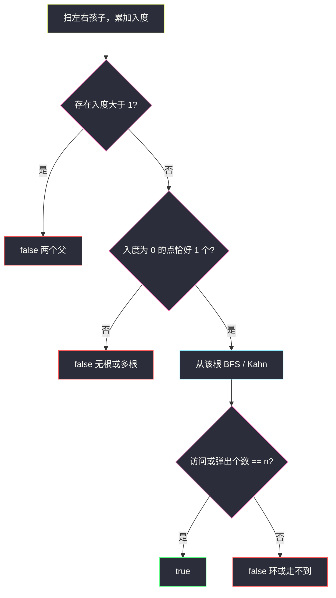
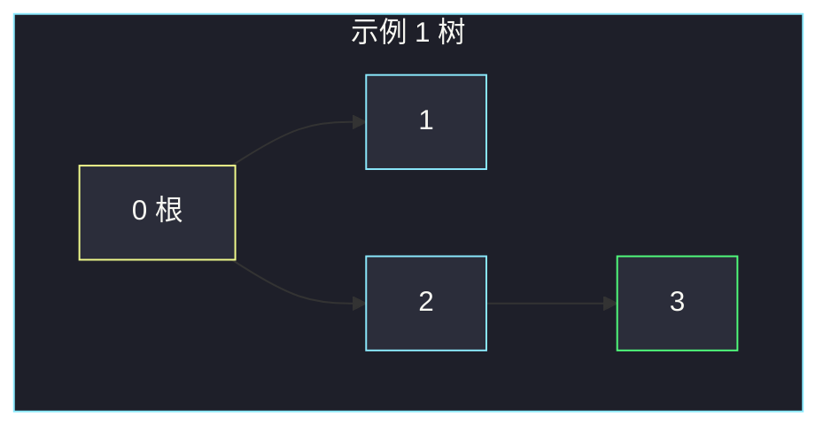

# 验证二叉树（入度 + 拓扑 / BFS 判唯一根）

## 一、问题描述

`n` 个节点编号 `0 .. n-1`，`leftChild[i]` / `rightChild[i]` 是 `i` 的左右孩子（`-1` 表示没有）。问这些边能不能 **恰好** 组成一棵二叉树：有且仅有一个根，每个点最多一个父节点，从根能到达全部点（无环、无森林）。

> 🔗 LeetCode 1361：https://leetcode.cn/problems/validate-binary-tree-nodes/
>
> 数据范围：`1 ≤ n ≤ 10⁴`，孩子编号在 `-1 .. n-1`。
>
> 📚 灵茶题单：**图论 · §2.1 拓扑排序**。

**示例 1**

```
输入：n = 4, leftChild = [1,-1,3,-1], rightChild = [2,-1,-1,-1]
输出：true
0 的左右是 1、2；2 的左是 3。唯一根 0，四个点都在树上。
```

**示例 2**

```
输入：n = 4, leftChild = [1,-1,3,-1], rightChild = [2,3,-1,-1]
输出：false
1 和 2 都指向 3，节点 3 有两个父。
```

**示例 3**

```
输入：n = 2, leftChild = [1,0], rightChild = [-1,-1]
输出：false
0 → 1 → 0 成环，没有入度为 0 的根。
```

**直观理解**

把「父 → 孩子」看成有向边。合法二叉树同时满足：

1. 每个点入度 ≤ 1（不能两个父）。
2. 恰好一个入度为 0 的点（唯一根）。
3. 从该根沿出边能访问全部 `n` 个点（连通且无环：环会让某些点进不去，或访问数不足）。

这三条缺一不可：两条都入度合法的链并排放着是森林；一个根加远处一个环是「入度看起来还行、但走不到」。

---

## 二、暴力解法

枚举每个点当根，DFS/BFS 看能不能访完 `n` 个点，并且中途不碰到「二次进入」的点。`n` 次遍历最坏 `O(n²)`，还能过 `1e4`，但要额外处理「多个根都碰巧能走完？」——走完只能说明那个连通块是树，**别的点可能形成另一棵**。漏判森林。

```python
# 伪代码：for root in 0..n-1: 若 dfs 访完 n 个且无重复访问 → 候选
# 候选多于 1 个还得再筛。写起来又长又容易漏。
```

### 复杂度

- **时间**：`O(n²)`。
- **空间**：`O(n)`。

### 🔴 瓶颈在哪里

根不用枚举：入度为 0 的点就是根候选。先数入度，再从唯一根走一遍即可。

---

## 三、优化探索（核心章节）

> 📚 本题在灵茶题单中属于 **§2.1 拓扑排序**。先统计入度找唯一根，再 Kahn / BFS 确认能弹出全部节点。

### 3.1 入度表

扫一遍 `leftChild`、`rightChild`：`c != -1` 则 `indeg[c] += 1`。一旦某点入度 ≥ 2，直接 `false`（两个父，或同一个父的左右都指它）。

入度为 0 的点收集起来：

- 0 个：全在环里（示例 3），或每个点都有父。
- ≥ 2 个：森林，多棵树并排。
- 恰好 1 个：唯一根，继续。

`n = 1` 且左右都是 `-1`：入度全 0，正好一个根，合法。

### 3.2 从根 BFS（或 Kahn）

**BFS 计数**：从根出发，沿左右孩子走，`visited` 防环。若试图进入已访问点 → 有环。最后 `len(seen) == n` 才是真树。

**Kahn 拓扑**：队列初始只放根。弹出 `u` 时把它的孩子入度减 1，减到 0 再入队。若图是树，恰好弹出 `n` 个点；有环则环上入度到不了 0，弹出个数 `< n`。

两种等价。默写 BFS 计数更短；拓扑更能看出「入度变化」。



### 3.3 为何三条都要

| 只做一部分 | 漏掉的反例 |
|------------|------------|
| 只查入度 ≤ 1 且一个根 | 根是一棵小树，旁边一个有向环（环上入度都是 1） |
| 只从某点 DFS 能走完 | 可能走的是其中一块，或选错了根 |
| 只查边数 = n-1 | 有向图还要唯一根、入度 ≤ 1 |

入度之和 = 边数。合法时边数一定是 `n-1`，但用入度 + 可达性已经覆盖，不必再数边。

### 3.4 一句话核心

> **入度 ≤ 1 且恰好一个根；从根 BFS 能覆盖全部点。否则就是双父、多根、环或森林。**

---

## 四、代码实现

### Python（主解：入度 + BFS）

```python
from collections import deque

class Solution:
    def validateBinaryTreeNodes(
        self, n: int, leftChild: list[int], rightChild: list[int]
    ) -> bool:
        indeg = [0] * n
        for i in range(n):
            for c in (leftChild[i], rightChild[i]):
                if c != -1:
                    indeg[c] += 1
                    if indeg[c] > 1:
                        return False

        roots = [i for i in range(n) if indeg[i] == 0]
        if len(roots) != 1:
            return False

        q = deque([roots[0]])
        seen = {roots[0]}
        while q:
            u = q.popleft()
            for c in (leftChild[u], rightChild[u]):
                if c == -1:
                    continue
                if c in seen:
                    return False
                seen.add(c)
                q.append(c)
        return len(seen) == n
```

**变量含义**

| 变量 | 含义 |
|------|------|
| `indeg[i]` | 有多少条边指向 i |
| `roots` | 入度为 0 的点，合法时长度 1 |
| `seen` | 从根出发已进入的点 |

孩子数组本身就是出边表，不用再新建邻接表。

### 拓扑版（入度变化更直观）

Kahn：孩子入度减到 0 才入队。弹出个数等于 `n` 即无环且全覆盖。入度已保证 ≤ 1，减 1 后要么 0 要么本来就是环上的 1。

```python
# 找到唯一 root 后：
q = deque([root])
cnt = 0
while q:
    u = q.popleft()
    cnt += 1
    for c in (leftChild[u], rightChild[u]):
        if c == -1:
            continue
        indeg[c] -= 1
        if indeg[c] == 0:
            q.append(c)
return cnt == n
```

---

## 五、具体例子演示

### 示例 1（合法 · 跟踪入度）

`left = [1,-1,3,-1]`，`right = [2,-1,-1,-1]`。

| 边 | 入度变化 |
|----|----------|
| 0→1 | `indeg[1] = 1` |
| 0→2 | `indeg[2] = 1` |
| 2→3 | `indeg[3] = 1` |

入度数组：`[0, 1, 1, 1]`。入度为 0 的只有 **0**。

**BFS 队列**

| 步骤 | 弹出 | 队列 | seen |
|------|------|------|------|
| 初 | — | `[0]` | `{0}` |
| 1 | 0 | `[1, 2]` | `{0,1,2}` |
| 2 | 1 | `[2]` | 无孩子 |
| 3 | 2 | `[3]` | `{0,1,2,3}` |
| 4 | 3 | `[]` | 结束 |

`seen` 大小 4 = n，返回 true。

**Kahn 入度**

| 弹出 | 操作 | 入度 |
|------|------|------|
| 0 | 1、2 各减 1 | `[0, 0, 0, 1]`，1 和 2 入队 |
| 1 | 无孩子 | 不变 |
| 2 | 3 减 1 | `[0, 0, 0, 0]`，3 入队 |
| 3 | 无孩子 | 弹出个数 4 |



### 示例 2（双父）

边 0→1、0→2、2→3、**1→3**。扫到第二条指向 3 的边时 `indeg[3] == 2`，立即 false。不必 BFS。

### 示例 3（环、无根）

0→1、1→0。`indeg = [1, 1]`，入度为 0 的集合为空 → false。

### 森林（两个根）

`n = 2`，左右全是 `-1`。`indeg = [0, 0]`，两个根 → false。单节点 `n = 1` 才允许「全都是根」。

### 根 + 旁路环

`n = 3`，`left = [1, -1, 2]`，`right = [-1, -1, -1]`：0→1，2→2（自环）。

入度 `[0, 1, 1]`，唯一根 0。BFS 只走到 `{0, 1}`，到不了 2，`len(seen) != 3` → false。这就是「入度条件过了、可达性没过」。

---

## 六、复杂度分析

| 方法 | 时间 | 空间 | 说明 |
|------|------|------|------|
| 枚举根再 DFS | `O(n²)` | `O(n)` | 还要防森林漏判 |
| 入度 + BFS / Kahn（主解） | `O(n)` | `O(n)` | 每点每边一次 |

孩子指针至多 `2n` 条，线性扫完。

---

## 七、对比总结

| 维度 | 枚举根 | 入度 + BFS |
|------|--------|------------|
| 找根 | 试 n 次 | 入度 0 且恰好一个 |
| 双父 | DFS 碰到二次访问 | 入度 ≥ 2 秒杀 |
| 环 / 森林 |  vis 数不足或多根 | 同左，但根唯一已先卡死森林 |

**易错点**

1. **只检查入度、不从根遍历**：旁路环、不可达点会漏。
2. **多个入度 0 却返回 true**：那是森林，不是「一棵」二叉树。
3. **`n = 1` 判成 false**：没有孩子完全合法。
4. **左右孩子是同一个点**：入度 +2，应 false；不要只 `+= 1` 一次。
5. **自环**：该点入度 ≥ 1，若它不是根则 BFS 走不到或 Kahn 弹不出；若根指向自己，根入度不再是 0。
6. **把 `-1` 当真节点**：越界。孩子为 `-1` 直接跳过。
7. **无向图思维**：父→子是有向的，不能把孩子边反着当无向树的 `n-1` 条边就结束（有向环 + 入度检查更干净）。

---

## 八、举一反三

| 题目 | 关系 |
|------|------|
| [207. 课程表](https://leetcode.cn/problems/course-schedule/) | 标准 Kahn：入度为 0 入队，看是否弹出全部点 |
| [210. 课程表 II](https://leetcode.cn/problems/course-schedule-ii/) | 同一套拓扑，额外记录弹出顺序 |
| [685. 冗余连接 II](https://leetcode.cn/problems/redundant-connection-ii/) | 有向树多了一条边：双父或环，比本题更细 |
| [1971. 寻找图中是否存在路径](https://leetcode.cn/problems/find-if-path-exists-in-graph/) | 无向连通；本题还要求树形 |
| [841. 钥匙和房间](https://leetcode.cn/problems/keys-and-rooms/) | 从固定点 0 遍历看是否覆盖。见 [keys-and-rooms.md](./keys-and-rooms.md) |

同目录最短路建模：[打开转盘锁](./open-the-lock.md) 是隐式图 BFS；本题是显式有向图 + 入度约束。

**思想迁移**

- 「是不是一棵有根树」= 入度约束 + 从根可达。拓扑排序是入度约束的执行器。
- 口诀：**「入度最多 1、根只能有一个；从根走一遍，点数不够就有环或森林。」**
