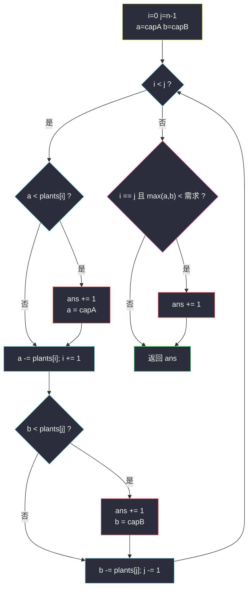
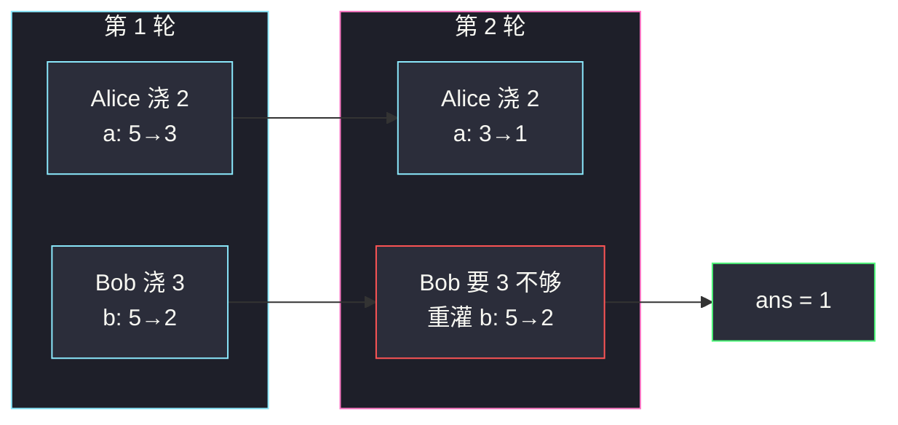

# 给植物浇水 II（相向双指针 · 左右同时模拟）

## 一、问题描述

`n` 株植物排成一行，第 `i` 株需要 `plants[i]` 的水。Alice 从左（下标 0）向右浇，Bob 从右（下标 `n-1`）向左浇，**同时**进行；浇每一株耗时相同。两人各有水罐，容量分别为 `capacityA`、`capacityB`，**出发前已经灌满**（这次不计入答案）。

规则：

- 若罐里的水足够浇当前这株，必须直接浇；否则**先重新灌满（计 1 次）再浇**。
- 若两人走到**同一株**，当前剩余水**更多**的人浇；一样多则 Alice 浇。另一个人这株不浇。

返回整个过程中**重新灌满**的次数。

> 🔗 LeetCode 2105：https://leetcode.cn/problems/watering-plants-ii/
>
> 数据范围：`1 <= n <= 10^5`，`1 <= plants[i] <= 10^6`，`max(plants[i]) <= capacityA, capacityB <= 10^9`（单株一定浇得动）。

**示例 1**

```
输入：plants = [2,2,3,3], capacityA = 5, capacityB = 5
输出：1
解释：Alice 浇 0 号剩 3，Bob 浇 3 号剩 2；
Alice 浇 1 号够，Bob 浇 2 号不够，Bob 重灌 1 次。
```

**示例 2**

```
输入：plants = [2,2,3,3], capacityA = 3, capacityB = 4
输出：2
解释：第一轮后两人各剩 1，第二轮两边都不够，各重灌一次。
```

**示例 3**

```
输入：plants = [5], capacityA = 10, capacityB = 8
输出：0
解释：只有一株，Alice 剩余 10 ≥ Bob 的 8，Alice 浇，出发时已满，不用重灌。
```

**直观理解**

时间同步 ⇒ Alice 浇完第 `k` 株时，Bob 正好浇完从右边数第 `k` 株。两人在数组上就是一对**相向指针**。中间若还剩一株，再按「谁剩水多谁浇」特判。本题属于灵神题单 **§3.2 相向双指针**，本质是模拟，没有隐藏贪心分支。

---

## 二、暴力解法

用列表标记已浇，每一步找最左/最右未浇株，更新两人剩余水量。逻辑正确，但每步扫数组找端点是 `O(n)`，共 `O(n)` 步 → `O(n^2)`。

```python
class Solution:
    def minimumRefill(self, plants: List[int], capacityA: int, capacityB: int) -> int:
        n, a, b, ans = len(plants), capacityA, capacityB, 0
        done = [False] * n
        while True:
            left = next((i for i in range(n) if not done[i]), None)
            if left is None:
                return ans
            right = next(i for i in range(n - 1, -1, -1) if not done[i])
            if left == right:                         # 同一株
                tank = a if a >= b else b
                if tank < plants[left]:
                    ans += 1
                return ans
            if a < plants[left]:
                ans += 1
                a = capacityA
            a -= plants[left]
            done[left] = True
            if b < plants[right]:
                ans += 1
                b = capacityB
            b -= plants[right]
            done[right] = True
```

### 复杂度

- **时间**：`O(n^2)`。`n = 10^5` 超时。
- **空间**：`O(n)` 的 `done`。

### 🔴 瓶颈在哪里

「最左未浇 / 最右未浇」就是一对单调指针：Alice 的下标只增，Bob 的只减。用 `i, j` 直接指向两人下一株，每株 `O(1)`。

---

## 三、优化探索（核心章节）

> 📚 本题在灵茶题单中属于 **§3.2 相向双指针**：`i` 从 0 向右，`j` 从 `n-1` 向左，`i < j` 时两人各浇一株；`i == j` 时相遇。

### 3.1 观察特征

| 特征 | 说明 |
|------|------|
| 同时 + 等耗时 | 第 t 步 Alice 在 `t`，Bob 在 `n-1-t` |
| 罐空才回河 | 浇之前若 `剩余 < 需求` 则 `ans += 1` 并灌满 |
| 出发已满不计入 | `a, b` 初值就是容量，不要先 `+1` |
| 相遇一株 | 只一个人浇：`max(剩余A, 剩余B)` 不够才重灌 |

容量保证 `≥ 每株需求`，所以重灌一次后一定浇得下，不会死循环。

### 3.2 模拟步骤

```text
i, j = 0, n - 1
a, b = capacityA, capacityB
while i < j:
    # Alice 浇 plants[i]
    if a < plants[i]: ans += 1; a = capacityA
    a -= plants[i]; i += 1
    # Bob 浇 plants[j]
    if b < plants[j]: ans += 1; b = capacityB
    b -= plants[j]; j -= 1
if i == j:
    if max(a, b) < plants[i]:
        ans += 1
```

相遇时：`a >= b` 则 Alice 浇，否则 Bob 浇。无论谁浇，需要重灌当且仅当**浇的那个人**当前剩余不足，即 `max(a, b) < plants[i]`。相等时 Alice 浇，此时 `max` 就是 `a`，与题面一致。



### 3.3 一句话核心

> **左右指针同时推进，浇前不够就灌满计数；碰到同一株时看谁剩得多，不够再灌一次。**

---

## 四、代码实现

### Python（主解：相向模拟）

```python
class Solution:
    def minimumRefill(self, plants: List[int], capacityA: int, capacityB: int) -> int:
        i, j = 0, len(plants) - 1
        a, b = capacityA, capacityB          # 当前剩余
        ans = 0
        while i < j:
            if a < plants[i]:
                ans += 1
                a = capacityA
            a -= plants[i]
            i += 1
            if b < plants[j]:
                ans += 1
                b = capacityB
            b -= plants[j]
            j -= 1
        if i == j and max(a, b) < plants[i]:
            ans += 1
        return ans
```

**变量含义**

| 变量 | 含义 |
|------|------|
| `i` | Alice 下一株 |
| `j` | Bob 下一株 |
| `a` / `b` | 两人罐中剩余 |
| `ans` | 已发生的重灌次数 |

**循环不变式**：`plants[0..i)` 已由 Alice 浇完，`plants(j..n)` 已由 Bob 浇完；`a, b` 是刚浇完后的剩余；`ans` 是到目前为止的重灌次数。

### Java

```java
class Solution {
    public int minimumRefill(int[] plants, int capacityA, int capacityB) {
        int i = 0, j = plants.length - 1, ans = 0;
        int a = capacityA, b = capacityB;
        while (i < j) {
            if (a < plants[i]) { ans++; a = capacityA; }
            a -= plants[i++];
            if (b < plants[j]) { ans++; b = capacityB; }
            b -= plants[j--];
        }
        if (i == j && Math.max(a, b) < plants[i]) ans++;
        return ans;
    }
}
```

---

## 五、具体例子演示

**示例 1** `plants = [2,2,3,3]`，`capacityA = capacityB = 5`。跟踪每轮 `i/r`（此处 r 即 `j`）与剩余水量。

| 轮 | i | j | 浇的株 | Alice 剩余 a | Bob 剩余 b | 重灌？ | ans |
|----|---|---|--------|--------------|------------|--------|-----|
| 初 | 0 | 3 | — | 5 | 5 | 出发已满不计 | 0 |
| 1 | 0→1 | 3→2 | 左 2 / 右 3 | 5-2=3 | 5-3=2 | 否 / 否 | 0 |
| 2 | 1→2 | 2→1 | 左 2 / 右 3 | 3-2=1 | 2<3，灌满 5-3=2 | 否 / **是** | 1 |
| 停 | 2 | 1 | `i > j` | — | — | 无相遇株 | **1** |

**示例 2** 容量 3 和 4，同一数组。

| 轮 | i | j | a 变化 | b 变化 | ans |
|----|---|---|--------|--------|-----|
| 初 | 0 | 3 | 3 | 4 | 0 |
| 1 | 1 | 2 | 3-2=1 | 4-3=1 | 0 |
| 2 | 2 | 1 | 1<2，灌 3-2=1 | 1<3，灌 4-3=1 | **2** |

**相遇需重灌**：`plants = [2,4,2]`，`capacityA = capacityB = 5`。

| 轮 | i | j | a | b | 说明 |
|----|---|---|---|---|------|
| 1 | 0→1 | 2→1 | 3 | 3 | 各浇端点 2 |
| 相遇 | 1 | 1 | 3 | 3 | 需求 4，`max(3,3)<4`，ans=1 |

Alice 与 Bob 水量相等，Alice 浇；她也不够，重灌一次。出发满罐浇 2 之后剩 3，确实浇不动 4。

**示例 3** `n=1`：`i==j==0`，循环不进，`max(10,8)=10 ≥ 5`，返回 0。



---

## 六、复杂度分析

| 方法 | 时间 | 空间 | 说明 |
|------|------|------|------|
| 每步扫描找端点 | `O(n^2)` | `O(n)` | 超时 |
| 相向双指针模拟（主解） | `O(n)` | `O(1)` | 每株恰好被浇一次 |

---

## 七、对比总结

| 维度 | 本题 II | #2079 给植物浇水 I | 典型相向（盛水） |
|------|---------|---------------------|------------------|
| 人数 | 两人相向 | 一人从左到右 | 两端协作算面积 |
| 指针 | `i` 增、`j` 减 | 单指针 | `i` 增或 `j` 减（每步只动一端） |
| 计数对象 | 回河重灌次数 | 同左（单人） | 最大面积 |
| 相遇 | 谁剩水多谁浇 | 无 | 无「同一元素」 |

**易错点**

1. **出发灌满计入 ans**：初值已经是满罐，第一株只要 `plants[0] ≤ capacity` 就不应 `+1`。
2. **相遇时两人各浇一次**：一株只浇一次，用 `max(a,b)` 判断**一个人**是否重灌。
3. **相遇时比较容量而不是剩余**：要用当前 `a, b`，不是 `capacityA, capacityB`。
4. **`i <= j` 当循环条件**：会把中间株在循环里按「两人各浇」处理，重复且错误；必须 `i < j`，相遇单独做。
5. **先减水再判断**：顺序是「不够则灌满，再减去需求」。
6. Alice/Bob 在循环里各自独立，不要共用一个剩余变量。

**模板（两人从两端同时扫）**

```python
i, j = 0, n - 1
while i < j:
    # 左端角色处理 plants[i]，i += 1
    # 右端角色处理 plants[j]，j -= 1
if i == j:
    # 中间一株的特殊规则
```

---

## 八、举一反三

| 题目 | 关系 |
|------|------|
| [2079. 给植物浇水](https://leetcode.cn/problems/watering-plants/) | 单人从左到右，回河距离计入步数；同一「罐空回灌」模型 |
| [11. 盛最多水的容器](https://leetcode.cn/problems/container-with-most-water/) | §3.2 相向，但每步只移动一端 |
| [881. 救生艇](https://leetcode.cn/problems/boats-to-save-people/) | 相向：最重+最轻能否同船 |
| [167. 两数之和 II](https://leetcode.cn/problems/two-sum-ii-input-array-is-sorted/) | 有序数组相向逼近目标和 |
| [42. 接雨水](https://leetcode.cn/problems/trapping-rain-water/) | 相向维护左右最大高度 |
| [1750. 删除字符串两端相同字符后的最短长度](https://leetcode.cn/problems/minimum-length-of-string-after-deleting-similar-ends/) | 同批 §3.2：两端按段收缩，不是模拟水量 |

**思想迁移**

- 「两人从两端同时干活」几乎总是 `while i < j` + 中间一枚特判，不要真的开两个线程。
- 模拟题先写出状态（剩余水、下标），再压缩成指针；计数发生在**状态不合法需要重置**的那一刻。
- 口诀：**「左右同时走，浇前不够就灌；碰到同一株，剩水多的人上。」**
